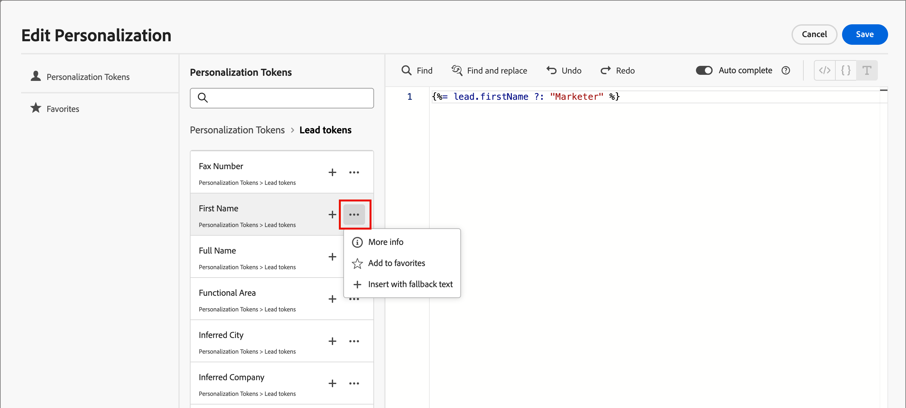

# Inhoud ontwerpen - personalisatie

Journey Optimizer B2B Edition gebruikt een inline eenvoudige syntaxis waarmee u expressies kunt maken met gepersonaliseerde inhoud tussen accolades `{{}}` . U kunt meerdere expressies zonder beperkingen toevoegen in dezelfde inhoud of hetzelfde veld.

U kunt bijvoorbeeld een personalisatieexpressie toevoegen als `Hello {{lead.firstName}} {{lead.lastName}}` . Bij het verwerken van de inhoud vervangt Journey Optimizer B2B Edition de expressie door de gegevens in de Experience Platform-database. Zo, wordt het eerste voorbeeld _Sint Smit van Hello_.

Zie [ verpersoonlijking van de Inhoud ](../user/content/personalization.md) voor uitvoerigere informatie over het gebruiken van verpersoonlijkingshulpmiddelen in Journey Optimizer B2B Edition.

>[!NOTE]
>
>Journey Optimizer B2B Edition volgt _camel geval_ syntaxis voor personalisatietokens in e-mails om de andere toepassingen van Adobe Experience Platform voor een verenigbare ervaring aan te passen. Dit symbolische formaat is volledig compatibel met de [ sjabloontaal van Handels ](https://handlebarsjs.com/guide/#what-is-handlebars){target="_blank"}. Alle tokens die vóór deze wijziging zijn toegevoegd, worden automatisch bijgewerkt.

In het volgende voorbeeld worden stappen beschreven voor het personaliseren van inhoud met behulp van persoon- en systeemtokens. Dit weerspiegelt de huidige Journey Optimizer B2B Edition-release.

1. Selecteer de tekstcomponent en klik _verpersoonlijking_ toevoegen ( ) pictogram in de toolbar.

   {width="600"}

   Deze actie opent _geeft Personalization_ dialoog uit.

1. Voeg een token toe door op de plusknop ( **+** ) naast de token te klikken.

   Als u het token met een fallback wilt toevoegen (standaardtekst die verschijnt wanneer dat veld niet beschikbaar is voor een lead), klikt u op het pictogram _Meer_ ( **..** ) en kiest u **[!UICONTROL Insert with fallback text]** .

   {width="700" zoomable="yes"}

1. Voeg aanvullende tokens of andere statische tekst toe die u wilt opnemen.

1. Klik op **[!UICONTROL Save]** .

   Het verpersoonlijkings scripting wordt getoond in de visuele ontwerpruimte. U kunt deze selecteren om indien nodig wijzigingen aan te brengen.

   {width="600"}
