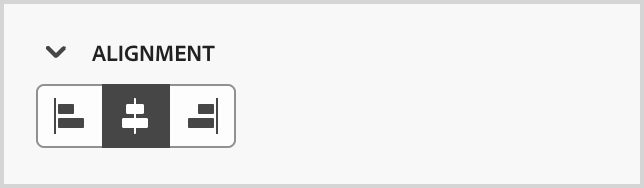
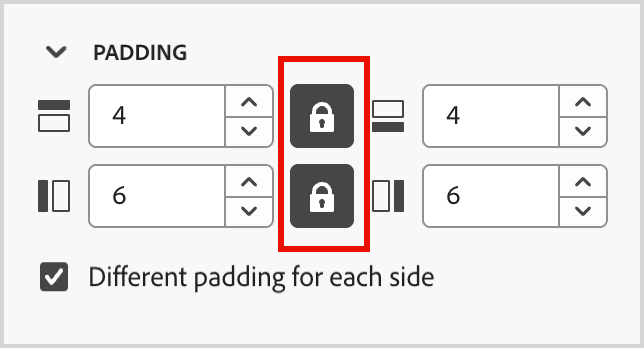
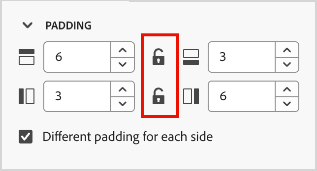

# Fragmenten

<!-- Content authoring steps for reuse -->

## Intentgegevensconfiguratie {#intent-data-note}

>[!NOTE]
>
>Intentgegevens worden opgenomen wanneer deze worden geconfigureerd voor uw Journey Optimizer B2B edition-instantie. Het vereist ook één of meerdere gepubliceerde reizen **of** creeerde het kopen groepen. Voor meer informatie over het model van de Detectie van de Intentie en hoe te om sleutelwoorden, producten, en categorieën voor te leggen, zie [ Gegevens van de Intentie ](../user/admin/intent-data.md).

## AEM Assets-licentiecode {#aem-assets-licensing-note}

>[!NOTE]
>
>Licenties voor AEM Assets as a Cloud Service en Dynamic Media-licentie zijn voorwaarden voor integratie. Zorg ervoor dat [ Dynamische Media met Open API ](https://experienceleague.adobe.com/en/docs/experience-manager-cloud-service/content/assets/dynamicmedia/dynamic-media-open-apis/dynamic-media-open-apis-overview){target="_blank"} wordt toegelaten. De integratie is beperkt tot bewaarplaatsen van de _rij van de Levering_. Als u de _rij van de Auteur_ gebruikt en het wilt omzetten, contacteer de Steun van Adobe Experience Manager. 
>&#x200B;>Afhankelijk van uw contract en configuratie kunt u Adobe Experience Manager Assets as a Cloud Service rechtstreeks vanuit Adobe Journey Optimizer B2B edition openen bij het ontwerpen van visuele inhoud.

## Inhoud ontwerpen - componenten - stap Structuren {#structures-step}

1. Als u het inhoudsontwerp wilt starten, sleept u een item van de **[!UICONTROL Structures]** naar het canvas.

   Voeg zoveel items vanuit _[!UICONTROL Structures]_&#x200B;toe als u nodig hebt en bewerk de instellingen voor elk item in het rechterdeelvenster.

   >[!TIP]
   >
   >Selecteer de _[!UICONTROL n:nkolom]_ component om het aantal kolommen van uw keus (tussen drie en 10) te bepalen. U kunt ook de breedte van elke kolom definiëren door de pijlen onder de kolom te verplaatsen.

   {width="800" zoomable="yes"} aan

   Elke kolomgrootte mag niet kleiner zijn dan 10% van de totale breedte van de structuurcomponent. Alleen lege kolommen kunnen worden verwijderd.

## Inhoud ontwerpen - componenten - stap Inhoud {#contents-step}

1. Vouw de sectie **[!UICONTROL Contents]** uit en voeg zoveel elementen toe als u nodig hebt in een of meer structuurcomponenten.

   {width="800" zoomable="yes"} aan
   <!--
   reference to the contents elements--->

## Inhoud ontwerpen - componenten - stap Instellingen {#settings-step}

1. Indien nodig kunt u aanvullende aanpassingen aanbrengen voor elke component op de tabbladen _[!UICONTROL Settings]_&#x200B;of&#x200B;_[!UICONTROL Style]_ .

   U kunt bijvoorbeeld de tekststijl, opvulling of marge van elke component wijzigen.

## Inhoud ontwerpen - stap Elementen {#assets-step}

1. Van de _plukker van Activa_, kunt u activa direct selecteren die in de activabibliotheek worden opgeslagen.

   Dubbelklik op de map die uw elementen bevat. Sleep de items naar een structuurcomponent.

   Voor meer informatie over het gebruiken van activa van uw brontype, zie [ activa aan uw inhoud ](../user/content/assets-overview.md#use-assets-for-content-authoring) toevoegen.

   {width="800" zoomable="yes"} aan

## Inhoud ontwerpen - stap voor personalisatie {#personalization-step}

1. Voeg verpersoonlijkingsgebieden in om uw inhoud van profielattributen, publiekslidmaatschappen, contextafhankelijke attributen, en meer aan te passen.

## Inhoud ontwerpen - stap voorwaardecontent inschakelen {#dynamic-content-step}

1. Klik op **[!UICONTROL Enable condition content]** om dynamische inhoud toe te voegen en de inhoud aan te passen aan de doelprofielen op basis van voorwaardelijke regels.

## Inhoud ontwerpen - stap Koppelingen bijhouden {#links-tracking-step}

1. Selecteer de tab **[!UICONTROL Links]** in het linkerdeelvenster om alle URL&#39;s weer te geven van de inhoud die wordt bijgehouden.

   U kunt het _Volgend Type_ of _Etiket_ wijzigen en markeringen toevoegen indien nodig.

## Inhoudscomponenten - geavanceerde stijlen {#styles-advanced}

Gebruik de stijlinstellingen van **[!UICONTROL Advanced]** om aanvullende CSS-compatibele kenmerken toe te passen op waarden. U kunt de waarden van de bestaande kenmerken wijzigen of nieuwe kenmerken toevoegen. De opmaak wordt toegepast op de component met behulp van het CSS-overervingsmodel voor bovenliggende en onderliggende componenten (elementen).

De weergegeven kenmerken weerspiegelen de stijlen die momenteel zijn gedefinieerd voor de component. U kunt de waarden volgens [ CSS definities ](https://www.w3schools.com/CSSref/index.php){target="_blank"} veranderen. Klik _toevoegen_ (**+**) pictogram om een nieuw stijlattribuut voor de component toe te voegen.

{width="250"}

## Inhoudscomponenten - horizontale lijnstijlen {#styles-alignment-h}

Vouw de sectie **[!UICONTROL Alignment]** uit en kies de horizontale uitlijning die u wilt gebruiken: links, gecentreerd of rechts. Deze stijl wordt omgezet in een standaard `text-align` CSS-stijl en bepaalt hoe de component binnen de bevattende component wordt geplaatst.

{width="250"}

## Inhoud - verticale uitlijningsstijlen {#styles-alignment-v}

Vouw de sectie **[!UICONTROL Alignment]** uit en kies de verticale uitlijning die u wilt gebruiken: boven, midden of onder. Deze stijl wordt omgezet in een standaard `vertical-align` CSS-stijl en heeft invloed op de positionering binnen de bevattende component.

{width="250"}

## Inhoudscomponenten - horizontale en verticale lijnstijlen {#styles-alignment-h-v}

Vouw de sectie **[!UICONTROL Alignment]** uit en kies de horizontale en verticale uitlijning die u wilt gebruiken. De uitlijningsstijlen hebben invloed op de positie van de HTML-component binnen de omvattende component (structuur of container).

De horizontale uitlijning wordt omgezet in een standaard `text-align` CSS-stijl en u kunt kiezen uit links, gecentreerd of rechts. De verticale uitlijning wordt omgezet in de standaard CSS-stijl van `vertical-align` en u kunt kiezen uit boven, midden of onder.

{width="300"}

## Inhoudscomponenten - achtergrondstijlen {#styles-background}

Selecteer de tab _[!UICONTROL Styles]_&#x200B;in het rechterdeelvenster en gebruik de sectie **[!UICONTROL Background]**&#x200B;om de achtergrondkleur voor de component te definiëren.

Schakel het selectievakje in en klik op het kleurvakje om een kleur in de kiezer te kiezen. U kunt een kleur kiezen door een bekende RGB-, HSL-, HSB- of hexadecimale waarde in te voeren. U kunt ook de schuifregelaar Kleur en het kleurveld gebruiken om de kleur te selecteren.

{width="300"}

## Inhoudscomponenten - randstijlen {#styles-border}

1. Vouw in het rechterdeelvenster met de tab _[!UICONTROL Styles]_&#x200B;de sectie **[!UICONTROL Border]**&#x200B;uit en stel de opties in om een rand voor de component weer te geven:

1. Verplaats de schakeloptie naar rechts om de weergaveopties voor de randen in te schakelen en stel deze in op basis van uw ontwerpcriteria:

   * Als u **[!UICONTROL Border color]** wilt instellen, schakelt u het selectievakje in en klikt u op het kleurvakje om een kleur in de kiezer te kiezen. U kunt een kleur kiezen door een bekende RGB-, HSL-, HSB- of hexadecimale waarde in te voeren. U kunt ook de schuifregelaar Kleur en het kleurveld gebruiken om de kleur te selecteren.

   {width="300"}

   * Als u **[!UICONTROL Border size]** (lijnbreedte) wilt instellen, klikt u op de pictogrammen Pijl-omhoog en Pijl-omlaag om het aantal pixels te verhogen of te verlagen.

   * Als u de **[!UICONTROL Border style]** wilt instellen, kiest u een waarde in de lijst met standaard-CSS `border-style` -waarden.

   * Om te bepalen waar de rand wordt weergegeven, schakelt u elk selectievakje **[!UICONTROL Border position]** in.

   {width="250"}

1. Voor **[!UICONTROL Border radius]**, plaats de numerieke waarde volgens de kromme u voor de hoeken wilt.

   Met de waarde 0 (standaardwaarde) wordt een vierkante hoek gemaakt.

## Inhoudscomponenten - margestijlen {#styles-margin}

Vouw in het rechterdeelvenster met het tabblad _[!UICONTROL Styles]_&#x200B;de sectie **[!UICONTROL Margin]**&#x200B;uit en stel de opties voor de marge-afstand in de structuurcomponent in. Deze stijl dupliceert de CSS `margin` -parameter, die de ruimte buiten een componentrand bestuurt en deze van andere componenten scheidt. Er ontstaat een tussenruimte rondom de component om de positionering en lay-out van omringende inhoud te beïnvloeden.

Stel de margewaarden in pixels in op basis van uw ontwerpvereisten. U kunt de marge voor alle zijden, de bovenkant-bodem, de linkerkant, of elke kant van de component onafhankelijk plaatsen:

* **Alle kanten** - om één waarde te plaatsen om op alle kanten van toepassing te zijn, ontruim **[!UICONTROL Different margin for each side]** checkbox. Klik op de pictogrammen pijl-omhoog en pijl-omlaag om het aantal pixels te vergroten of te verkleinen.

  {width="250"}

* **top-bottom** - om de bovenkant en bodemmarges aan de zelfde waarde te plaatsen, plaats het _Vergrendelde_ pictogram tussen de bovenkant en bodemmontages. Klik op de pictogrammen pijl-omhoog en pijl-omlaag om het aantal pixels te verhogen of te verlagen.

* **links-recht** - om de linker en juiste marges aan de zelfde waarde te plaatsen, plaats het _Vergrendelde_ pictogram tussen de linker en juiste montages. Klik op de pictogrammen pijl-omhoog en pijl-omlaag om het aantal pixels te verhogen of te verlagen.

  {width="250"}

* **Onafhankelijk** - om elke marge aan een onafhankelijke waarde te plaatsen, plaats het _Ontgrendelde_ pictogram tussen de bovenkant en bodemmontages en tussen de linkerzijde en het recht. Klik voor elke instelling op de pictogrammen pijl-omhoog en pijl-omlaag om het aantal pixels te verhogen of te verlagen.

  {width="250"}

## Inhoudscomponenten - opvullingsstijlen {#styles-padding}

Vouw in het rechterdeelvenster met het tabblad _[!UICONTROL Styles]_&#x200B;de sectie **[!UICONTROL Padding]**&#x200B;uit en stel de opties voor opvulling in de structuurcomponent in. Deze stijl dupliceert de CSS `padding` -parameter. Dit is de ruimte tussen de inhoud van een component en de rand ervan. De opvulling biedt interne ruimte die u kunt gebruiken om de afstand tussen de inhoud en de rand van de component te bepalen.

Stel de opvullingswaarden in pixels in op basis van uw ontwerpvereisten. U kunt de opvulling voor alle zijden, de bovenkant-bodem, de linkerkant of elke kant van de component onafhankelijk instellen:

* **Alle kanten** - om één waarde te plaatsen om op alle kanten van toepassing te zijn, ontruim **[!UICONTROL Different padding for each side]** checkbox. Klik op de pictogrammen pijl-omhoog en pijl-omlaag om het aantal pixels te vergroten of te verkleinen.

  {width="250"}

* **top-bottom** - om de bovenkant en bodem het opvullen aan de zelfde waarde te plaatsen, plaats het _Vergrendelde_ pictogram tussen de bovenkant en bodemmontages. Klik op de pictogrammen pijl-omhoog en pijl-omlaag om het aantal pixels te verhogen of te verlagen.

* **links-recht** - om de linker en juiste opvulling aan de zelfde waarde te plaatsen, plaats het _Vergrendelde_ pictogram tussen de linker en juiste montages. Klik op de pictogrammen pijl-omhoog en pijl-omlaag om het aantal pixels te verhogen of te verlagen.

  {width="250"}

* **Onafhankelijk** - om het opvullen voor elke kant aan een onafhankelijke waarde te plaatsen, plaats het _Ontgrendelde_ pictogram tussen de bovenkant en bodemmontages en tussen de linkerzijde en het recht. Klik voor elke instelling op de pictogrammen pijl-omhoog en pijl-omlaag om het aantal pixels te verhogen of te verlagen.

  {width="250"}

## Inhoudscomponenten - Stijlen vergroten/verkleinen {#styles-size}

Vouw in het rechterdeelvenster met het tabblad _[!UICONTROL Styles]_&#x200B;de sectie **[!UICONTROL Size]**&#x200B;uit en stel de opties voor de hoogte en breedte van de component in:

* **[!UICONTROL Height]** - Klik op de pictogrammen pijl-omhoog en pijl-omlaag om het aantal pixels te vergroten of te verkleinen. Een lege waarde (Auto) is de standaardwaarde en wijzigt de hoogte van het element op basis van de inhoud ervan.

* **[!UICONTROL Width]** - Gebruik de schakeloptie om de breedte in te stellen op basis van pixels of percentage.

   * Gebruik de schuifregelaar voor een percentage van de breedte om het percentage in te stellen. Het percentage bepaalt de elementgrootte op basis van het inhoudsvak van het bevattende blok, dat opvulling en randen uitsluit. Met een waarde van 50 stelt u de breedte van het element in op 50% van de breedte van het element dat de breedte van de blokinhoud bevat.

     {width="250"} gebruikt

   * Voor een op pixels gebaseerde breedte klikt u op de pijlpictogrammen omhoog en omlaag om het aantal pixels te vergroten of te verkleinen. Een lege waarde (Auto) is de standaardwaarde en wijzigt de breedte van het element op basis van de inhoud ervan.

     {width="250"} gebruikt

## Inhoudscomponenten - tekststijlen {#styles-text}

Vouw in het rechterdeelvenster met de tab _[!UICONTROL Styles]_&#x200B;de sectie **[!UICONTROL Text]**&#x200B;uit en stel de opties voor de tekststijlen van de component in:

* **[!UICONTROL Font family]** - Klik op het pijlpictogram omlaag om een lettertypefamilie voor tekst binnen de component te selecteren.

* **[!UICONTROL Font size]** - Klik op de pictogrammen Pijl-omhoog en Pijl-omlaag om de tekengrootte te vergroten of te verkleinen of voer een waarde in. Voor ingevoerde waarden kunt u decimalen gebruiken.

* **[!UICONTROL Line height]** - Klik op de pictogrammen Pijl-omhoog en Pijl-omlaag om de regelhoogte te verhogen of te verlagen of voer een waarde in. Voor ingevoerde waarden kunt u decimalen gebruiken.

  {width="250"}

* **[!UICONTROL Text styles]** - selecteer het pictogram voor de tekststijl: _Vet_, _Cursief_, _Onderstreept_, of _Doorhalen_.

* **[!UICONTROL Text alignment]** - selecteer het pictogram voor de horizontale tekstgroepering: _Linker_, _Gecentreerd_, _Juist_, of _Uitgelijnd_.

* **[!UICONTROL Font color]** - Klik op het gekleurde vierkant om een lettertypekleur in de kiezer te kiezen. U kunt een kleur kiezen door een bekende RGB-, HSL-, HSB- of hexadecimale waarde in te voeren. U kunt ook de schuifregelaar Kleur en het kleurveld gebruiken om de kleur te selecteren.

  {width="300"}

## Inhoud - Afbeeldingsselectie - Marketo DAM {#me-dam}

Kies dit type om door een afbeeldingselement te bladeren en dit te selecteren in de Journey Optimizer B2B edition-bibliotheek of in de aangesloten Market Engage-instantie.

{width="700" zoomable="yes"}

In het dialoogvenster kunt u een afbeelding kiezen in de geselecteerde opslagplaats en werkruimte. Klik op **[!UICONTROL Select]** om het element toe te voegen.

Er zijn hulpmiddelen beschikbaar om u te helpen van de activa de plaats bepalen die u nodig hebt:

* Klik het _pictogram van de Filter_ op de bovenkant verlaten om de getoonde punten volgens uw criteria te filtreren.

* Ga tekst op het _gebied van het Onderzoek_ in om de getoonde punten voor een gelijke van de activanaam te filtreren.

  {width="700" zoomable="yes"} nodig hebt

## Inhoud - Afbeeldingsselectie - AEM Assets {#aem-assets-dam}

Kies dit type om een beeldactiva van a [ te doorbladeren en te selecteren gevormde Ervaring beheert de bewaarplaats van Assets ](../user/admin/configure-aem-repositories.md).

Kies in het dialoogvenster _[!UICONTROL Select Assets]_&#x200B;een afbeelding met de beschikbare gereedschappen om te zoeken naar het benodigde element en klik op **[!UICONTROL Select]**.:

* Wijzig de **[!UICONTROL Repository]** rechtsboven.

* Klik op **[!UICONTROL Manage assets]** rechtsboven om de Assets-opslagplaats te openen in een ander browsertabblad en AEM Assets-beheergereedschappen te gebruiken.

* Klik het _type van Mening_ selecteur bij het hoogste recht om de vertoning in **[!UICONTROL List View]**, **[!UICONTROL Grid View]**, **[!UICONTROL Gallery View]**, of **[!UICONTROL Waterfall View]** te veranderen.

* Klik het _pictogram van de Sorteervolgorde_ om de sorteervolgorde tussen het stijgen en het dalen te veranderen.

  {width="700" zoomable="yes"} te vinden en te selecteren

* Klik op de menupijl **[!UICONTROL Sort by]** om de sorteercriteria te wijzigen in **[!UICONTROL Name]** , **[!UICONTROL Size]** of **[!UICONTROL Modified]** .

* Klik het _pictogram van de Filter_ op de bovenkant verlaten om de getoonde punten volgens uw criteria te filtreren.

* Ga tekst op het _gebied van het Onderzoek_ in om de getoonde punten voor een gelijke van de activanaam te filtreren.

  {width="700" zoomable="yes"} de plaats te bepalen

## Inhoud - afbeelding uploaden {#image-upload}

Kies dit type om een bestand van uw systeem te selecteren en in de Journey Optimizer B2B edition-elementenbibliotheek te importeren.

Sleep in het dialoogvenster _[!UICONTROL Upload image]_&#x200B;een bestand van uw systeem naar het bestandsvak. De maximale bestandsgrootte is 100 MB.

{width="450"}

De bestandsnamen van de geselecteerde afbeeldingen worden weergegeven in het dialoogvenster. Namen van elementbestanden moeten uniek zijn (in verschillende mappen). Als er al een bestand met de naam bestaat, wordt er een bericht weergegeven. Namen kunnen maximaal 100 tekens hebben en mogen geen speciale tekens bevatten (zoals `;` , `:` , `\` en `|` ).

Klik op **[!UICONTROL Import]**.

## Betrokkenheidsscore {#engagement-activities}

| Naam activiteit | Beschrijving | Type betrokkenheid | Maximale dagelijkse frequentie | Standaardactiegewicht van model |
| --- | --- | --- | --- | --- |
| [!UICONTROL Attend Event] | Een lid woonde een gebeurtenis bij | Gebeurtenis | 20 | 60 |
| [!UICONTROL Email Clicked] | Een lid klikt op een koppeling in een e-mailbericht | E-mail | 20 | 30 |
| [!UICONTROL Email Opened] | Een lid opent een e-mail | E-mail | 20 | 30 |
| [!UICONTROL Form Filled Out] | Een lid vult een formulier in en verzendt het op een webpagina | Web | 20 | 40 |
| [!UICONTROL Interesting Moment] | Een lid heeft een interessant moment | Gekromd | 20 | 60 |
| [!UICONTROL Link Clicks] | Een lid klikt op een koppeling op een webpagina | Web | 20 | 40 |
| [!UICONTROL Page Views] | Een lid bekijkt een webpagina | Web | 20 | 40 |
| [!UICONTROL Register for Event] | Een lid dat is geregistreerd voor een gebeurtenis | Gebeurtenis | 20 | 60 |
