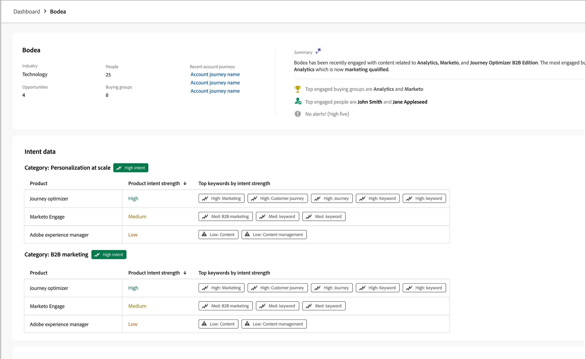
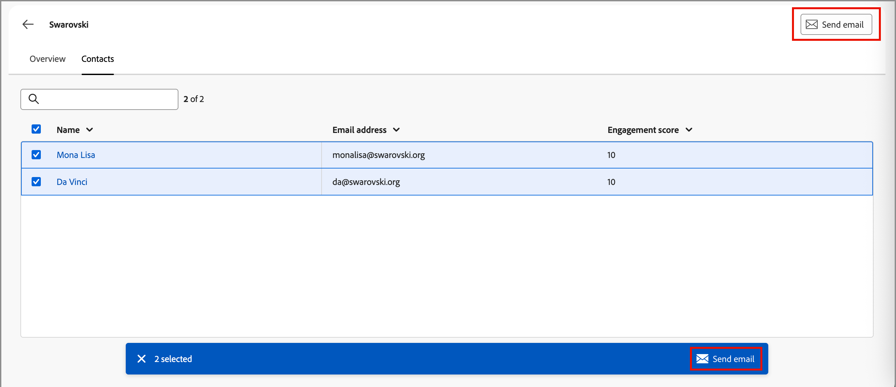

# Accountgegevens

Wanneer u een rekeningsnaam van overal in Journey Optimizer B2B edition klikt, wordt de _pagina van de Details van de Rekening_ getoond. Deze pagina bevat nuttige informatie over de account, waaronder algemene AI-overzichten. Er zijn ook [ acties ](#account-actions) die u voor contacten verbonden aan de rekening kunt uitvoeren.

{width="700" zoomable="yes"}

Gebruik het tabblad **[!UICONTROL Overview]** om informatie over de account te bekijken en het tabblad **[!UICONTROL Contacts]** om toegang te krijgen tot een lijst met contactpersonen voor de account.

## [!UICONTROL Overview] tab

De pagina met accountdetails bestaat uit drie primaire secties:

### Accountoverzicht

{zoomable="yes"}

Het gedeelte Accountoverzicht bevat de volgende accountgegevens:

* Accountnaam
* Aantal personen op de account
* Marktsegment
* Open kansen
* De drie meest recente rekeningsreizen waar de rekening momenteel in gebruik is (klik de reisnaam om het [ reisoverzicht ](../journeys/journey-overview.md) te openen)
* Generatieve AI-samenvatting van de rekening, die informatie bevat over de belangrijkste betrokken inkoopgroepen.

### Intentgegevens

In Journey Optimizer B2B edition voorspelt het Intent Detection-model een oplossing/product van interesse met voldoende vertrouwen op basis van de activiteit van het rekeningcontact. De intent of account contacten kan worden geïnterpreteerd als de waarschijnlijkheid dat een product geïnteresseerd is.

{{intent-data-note}}

{width="700" zoomable="yes"}

* Intentieniveaus
* Typen intentsignalen - Trefwoorden, product en oplossing

### Contact opnemen

{width="800" zoomable="yes"}

De _[!UICONTROL Contact coverage]_sectie toont het aantal contacten van de rekening met een specifieke rol verbonden aan een oplossingsbelang. De toewijzing van rol en oplossingsbelang is gebaseerd op het het kopen malplaatje van de rollen van de groep. Klik op een cel om de volgende details weer te geven:

* Beschrijving, in het volgende formaat: _x de mensen hebben y rol voor de rente van de oplossing van z_
* Kolommen
* Naam
* Account
* Functie
* Groep voor kopen
* Persoonlijke betrokkenheidsscore
* Laatste activiteit
* Details

Klik het _pictogram van de Filter_ (  ) bij de bovenkant verlaten om de gegevensvertoning te filtreren gebruikend om het even welk van deze attributen:

* Oplossingsrente
* Tijdsperiode

### Contactoverlapping

{width="800" zoomable="yes"}

In de sectie _[!UICONTROL Contact overlap]_worden contactpersonen van de account weergegeven die deel uitmaken van meer dan één inkoopgroep omdat ze aan meerdere belangen van oplossingen zijn gekoppeld. Deze informatie bestaat uit een tabel met de volgende kolommen:

* Naam
* Functie
* Account
* Oplossingsrente

Klik de _Informatie_ ( ) naast de contactnaam om een lijst met de volgende details te tonen:

* Het kopen groep (klik de naam om de [ het kopen groepsdetails ](../buying-groups/buying-group-details.md) te openen)
* Functie
* Oplossingsrente
* De intentie van het product (als [ gevormd ](../admin/intent-data.md))
* Product

Klik het _pictogram van de Filter_ (  ) bij de bovenkant verlaten om de gegevensvertoning te filtreren gebruikend om het even welk van deze attributen:

* Oplossingsrente
* Rollen

## [!UICONTROL Contacts] tab

Selecteer het tabblad **[!UICONTROL Contacts]** om een lijst weer te geven met alle personen die aan het account zijn gekoppeld en die naar Experience Platform worden gesynchroniseerd. Elke vermelde contactpersoon bevat de naam, het e-mailadres en de betrokkenheidsscore.

{width="700" zoomable="yes"}

## E-mail verzenden

U kunt een door een markeerteken goedgekeurde e-mail naar een of meer geselecteerde contactpersonen (maximaal 50 tegelijk) of naar alle contactpersonen voor de account verzenden. De lijst met beschikbare e-mails is beperkt tot goedgekeurde e-mailberichten van het aangesloten Marketo Engage-exemplaar.

>[!BEGINTABS]

>[!TAB  Alle rekeningscontacten ]

1. Klik in het tabblad _[!UICONTROL Overview]_rechtsboven op **[!UICONTROL Send email]**.

   {width="700" zoomable="yes"}

1. Selecteer in het dialoogvenster _[!UICONTROL Send email]_de Marketo Engage-werkruimte en schakel vervolgens het selectievakje in voor de e-mail die u wilt verzenden.

   {width="700" zoomable="yes"}

1. Klik op **[!UICONTROL Send]**.

>[!TAB  Geselecteerde contacten ]

1. Selecteer op het tabblad _[!UICONTROL Contacts]_de selectievakjes voor de contactpersonen die u de e-mail wilt ontvangen.

1. Klik op **[!UICONTROL Send email]** rechtsboven of in de selectiebalk onderaan.

   {width="700" zoomable="yes"}

1. Selecteer in het dialoogvenster _[!UICONTROL Send email]_de Marketo Engage-werkruimte en schakel vervolgens het selectievakje in voor de e-mail die u wilt verzenden.

   {width="700" zoomable="yes"}

1. Klik op **[!UICONTROL Send]**.

>[!ENDTABS]
