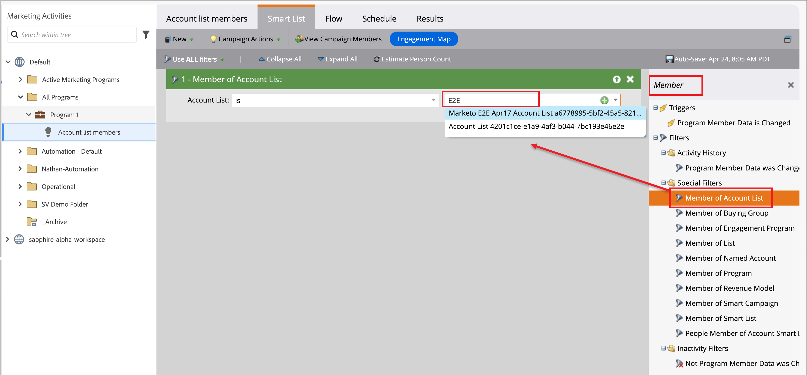
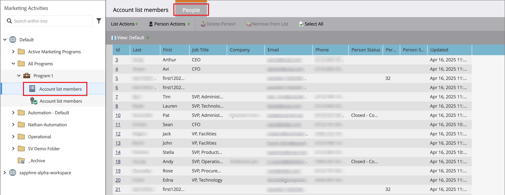

# Accountlijsten gebruiken voor reizen en programma&#39;s

Er zijn meerdere manieren waarop u lijsten met Live (gepubliceerde) accounts kunt opnemen in uw accountreizen.

## Knop voor accountpubliek

Al rekeningsritten beginnen met een [_knoop_ van het publiek van de Rekening 0&rbrace;. ](../journeys/account-audience-nodes.md) Wanneer u deze knoop plaatst om een rekeningslijst te gebruiken, bewegen de lidrekeningen zich door de reis wanneer het (gepubliceerd) live gaat.

1. Selecteer de **[!UICONTROL Account list]** optie voor de beginnende _2&rbrace; knoop van het publiek van de Rekening._

   {width="500"}

1. Klik op **[!UICONTROL Add accounts list]**.

1. Schakel het selectievakje voor de accountlijst in en klik op **[!UICONTROL Save]** .

   {width="600" zoomable="yes"}

## Een actieknooppunt maken - Toevoegen aan account

**_Statische rekeningslijsten slechts_**

Binnen een rekeningsreis, voeg rekeningen aan een statische rekeningslijst toe gebruikend [ a _neem een 2&rbrace; knoop van de Actie_.](../journeys/action-nodes.md)

U hebt bijvoorbeeld een reispad waar u een e-mail verzendt en sommige accounts verschillende acties uitvoeren als reactie. U beschouwt deze activiteit als een kwalificatiepunt op de reis. Met de kwalificatie, wilt u hen aan een rekeningslijst toevoegen die als publiek voor een andere reis met een verschillende stroom voor gekwalificeerde rekeningen wordt gebruikt.

>[!NOTE]
>
>Als een account al in de lijst staat wanneer het knooppunt wordt uitgevoerd, wordt de handeling genegeerd.

1. Selecteer de optie _[!UICONTROL Action on]_&#x200B;**[!UICONTROL Accounts]**.

1. Kies _[!UICONTROL Action on accounts]_&#x200B;bij **[!UICONTROL Add to account list]**.

   {width="500"}

1. Kies bij **[!UICONTROL Select live static account list]** de accountlijst waaraan u accounts wilt toevoegen.

   {width="500"}

## Een actieknooppunt maken - Verwijderen uit account

**_Statische rekeningslijsten slechts_**

Binnen een rekeningsreis, verwijder rekeningen uit een statische rekeningslijst gebruikend [ a _neemt een 2&rbrace; knoop van de Actie_.](../journeys/action-nodes.md)

U hebt bijvoorbeeld een reispad waar u een e-mail verzendt en sommige accounts verschillende acties uitvoeren als reactie. U beschouwt deze activiteit als een kwalificatiepunt op de reis. Met deze kwalificatie, wilt u hen uit een rekeningslijst verwijderen die als publiek voor een andere reis wordt gebruikt die extra e-mails verzendt zodat u uw kwalificatiemededelingen niet dupliceert.

>[!NOTE]
>
>Als een account niet in de lijst staat waar deze moet worden verwijderd, wordt de handeling genegeerd.

1. Selecteer de optie _[!UICONTROL Action on]_&#x200B;**[!UICONTROL Accounts]**.

1. Kies _[!UICONTROL Action on accounts]_&#x200B;bij **[!UICONTROL Remove from account list]**.

   {width="500"}

1. Kies bij **[!UICONTROL Select live static account list]** de accountlijst waarin u accounts wilt verwijderen.

   {width="500"}

## Marketo Engage-programma - Lijst van lidstaten

Als Marketer wilt u wellicht programma&#39;s in Marketo Engage onderdrukken voor mensen die deel uitmaken van accountlijsten in Journey Optimizer B2B edition.

In de Marketo Engage-instantie die is verbonden met Journey Optimizer B2B edition, kunt u het filter _[!UICONTROL Member of Account List]_&#x200B;in uw slimme lijsten gebruiken om deze leads te identificeren op basis van uw campagnestrategie. Voor meer informatie over Slimme Lijsten, verwijs naar de [ documentatie van Marketo Engage ](https://experienceleague.adobe.com/en/docs/marketo/using/product-docs/core-marketo-concepts/smart-lists-and-static-lists/understanding-smart-lists){target="_blank"}.

### Het filter toevoegen aan een slimme lijst

1. Selecteer in Marketo Engage een campagne en klik op de tab **[!UICONTROL Smart List]** .

1. Typ `Member` in de lijst met filters rechts in het scherm en zoek het filter **[!UICONTROL Member of Account List]** .

1. Sleep het filter naar het canvas Slimme lijst.

1. Stel op het canvas Slimme lijst de waarde van de **[!UICONTROL Member of account]** lijst in.

   Klik op de pijl-omlaag om alle accountlijsten weer te geven of voer een deel van de naam van de accountlijst in om de accountlijst te zoeken die u nodig hebt.

   {width="800" zoomable="yes"}

1. Voeg in de campagnestroom de stap **[!UICONTROL Add to List]** toe en kies de lijst waar u de personen wilt vullen in de accountlijst van Journey Optimizer B2B edition.

   Verwijs naar _[een stap van de Stroom aan een slimme campagne ](https://experienceleague.adobe.com/en/docs/marketo/using/product-docs/core-marketo-concepts/smart-campaigns/flow-actions/add-a-flow-step-to-a-smart-campaign){target="_blank"}_ in de documentatie van Marketo Engage voor gedetailleerde informatie over het toevoegen van stappen aan een stroom toevoegen.

### De leden controleren

Nadat de stroom loopt, kunt u de lijst van mensen bekijken die in de lijst worden bevolkt. Open de lijst en selecteer het tabblad Personen.

{width="800" zoomable="yes"}
