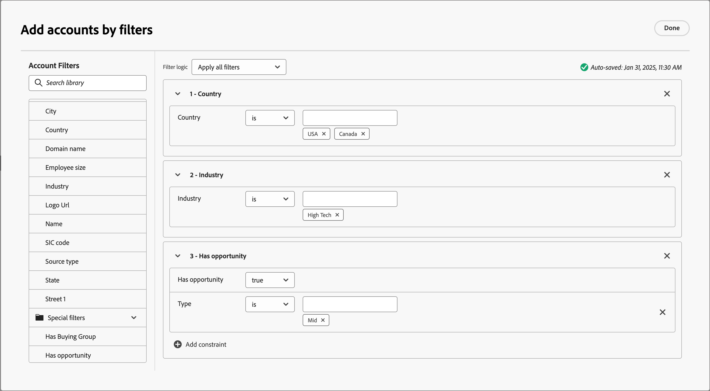
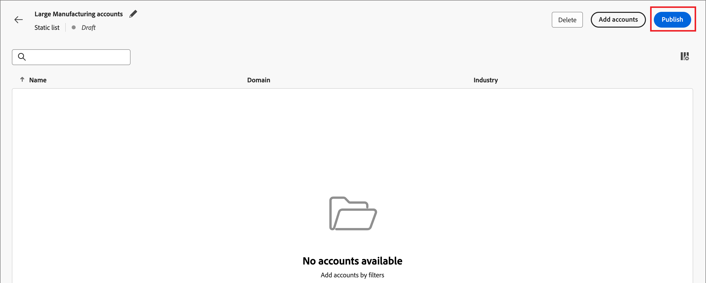

# Accountlijsten

In Journey Optimizer B2B edition is een accountlijst een verzameling benoemde accounts die Marktdeelnemers kunnen gebruiken voor een doelgerichte reisorganisatie. Een accountlijst kan zich richten op benoemde accounts op basis van uw gedefinieerde criteria, zoals de branche, locatie of grootte van het bedrijf. Er zijn twee typen accountlijsten:

* **Statisch** - met een statische rekeningslijst, verandert de lijst slechts wanneer u de rekeningen toevoegt. U kunt handmatig accounts toevoegen door een filterset toe te passen om de lijst te vullen op basis van de huidige accountgegevens, of door een accountreis toe te voegen en te verwijderen.
* **Dynamisch** - met een dynamische rekeningslijst, bepaalt u een filter dat voor automatisch het leiden van de lijst wordt geplaatst. Het systeem gebruikt deze filterset om accounts toe te voegen en te verwijderen op basis van wijzigingen in de accountgegevens. Dit lijstbeheer is gelijkaardig aan [ publiekssegmentatie in het Platform van Gegevens van de Klant in real time ](https://experienceleague.adobe.com/nl/docs/experience-platform/rtcdp/segmentation/b2b){target="_blank"}.

Wanneer een rekeningslijst in a _Levende_ (gepubliceerde) staat is, is het beschikbaar voor [ gebruik in rekeningsreizen en de programma&#39;s van Marketo Engage ](./account-lists-journeys.md).

>[!NOTE]
>
>Account geeft gegevens van een hefboomaccount van Marketo Engage weer om accountsegmenten en lijsten te maken. Dit betekent dat als een accountsegment van Adobe Experience Platform niet actief wordt gesynchroniseerd met Marketo Engage, de accounts in dat Experience Platform-segment mogelijk niet beschikbaar zijn in de accountlijsten van Journey Optimizer B2B edition. Daarna kunnen personen uit accounts in Experience Plafrom-segmenten die niet naar Marketo Engage zijn gesynchroniseerd, niet worden opgenomen in het aantal personen dat lid is van de organisatie of worden meegeteld in triggergebeurtenissen.

## Accountlijsten openen en doorbladeren

Vouw **[!UICONTROL Accounts]** uit in de linkernavigatie en klik op **[!UICONTROL Account lists]** .

{width="800" zoomable="yes"}

De weergegeven _[!UICONTROL Account lists]_&#x200B;pagina bevat de volgende kolommen:

* [!UICONTROL Name] (klik op de naam van de accountlijst voor meer informatie)
* [!UICONTROL Status]
* [!UICONTROL Type]
* [!UICONTROL Last updated on]
* [!UICONTROL Last updated by]
* [!UICONTROL Creation date]
* [!UICONTROL Created by]

Deze lijst omvat de capaciteit om op Naam te zoeken. De sorteerfunctie is momenteel niet beschikbaar.

U kunt de getoonde lijst aanpassen door de _montages van de Kolom_ te klikken ( ) pictogram in de hoger-juiste hoek en het selecteren of ontruimen van checkboxes.

{width="300"} te tonen

Om de beschrijving voor een rekeningslijst te bekijken, klik het _pictogram van de Informatie_ ( ) naast de naam.

## Een accountlijst maken

Wanneer u een accountlijst maakt, definieert u een set filters om de lijst te genereren. U kunt het bijvoorbeeld gebruiken om een lijst met accounts te genereren waarin de branche Gezondheidszorg is en de inkomsten meer dan $100M bedragen.

1. Klik op de pagina _[!UICONTROL Account lists]_&#x200B;op de **[!UICONTROL Create account list]**&#x200B;rechtsboven op de pagina.

   {width="700" zoomable="yes"}

1. Voer in het dialoogvenster _[!UICONTROL Create account list]_&#x200B;een uniek **[!UICONTROL Name]**(vereist) en een **[!UICONTROL Description]**(optioneel) veld in.

1. Kies de _[!UICONTROL Type]_&#x200B;voor de accountlijst,**[!UICONTROL Static]**&#x200B;of **[!UICONTROL Dynamic]**.

   {width="380"}

1. Klik op **[!UICONTROL Create]**.

   Er wordt een nieuwe lijst met statische accounts geopend met een lege lijst met accounts. Er wordt een nieuwe dynamische accountlijst geopend met het deelvenster _[!UICONTROL Add accounts by filter]_&#x200B;op de pagina.

## Accounts toevoegen aan de accountlijst

Voor een statische lijst kunt u doorgaan met het publiceren van de lege accountlijst en het toevoegen van accounts via een accountreis. U kunt ook handmatig accounts toevoegen door een filterset toe te passen voordat u deze publiceert.

Voor een dynamische accountlijst moet u de filterset toevoegen die u wilt gebruiken om de lijst automatisch te beheren voordat u deze publiceert.

>[!BEGINTABS]

>[!TAB  Statische rekeningslijst ]

Nadat u de lijst met statische accounts hebt gemaakt, kunt u de lijst vullen door een filterset toe te passen. U kunt een filter ook toepassen dat wordt geplaatst om rekeningen aan een statische rekeningslijst toe te voegen nadat het wordt gepubliceerd (_Levend_).

>[!NOTE]
>
>Als u de accountlijst leeg wilt laten beginnen, selecteert u geen filters en publiceert u gewoon de accountlijst. Het is nuttig om met een lege lijst te beginnen wanneer u van plan bent om leden door een actie van de rekeningsreis toe te voegen (zie [ een actieknooppunt nemen - voeg aan rekening ](#take-an-action-node---add-to-account) toe).

1. CLick **[!UICONTROL Add accounts]** .

   {width="700" zoomable="yes"}

   U kunt deze functie openen op de lege lijstpagina of bij het hoogste recht.

1. In het dialoogvenster _[!UICONTROL Add accounts by filter]_&#x200B;gebruikt u het menu **[!UICONTROL Account Filters]**&#x200B;om de kenmerken en activiteiten toe te voegen die u wilt gebruiken om de filterset te maken:

   De filters worden genest in categoriemappen. U kunt elke map uitvouwen en door de lijsten met beschikbare filters bladeren. Of, gebruik het _hulpmiddel van het Onderzoek_ bij de bovenkant om van de filter de plaats te bepalen die u nodig hebt.

   * Sleep het filter van het linkermenu naar de filterdefinitieruimte.
   * Voltooi de definitie van de gelijke evaluatie.
   * Herhaal deze handelingen voor elk filter dat u wilt opnemen.

     {width="700" zoomable="yes"}

   * U kunt de voorwaarden perfectioneren door **[!UICONTROL Filter logic]** bij de bovenkant toe te passen. U kunt ervoor kiezen om alle kenmerkvoorwaarden of een willekeurige voorwaarde aan te passen.

     {width="450"}

1. Klik op **[!UICONTROL Populate accounts]** wanneer de filterset en de logica zijn voltooid.

   Het populatieproces kan enige tijd in beslag nemen, afhankelijk van het aantal accounts dat moet worden geëvalueerd en ingevuld (de grootte van de database en de filtercriteria die u hebt geselecteerd). Het kan maximaal twee uur duren voordat accounts in de lijst worden ingevuld.

U kunt doorgaan met het publiceren van de lijst, zodat deze beschikbaar is voor het toevoegen en verwijderen van handelingen tijdens een accountreis.

>[!TAB  Dynamische rekeningslijst ]

Nadat u een dynamische rekeningslijst creeert, bepaalt u de filterreeks die wordt gebruikt om de lijst (toe te voegen/verwijder rekeningen) te beheren wanneer het _Levend_ (gepubliceerd) is. U kunt geen accounts toevoegen/verwijderen via accountreizen, maar er is een gepubliceerde dynamische accountlijst beschikbaar voor het startknooppunt voor het accountpubliek.

1. Klik op **[!UICONTROL Select filters]**.

   {width="700" zoomable="yes"}

1. In het dialoogvenster _[!UICONTROL Add accounts by filter]_&#x200B;gebruikt u het menu **[!UICONTROL Account Filters]**&#x200B;om de kenmerken en speciale filters toe te voegen die u wilt gebruiken om de filterset te maken:

   De filters worden genest in categoriemappen. U kunt elke map uitvouwen en door de lijsten met beschikbare filters bladeren. Of, gebruik het _hulpmiddel van het Onderzoek_ bij de bovenkant om van de filter de plaats te bepalen die u nodig hebt.

   * Sleep het filter van het linkermenu naar de filterdefinitieruimte.
   * Voltooi de definitie van de gelijke evaluatie.
   * Herhaal deze handelingen voor elk filter dat u wilt opnemen.

     {width="700" zoomable="yes"}

   * U kunt de voorwaarden perfectioneren door **[!UICONTROL Filter logic]** bij de bovenkant toe te passen. U kunt ervoor kiezen om alle kenmerkvoorwaarden of een willekeurige voorwaarde aan te passen.

     {width="450"}

1. Klik op **[!UICONTROL Done]** wanneer de filterset en de logica zijn voltooid.

   Als u met de filterreeks wordt tevreden, kunt u aan [ te werk gaan publiceren de lijst ](#publish-an-account-list) om het voor de beginnende [ knoop van het rekeningspubliek ](#account-audience-node) in een rekeningsreis ter beschikking te stellen.

   >[!NOTE]
   >
   >U kunt de filters voor een dynamische accountlijst niet bijwerken nadat de lijst is gepubliceerd.

   Het populatieproces kan enige tijd in beslag nemen, afhankelijk van het aantal accounts dat moet worden geëvalueerd en ingevuld (de grootte van de database en de filtercriteria die u hebt geselecteerd). Het kan maximaal twee uur duren voordat accounts in de lijst worden ingevuld.

>[!ENDTABS]

## Een accountlijst publiceren

U kunt een accountlijst publiceren zodra de filterset is voltooid.

>[!BEGINTABS]

>[!TAB  Statische rekeningslijst ]

1. Klik op **[!UICONTROL Publish]** rechtsboven.

   {width="700" zoomable="yes"}

1. Klik in het dialoogvenster _[!UICONTROL Publish static account list]_&#x200B;op **[!UICONTROL Publish]**&#x200B;om te bevestigen.

   {width="400"}

Het statuut van de statische rekeningslijst verandert in _[!UICONTROL Live]_&#x200B;en het is beschikbaar voor [ gebruik in een rekeningsreis ](#account-list-usage-in-account-journeys).

>[!TAB  Dynamische rekeningslijst ]

U kunt doorgaan met het publiceren van een dynamische accountlijst zodra de filterset is voltooid. Nadat de accountlijst de status Live heeft, kunt u deze selecteren in een reisknooppunt voor het publiek van de account.

1. Klik op **[!UICONTROL Publish]** rechtsboven.

   {width="700" zoomable="yes"}

1. Klik in het dialoogvenster _[!UICONTROL Publish dynamic account list]_&#x200B;op **[!UICONTROL Publish]**&#x200B;om te bevestigen.

   {width="400"}

Het statuut van de dynamische rekeningslijst verandert in _[!UICONTROL Live]_&#x200B;en het is beschikbaar voor [ gebruik in een rekeningsreis ](#account-list-usage-in-account-journeys).

>[!ENDTABS]
