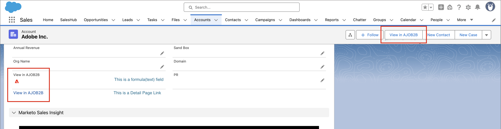

# Toegang tot detailpagina&#39;s in CRM

Adobe Journey Optimizer B2B edition staat leden van verkoop- en accountteams toe om gedetailleerde pagina&#39;s voor account en groepsgegevens rechtstreeks te openen via hun Customer Relationship Management (CRM)-tool, zoals Salesforce of Microsoft Dynamics. Met deze integratie kunnen verkoopvertegenwoordigers snel toegang krijgen tot realtime account en groepsinzichten kopen, zoals betrokkenheidsgeschiedenis, intentsignalen en door AI gegenereerde aanbevelingen. Deze mogelijkheid stelt het verkoopteam in staat om sneller te werken, slimmer prioriteiten te stellen en beter af te stemmen op Marketing.

Om verkoop en de leden van het rekeningsteam voor het bekijken van [&#x200B; rekeningsdetails &#x200B;](account-details.md) en [&#x200B; persoondetails &#x200B;](person-details.md) pagina&#39;s in Journey Optimizer B2B edition van CRM toe te laten, kan Salesforce of de beheerder van de Dynamica een verbinding van de rekening, het contact, of de mening van het lood toevoegen.

Wanneer een het teamlid van de Verkoop de verbinding van de instantie van CRM gebruikt, zou zandbak _Prod_ moeten zijn, en de organisatie IMS wordt bepaald volgens de volgende geordende logica:

1. De meest recente organisatie waartoe de gebruiker toegang heeft gehad
1. De eerste in de lijst met een alfabetische sortering
1. De organisatie die u in de voorkeuren hebt geselecteerd

## Salesforce-koppelingen

Een beheerder van Salesforce met _past de toestemming van de Toepassing_ aan kan de verbinding in de Rekening, het Contact, of de lay-out van het Lood vormen. Met de geconfigureerde koppelingen hebben Verkoopgebruikers toegang tot de pagina met corresponderende accountgegevens of persoonlijke gegevens in Adobe Journey Optimizer B2B edition.

In Salesforce voegt u de aangepaste koppeling toe als een knop, hyperlink of gekoppeld pictogram en past u deze aan volgens de voorkeuren van uw team.

{width="800" zoomable="yes"}

Voor gedetailleerde informatie over het toevoegen van een douaneverbinding in Salesforce, verwijs naar [&#x200B; Bepaal de Knopen en de Verbindingen van de Douane &#x200B;](https://help.salesforce.com/s/articleView?id=platform.defining_custom_links.htm&type=5) in de documentatie van Salesforce.

Wanneer u de doel-URL voor de koppeling definieert, kunt u de account-, contact- of lead-indeling gebruiken en deze koppelen aan de bijbehorende detailpagina in Journey Optimizer B2B edition:

* **Rekening** - `https://experience.adobe.com/#/journey-optimizer-b2b/accounts/crm/account/[18-character ID of account]`

* **Contact** - `https://experience.adobe.com/#/journey-optimizer-b2b/accounts/crm/contact/[18-character ID of contact]`

* **Lood** - `https://experience.adobe.com/#/journey-optimizer-b2b/accounts/crm/lead/[18-character ID of lead]`

Gebruik het object `Account` om de 18-teken-id van het account op te halen, zoals `CASESAFEID(Account.Id)` of `CASESAFEID(Id)` .

**_Examples:_**

+++Veldkoppeling

1. Ga in Salesforce naar **[!UICONTROL Setup]** > **[!UICONTROL Object Manager]** > **[!UICONTROL Account]**/**[!UICONTROL Contact]**/**[!UICONTROL Lead]** > **[!UICONTROL Fields & Relationships]** .
1. Klik **[!UICONTROL New]** om een formule (tekst) gebied tot stand te brengen, en het toe te voegen aan een _Rekening_, _Contact_, of _Lood_ lay-out.

   Gebruik voor de formule de volgende voorbeelden als richtlijn.

   **_Text hyperlink:_**

   * Account - `HYPERLINK("https://experience.adobe.com/#/journey-optimizer-b2b/accounts/crm/account/" & CASESAFEID(Id), "View in AJO B2B")`
   * Contact - `HYPERLINK("https://experience.adobe.com/#/journey-optimizer-b2b/accounts/crm/contact/" & CASESAFEID(Id), "View in AJO B2B")`
   * Lood - `HYPERLINK("https://experience.adobe.com/#/journey-optimizer-b2b/accounts/crm/lead/" & CASESAFEID(Id), "View in AJO B2B")`

   **_Icon hyperlink:_**

   * Account - `HYPERLINK("https://experience.adobe.com/#/journey-optimizer-b2b/accounts/crm/account/" & CASESAFEID(Id), IMAGE("https://cdn.experience.adobe.net/assets/HeroIcons.6620f5dc.svg#AdobeExperienceSubCloud", "View in AJO B2B", 24, 24))`
   * Contact - `HYPERLINK("https://experience.adobe.com/#/journey-optimizer-b2b/accounts/crm/contact/" & CASESAFEID(Id), IMAGE("https://cdn.experience.adobe.net/assets/HeroIcons.6620f5dc.svg#AdobeExperienceSubCloud", "View in AJO B2B", 24, 24))`
   * Contact - `HYPERLINK("https://experience.adobe.com/#/journey-optimizer-b2b/accounts/crm/lead/" & CASESAFEID(Id), IMAGE("https://cdn.experience.adobe.net/assets/HeroIcons.6620f5dc.svg#AdobeExperienceSubCloud", "View in AJO B2B", 24, 24))`

   {width="800" zoomable="yes"}

1. Vernieuw de pagina zodat de layoutwijzigingen worden weergegeven. Ga naar **[!UICONTROL Profile]** en selecteer een andere optie onder **[!UICONTROL DISPLAY DENSITY]** .

   {width="450" zoomable="yes"}

+++

+++Koppeling naar detailpagina

1. Ga in Salesforce naar **[!UICONTROL Setup]** > **[!UICONTROL Object Manager]** > **[!UICONTROL Account]**/**[!UICONTROL Contact]**/**[!UICONTROL Lead]** > **[!UICONTROL Buttons, Links, and Actions]** .
1. Klik op **[!UICONTROL New Button or Link]** in de rechterbovenhoek en maak de koppeling voor de detailpagina.

   Gebruik voor de formule de volgende voorbeelden als richtlijn.

   * Account - `{!URLFOR("https://experience.adobe.com/#/journey-optimizer-b2b/accounts/crm/account/" & CASESAFEID(Account.Id), null)}`
   * Contact - `{!URLFOR("https://experience.adobe.com/#/journey-optimizer-b2b/accounts/crm/contact/" & CASESAFEID(Contact.Id), null)}`
   * Lood - `{!URLFOR("https://experience.adobe.com/#/journey-optimizer-b2b/accounts/crm/lead/" & CASESAFEID(Lead.Id), null)}`

   {width="800" zoomable="yes"}

1. Ga naar **[!UICONTROL Page Layouts]** in de linkernavigatie.

1. Sleep de verbinding van **[!UICONTROL Custom Links]** en laat vallen het in de _sectie van de Verbindingen van de Douane_ in de lay-out.

+++

+++Knop Detailpagina

1. Ga in Salesforce naar **[!UICONTROL Setup]** > **[!UICONTROL Object Manager]** > **[!UICONTROL Account]**/**[!UICONTROL Contact]**/**[!UICONTROL Lead]** > **[!UICONTROL Buttons, Links, and Actions]** .
1. Klik op **[!UICONTROL New Button or Link]** in de rechterbovenhoek en maak de knop voor de detailpagina.

   Kies **[!UICONTROL Display Type]** bij **[!UICONTROL Detail Page Link]** .

   Gebruik voor de formule de volgende voorbeelden als richtlijn.

   * Account - `{!URLFOR("https://experience.adobe.com/#/journey-optimizer-b2b/accounts/crm/account/" & CASESAFEID(Account.Id), null)}`
   * Contact - `{!URLFOR("https://experience.adobe.com/#/journey-optimizer-b2b/accounts/crm/contact/" & CASESAFEID(Contact.Id), null)}`
   * Lood - `{!URLFOR("https://experience.adobe.com/#/journey-optimizer-b2b/accounts/crm/lead/" & CASESAFEID(Lead.Id), null)}`

   {width="800" zoomable="yes"}

1. Ga naar **[!UICONTROL Page Layouts]** in de linkernavigatie.

1. Sleep de knop vanuit **[!UICONTROL Mobile & Lightning Actions]** en zet deze neer in de sectie **[!UICONTROL Salesforce Mobile and Lightning Experience Actions]** in de layout.

   {width="800" zoomable="yes"} toe

+++

## Microsoft Dynamics-koppelingen

Een ontwikkelaar van de Dynamica kan de Account, Contact, of Lead entiteit uitbreiden om een verbindingsgebied toe te voegen. Met de geconfigureerde koppelingen hebben Verkoopgebruikers toegang tot de pagina met corresponderende accountgegevens of persoonlijke gegevens in Adobe Journey Optimizer B2B edition.

Voeg de aangepaste koppeling toe als een knop, hyperlink of koppeling naar een gekoppeld pictogram en pas de koppeling aan naar de voorkeuren van uw team.

{width="800" zoomable="yes"}

Gebruik Power Apps om Microsoft-modelgestuurde apps aan te passen, zoals Dynamics-componenten. Voor gedetailleerde informatie over het gebruiken van de Apps van de Macht om een douaneverbinding in Dynamiek toe te voegen, verwijs naar de [&#x200B; documentatie van PowerApps &#x200B;](https://learn.microsoft.com/en-us/power-apps/maker/model-driven-apps/create-edit-web-resources).

Wanneer u de doel-URL voor de koppeling definieert, kunt u de account-, contact- of hoofdweergave gebruiken en deze koppelen aan de bijbehorende detailpagina in Journey Optimizer B2B edition:

* **Rekening** - `https://experience.adobe.com/#/journey-optimizer-b2b/accounts/crm/account/[Account ID]`

* **Contact** - `https://experience.adobe.com/#/journey-optimizer-b2b/accounts/crm/contact/[Contact ID]`

* **Lood** - `https://experience.adobe.com/#/journey-optimizer-b2b/accounts/crm/lead/[Lead ID]`

**_Examples:_**

+++URL-veld

Voer de volgende taakvolgorde uit om de aangepaste koppeling als een URL-veld toe te voegen:

**1 - vorm het oplossingsgebied**

1. Ga naar **[!UICONTROL Advanced Settings]** > **[!UICONTROL Customize the system]** en selecteer de tab **[!UICONTROL Solution]** .
1. Selecteer **[!UICONTROL Entities]** > **[!UICONTROL Account]**/**[!UICONTROL Contact]**/**[!UICONTROL Lead]** > **[!UICONTROL Fields]** .
1. Klik op **[!UICONTROL New]** en configureer het nieuwe veld.

   {width="800" zoomable="yes"}

1. Sla de veldconfiguratie op.
1. Selecteer op het tabblad _[!UICONTROL Solution]_&#x200B;de optie **[!UICONTROL Web Resources]**.
1. Klik op **[!UICONTROL New]** en configureer de volgende JScript-webbron (Script):

   ```js
   function setViewInAjoB2b(executionContext) {
    var url = "https://experience.adobe.com/#/journey-optimizer-b2b/accounts/crm";
   
    var formContext = executionContext.getFormContext();
   
    // Get the entity ID (GUID)
    var id = formContext.data.entity.getId();
   
    // Get the entity type (account, lead, contact)
    var type = formContext.data.entity.getEntityName().toLowerCase();
   
    if (id && type) {
        // Remove curly braces
        id = id.replace(/[{}]/g, "").toLowerCase();
   
        // Set the value in the custom field (Ensure this field exists on the form)
        formContext.getAttribute("new_viewinajob2b").setValue(url + "/" + type + "/" + id);
       }
   }
   ```

   {width="800" zoomable="yes"} toe

1. Klik boven aan de pagina op **[!UICONTROL SAVE]** en vervolgens op **[!UICONTROL PUBLISH]** .

**2 - vorm**

1. Voor het _lusje van de Oplossing_, uitgezochte **[!UICONTROL Entities]** > **[!UICONTROL Account]**/**[!UICONTROL Contact]**/ **[!UICONTROL Lead]** > **[!UICONTROL Forms]** > **[!UICONTROL Account]**/**[!UICONTROL Contact]**/**[!UICONTROL Lead]**.
1. Sleep het nieuwe veld dat u in de eerste taak hebt gemaakt van **[!UICONTROL Field Explorer]** naar de sectie **[!UICONTROL Summary]** .

   {width="800" zoomable="yes"} toe

1. Dubbelklik het gebied in de _Samenvatting_ sectie en vorm zijn eigenschappen.

   {width="800" zoomable="yes"}

   Klik op **[!UICONTROL OK]** wanneer de configuratie van de eigenschap is voltooid.

1. Klik in het lint boven aan de pagina op **[!UICONTROL Save]** en vervolgens op **[!UICONTROL Publish]** .

**3 - voeg het JS Webmiddel aan de vormbibliotheken** toe

1. Klik op de tab _[!UICONTROL Home]_&#x200B;bovenaan op **[!UICONTROL Form Properties]**.
1. Klik op **[!UICONTROL Add]**.

   {width="500" zoomable="yes"} toe

1. Zoek de bron, selecteer deze en klik op **[!UICONTROL Add]** .

   {width="500" zoomable="yes"} toe

1. Selecteer de toegevoegde bron en klik op **[!UICONTROL Add]** onder _[!UICONTROL Event Handlers]_.
1. Voeg de functie `setViewInAjoB2b` toe aan **[!UICONTROL Event Handlers]** .
1. Selecteer de functie in de lijst _[!UICONTROL Event Handlers]_&#x200B;en stel **[!UICONTROL Control]**&#x200B;in op `Form` en **[!UICONTROL Event]**&#x200B;op `OnLoad` .

   {width="500" zoomable="yes"} toe

1. Klik op **[!UICONTROL OK]**.

1. Klik op de tab _[!UICONTROL Home]_&#x200B;boven in het scherm op **[!UICONTROL Save]**&#x200B;en vervolgens op **[!UICONTROL Publish]**.

**4 - verifieer de verbinding**

Als u de koppeling wilt controleren, controleert u de account-, contact- of regelweergave in Dynamics.

{width="500" zoomable="yes"} toe

Als de koppeling niet wordt weergegeven, probeert u op de startpagina Dynamiek naar Accounts, Contactpersonen of Leads onder **[!UICONTROL Customers]** te gaan. Ga vervolgens terug naar de specifieke account, de contactgegevens of de kopweergave. U kunt ook uitloggen en opnieuw aanmelden.

+++

+++HTML-webresource

Voer de volgende taakvolgorde uit om de aangepaste koppeling toe te voegen als een HTML-webbron:

>[!NOTE]
>
>Dit voorbeeld hangt af van hoe de Dynamica Webpagina Webmiddelen gebruikt.

**1 - vorm de middelen van het oplossingsWeb**

1. Ga naar **[!UICONTROL Advanced Settings]** > **[!UICONTROL Customize the system]** en selecteer de tab **[!UICONTROL Solution]** .

1. Selecteer op het tabblad _[!UICONTROL Solution]_&#x200B;de optie **[!UICONTROL Web Resources]**.

1. Klik op **[!UICONTROL New]** en configureer de volgende JScript-webbron (Script) met de volgende functie:

   ```js
   function getFormContext(executionContext) {
       window.top["formContext"] = executionContext.getFormContext();
   }
   ```

   {width="800" zoomable="yes"}

1. Klik op **[!UICONTROL New]** om een andere webbron te maken en een webbron van een webpagina (HTML) te configureren met de volgende HTML:

   ```html
   <html>
   <head>
       <script>
       function onLoad(){
           // Adobe URL
           var url = "https://experience.adobe.com/#/journey-optimizer-b2b/accounts/crm";
   
           // Get the entity ID (GUID)
           var id = window.top.formContext.data.entity.getId();
   
           // Get the entity type (account, lead, contact)
           var type = window.top.formContext.data.entity.getEntityName().toLowerCase();
   
           if (id && type) {
               // Remove curly braces
               id = id.replace(/[{}]/g, "").toLowerCase();
               var url = url + "/" + type + "/" + id;
   
               // Find the hyperlink and set the href value
               var link = document.getElementById("link");
               link.href = url;
           }
       }
       </script>
   </head>
   <body onload="onLoad()" style="margin-left: 0;">
       <a id="link" style="text-decoration: none; font-family: sans-serif; font-size: 13px;" target="_blank">
           
           <span style="vertical-align: middle;">View in AJOB2B</span>
       </a>
   </body>
   </html>
   ```

1. Klik boven aan de pagina op **[!UICONTROL SAVE]** en vervolgens op **[!UICONTROL PUBLISH]** .

**2 - voeg de JS Webmiddelen aan de vormbibliotheken** toe

1. Voor het _lusje van de Oplossing_, uitgezochte **[!UICONTROL Entities]** > **[!UICONTROL Account]**/**[!UICONTROL Contact]**/ **[!UICONTROL Lead]** > **[!UICONTROL Forms]** > **[!UICONTROL Account]**/**[!UICONTROL Contact]**/**[!UICONTROL Lead]**.

1. Voor het _Huis_ lusje bij de bovenkant, klik **[!UICONTROL Form Properties]**.

1. Klik op **[!UICONTROL Add]**.

1. Zoek de JScript-webbron (`new_getFormContext`) die u hebt gemaakt, selecteer deze en klik op **[!UICONTROL Add]** .

   {width="500" zoomable="yes"} toe

1. Selecteer de toegevoegde bron en klik op **[!UICONTROL Add]** onder _[!UICONTROL Event Handlers]_.
1. Voeg de functie `getFormContext` toe aan **[!UICONTROL Event Handlers]** .
1. Selecteer de functie in de lijst _[!UICONTROL Event Handlers]_&#x200B;en stel **[!UICONTROL Control]**&#x200B;in op `Form` en **[!UICONTROL Event]**&#x200B;op `OnLoad` .

   {width="500" zoomable="yes"} toe

1. Klik op **[!UICONTROL OK]**.

1. Klik op de tab _[!UICONTROL Home]_&#x200B;boven in het scherm op **[!UICONTROL Save]**&#x200B;en vervolgens op **[!UICONTROL Publish]**.

**3 - vorm**

1. Voor het **[!UICONTROL HOME]** lusje voor de Rekening, het Contact, of vorm van het Lood, uitgezocht **[!UICONTROL Body]** (om het verbonden middel in de _Samenvatting_ sectie) tot stand te brengen of **[!UICONTROL Header]** (om het in het kopbalmenu tot stand te brengen).

   {width="500" zoomable="yes"}

1. Selecteer de tab **[!UICONTROL INSERT]** bovenaan en klik op **[!UICONTROL Web Resource]** .

1. Voeg de webbron in die u hebt gemaakt en configureer de eigenschappen.

   {width="500" zoomable="yes"}

   Voor gedetailleerde informatie over de eigenschappen en het formatteren van het Webmiddel, zie de [&#x200B; documentatie van de Apps van de Macht &#x200B;](https://learn.microsoft.com/en-us/power-apps/maker/model-driven-apps/web-resource-properties-legacy).

1. Klik op **[!UICONTROL OK]**.

   Als u een Body/Summary-plaatsing kiest voor de webbron, wordt deze weergegeven in de formulierindeling.

   {width="800" zoomable="yes"} wordt toegevoegd

1. Klik op de tab _[!UICONTROL Home]_&#x200B;boven in het scherm op **[!UICONTROL Save]**&#x200B;en vervolgens op **[!UICONTROL Publish]**.

**4 - verifieer de verbinding**

Als u de koppeling wilt controleren, controleert u de account-, contact- of regelweergave in Dynamics.

{width="500" zoomable="yes"} toe

Als de koppeling niet wordt weergegeven, probeert u op de startpagina Dynamiek naar Accounts, Contactpersonen of Leads onder **[!UICONTROL Customers]** te gaan. Ga vervolgens terug naar de specifieke account, de contactgegevens of de kopweergave. U kunt ook uitloggen en opnieuw aanmelden.

+++
