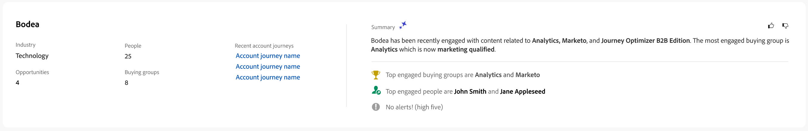

# Persoonsgegevens

Wanneer u ergens in Journey Optimizer B2B edition op de naam van een persoon klikt, wordt de pagina met persoonlijke gegevens weergegeven. Deze pagina bevat nuttige informatie over de persoon die aan een account of inkoopgroep is gekoppeld, inclusief een generatieve AI-samenvatting van hooglicht- en intentgegevens (indien geconfigureerd). <!-- There are also [actions](#person-actions) that you can execute for the person. -->

{width="800" zoomable="yes"}

U kunt tot deze pagina toegang hebben door een naam te klikken die in het [&#x200B; Intelligente Dashboard &#x200B;](../dashboards/intelligent-dashboard.md) wordt getoond, [&#x200B; het Kopen de detailpagina van de Groep &#x200B;](../buying-groups/buying-group-details.md), of [&#x200B; pagina van de Details van de Rekening &#x200B;](./account-details.md).

De pagina met persoonlijke gegevens bestaat uit de volgende vier secties:

## Overzicht van persoon

{zoomable="yes"}

De sectie met het overzicht van de persoon boven aan de pagina bevat de volgende informatie:

* Naam
* Titel
* E-mail
* Telefoonnummer
* Betrokkenheidsscore
* Samenvatting

## Activiteiten

Deze sectie bevat een lijst met de meest recente e-mail-, web-, formulieren- en interessante momenten die aan de persoon zijn gekoppeld (maximaal 20). De items zijn lijsten als het type activiteit met de datum en tijd.

{width="700" zoomable="yes"}

## Groepen kopen op basis van betrokkenheidsscore

Deze sectie omvat inkoopgroepen waarbij de persoon lid is en wordt gesorteerd op basis van betrokkenheidsscore. Elke kaart bevat de volgende informatie over de inkoopgroep:

* Naam - klik de naam om de [&#x200B; het kopen groepsdetails &#x200B;](../buying-groups/buying-group-details.md) te openen.
* Betrokkenheidsscore
* Volledigheidsscore
* Werkgebied
* Leden

{width="700" zoomable="yes"}

## Intentgegevens

In Journey Optimizer B2B edition voorspelt het Intent Detection-model een oplossing/product van interesse met voldoende vertrouwen op basis van iemands activiteit. Het gebruikt ook de activiteiten van andere medeleden van de rekening, samen met geëtiketteerde inhoud. De intentie van een persoon kan worden geïnterpreteerd als de waarschijnlijkheid dat hij belang heeft bij een product.

{{intent-data-note}}

{width="700" zoomable="yes"}

* Intentieniveaus
* Typen intentsignalen - Trefwoorden, product en oplossing

<!-- ## Person actions -->
