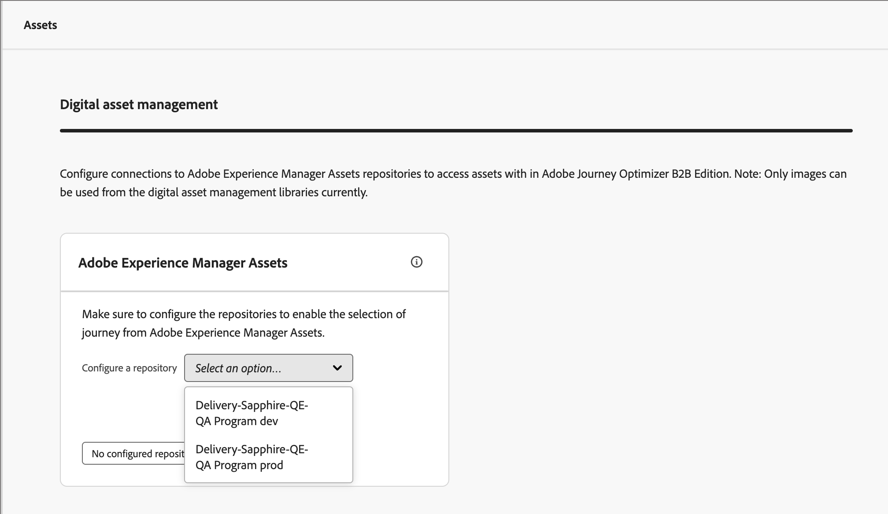

# Experience Manager-opslagruimten voor middelen configureren

Adobe Journey Optimizer B2B edition integreert met Adobe Experience Manager Assets as a Cloud Service, zodat u niet alleen via e-mailberichten, maar ook via uw account middelen kunt gebruiken. Het zorgt voor transparantie door informatie uit te wisselen met Experience Manager Assets. Configureer de verbinding met Adobe Experience Assets om deze mogelijkheid in te schakelen.

Adobe Experience Manager Cloud Manager wordt georganiseerd in programma&#39;s, en elk programma heeft veelvoudige milieu&#39;s en bewaarplaatsen ([ Leer meer ](https://experienceleague.adobe.com/en/docs/experience-manager-cloud-service/content/implementing/using-cloud-manager/programs/program-types){target="_blank"}). Wanneer u Adobe Experience Manager Assets configureert in Adobe Journey Optimizer B2B edition, stelt u verbindingen in met elke repository die u wilt gebruiken voor toegang tot digitale middelen.

{{aem-assets-licensing-note}}

## Vereisten

* Produceer de dienstgeloofsbrieven voor het gewenste milieu op Developer Console zonder hoofd van AEM ([ Leer meer ](https://experienceleague.adobe.com/en/docs/experience-manager-learn/getting-started-with-aem-headless/authentication/service-credentials#generate-service-credentials){target="_blank"}).
* Verwerk de certificaten die nodig zijn voor de verbinding. Als beste praktijk, zorg ervoor dat de certificaten minstens zes maanden vóór afloop van de geldigheidsduur resteren. De certificaten verlopen elke 365 dagen.
* Adobe Journey Optimizer B2B edition ondersteunt de toegang tot één digitale bron voor middelenbeheer tegelijk. Zorg ervoor dat de vereiste middelen beschikbaar zijn in Adobe Experience Manager voordat u overschakelt.

>[!IMPORTANT]
>
>De de dienstgeloofsbrieven zijn bona fide en bevatten een privé sleutel. Deze geloofsbrieven moeten worden opgeslagen, worden geleid, en worden betreden volgens het beleid van IT en van de Veiligheid van uw organisatie.

## Een dataopslagverbinding toevoegen

1. Kies in de linkernavigatie **[!UICONTROL Administration]** > **[!UICONTROL Configuration]** .

1. Klik op **[!UICONTROL Assets]** in het middelste deelvenster.

   {width="700" zoomable="yes"}

<!--   The default digital asset management option is configured as `Adobe Marketo Engage`.
-->
Vanaf hier kunt u de verbindingen met elke AEM-omgeving één voor één configureren.

1. Klik in het vak _[!UICONTROL Adobe Experience Manager Assets]_&#x200B;op de pijl naast **[!UICONTROL Configure a repository]**&#x200B;en kies de gegevensopslagruimte.

   {width="500"}

1. Klik op **[!UICONTROL Add a certificate]** en gebruik de dialooggereedschappen om het bestand te uploaden.

   U kunt een .json-bestand uploaden door het naar het dialoogvenster te slepen of door op de koppeling te klikken om een bestand op uw systeem te zoeken en te selecteren (controleer of het bestand een geldig JSON-type is).

   {width="500"}

   Na het uploaden wordt het certificaat onderaan weergegeven.

   >[!NOTE]
   >
   >Als een ongeldig bestand wordt gebruikt, wordt onderaan in het dialoogvenster een fout weergegeven.

   Klik op **[!UICONTROL Add]** om het certificaat te voltooien.

1. Klik op de pijl Vorige (←) om terug te keren naar de hoofdconfiguratiepagina.

   De geconfigureerde opslagplaats wordt weergegeven in de tabel onder het selectievenster. U kunt een andere opslagplaats toevoegen door stap 3-4 te herhalen.

   {width="600" zoomable="yes"}

Wanneer u klaar bent met het configureren van de opslagruimten, kunnen teamleden de Adobe Experience Manager Assets selecteren bij het ontwerpen van inhoud.

>[!NOTE]
>
>Adobe Journey Optimizer B2B edition biedt ondersteuning voor toegang tot één digitale bron voor middelenbeheer tegelijk met het ontwerpen van inhoud. 

## Certificaten vervangen

Certificaten verlopen elke 365 dagen na de aanmaakdatum. Vervang het voor het verstrijken van de termijn om ervoor te zorgen dat uw team tot activa kan blijven toegang hebben.

>[!NOTE]
>
>Adobe Journey Optimizer B2B edition communiceert met Experience Manager-middelen voor gebruiksinformatie. De verbinding moet actief blijven voor betrouwbare gegevenssynchronisatie bij het gebruik en om gegevensdiscrepanties te voorkomen. Beheerders krijgen via de meldingen in de app een melding te zien over het verlopen van certificaten. Ze kunnen ook de vervaldatums noteren in de Assets-subsectie - Digitaal middelenbeheer in het beheergebied.

1. Zoek op de pagina voor beheer van digitale elementen de lijst met geconfigureerde opslagruimten.

1. Klik op de gewenste opslagplaats om het certificaat te vervangen.

1. Klik op het pictogram met de ovalen (**...** ) voor het certificaatbestand om de opties voor handelingen op het bestand weer te geven.

   {width="600" zoomable="yes"}

1. Kies **[!UICONTROL Replace]** om het dialoogvenster voor het uploaden van bestanden te openen.

1. Upload een bestand door het naar het dialoogvenster te slepen of door de koppeling te gebruiken. Zorg ervoor dat het bestand van het type json is.

   {width="500"}

1. Klik op **[!UICONTROL Replace]** om het uploaden te bevestigen.

## Een certificaat weergeven

U kunt het JSON-certificaatbestand weergeven dat is gekoppeld aan de gegevensopslagverbinding.

1. Zoek op de pagina voor beheer van digitale elementen de lijst met geconfigureerde opslagruimten.

1. Klik op de verbonden opslagplaats.

1. Klik op het pictogram met de ovalen (**...** ) voor het certificaatbestand om de opties voor handelingen op het bestand weer te geven.

1. Kies **[!UICONTROL View]** .

   {width="600"}

1. Klik op **[!UICONTROL Close]** om terug te keren naar de pagina Opslagplaats configureren.

## Een dataopslagverbinding verwijderen

Als u een opslagplaats verwijdert, verwijdert u de toegang van gebruikers tot de Experience Manager Assets-omgeving in Journey Optimizer B2B edition.

1. Zoek op de pagina _[!UICONTROL Digital asset management]_&#x200B;de lijst met geconfigureerde opslagruimten voor elementen.

1. Klik op de gewenste naam van de opslagplaats om de verbinding te bewerken.

1. Klik op het pictogram met de ovalen (**...** ) voor het certificaatbestand om de opties voor handelingen op het bestand weer te geven.

1. Kies **[!UICONTROL Delete]** .

1. Klik op **[!UICONTROL Delete]** in het bevestigingsdialoogvenster.
<!--

## Switch back to Adobe Marketo Engage Assets

Select Adobe Marketo Engage digital asset management in the Assets section.

After the confirmation, the Adobe Marketo Engage assets library is available for users.
-->
