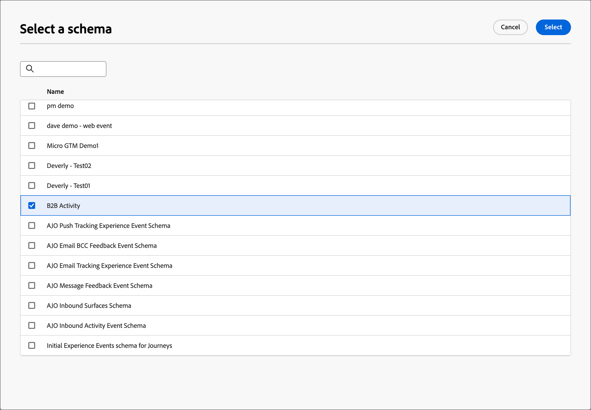
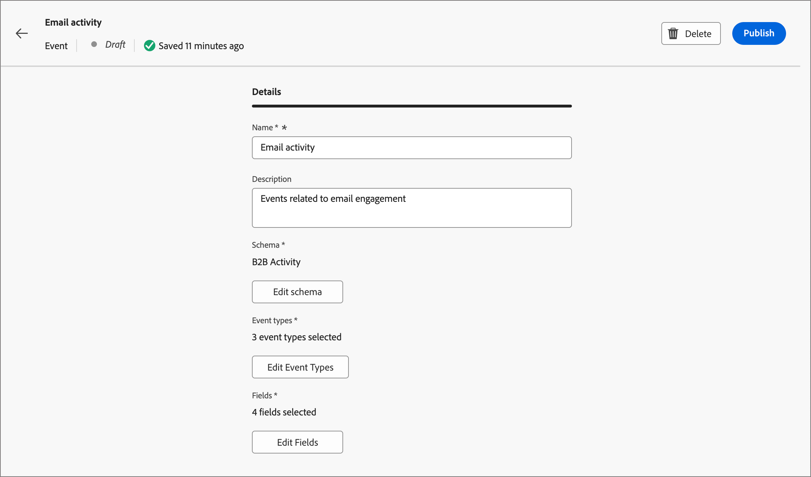

# Experience Platform-gebeurtenisdefinities configureren

De beheerders kunnen op Adobe Experience Platform (AEP)-Gebaseerde gebeurtenisdefinities vormen, die Marketers toelaten om rekeningsreizen tot stand te brengen die aan [ de Gebeurtenissen van de Ervaring van AEP ](https://experienceleague.adobe.com/nl/docs/experience-platform/xdm/classes/experienceevent){target="_blank"} reageren.

{width="30"} [ bekijk het videooverzicht ](#overview-video)

Het gebruik van AEP Experience Events voor reizen in rekening is een proces in twee stappen:

1. Een AEP-gebeurtenisdefinitie maken en publiceren.

2. In een rekeningsreis, voeg a _toe luistert naar een gebeurtenis_ knoop en [ selecteert een de gebeurtenisdefinitie van AEP als personengebeurtenis ](../journeys/listen-for-event-nodes.md#listen-for-an-experience-event).

Voor elke gebeurtenisdefinitie zijn de volgende Experience Platform-invoer vereist:

* **_Schema_** - XDM schema dat de de gegevensstructuur van de Gebeurtenis van de Ervaring bepaalt. De functie moet zijn gebaseerd op een Experience Event en moet voor het profiel zijn ingeschakeld.

  >[!NOTE]
  >
  >Om ervoor te zorgen dat de benodigde schema&#39;s worden bepaald, coördineer met uw team van de Techniek. [ Creërend XDM- schema&#39;s ](https://experienceleague.adobe.com/nl/docs/experience-platform/xdm/schema/composition){target="_blank"} is een complex proces dat door gegevensingenieurs wordt uitgevoerd die op gebruiksgevalvereisten over uw organisatie worden gebaseerd.

* **_de types van Gebeurtenis_** - XDM ExperienceEvent eventType (maximum van 20 per gebeurtenisdefinitie).

* **_Gebieden_** - XDM gebieden die in het schema (maximum van 20 per gebeurtenisdefinitie) aanwezig zijn

* **_Naam_** - een unieke naam voor de gebeurtenisdefinitie.

* **_Beschrijving_** - een beschrijving voor de gebeurtenisdefinitie.

## Beperkingen en geleiders

Houd rekening met het volgende wanneer u gebeurtenisdefinities maakt en beheert om aan uw organisatorische doelstellingen te voldoen:

* Journey Optimizer B2B edition ondersteunt maximaal 50 gebeurtenisdefinities.

* Accountreizen kunnen luisteren naar AEP Experience Events die worden ingeslikt met behulp van AEP-streamingmogelijkheden, zoals Web SDK of HTTP API.

* Slechts één AEP-gebeurtenisdefinitie kan een gecombineerd schema en een set gebeurtenistypen gebruiken. Wanneer u een gebeurtenisdefinitie maakt met een schema (bijvoorbeeld `My Schema` ) en een gebeurtenistype (bijvoorbeeld `Web Webpagedetails Page Views` ), kan geen enkele andere gebeurtenisdefinitie de combinatie van `My Schema` en `Web Webpagedetails Page Views` gebruiken.

* Een gebeurtenisdefinitie kan in meer dan één rekeningsreis worden gebruikt.

* AEP Experience Events kunnen worden gebruikt voor beslissingsdoeleinden binnen een accountreis, maar worden niet bewaard. Daarom kan er in Journey Optimizer B2B edition geen gebruik worden gemaakt van de historische staat van dienst van AEP Experience Events.

* De beperkingen voor _datum van activiteit_ en _minimumaantal tijden_ worden niet gesteund.

* Nadat een gebeurtenisdefinitie is gepubliceerd, kunnen het schema en de naam niet meer worden gewijzigd. U kunt echter gebeurtenistypen en velden toevoegen door een conceptversie te maken en opnieuw te publiceren.

* Definities van gebeurtenissen die worden gebruikt bij gepubliceerde reizen kunnen niet worden verwijderd.

## Gebeurtenisdefinities openen en beheren

1. Kies in de linkernavigatie **[!UICONTROL Administration]** > **[!UICONTROL Configurations]** .

1. Klik op **[!UICONTROL Events]** in het tussenliggende deelvenster om de lijst met gebeurtenisdefinities weer te geven.

   Van deze pagina, kunt u [ creëren ](#create-an-event-definition) [ publiceren, ](#publish-an-event-defintion) uitgeven [, en ](#edit-an-event-definition) schrappen [ gebeurtenisdefinities.](#delete-an-event-definition)

   {width="800" zoomable="yes"}

   De lijst wordt gesorteerd door de _[!UICONTROL Modified]_&#x200B;kolom, met de onlangs bijgewerkte definities bij de bovenkant als gebrek.<!-- Click the column title to change between ascending and descending.-->

1. Klik op de naam om de details voor een gebeurtenisdefinitie te openen.

### Status van gebeurtenisdefinitie en levenscyclus

In de lijst _[!UICONTROL Event definitions]_&#x200B;geeft de kolom **[!UICONTROL Status]**&#x200B;de huidige status voor elke definitie aan. De status bepaalt de beschikbaarheid ervan voor gebruik in accountreizen en de wijzigingen die u daarin kunt aanbrengen.

| Status | Beschrijving |
| -------------------- | ----------- |
| Concept | Wanneer u een gebeurtenisdefinitie maakt, bevindt deze zich in de conceptstatus. Het blijft in deze status totdat u het publiceert voor gebruik tijdens reizen op account. Beschikbare handelingen:  <li>Alle details bewerken<li>Publiceren<li>Verwijderen |
| Gepubliceerd | Wanneer u een gebeurtenisdefinitie publiceert, wordt deze beschikbaar voor gebruik in accountreizen. De details kunnen niet worden gewijzigd. Beschikbare handelingen:  <li>Beschikbaar voor _luistert naar een gebeurtenis_ wegknooppunt<li>Conceptversie maken<li>Verwijderen (indien niet in gebruik) |
| Gepubliceerd (met concept) | Wanneer u een concept maakt op basis van een gepubliceerde gebeurtenisdefinitie, blijft de gepubliceerde versie beschikbaar voor gebruik tijdens reizen van accounts en kan de conceptversie worden gewijzigd. Als u de conceptversie publiceert, vervangt deze de huidige gepubliceerde versie en wordt de gebeurtenisdefinitie bijgewerkt voor accountreizen waar deze nog niet is uitgevoerd. Beschikbare handelingen:  <li>Alle details bewerken<li>Conceptversie publiceren<li>Conceptversie negeren<li>Verwijderen (indien niet in gebruik) |

{zoomable="yes"}

### De lijst met gebeurtenisdefinities filteren

Als u naar een gebeurtenisdefinitie op naam wilt zoeken, voert u een tekenreeks in op de zoekbalk voor een overeenkomst.

{width="700" zoomable="yes"}

## Een gebeurtenisdefinitie maken

1. Kies in de linkernavigatie **[!UICONTROL Administration]** > **[!UICONTROL Configuration]** .

1. Klik op **[!UICONTROL Events]** in het tussenliggende deelvenster om de lijst met gebeurtenisdefinities weer te geven.

1. Klik op **[!UICONTROL Create event]** rechtsboven.

1. Voer de waarden **[!UICONTROL Name]** (vereist) en **[!UICONTROL Description]** (optioneel) in.

   {width="600" zoomable="yes"}

1. Stel de **[!UICONTROL Schema]** in die u voor de gebeurtenisdefinitie wilt gebruiken.

   Het schema dat u selecteert, bepaalt welke velden beschikbaar zijn om aan de definitie toe te voegen. De gebieden die u toevoegt zijn dan beschikbaar als beperkingen voor a _luisteren naar een gebeurtenis_ knoop in een rekeningsreis.

   * Klik op **[!UICONTROL Select schema]**.
   * Selecteer in het dialoogvenster een schema in de lijst met op gebeurtenissen gebaseerde schema&#39;s voor Experience.
   * Klik op **[!UICONTROL Select]**.

   {width="600" zoomable="yes"}

1. Selecteer de **[!UICONTROL Event types]** die u voor de gebeurtenisdefinitie wilt gebruiken.

   De [ gebeurtenistypen ](https://experienceleague.adobe.com/nl/docs/experience-platform/xdm/classes/experienceevent#eventType){target="_blank"} die u selecteert bepalen de gebeurtenissen die als beperkingen voor a _beschikbaar zijn luisteren naar een gebeurtenis_ knoop in een rekeningsreis.

   * Klik op **[!UICONTROL Select event types]**.
   * Selecteer in het dialoogvenster een of meer gebeurtenistypen in de lijst (maximaal 20).
   * Klik op **[!UICONTROL Select]**.

   {width="600" zoomable="yes"}

1. Selecteer de **[!UICONTROL Fields]** die u voor de gebeurtenisdefinitie wilt gebruiken.

   De gebieden die u selecteert bepalen de beperkingen die beschikbaar zijn wanneer de gebeurtenis voor a _wordt gebruikt luisteren naar een gebeurtenis_ knoop in een rekeningsreis.

   >[!NOTE]
   >
   >Het veld `eventType` is vereist en wordt automatisch geselecteerd.

   * Klik op **[!UICONTROL Select fields]**.
   * Selecteer in het dialoogvenster een of meer velden in de lijst (maximaal 20).
   * Klik op **[!UICONTROL Select]**.

   {width="600" zoomable="yes"}

1. Klik op **[!UICONTROL Create]** wanneer het schema, de gebeurtenistypen en de velden zijn voltooid.

   Op verwezenlijking, wordt de lijstpagina getoond en de nieuwe gebeurtenis is bij de bovenkant van de lijst met de status van het a _Ontwerp_.

   {width="700" zoomable="yes"}

## Een gebeurtenisdefinitie publiceren

Wanneer u ervan overtuigd bent dat de definitie van de conceptgebeurtenis naar wens is, kunt u deze publiceren. De gepubliceerde gebeurtenisdefinitie is dan beschikbaar voor gebruik in rekeningreizen. Nadat de gebeurtenisdefinitie is gepubliceerd, kunt u een conceptversie maken als u er wijzigingen in wilt aanbrengen. U kunt het schema echter niet wijzigen en u kunt alleen gebeurtenistypen en velden toevoegen (u kunt deze niet verwijderen).

1. Kies in de linkernavigatie **[!UICONTROL Administration]** > **[!UICONTROL Configuration]** .

1. Klik op **[!UICONTROL Events]** in het tussenliggende deelvenster om de lijst met gebeurtenisdefinities weer te geven.

1. Klik in de lijst _[!UICONTROL Event definitions]_&#x200B;op de naam van de definitie van de conceptgebeurtenis om de detailpagina te openen.

   {width="600" zoomable="yes"}

   Controleer indien nodig de instellingen voordat u publiceert. U kunt [ het ontwerp ](#edit-an-event-definition) uitgeven als het niet aan uw vereisten voldoet.

1. Klik op **[!UICONTROL Publish]** rechtsboven.

1. Klik op **[!UICONTROL Publish]** in het bevestigingsdialoogvenster.

   {width="300"}

   De status voor de gebeurtenisdefinitie verandert in _Gepubliceerd_ en het is nu [ beschikbaar voor gebruik in rekeningsreizen ](../journeys/listen-for-event-nodes.md#listen-for-an-experience-event).

   {width="700" zoomable="yes"}

## Een gebeurtenisdefinitie bewerken

1. Kies in de linkernavigatie **[!UICONTROL Administration]** > **[!UICONTROL Configuration]** .

1. Klik op **[!UICONTROL Events]** in het tussenliggende deelvenster om de lijst met gebeurtenisdefinities weer te geven.

   Bewerkingen aan een gebeurtenisdefinitie zijn afhankelijk van de huidige status:

   * Wanneer een gebeurtenisdefinitie in _Laag_ status is, kunt u om het even welk van zijn details uitgeven.
   * Wanneer een gebeurtenisdefinitie in _Gepubliceerde_ status is, kunt u niet het uitgeven. U kunt een conceptversie maken die bewerkbaar is en vervolgens de gepubliceerde versie vervangen.
   * Wanneer een gebeurtenisdefinitie in _Gepubliceerd (met ontwerp)_ status is, kunt u de ontwerp versie veranderen (geef de beschrijving uit, en voeg gebeurtenistypen en gebieden toe).

   {width="700" zoomable="yes"}

1. Klik op de aanbiedingspagina van _[!UICONTROL Event definitions]_&#x200B;op de naam van de gebeurtenisdefinitie om deze te openen.

Voer de stappen uit op basis van de status:

>[!BEGINTABS]

>[!TAB  Ontwerp ]

1. Wijzig desgewenst de definitiedetails van de gebeurtenis.

   {width="600" zoomable="yes"}

   Volg die zelfde richtlijnen die voor [ worden gebruikt die een gebeurtenisdefinitie ](#create-an-event-definition) creëren.

   De wijzigingen worden automatisch opgeslagen in het concept.

1. Wanneer de gebeurtenisdefinitie aan uw criteria voldoet en u deze beschikbaar wilt stellen voor gebruik van accountreizen, klikt u op **[!UICONTROL Publish]** .

1. Klik op **[!UICONTROL Publish]** in het bevestigingsdialoogvenster.

   De status voor de gebeurtenisdefinitie verandert in _Gepubliceerd_, en het is nu beschikbaar voor gebruik in rekeningsreizen.

>[!TAB  Gepubliceerd ]

1. Als u de gebeurtenisdefinitie wilt bijwerken, klikt u op **[!UICONTROL Create draft version]** rechtsboven.

   {width="600" zoomable="yes"}

1. Klik in het bevestigingsdialoogvenster op **[!UICONTROL Create draft]** om de conceptversie te openen.

   {width="300"}

   Deze actie leidt tot de ontwerp versie en keert aan de lijstpagina terug, waar de gebeurtenisdefinitie nu in _Gepubliceerd (met ontwerp)_ status is.

1. Klik op de naam van de gebeurtenisdefinitie om deze te openen.

   Voor a _Gepubliceerd (met ontwerp)_ gebeurtenisdefinitie, wordt het _[!UICONTROL Published]_&#x200B;versielusje geselecteerd als gebrek.

1. Selecteer het tabblad **[!UICONTROL Draft]** Versie.

   {width="600" zoomable="yes"}

1. Wijzig desgewenst de bewerkbare details (**[!UICONTROL Description]**, **[!UICONTROL Event types]** en **[!UICONTROL Fields]** ).

   Volg die zelfde richtlijnen die voor [ worden gebruikt die een gebeurtenisdefinitie ](#create-an-event-definition) creëren.

   De wijzigingen worden automatisch opgeslagen in het concept.

1. Klik op **[!UICONTROL Publish Draft]** als de definitie van de conceptgebeurtenis voldoet aan uw criteria en u de huidige gepubliceerde versie wilt vervangen voor gebruik tijdens een accountreis.

1. Klik op **[!UICONTROL Publish]** in het bevestigingsdialoogvenster.

   {width="300"}

   Wanneer u de conceptversie publiceert, vervangt deze de huidige gepubliceerde versie en wordt de gebeurtenisdefinitie bijgewerkt voor accountreizen waar deze al in gebruik is maar nog niet is uitgevoerd.

>[!TAB  Gepubliceerd (met ontwerp) ]

Wanneer u a _Gepubliceerde (met ontwerp)_ gebeurtenisdefinitie opent, wordt het _[!UICONTROL Published]_&#x200B;versielusje geselecteerd als gebrek.

1. Selecteer het tabblad **[!UICONTROL Draft]** Versie.

   {width="600" zoomable="yes"}

1. Wijzig desgewenst de bewerkbare details (**[!UICONTROL Description]**, **[!UICONTROL Event types]** en **[!UICONTROL Fields]** ).

   Volg de zelfde richtlijnen die voor [ worden gebruikt die een gebeurtenisdefinitie ](#create-an-event-definition) creëren.

   De wijzigingen worden automatisch opgeslagen in het concept.

1. Klik op **[!UICONTROL Publish Draft]** als de definitie van de conceptgebeurtenis voldoet aan uw criteria en u de huidige gepubliceerde versie wilt vervangen voor gebruik tijdens een accountreis.

1. Klik op **[!UICONTROL Publish]** in het bevestigingsdialoogvenster.

   {width="300"}

   Wanneer u de conceptversie publiceert, vervangt deze de huidige gepubliceerde versie en wordt de gebeurtenisdefinitie bijgewerkt voor accountreizen waar deze al in gebruik is maar nog niet is uitgevoerd.

>[!ENDTABS]

## Een gebeurtenisdefinitie verwijderen

U kunt een gebeurtenisdefinitie verwijderen als deze niet wordt gebruikt door een gepubliceerde accountreis.

>[!CAUTION]
>
>Wees voorzichtig met deze handeling. Het verwijderen van een gebeurtenisdefinitie kan niet ongedaan worden gemaakt.

1. Kies in de linkernavigatie **[!UICONTROL Administration]** > **[!UICONTROL Configuration]** .

1. Klik op **[!UICONTROL Events]** in het tussenliggende deelvenster om de lijst met gebeurtenisdefinities weer te geven.

1. Bepaal de plaats van de gebeurtenisdefinitie in lijst en klik _Schrapping_ ( ) pictogram rechts van de naam.

1. Klik op **[!UICONTROL Delete]** in het bevestigingsdialoogvenster.

   {width="300"} te schrappen

## Video over overzicht

>[!VIDEO](https://video.tv.adobe.com/v/3448637/?learn=on)