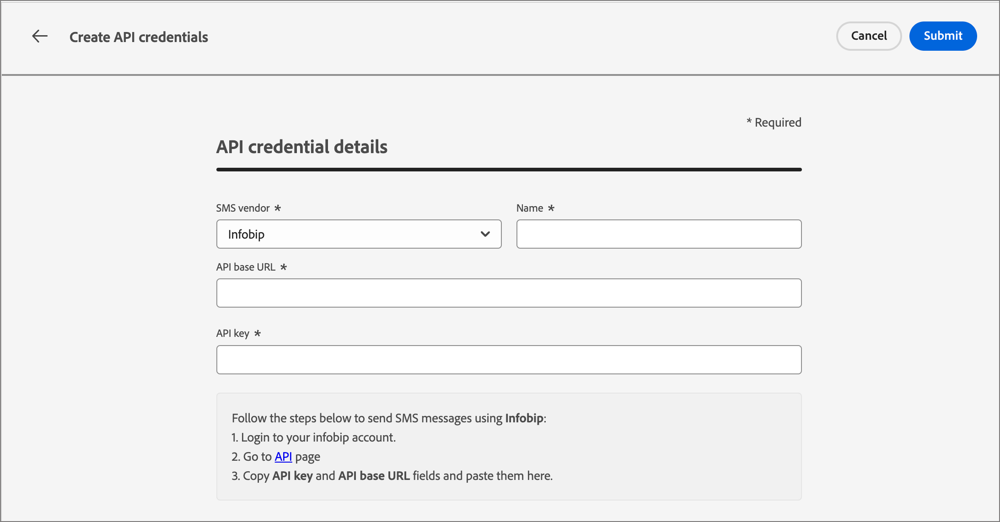

# SMS-kanaalconfiguraties

Adobe Journey Optimizer B2B edition verzendt tekstberichten via SMS-serviceproviders (of SMS-gatewayproviders). Alvorens uw bericht van SMS te creëren, vorm uw dienstverlener van de _montages van de Beheerder_.

## SMS-gatewayserviceproviders

Adobe Journey Optimizer B2B edition is momenteel geïntegreerd met externe providers die services voor tekstberichten onafhankelijk aanbieden. Ondersteunde providers voor tekstberichten zijn Sinch, Twilio en Infobip.

Voordat u een SMS-kanaal configureert in Adobe Journey Optimizer B2B edition, moet u een account met een van deze providers maken om uw API-token en service-id op te halen. Deze gegevens zijn vereist om de verbinding tussen Adobe Journey Optimizer B2B edition en de toepasselijke provider te configureren.

>[!IMPORTANT]
>
>Voor het gebruik van services voor tekstberichten gelden aanvullende voorwaarden van de betreffende provider. Als oplossingen van derden zijn Sinch, Twilio en Infobip via integratie beschikbaar voor Adobe Journey Optimizer B2B edition-gebruikers. Adobe heeft geen controle en is niet verantwoordelijk voor producten van derden. Neem contact op met uw provider voor problemen met of verzoeken om assistentie met betrekking tot de SMS-services.

## Een bestaande API-configuratie voor SMS controleren

>[!NOTE]
>
>De beschreven instellingen zijn alleen toegankelijk voor gebruikers met SMS-beheerdersrechten.

1. Vouw de sectie **[!UICONTROL Administrator]** in de linkernavigatie uit en klik op **[!UICONTROL Channels]** .

   {width="800" zoomable="yes"}

1. Selecteer **[!UICONTROL API Credentials]** in het navigatievenster.

   De pagina bevat de beschikbare API-configuraties voor uw instantie.

1. Indien nodig, klik het _pictogram van de Filter_ ( ) en selecteer opties om de lijst van gevormde API geloofsbrieven door de dienstverlener of de schepper van SMS te tonen.

   {width="600" zoomable="yes"}

## Nieuwe API-referenties maken voor een SMS-serviceprovider

>[!BEGINTABS]

>[!TAB  Sinch ]

_Om Sinch als uw leverancier van SMS met Adobe Journey Optimizer B2B edition te vormen :_

1. Vouw de sectie **[!UICONTROL Administrator]** in de linkernavigatie uit en klik op **[!UICONTROL Configuration]** .

1. Klik op **[!UICONTROL Create new API credentials]** rechtsboven in de lijst _[!UICONTROL API credentials]_.

1. Vorm uw geloofsbrieven van SMS API:

   {width="500"}

   * **[!UICONTROL SMS vendor]** - Kies `Sinch` als SMS-provider.

   * **[!UICONTROL Name]** - Voer een naam in voor uw API-referentie.

   * **[!UICONTROL Service ID]** en **[!UICONTROL API Token]** - Ga naar de pagina met API&#39;s van uw Sinch-account (u vindt uw gegevens onder het tabblad SMS).

   Voor meer informatie over het vinden van deze informatie voor uw rekening van Sinch, zie de [ de ontwikkelaarsdocumentatie van Sinch ](https://developers.sinch.com/docs/sms/getting-started)

1. Klik op **[!UICONTROL Submit]** wanneer de configuratiegegevens van de API-referenties zijn voltooid.

>[!TAB  Twilio ]

_To configure Twilio as your SMS provider with Adobe Journey Optimizer B2B edition :_

1. Vouw de sectie **[!UICONTROL Administrator]** in de linkernavigatie uit en klik op **[!UICONTROL Configuration]** .

1. Klik op **[!UICONTROL Create new API credentials]** rechtsboven in de lijst _[!UICONTROL API credentials]_.

1. Vorm uw geloofsbrieven van SMS API:

   {width="500"}

   * **[!UICONTROL SMS vendor]** - Kies `Twilio` als SMS-provider.

   * **[!UICONTROL Name]** - Voer een naam in voor uw API-referentie.

   * **[!UICONTROL Account SID]** en **[!UICONTROL Auth Token]** - toegang tot de _ruit van Info van de Rekening_ van uw pagina van het dashboard van de Console van Twilio om uw geloofsbrieven te vinden.

   Voor meer informatie over het vinden van deze informatie voor uw rekening van Twilio, zie het [ Centrum van de Hulp van Twilio ](https://help.twilio.com/articles/14726256820123-What-is-a-Twilio-Account-SID-and-where-can-I-find-it-).

1. Klik op **[!UICONTROL Submit]** rechtsboven op de pagina wanneer de configuratiegegevens van de API-referenties zijn voltooid.

>[!TAB  Infobip ]

_Om Infobip als uw leverancier van SMS met Adobe Journey Optimizer B2B edition te vormen :_

1. Vouw de sectie **[!UICONTROL Administrator]** in de linkernavigatie uit en klik op **[!UICONTROL Configuration]** .

1. Klik op **[!UICONTROL Create new API credentials]** rechtsboven in de lijst _[!UICONTROL API credentials]_.

1. Vorm uw geloofsbrieven van SMS API:

   {width="500"}

   * **[!UICONTROL SMS vendor]** - Kies `Infobip` als SMS-provider.

   * **[!UICONTROL Name]** - Voer een naam in voor uw API-referentie.

   * **[!UICONTROL API base URL]** en **[!UICONTROL API key]** - Ga naar de webinterface-homepage of de API-sleutelbeheerpagina voor uw Infobip-account om uw referenties te vinden.

   Voor meer informatie over het vinden van deze informatie voor uw Infobip rekening, zie de [ documentatie Infobip ](https://www.infobip.com/docs/api/_blank).

1. Klik op **[!UICONTROL Submit]** rechtsboven op de pagina wanneer de configuratiegegevens van de API-referenties zijn voltooid.

>[!ENDTABS]

Wanneer u op _[!UICONTROL Submit]_klikt, worden de referenties direct gevalideerd en opgeslagen en wordt u omgeleid naar de pagina met_[!UICONTROL API credentials]_ -lijsten. Als de verzonden referenties ongeldig zijn, wordt een foutbericht weergegeven op de pagina met lijsten. In dit geval kunt u de configuratie annuleren of deze bijwerken en opnieuw verzenden.
