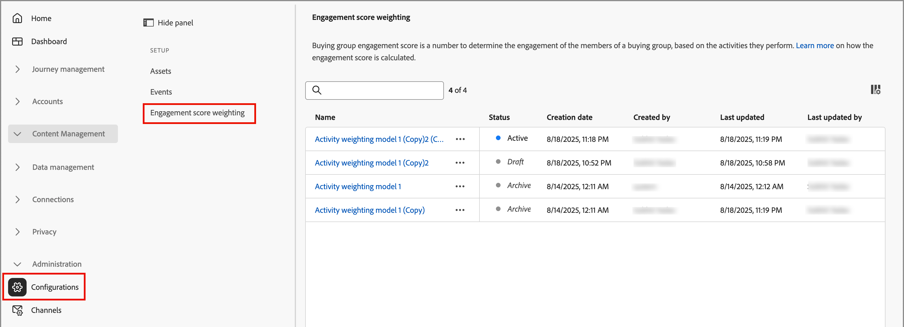
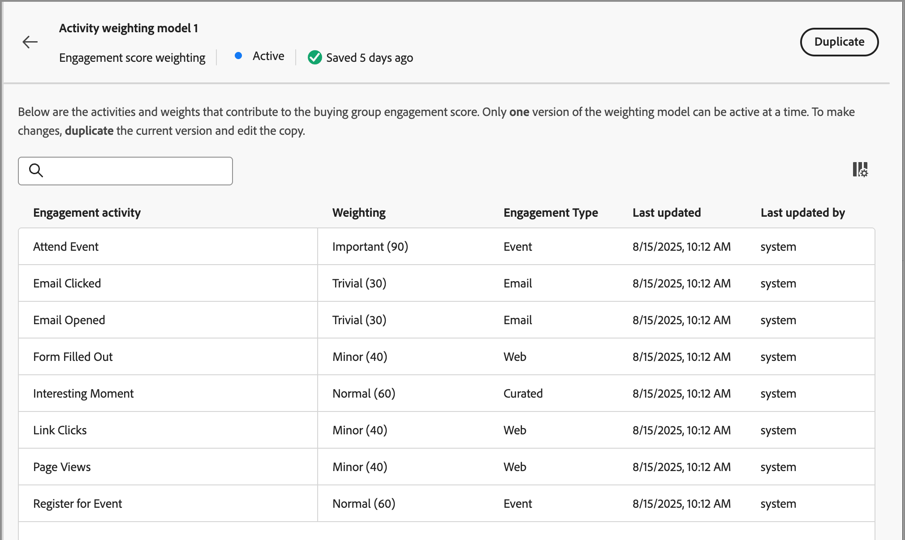
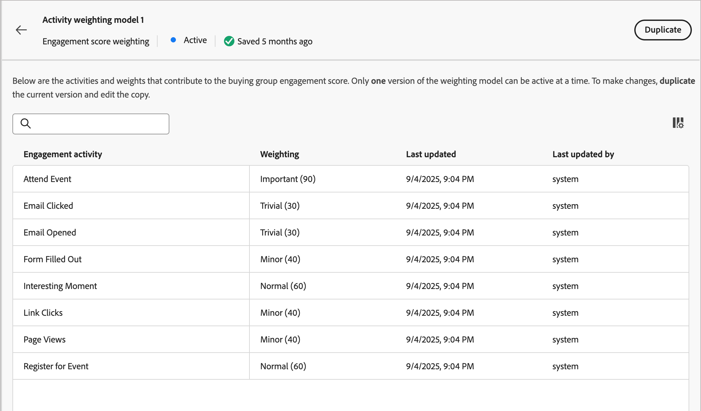
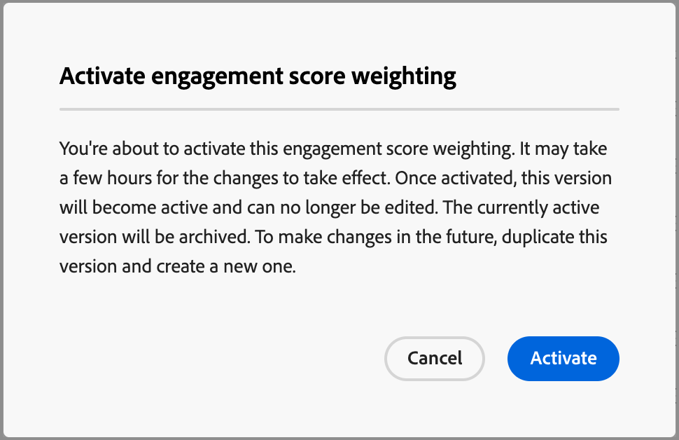

# Aangepaste weging voor betrokkenheidsscore configureren

A [&#x200B; het kopen score van de groepsovereenkomst &#x200B;](../buying-groups/engagement-scores.md) wijst op het niveau van overeenkomst door diverse activiteiten te evalueren die voor leden van de het kopen groep worden geregistreerd. Met aangepaste score weging, hebben de teams van de marketing verrichtingen de flexibiliteit om hun eigen modellen voor het wegen van de activiteiten te bepalen. Een model van het douaneonderzoek veroorzaakt een nauwkeurigere bezinning van uw pijpleiding door aan het gedrag voorrang te geven dat het nauwkeurigst het kopen intent in uw verkoopproces signaleert.

Als beheerder kunt u meerdere betrokkenheidsscore-modellen definiëren voor uw organisatie, maar slechts één model kan op elk moment actief zijn. U definieert een scoremodel op basis van het gewicht dat wordt toegepast op elke activiteit in het kader van de betrokkenheidsscore.

>[!PREREQUISITES]
>
>Om een model van de betrokkenheidsscore te bepalen en te activeren, moet u de _[!UICONTROL Manage B2B Admin Configurations]_[&#x200B; producttoestemming &#x200B;](./user-management.md#b2b-product-permissions) hebben.

## Toegang krijgen tot de modellen voor de weging van de betrokkenheidsscore

Open de lijst van _[!UICONTROL Engagement score weighting]_&#x200B;om actieve, ontwerp, en gearchiveerde modellen te bekijken:

1. Kies in de linkernavigatie **[!UICONTROL Administration]** > **[!UICONTROL Configurations]** .

1. Klik op **[!UICONTROL Engagement score weighting]** in het tussenliggende deelvenster om de lijst met scoremodellen weer te geven.

   Van deze pagina, kunt u [&#x200B; tot stand brengen (dubbel) &#x200B;](#create-an-engagement-score-model), [&#x200B; activeren &#x200B;](#activate-a-score-model), en [&#x200B; &#x200B;](#change-the-engagement-weighting-settings) modellen van de betrokkenheidsscore uitgeven.

   {width="800" zoomable="yes"}

   In de lijst worden de laatst bijgewerkte modellen bovenaan weergegeven (gesorteerd op _[!UICONTROL Last updated]_) en kunt u zoeken op&#x200B;_[!UICONTROL Name]_ .

   U kunt de getoonde lijst aanpassen door de _montages van de Kolom_ te klikken ( ) pictogram in de hoger-juiste hoek en het selecteren of ontruimen van kolomcheckboxes.

   {width="300"}

1. Klik op de naam voor toegang tot de details voor een betrokkenheidsscore-model.

### Standaardscore-model

Het systeem leidt tot een eerste model van de betrokkenheidsscore genoemd _het wegen van de Activiteit model 1_. Betrokkenheidsactiviteiten zijn gebaseerd op standaard- en aangepaste Experience Platform-gebeurtenissen. De wegingen op alle activiteiten zijn standaard 0.

{width="600" zoomable="yes"}

<!-- **Standard architecture (legacy)** - If your environment still uses the standard architecture, the connected [!DNL Marketo Engage] instance is the source for the engagement activity data. The default model is active until you create a custom version and activate it. -->

<!-- {width="600" zoomable="yes"} -->

Wanneer u een douanemodel activeert, verandert het actieve model in een _Gearchiveerde_ status. Als u besluit terug te keren naar het standaardbetrokkenheidsscore-model, kunt u het oorspronkelijke standaardmodel dupliceren en vervolgens activeren of gebruiken als beginpunt voor een ander aangepast model.

### Conceptenmodel verwijderen

U kunt een conceptbetrokkenheidsscore-model verwijderen als u besluit dat u het in de toekomst niet wilt activeren. Klik het _Meer menu_ (**..***) pictogram naast de modelnaam van de ontwerpscore in de lijst en kies **[!UICONTROL Delete]**.

{width="350"}

Klik op **[!UICONTROL Delete]** in het bevestigingsdialoogvenster.

## Een aangepast scoremodel voor betrokkenheid maken

Als u een aangepast betrokkenheidsscore-model wilt maken, dupliceert u het standaardmodel of een ander aangepast model dat al is gemaakt. U kunt het huidige _Actieve_ model, het model van het a _Ontwerp_, of een _Gearchiveerd_ model dupliceren. Vervolgens bewerkt u het gedupliceerde model naar wens.

1. Klik op de modelnaam om de pagina met modeldetails te openen en klik op **[!UICONTROL Duplicate]** rechtsboven.

   {width="600" zoomable="yes"}

   U kunt ook op het pictogram _Meer menu_ (**..***) naast de naam van het scoremodel in de lijst klikken en **[!UICONTROL Duplicate]** kiezen.

   {width="325"} te dupliceren

1. In het _Dubbele_ dialoog, ga een unieke naam voor het gedupliceerde model in en klik **[!UICONTROL Duplicate]**.

   {width="500"} te dupliceren

   Het gedupliceerde model wordt getoond in de lijst met de status van het a _Ontwerp_. Klik op de naam om de details van het scoremodel te openen en wijzigingen aan te brengen.

### De instellingen voor de weging van betrokkenheid wijzigen

De instellingen voor gewicht definiëren de banden die u aan elke activiteit in het model kunt toewijzen. U kunt de banden veranderen om de strategieën van uw organisatie voor het evalueren van betrokkenheid te weerspiegelen. Bijvoorbeeld, zou u de _Normale_ weging band aan een waarde van 65 kunnen aanpassen als u een hogere waarde aan normale activiteiten wilt toewijzen. Of, kunt u een weegband toevoegen die wordt ontworpen om activiteiten te vangen die tussen _Normaal_ en _Belangrijk_ vallen. In dit geval, kon u een band toevoegen en het etiketteren als _Belangrijk_ en een waarde van de gewichtsband van 75 toewijzen.

1. Klik op de pagina met details van het scoremodel boven aan het scherm op **[!UICONTROL Engagement weight settings]** .

   {width="600" zoomable="yes"}

1. Pas voor elke gewichtsklasse de naam of waarden aan uw wensen aan:

   * Wijzig de naam in het veld _[!UICONTROL Weighting band]_.
   * Voer een nieuwe waarde in. U kunt ook op **&plus;** of **-** klikken om de waarde te verhogen of te verlagen.

   {width="500"}

1. Voeg zo nodig een andere wegingsband toe:

   Klik op **[!UICONTROL + Add weighting band]** onder aan de lijst. Met deze handeling wordt onder aan de lijst een lege wegingsband ingevoegd.

   Voer de naam in en stel de waarde voor de band in. Gebruik een unieke naam en waarde.

1. Om een wegingsband te verwijderen, klik _Schrapping_ ( ) pictogram voor de wegende bandrij.

1. Klik op **[!UICONTROL Save]** wanneer de wijzigingen zijn voltooid.

### De weging van de activiteit wijzigen

Elk scoremodel bevat de volledige lijst met ondersteunde betrokkenheidsscore-activiteiten.

+++Activiteiten voor Experience Platform-evenementen

Het standaardmodel voor Experience Platform-gebeurtenissen omvat de door Experience Platform bijgehouden activiteiten. Elke activiteit heeft een nul (0) gewicht (niet gebruikt) tot u een gewicht aan het toewijst. Alle activiteiten hebben ook een maximale dagelijkse frequentie van 20, die u niet kunt wijzigen.

<table style="table-layout: fixed; width: 100%; border: 0;">
<tbody>
<tr style="border: 0;">
<td>
<ul><li>Advertising Kliks </li><li>Advertising voltooid </li><li>Advertising Conversies </li><li>Advertising Federated </li><li>Advertising First Quartiles </li><li>Advertising-impressies </li><li>Advertising Midpoints </li><li>Advertising start </li><li>Advertising Third Quartiles </li><li>Advertising Time Played </li><li>Toepassing sluiten </li><li>Toepassing starten </li><li>Campagne voor betrokkenheid wijzigen </li><li>Commerce Backoffice CreditMemo uitgegeven </li><li>Commerce Backoffice Order geannuleerd </li><li>Commerce Backoffice Order Placed </li><li>Commerce Backoffice OrderItems verzonden </li><li>Commerce Backoffice-verzending voltooid </li><li>Commerce-uitchecken </li><li>Commerce-productlijst (winkelwagentje) toegevoegd </li><li>Commerce-productlijst (winkelwagentje) wordt geopend </li><li>Verwijderingen van de Commerce-productlijst (winkelwagentje) </li><li>Opnieuw openen van Commerce-productlijst (winkelwagentje) </li><li>Weergaven Commerce-productlijst (winkelwagentje) </li><li>Commerce-productweergaven </li><li>Aankopen voor Commerce </li><li>Commerce Save for Laters </li><li>Afwijzen van voorstel voor beslissing </li><li>Weergave voor beslissingsvoorstel </li><li>Beslissingsvoorstel Interactie </li></ul>
</td>
<td>
<ul><li>Verzenden van beslissingsvoorstel </li><li>Trigger voor beslissingsvoorstel </li><li>Feedback geven </li><li>E-mail voor direct marketing is afgeschreven </li><li>Direct marketing-e-mail zonder korting </li><li>E-mail voor directe marketing geklikt </li><li>E-mailadres voor directe marketing </li><li>E-mail voor directe marketing is geopend </li><li>E-mail voor direct marketing verzonden </li><li>E-mail voor directe marketing is geannuleerd </li><li>Inapp-bericht is afgewezen </li><li>In-app-bericht weergegeven </li><li>Het bericht in de app was interactief met </li><li>Loodbewerking toevoegen aan campagne </li><li>Webhaak hoofdoperatieaanroep </li><li>Campagnestream voor bewerking van lead wijzigen </li><li>Lead-bewerking converteren </li><li>Interesserende momenten voor lead-bewerking </li><li>Leads voor samenvoegen van lead </li><li>Nieuwe lead-bewerking </li><li>Opbrengstfase van lead-bewerking gewijzigd </li><li>Score voor lead-bewerking gewijzigd </li><li>Status van lead-bewerking gewijzigd in Campagne-progressie </li></ul>
</td>
<td>
<ul><li>Leadbewerking toevoegen aan lijst </li><li>Leadbewerking verwijderen uit lijst </li><li>Locatie afsluiten </li><li>Media enBreakComplete </li><li>Media adBreakStart </li><li>Media en compleet </li><li>Media en overslaan </li><li>Media en starten </li><li>Media bitrateChange </li><li>Media bufferStart </li><li>Media hoofdstukComplete </li><li>Media-hoofdstukOverslaan </li><li>Media chapterStart </li><li>Aangepaste reeksspatiëring voor media </li><li>Gedownloade inhoud van media </li><li>Media-fout </li><li>Media pauseStart </li><li>Media pingelen </li><li>Media afspelen </li><li>MediasessieVoltooid </li><li>Media sessionEnd </li><li>Media sessionStart </li><li>MediastatussenUpdate </li><li>Feedback op bericht </li><li>Gegevens voor berichtenweergave </li><li>Berichten bijhouden </li><li>Opportunity-gebeurtenis toegevoegd aan opportunity </li><li>Opportunity-gebeurtenismogelijkheid bijgewerkt </li><li>Opportunity-gebeurtenis verwijderen uit opportunity </li><li>Toepassing voor het bijhouden van pushberichten is geopend </li><li>Aangepaste handeling voor opvolgen </li><li>Webformulier ingevuld </li><li>Webinteractiekoppelingen klikken </li><li>Webpagina, details, paginaweergaven</li></ul>
</td>
</tbody>
</table>

+++

+++Activiteiten voor standaardarchitectuur

Het standaardmodel voor de standaardarchitectuur omvat de [!DNL Marketo Engage] bijgehouden activiteiten met een bijbehorende standaardgewicht. Wanneer u dit model dupliceert, kunt u de weging naar wens wijzigen. U kunt de maximale dagelijkse frequentie niet wijzigen.

{{engagement-activities-me}}

+++

Stel voor elke activiteit in de lijst de waarde in die u wilt toewijzen aan elke activiteit. Klik op de pijl-omlaag in het veld **[!UICONTROL Weighting]** en kies de wegingsband die is gedefinieerd in de instellingen voor de weging van de betrokkenheid.

{width="600" zoomable="yes"}

Als u niet wilt dat de berekening van de betrokkenheidsscore een activiteit gebruikt, stelt u de weging in op een nulwaarde (0).

Uw wijzigingen worden automatisch opgeslagen.

## Een scoremodel activeren

Wanneer u een conceptscore activeert, vervangt dit het momenteel actieve model. Het momenteel actieve model wordt automatisch gearchiveerd.

1. Open een conceptscore-model om de detailpagina weer te geven.

1. Klik op **[!UICONTROL Activate]** .

1. Klik op **[!UICONTROL Activate]** in het bevestigingsdialoogvenster.

   {width="400"}
