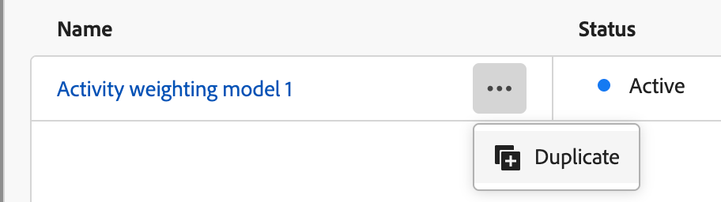

# Aangepaste weging voor betrokkenheidsscore configureren

Een betrokkenheidsscore voor een inkoopgroep geeft het niveau van betrokkenheid weer door verschillende activiteiten te evalueren die zijn geregistreerd voor leden van de inkoopgroep. Met een aangepaste score kunnen marketingteams hun eigen modellen definiëren voor het afwegen van de activiteiten die het meest relevant zijn voor de betrokkenheid. Een model van het douaneonderzoek veroorzaakt een nauwkeurigere bezinning van uw pijpleiding door aan het gedrag voorrang te geven dat het nauwkeurigst het kopen intent in uw verkoopproces signaleert.

Als beheerder kunt u meerdere betrokkenheidsscore-modellen definiëren voor uw organisatie, maar slechts één model kan op elk moment actief zijn. U definieert een scoremodel op basis van het gewicht dat wordt toegepast op elke activiteit in het kader van de betrokkenheidsscore.

## Toegang krijgen tot de modellen voor de weging van de betrokkenheidsscore

1. Kies in de linkernavigatie **[!UICONTROL Administration]** > **[!UICONTROL Configurations]** .

1. Klik op **[!UICONTROL Engagement score weighting]** in het tussenliggende deelvenster om de lijst met scoremodellen weer te geven.

   Van deze pagina, kunt u [&#x200B; tot stand brengen (dubbel) &#x200B;](#create-an-engagement-score-model), [&#x200B; activeren &#x200B;](#activate-a-score-model), en [&#128279;](#change-the-engagement-weighting-settings) modellen van de betrokkenheidsscore uitgeven.

   {width="800" zoomable="yes"}

   In de tabel worden de meest recent bijgewerkte modellen bovenaan weergegeven (gesorteerd op _[!UICONTROL Last updated]_) en kunt u zoeken op&#x200B;_[!UICONTROL Name]_ .

   U kunt de getoonde lijst aanpassen door de _montages van de Kolom_ te klikken ( ) pictogram in de hoger-juiste hoek en het selecteren of ontruimen van kolomcheckboxes.

   {width="300"}

1. Klik op de naam voor toegang tot de details voor een betrokkenheidsscore-model.

### Standaardscore-model

Het systeem leidt tot een eerste model van de betrokkenheidsscore genoemd _het wegen van de Activiteit model 1_, dat het actieve model is tot u uw eigen douanemodel creeert en het activeert. Wanneer u uw douanemodel activeert, verandert het standaardmodel in een _Gearchiveerde_ status. U kunt het dupliceren als u besluit om terug te keren naar het standaardbetrokkenheidsscore-model, of om het te gebruiken als uitgangspunt voor een ander aangepast model.

{width="600" zoomable="yes"}

### Conceptenmodel verwijderen

U kunt een conceptbetrokkenheidsscore-model verwijderen als u besluit dat u het in de toekomst niet wilt activeren. Klik het _Meer menu_ (**..***) pictogram naast de modelnaam van de ontwerpscore in de lijst en kies **[!UICONTROL Delete]**.

{width="350"}

Klik op **[!UICONTROL Delete]** in het bevestigingsdialoogvenster.

## Een aangepast scoremodel voor betrokkenheid maken

Als u een aangepast betrokkenheidsscore-model wilt maken, dupliceert u het standaardmodel of een ander aangepast model dat al is gemaakt. U kunt het huidige _Actieve_ model, het model van het a _Ontwerp_, of een _Gearchiveerd_ model dupliceren. Vervolgens bewerkt u het gedupliceerde model naar wens.

1. Klik op de modelnaam om de pagina met modeldetails te openen en klik op **[!UICONTROL Duplicate]** rechtsboven.

   {width="600" zoomable="yes"}

   U kunt ook op het pictogram _Meer menu_ (**..***) naast de naam van het scoremodel in de lijst klikken en **[!UICONTROL Duplicate]** kiezen.

   {width="325"} te dupliceren

1. In het _Dubbele_ dialoog, ga een unieke naam voor het gedupliceerde model in en klik **[!UICONTROL Duplicate]**.

   {width="500"} te dupliceren

   Het gedupliceerde model wordt getoond in de lijst met de status van het a _Ontwerp_. Klik op de naam om de details van het scoremodel te openen en wijzigingen aan te brengen.

### De instellingen voor de weging van betrokkenheid wijzigen

De instellingen voor gewicht definiëren de banden die u aan elke activiteit in het model kunt toewijzen. U kunt de banden veranderen om de strategieën van uw organisatie voor het evalueren van betrokkenheid te weerspiegelen. Bijvoorbeeld, zou u de _Normale_ weging band aan een waarde van 65 kunnen aanpassen als u een hogere waarde aan normale activiteiten wilt toewijzen. Of, kunt u een weegband toevoegen die wordt ontworpen om activiteiten te vangen die tussen _Normaal_ en _Belangrijk_ vallen. In dit geval, kon u een band toevoegen en het etiketteren als _Belangrijk_ en een waarde van de gewichtsband van 75 toewijzen.

1. Klik op de pagina met details van het scoremodel boven aan het scherm op **[!UICONTROL Engagement weight settings]** .

   {width="600" zoomable="yes"}

1. Pas voor elke gewichtsklasse de naam of waarden aan uw wensen aan:

   * Wijzig de naam in het veld _[!UICONTROL Weighting band]_.
   * Voer een nieuwe waarde in. U kunt ook op **&plus;** of **-** klikken om de waarde te verhogen of te verlagen.

   {width="500"}

1. Voeg zo nodig een andere wegingsband toe:

   Klik op **[!UICONTROL + Add weighting band]** onder aan de lijst. Met deze handeling wordt onder aan de lijst een lege wegingsband ingevoegd.

   Voer de naam in en stel de waarde voor de band in. Gebruik een unieke naam en waarde.

1. Indien nodig, verwijder een wegingsband, klik _Schrapping_ ( ) pictogram voor de wegende bandrij.

1. Klik op **[!UICONTROL Save]** wanneer de wijzigingen zijn voltooid.

### De weging van de activiteit wijzigen

Elk scoremodel bevat de volledige lijst met ondersteunde betrokkenheidsscore-activiteiten:

{{engagement-activities}}

Stel voor elke activiteit in de lijst de waarde in die u wilt toewijzen aan elke activiteit. Klik op de pijl-omlaag in het veld **[!UICONTROL Weighting]** en kies de wegingsband die is gedefinieerd in de instellingen voor de weging van de betrokkenheid.

{width="500"}

Als u niet wilt dat de berekening van de betrokkenheidsscore een activiteit gebruikt, stelt u de weging in op een nulwaarde (0).

Uw wijzigingen worden automatisch opgeslagen.

## Een scoremodel activeren

Wanneer u een conceptscore activeert, vervangt dit het momenteel actieve model. Het momenteel actieve model wordt automatisch gearchiveerd.

1. Open een conceptscore-model om de detailpagina weer te geven.

1. Klik op **[!UICONTROL Activate]**.

1. Klik op **[!UICONTROL Activate]** in het bevestigingsdialoogvenster.

   {width="400"}
