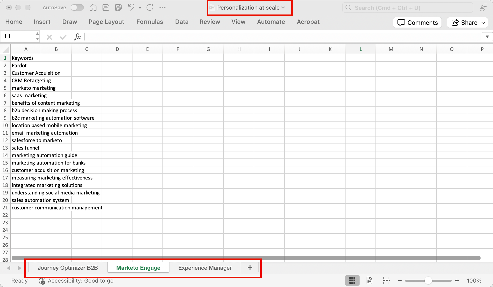
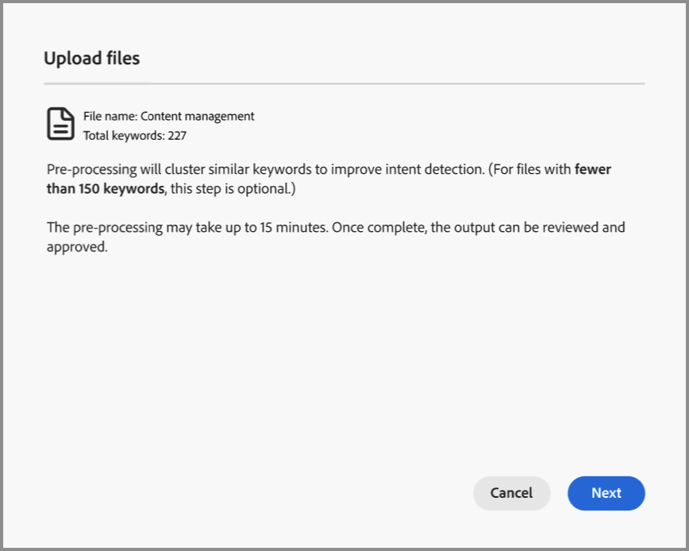

# Intentgegevens

In Journey Optimizer B2B edition voorspelt het Intent Detection-model een oplossing/product van interesse met voldoende vertrouwen op basis van de activiteit van een lead. Het gebruikt ook de activiteiten van andere medeleden van de rekening, samen met geëtiketteerde inhoud. De intentie van een persoon kan worden geïnterpreteerd als de waarschijnlijkheid dat hij belang heeft bij een product.

* Niveaus van intentie - Beschikbaar op bekend niveau voor leads, accounts en inkoopgroepen.
* Typen intentsignalen - Trefwoorden, product en oplossing

De intentgegevens worden gebruikt in het [_Intelligente dashboard_](../dashboards/intelligent-dashboard.md), [_de details van de Rekening_ pagina ](../accounts/account-details.md), [_het Kopen van groepsdetails_ pagina ](../buying-groups/buying-group-details.md), en [_de details van de Persoon_ pagina ](../accounts/person-details.md).

{width="700" zoomable="yes"}

## Uw intenttoewijzingsgegevens voorbereiden

Als u deze functie wilt activeren, maakt u een spreadsheet, zoals een Microsoft Excel-bestand, met tabs om de intenttaxonomie te definiëren. Het volledige spreadsheet wordt geüpload als één categorie die meerdere producten kan hebben, en elk product kan veelvoudige sleutelwoorden hebben. Gebruik de volgende definities voor uw spreadsheet van de intentafbeelding voor elke categorie die u wilt bepalen:

* Naam van spreadsheet = _Naam van de Categorie_
* Elke tab = uw productnaam
* Elke tab bevat één kolom = producttrefwoorden (maximaal 150)

U kunt een dossier van Excel downloaden als malplaatje voor het voorbereiden van uw toewijzingsgegevens te gebruiken. De sjabloon downloaden:

1. Kies in de linkernavigatie **[!UICONTROL Administration]** > **[!UICONTROL Configuration]** .

1. Klik op **[!UICONTROL Intent Mapping]** in het middelste deelvenster.

1. Klik op **[!UICONTROL Create category]**.

1. Klik op de koppeling **[!UICONTROL Download file template]** in het dialoogvenster.

   {width="500"}

1. Klik op **[!UICONTROL Cancel]**.

   U kunt terugkeren om het voorbereide bestand te uploaden wanneer het is voltooid.

1. Met de sjabloon definieert u de intenttoewijzingsgegevens:

   * Wijzig de naam van het dossier om op uw categorienaam, zoals _Personalization bij schaal_ te wijzen.
   * Verander elke lusjes volgens uw productnamen, zoals _Journey Optimizer B2B_, _Marketo Engage_, en _Experience Manager_.
   * Voeg de productsleutelwoorden voor elk lusje, zoals _B2B Marketing_ toe, _de Erkenning van het Merk_, en _Betrokkenheid van het Lood_.

   {width="600" zoomable="yes"}

## Een categoriebestand uploaden

Wanneer uw spreadsheet klaar is, ga aan de _[!UICONTROL Intent Mapping]_&#x200B;configuratiepagina terug en upload het dossier.

1. Klik op **[!UICONTROL Create category]**.

1. Sleep het bestand naar het dialoogvenster _[!UICONTROL Upload files]_&#x200B;of klik op **[!UICONTROL Select a file]**&#x200B;om het bestand op uw systeem te zoeken en te selecteren.

1. Klik op **[!UICONTROL Next]**.

   De preprocessing looppas aan cluster gelijkaardige sleutelwoorden, die intentopsporing verbetert en sleutelwoordverdunning vermijdt. Er wordt een pulsmelding weergegeven zodra deze voorbehandeling is voltooid (maximaal 15 minuten, afhankelijk van de gegevens).

   {width="500"}

   Het resultaat wordt getoond in de _Afbeelding van de Intentie 1&rbrace; pagina._

   {width="600" zoomable="yes"}

## De categorie goedkeuren of afwijzen

Controleer de categorielijst en klik op **[!UICONTROL Approve]** om de trefwoorden te activeren voor gebruik op het Intelligente dashboard, de pagina Accountdetails, de pagina Informatie over kopersgroepen en de pagina Persondetails. Klik op **[!UICONTROL View all]** om de volledige lijst voor elk product weer te geven of klik op **[!UICONTROL Download]** om de volledige lijst weer te geven als Excel-bestand.

Als u niet tevreden bent met de lijst, kunt u op **[!UICONTROL Delete]** klikken om de categorie te verwijderen. Vervolgens kunt u het spreadsheetbestand aanpassen voordat u het uploadproces opnieuw start om die categorie te definiëren.

>[!IMPORTANT]
>
>Je moet de nieuwe rubriek goedkeuren of afwijzen voordat je een andere rubriek kunt toevoegen of een rubriek kunt bewerken.

Als u een andere categorie toevoegt en de bijbehorende taxonomie van invloed is op een bestaande categorie, wordt een waarschuwing weergegeven. Houd rekening met dit effect wanneer u besluit de categorie goed te keuren of af te wijzen. Als het product in meer dan één categorie wordt gebruikt, moet de koppeling tussen product en trefwoord voor alle categorieën hetzelfde zijn.

{width="600" zoomable="yes"}
