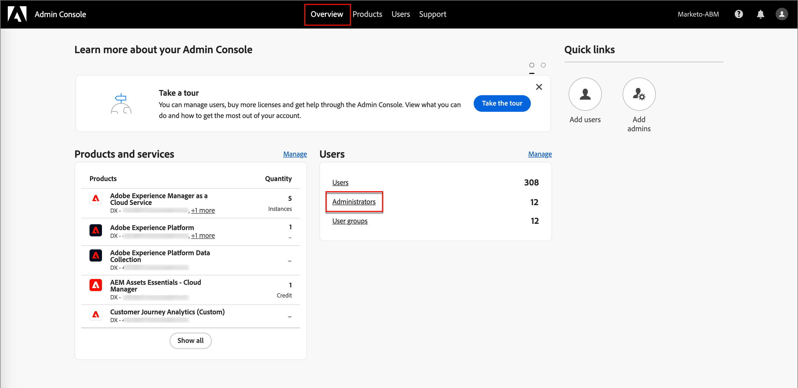
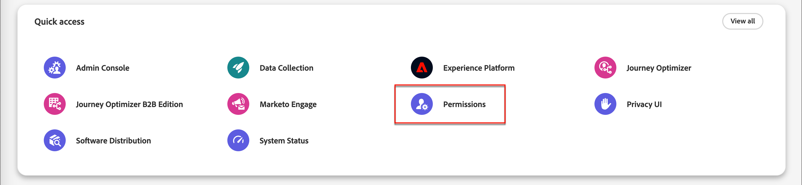
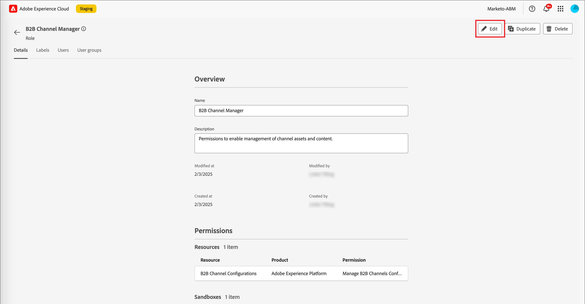

# Gebruikersbeheer

Nadat de levering is voltooid en de zandbakken verbindend zijn, voltooi de volgende stappen om Adobe Journey Optimizer B2B edition toegang voor uw team en gebruikers te verlenen.

1. [ creeer een het productprofiel van Marketo Engage ](#marketo-engage-profile) in Admin Console (nieuwe instantie van Marketo Engage slechts).
1. [ creeer een gebruikersgroep ](#create-user-group) in Admin Console.
1. [ geef ingebouwde rollen ](#edit-roles) uit of [ creeer een douanerol ](#create-a-custom-role) met de toestemmingen van Journey Optimizer B2B edition.
1. [ voegt gebruikers ](#add-users) of [ groepen ](#add-user-groups-to-a-role) aan rollen toe.

Als beheerder kunt u deze taken uitvoeren in de Adobe Admin Console, een centrale plaats voor het beheer en beheer van uw Adobe-productlicenties en -gebruikers. In de Admin Console kunt u gebruikers maken en beheren op één locatie in plaats van binnen uw verschillende individuele oplossingen. Verwijs naar de [ overzicht van Admin Console ](https://helpx.adobe.com/nl/enterprise/using/admin-console.html) pagina om meer over zijn functies en mogelijkheden te leren.

## Toegang tot de Admin Console

Voordat u de Admin Console kunt gebruiken om gebruikers binnen uw team te beheren, moet u ervoor zorgen dat u toegang hebt tot de Admin Console en over de juiste machtigingen beschikt.

1. Als systeembeheerder ontvangt u meerdere e-mails van Adobe als onderdeel van het instapproces.

   Zoek de welkomstmail die de informatie over de organisatienaam verstrekt waaraan u toegang hebt verleend.

1. Klik op de koppeling **[!UICONTROL Get started]** in uw welkomstbericht om naar de Admin Console te navigeren.

   Als u niet e-mail kunt vinden, open direct browser aan Admin Console in [ https://adminconsole.adobe.com ](https://adminconsole.adobe.com).

1. Meld u aan met uw Adobe ID.

   Op succesvolle login, ziet u de _pagina van het Overzicht_ van Adobe Admin Console.

1. Als u toegang tot veelvoudige organisaties hebt, zorg ervoor dat u aan de correcte organisatie hebt het programma geopend.

   Als u uw organisatie wilt wijzigen, klikt u in de rechterbovenhoek op de naam van de organisatie en kiest u de organisatie waartoe u toegang nodig hebt.

1. Selecteer **[!UICONTROL Administrators]** op de _[!UICONTROL Users]_-kaart om te controleren of u systeembeheerder bent.

   {width="700" zoomable="yes"}

1. Zoek door je Adobe ID-e-mail, gebruikersnaam, voornaam of achternaam in te voeren.

   * Als uw toegang correct wordt gevormd, keert het onderzoek uw verslag terug.

   * Als de waarde in de kolom **[!UICONTROL ADMIN ROLE]** `System` toont, weet u dat u (of de getoonde gebruiker) een systeembeheerder bent.

## Het Marketo Engage-productprofiel maken {#marketo-engage-profile}

Wanneer u gebruikers toegang geeft tot een Adobe-oplossing, wilt u ze niet altijd volledige toegang geven. Met productprofielen kan elke oplossing beschikken over een eigen set gebruikersrechten. Gebruik de Admin Console om productprofielen toe te wijzen.

Voor meer informatie over het gebruiken van productprofielen voor gebruikersrechten, zie [ productprofielen voor ondernemingsgebruikers ](https://helpx.adobe.com/nl/enterprise/using/manage-product-profiles.html){target="_blank"} in de documentatie van Admin Console beheren.
<!--
>[!BEGINSHADEBOX]

When you add a user to the Marketo Engage product profile, they are subsequently added to the _Standard User_ role within the Default workspace of the Marketo Engage subscription. This role grants them all _Standard User_ permissions for Marketo Engage in that workspace. Currently, all Journey Optimizer B2B Edition users are required to be Marketo Engage users. A Marketo Engage administrator can restrict access by updating the permissions for the _Standard User_ role or by moving the user to a different Marketo Engage user role with more restrictive permissions.

For more information about managing these permissions within Marketo Engage, see [Managing User Roles and Permissions](https://experienceleague.adobe.com/nl/docs/marketo/using/product-docs/administration/users-and-roles/managing-user-roles-and-permissions){target="_blank"} in the Marketo Engage documentation.

>[!ENDSHADEBOX]-->

{width="30"} Een systeembeheerder of het productbeheerder van Marketo Engage kan de volgende stappen uitvoeren.

1. Login aan [ https://adminconsole.adobe.com ](https://adminconsole.adobe.com).

1. Selecteer de tab **[!UICONTROL Products]** .

1. Open de Marketo Engage-instantie waar u het profiel wilt toevoegen en klik op **[!UICONTROL New profile]** .

   {width="700" zoomable="yes"}

1. Ga een naam van het productprofiel, zoals _StandaardGebruiker_ in.

1. Klik **daarna** en dan **sparen**.

## Een gebruikersgroep maken {#create-user-group}

Een gebruikersgroep is een inzameling van gebruikers wordt verleend een gedeelde reeks toestemmingen. U kunt gebruikers toevoegen aan of verwijderen uit uw gebruikersgroep. De machtigingen voor de groep blijven ongewijzigd wanneer de gebruikers in de groep worden gewijzigd.

Voor meer informatie over hoe de gebruikersgroepen worden gebruikt om toestemmingen te beheren, zie [ gebruikersgroepen beheren ](https://helpx.adobe.com/nl/enterprise/using/user-groups.html){target="_blank"} in de documentatie van Admin Console.

{width="30"} Een systeembeheerder kan de volgende stappen uitvoeren.

1. Login aan [ https://adminconsole.adobe.com ](https://adminconsole.adobe.com).

1. Selecteer de tab **[!UICONTROL Users]** .

1. Kies **[!UICONTROL User Groups]** in de linkernavigatie.

1. Klik op **[!UICONTROL New user group]** rechtsboven.

1. Ga een naam voor de gebruikersgroep, zoals _StandaardGebruikers_ in en klik **[!UICONTROL Save]**.

1. Klik op de gebruikersgroep die u zojuist hebt gemaakt.

1. Selecteer de tab **[!UICONTROL Assigned product profiles]** en klik op **[!UICONTROL Assign profile]** .

1. Klik **+** en voeg elke instantie van de volgende producten toe:

   * [!UICONTROL Marketo Engage]
   * [!UICONTROL Adobe Experience Platform - AEP-Default-All-Users]
   * [!UICONTROL Adobe Experience Platform Data Collection]
   * [!UICONTROL Data Collection All Access]

   {width="700" zoomable="yes"} toe

1. Klik op **[!UICONTROL Save]**.

## Gebruikers aan een groep toevoegen

Voor informatie over gebruikersbeheer, zie [ de gebruikers van Admin Console ](https://helpx.adobe.com/nl/enterprise/using/user-groups.html) in de documentatie van Admin Console.

{width="30"} Een systeembeheerder of productbeheerder kunnen de volgende stappen uitvoeren. Een productbeheerder kan alleen gebruikers toevoegen die al in zijn organisatie bestaan.

1. Ga naar [ https://adminconsole.adobe.com ](https://adminconsole.adobe.com).

1. Klik onder _[!UICONTROL Quick links]_&#x200B;op **[!UICONTROL Add users]**.

1. Voeg elke gebruiker toe:

   * Voer het e-mailadres, de voornaam en de achternaam van de gebruiker in.

     {width="600" zoomable="yes"} toe

   * Voor **[!UICONTROL User groups]**, klik **+**.

   * Selecteer de gebruikersgroep die u eerder hebt gemaakt.

   * Klik op **[!UICONTROL Apply]**.

1. Klik op **[!UICONTROL Save]**.

## Rollen bewerken voor productmachtigingen {#edit-roles}

Machtigingen zijn eenheidrechten waarmee u de machtigingen kunt definiëren die aan een productprofiel zijn toegewezen. Elke toestemming wordt verzameld onder een mogelijkheid, zoals reizen of inkoopgroepen, die de verschillende functies of objecten in Journey Optimizer B2B edition vertegenwoordigt.

Het _gebied van Toestemmingen_ van Adobe Experience Platform is waar de beheerders gebruikersrollen en toegangsbeleid kunnen bepalen om toegangstoestemmingen voor eigenschappen en voorwerpen binnen een producttoepassing te beheren. In deze app kunt u rollen maken en beheren en kunt u de gewenste resourcemachtigingen voor deze rollen toewijzen. Met machtigingen kunt u ook de sandboxen en gebruikers beheren die aan een specifieke rol zijn gekoppeld.

Voor meer informatie over roltoestemmingen in Experience Platform, zie [ toestemmingen voor een rol ](https://experienceleague.adobe.com/nl/docs/experience-platform/access-control/abac/permissions-ui/permissions){target="_blank"} in de documentatie van Experience Platform beheren.

### B2B-productmachtigingen

De volgende machtigingen zijn van toepassing op de toegang tot Journey Optimizer B2B edition-mogelijkheden:

| Categorie | Beschrijving | Machtigingen |
| -------- | ----------- | ---------- |
| B2B-accountlijsten | Machtigingen voor B2B-accountlijsten configureren, beheren, weergeven en publiceren. Deze machtigingen omvatten handelingen zoals het toevoegen, verwijderen, importeren en verwijderen van accounts in accountlijsten. | <li>B2B-accountlijsten beheren |
| B2B-beheerconfiguraties | Vorm, beheer, en meningstoestemmingen voor B2B administratieve configuraties. Deze machtigingen omvatten verbindingen voor digitaal middelenbeheer, opslagruimten voor middelen en gebeurtenissen. | <li>B2B-beheerconfiguraties beheren |
| B2B Assets | Machtigingen voor B2B-elementen configureren, beheren en weergeven. Deze machtigingen zijn onder andere e-mails, sms, bestemmingspagina&#39;s, fragmenten, sjablonen en afbeeldingen. | <li>B2B Assets beheren <li>B2B-sjablonen beheren <li>B2B-fragmenten beheren |
| B2B-kopersgroepen | Vorm, beheer, en meningstoestemmingen voor het kopen van B2B groepen. Deze toestemmingen omvatten oplossingsbelangen, rolmalplaatjes, en het kopen groepsstatus. | <li>B2B-kopersgroepen beheren |
| B2B-kanaalconfiguraties | Vorm, beheer, en meningstoestemmingen voor B2B kanaalconfiguraties. Deze machtigingen omvatten instellingen voor communicatielimieten, API-referenties en beveiligingsinstellingen. | <li>B2B-kanaalconfiguraties beheren |
| B2B-dashboards | Configureer en bekijk machtigingen voor B2B-dashboards. Deze machtigingen omvatten accountbetrokkenheid, het aanschaffen van groepsfasen, het doorlopen van accounts en contactdekking. | <li>B2B-dashboards beheren |
| B2B-reizen | Configureer machtigingen voor beheren, weergeven en publiceren voor B2B-reizen. Deze machtigingen omvatten account- en persoonlijke handelingen, gebeurtenislisteners en gesplitste paden | <li>B2B-reizen beheren |

### B2B ingebouwde rollen

Als het Journey Optimizer B2B edition-product in uw organisatie is voorzien, bevat Experience Platform een set ingebouwde (standaard)rollen die u kunt gebruiken om de toegang tot de productmogelijkheden te beheren:

| Functie | Machtigingen |
| ---- | ----------- |
| B2B-reismanager | <li>B2B-reizen beheren <li>B2B-kopersgroepen beheren <li>B2B-accountlijsten beheren <li>B2B-betrokkenheidsdashboard weergeven <li>B2B-dashboard met inzichten weergeven |
| B2B-kanaalbeheer | <li>B2B Assets beheren <li>B2B-sjablonen beheren <li>B2B-fragmenten beheren |
| B2B-systeembeheerder | <li>B2B-kanaalconfiguraties beheren <li>B2B-beheerconfiguraties beheren |
| B2B-verkoopgebruiker | <li>B2B-betrokkenheidsdashboard weergeven |

### Rolmachtigingen bewerken

Voor ingebouwde of douanrollen, kunt u op elk ogenblik besluiten om toestemmingen toe te voegen of te schrappen. Als u een standaard- of aangepaste rol wijzigt, heeft dit invloed op elke gebruiker die aan de rol is toegewezen.

In het volgende voorbeeld, wilt u toestemmingen met betrekking tot het middel van de Reizen B2B voor gebruikers toevoegen die aan de B2B rol van de Manager van het Kanaal worden toegewezen. Dankzij deze wijziging kunnen gebruikers voor die rol ook accountreizen beheren.

>[!NOTE]
>
>Een systeembeheerder van Admin Console kan deze stappen uitvoeren.

_om de toestemmingen voor een rol te veranderen:_

1. Ga naar [ experience.adobe.com ](https://experience.adobe.com/).

1. Selecteer **[!UICONTROL Permissions]** in het deelvenster _[!UICONTROL Quick access]_.

   >[!NOTE]
   >
   >Als u _[!UICONTROL Permissions]_&#x200B;niet ziet, moet u mogelijk op **[!UICONTROL View all]**&#x200B;klikken en deze selecteren in de beschikbare toepassingen.

   {width="700" zoomable="yes"}

1. Selecteer **[!UICONTROL Roles]** in de linkernavigatie.

1. Klik de _&#x200B;**rolnaam van de Manager van het Kanaal 0&rbrace; B2B.**&#x200B;_

1. Klik in de detailpagina op **[!UICONTROL Edit]** rechtsboven.

   {width="700" zoomable="yes"} uit

   In de rolredacteur, toont het _[!UICONTROL Resources]_&#x200B;menu de lijst van middelen die op Experience Cloud - Platform aangedreven toepassingsproducten van toepassing zijn.

   U kunt _B2B_ in het onderzoekshulpmiddel ingaan om de lijst voor de B2B producttoestemmingen te filtreren.

1. Klik _toevoegen_ pictogram (**+**) voor het middel van de Reizen B2B.

   {width="700" zoomable="yes"} uit

1. Selecteer **[!UICONTROL Manage B2B Account Journeys]** op de _[!UICONTROL B2B Journeys]_&#x200B;machtigingskaart.

1. Klik op **[!UICONTROL Save]**.

   {width="700" zoomable="yes"} uit

1. Klik op **[!UICONTROL Close]** om terug te keren naar de detailpagina.

### Gebruikers aan een rol toevoegen

{width="30"} Een systeembeheerder of het productbeheerder van AEP kan de volgende stappen uitvoeren.

1. Open de roldetails en selecteer het **[!UICONTROL Users]** lusje.

   Op dit tabblad wordt een lijst weergegeven met alle gebruikers die aan de rol zijn toegewezen.

1. Klik op **[!UICONTROL Add users]**.

   {width="700" zoomable="yes"} toe

1. Zoek in het dialoogvenster _[!UICONTROL Add users]_&#x200B;de gebruikers die u aan de rol wilt toevoegen en selecteer deze.

   * Met het gereedschap Zoeken kunt u de lijst met gebruikers filteren.

   * Schakel het selectievakje voor elke gebruiker in.

   {width="600" zoomable="yes"} toe

1. Klik op **[!UICONTROL Save]** als u alle gebruikers hebt geselecteerd die u wilt toevoegen.

### Gebruikersgroepen toevoegen aan een rol

Voor informatie over gebruikersbeheer, zie [ de gebruikers van Admin Console ](https://helpx.adobe.com/nl/enterprise/using/user-groups.html) in de documentatie van Admin Console.

{width="30"} Een systeembeheerder of het productbeheerder van AEP kan de volgende stappen uitvoeren.

1. Open de roldetails en selecteer het **[!UICONTROL User groups]** lusje.

   Op dit tabblad wordt een lijst weergegeven met alle gebruikersgroepen die aan de rol zijn toegewezen.

1. Klik op **[!UICONTROL Add Groups]**.

   {width="700" zoomable="yes"} toe

1. Zoek in het dialoogvenster _[!UICONTROL Add groups]_&#x200B;de groepen die u aan de rol wilt toevoegen en selecteer deze.

   * Met het gereedschap Zoeken kunt u de lijst met gebruikersgroepen filteren.

   * Schakel het selectievakje voor elke gebruikersgroep in.

   {width="600" zoomable="yes"} toe

1. Klik op **[!UICONTROL Save]** als u alle gebruikers hebt geselecteerd die u wilt toevoegen.

## Een aangepaste rol maken

{width="30"} Een systeembeheerder of het productbeheerder van AEP kan de volgende stappen uitvoeren.

1. Selecteer **[!UICONTROL Roles]** in de linkernavigatie en selecteer **[!UICONTROL Create role]**.

1. In de _[!UICONTROL Create new role]_&#x200B;dialoog, ga een naam voor de rol, zoals_ B2B Marketers _, en een beschrijving (facultatief) in.

1. Klik op **[!UICONTROL Confirm]**.

1. Selecteer uw sandboxen.

   {width="700" zoomable="yes"}

1. Voeg de profielmachtigingen toe:

   * In de _[!UICONTROL Resources]_&#x200B;lijst op de linkerzijde, bepaal de plaats van het **[!UICONTROL Profile Management]**&#x200B;punt en klik_ toevoegen _(**+**) pictogram om de attributen toe te voegen.

   * Voeg voor het kenmerk de volgende machtigingen toe:
      * [!UICONTROL View segments]
      * [!UICONTROL Manage segments]
      * [!UICONTROL View profiles]
      * [!UICONTROL Manage profiles]
      * [!UICONTROL View B2B profile]
      * [!UICONTROL Manage B2B profile]

   {width="700" zoomable="yes"} toe

1. B2B-productmachtigingen toevoegen:

   Verwijs naar de lijst van [ B2B producttoestemmingen ](#b2b-product-permissions) om te bepalen welke productmogelijkheden die u voor de rol wilt.

   In de _[!UICONTROL Resources]_&#x200B;lijst op de linkerzijde, bepaal de plaats van de **[!UICONTROL B2B]**&#x200B;punten en klik_ _toevoegen (**+**) pictogram om elk attribuut toe te voegen dat u voor de rol wilt toelaten.

   U kunt _B2B_ in het onderzoekshulpmiddel ingaan om de lijst voor de B2B producttoestemmingen te filtreren.

1. Klik op **[!UICONTROL Save]** rechtsboven.

1. Ga naar de details van de rol en selecteer de tab **[!UICONTROL User groups]** .

1. Klik op **[!UICONTROL Add Groups]**.

   {width="700" zoomable="yes"} toe

1. Schakel het selectievakje in naast de gebruikersgroep die u eerder in de Admin Console hebt gemaakt.

1. Klik op **[!UICONTROL Save]**.
