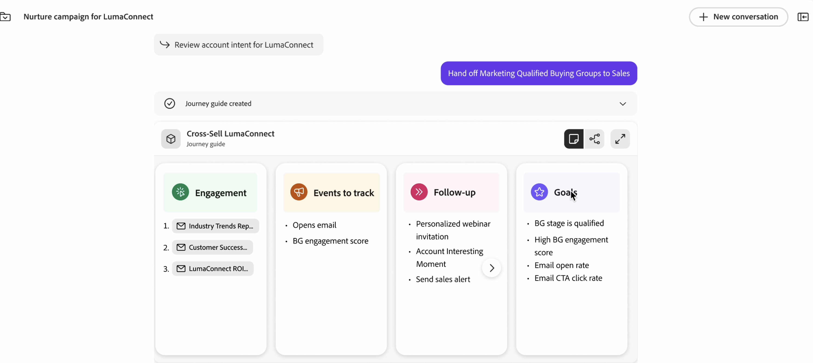

# Journey Build Agent for B2B

De Agent B2B van de Bouwer van de reis is een agent AI die u bij reisontwerp/verwezenlijking, uitvoering, en optimalisering door automatisering en gegeven-gedreven aanbevelingen bijstaat. De agent van de Bouwer van de reis voor B2B automatiseert en vermindert de tijd die wordt vereist om verwezenlijking van nieuwe B2B reizen uit te voeren.

{de Agent B2B van de Bouwer van 0} Reis Vragen 

De Journey Agent in Journey Optimizer B2B edition pakt drie van de belangrijkste uitdagingen aan waarmee B2B-marketers vandaag worden geconfronteerd:

* Het behandelen van meer en meer complexe klantenreizen (ingewikkeldheid in publiek, inhoud &amp; overseinen, en omnichannel)
* Efficiënter maken in het licht van strengere budgetten
* Bepalen hoe de optimale reis van de klant moet worden gestructureerd

De Agent B2B van de Bouwer van de reis Agent kan worden gebruikt om reizen te produceren en bij te werken:

* CREATE - Vertaal marketing doelstellingen, producten, betrokkenheidsstrategie, en KPIs in een persoonlijke klantenreis met automatisering en voorwaarden
* AANBEVELEN - Gebruikmaken van marketingafspraken uit het verleden en andere historische gegevens om de creatie van reizen te optimaliseren
* OPTIMALISEREN - actieve reizen analyseren, aanpassen en optimaliseren op basis van voorspellingen of werkelijke prestaties
* BEHEREN - Overlappende reizen en berichtenlevering prioriteren, beheren en ordenen

## Standaardgebruik

Als u de Journey Agent wilt gebruiken, typt u in het venster met de vraag wat u wilt maken in de natuurlijke taal:

&quot;Maak een B2B-reis om besluitvormers uit te nodigen voor een routekaart voor een rekening in loondienst, die naar alle waarschijnlijkheid een nieuwe pijpleiding zal openen.&quot;

{de Agent B2B van de Bouwer van 0} Reis Vragen 

Hoe meer details u kunt verstrekken, hoe beter het antwoord zal zijn. Als u bestaande marketing materialen hebt die de gebeurtenis, of uw product, enz. beschrijven, kleef dat in de herinnering, zodat heeft de Agent een beter gevoel van het doel.

&quot;Doe dienst als B2B reisstrategist om een multi-stage reis van de klantenrekening tot stand te brengen die beleidsmakers en marketing persoonlijkheden in de vroege exploratiefase van `Solution Name` voedt en aangaat. Het doel is om anonieme bezoekers om te zetten in bekende contacten, de betrokkenheid met relevante inhoud op `domain`.com te verdiepen en voorgekwalificeerde leads voor `Product Name` -verkoopactiviteiten. Gebruik kanalen zoals e-mail en betaalde media, die bestaande publiekssegmenten en inhoud gebruiken. Structuur de reis over voorlichting, overweging, en evaluatiestappen over 4 tot 6 weken, met duidelijke trekkers, acties, en doelstellingen voor elke fase. Neem KPI&#39;s op zoals conversiekoersen, betrokkenheidsscores en demoverzoeken en retourneer de uitvoer als een gestructureerde transportstroom.&quot;

Deze gedetailleerde herinnering verstrekt:

* Heldere intentie: wat wilt u dat de AI doet? Wees specifiek over de taak of het resultaat.
* Context-rijk: relevante achtergrond of beperkingen geven. Voeg indien mogelijk voorbeelden of verwijzingen toe.
* Gestructureerde indeling: gebruik opsommingstekens, genummerde stappen of sjablonen.
* Rol toewijzen: geef de rol van de AI op - &#39;Handelen als gegevensanalist..&#39;

Gebruik de agent om verfijning te herhalen: Begin eenvoudig, verfijn dan uw herinnering die op de resultaten wordt gebaseerd. Feedbackloops verbeteren de resultaten in de loop der tijd.

## End-to-end B2B-reis maken (account- of personenreis) van tekstbestanden of berichten.

De Journey Agent kan een end-to-end reisstroom (rekening of persoonreis) van natuurlijke taaltekstherinneringen en meta-gegevens, door een gesprekservaring eerder dan een traditioneel gebruikersinterface produceren.

Voorbeelden van end-to-end Reis-prompt:

* Maak een reis over het kanaal naar accounts die de afgelopen 30 dagen niet met mijn inhoud zijn gemoeid.
* Creeer een reis om een oplossing aan rekeningen over te brengen die hoge intentie zonder open pijpleiding tonen door gepersonaliseerde inhoud voor de belangrijkste het kopen groeprollen te verstrekken.
* Een B2B-reis maken om besluitvormers uit te nodigen voor een routekaart voor een rekening in dienst genomen rekeningen die naar alle waarschijnlijkheid een nieuwe pijpleiding zullen openen.
* Maak een reis naar whitespace-accounts met de intentie voor mijn oplossing, waarbij u zich richt op mensen die zich bezighouden met inhoud op de website.

## Meerfasentransporten

U kunt als B2B reisontwerper handelen om een multi-stadium reis van de klantenrekening tot stand te brengen die besluitvormers en marketing persoonlijkheden reeds in de exploratiefase informeert.
Het doel is anonieme bezoekers om te zetten in bekende contacten, de betrokkenheid met relevante inhoud te verdiepen, en primordiale gekwalificeerde leads voor verkoopbevordering.

* Gebruik kanalen zoals `Email` , `Paid media` , `Personalized web experiences` om bestaande publiekssegmenten en -inhoud te benutten.
* Structuur de reis over `awareness`, `consideration`, en `evaluation` stadia over 4-6 weken, met duidelijke trekkers, acties, en doelstellingen voor elk stadium.
* Neem KPI&#39;s op, zoals `conversion rates` , `engagement scores` en `demo requests` , en retourneer de uitvoer als een gestructureerde transportstroom.
