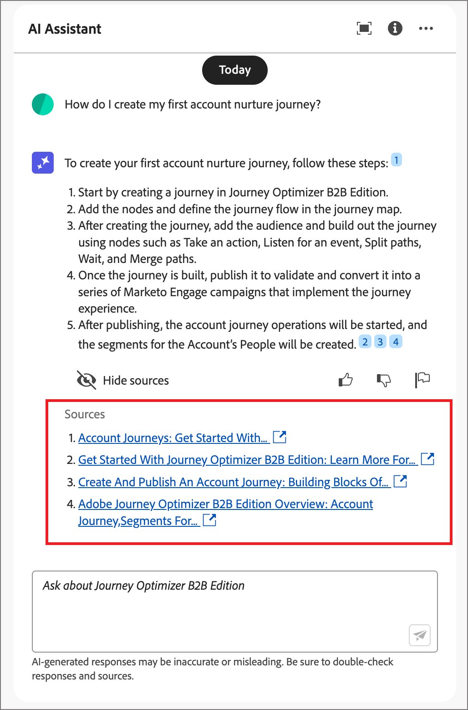

# AI Assistant gebruiken in Journey Optimizer B2B edition

In Journey Optimizer B2B edition is AI Assistant een gebruikersinterfacefunctie waarmee u productconcepten kunt begrijpen, snel kunt navigeren en leren over de productfuncties en operationele inzichten voor uw omgeving kunt opvragen. Het is ook verkrijgbaar in verschillende producten in Adobe Experience Cloud.

>[!IMPORTANT]
>
>U moet akkoord gaan met de Adobe Experience Cloud Generative AI-gebruikersrichtlijnen voordat u de AI Assistant kunt gebruiken. Voor meer informatie over deze overeenkomst en gebruiksrichtlijnen, zie de [ Generatieve AI Richtlijnen van de Gebruiker van Adobe Experience Cloud ](https://www.adobe.com/legal/licenses-terms/adobe-dx-gen-ai-user-guidelines.html).

U opent de AI-assistent door op het pictogram in de koptekst te klikken. AI Assistant wordt in een deelvenster aan de rechterkant geopend.

{width="420"}

De interface AI Assistant wordt weergegeven en bevat direct informatie die u nodig hebt om aan de slag te gaan. U kunt de opties gebruiken die onder _Ideeën worden verstrekt om_ begonnen te worden om vragen en bevelen, zoals te beantwoorden:

* Welke reizen zijn gepubliceerd?
* Welke oplossingen zijn er gevonden?
* Vertel me de belangrijkste voordelen van Journey Optimizer B2B edition.

In Adobe Journey Optimizer B2B edition biedt AI Assistant ondersteuning voor de volgende gebruiksgevallen:

## Vragen over productkennis stellen

Vragen over productkennis gaan over Journey Optimizer B2B edition-concepten en &#39;Hoe kan ik?-informatie. Enkele voorbeelden van productkennisvragen zijn:

* Hoe kan ik SMS-leveranciersaccounts instellen?
* Hoe stuur ik een e-mail op reis?
* Hoe kan ik mijn e-mailinhoud personaliseren?

Als u een productvraag wilt stellen, voert u deze in in het veld onder aan het venster en drukt u op Enter. Bijvoorbeeld, wanneer u moet leren hoe te om een het kopen groep in een reis te gebruiken. In dit geval, gaat u _in hoe ik een het kopen groep in een reis gebruik?_ Nadat u de vraag hebt verzonden, vraagt AI Assistant naar de bijbehorende kennisbasis en wordt een antwoord in een paar seconden gecompileerd.

{width="420"} in

+++Een voorbeeldantwoord weergeven

{width="420"} in

+++

## Stel vragen over operationele inzichten

Operationele vragen over inzichten hebben betrekking op de reisobjecten in de sandbox van uw organisatie. U kunt vragen stellen over operationele artefacten, zoals rekeningspubliek, rekeningsreis, oplossingsrente, en het kopen groepsmalplaatje. Voorbeelden van vragen of vragen over operationele inzichten zijn:

* Hoeveel reizen heb ik in Adobe Journey Optimizer B2B edition?
* Geef me een lijst van alle geplande reizen
* Hoeveel reizen zijn er in de afgelopen 7 dagen gemaakt?

AI Assistant moet zich in een actieve sandbox bevinden om een voldoende antwoord te bieden op een vraag over uw operationele inzichten.

>[!NOTE]
>
>De enige voorwerpen van Adobe Journey Optimizer B2B edition die door de AI Medewerker operationele vragen van inzichten worden gesteund zijn vermeld in de [ operationele lijst van het inzichten ](./ai-assistant-overview.md#operational-insights). Deze kan alleen toegang krijgen tot gegevens voor de sandbox waarin u zich momenteel bevindt.

Als u een vraag over operationele inzichten wilt stellen, voert u deze in in het veld onder aan het deelvenster en drukt u op Enter. Wanneer u bijvoorbeeld wilt weten wat het publiek is voor uw sandbox. In dit geval, gaat u _in hoeveel publiek er zijn?_.  AI Assistant geeft een telling van de doelgroepen in uw sandbox en een uitleg van hoe het antwoord is berekend. In het volgende voorbeeldantwoord, verstrekt AI Assistant een verbinding om tot de soorten publiek in UI toegang te hebben en schetst de stappen het nam om het aantal soorten publiek te identificeren.

{width="420"}

U kunt uw eerste onderzoek volgen door om een lijst van artefacten te vragen, zoals _maak een lijst van top 5 door grootte_. De Medewerker van AI keert een lijst met de hoogste vijf punten in de vraag en hun overeenkomstige IDs terug. Klik het _pictogram van de Download_ ( ) om de lijst als Csv- dossier te downloaden.

{width="420"}

Om de volledige lijst in AI Medewerker te bekijken, klik _maximaliseren_ ( ) pictogram. Klik in de uitgebreide tabelweergave op **[!UICONTROL Download CSV]** om de informatie op te slaan als een CSV-bestand.

{width="600" zoomable="yes"}

## Reacties verifiëren

AI Assistant bevat gereedschappen waarmee u reacties kunt verifiëren en valideren.

### Productkennisbronnen

Nadat u een antwoord voor een productvraag hebt ontvangen, selecteert u **[!UICONTROL Show source]** om de broncitaten van de productkennis weer te geven die worden gebruikt om de AI Assistant-reactie te genereren.

AI Assistant biedt koppelingen naar de documentatie die de eerste reactie bevestigt. Er worden ook voetnoten toegevoegd aan het antwoord om de specifieke delen van het antwoord aan te geven die verwijzen naar de gekoppelde documentatiebronnen.

{width="420"}

### Operationele informatiebronnen

Nadat u een antwoord hebt ontvangen voor een vraag over operationele inzichten, klikt u op **[!UICONTROL Show source]** en selecteert u vervolgens **[!UICONTROL View source query]** .

U kunt elke reactie met betrekking tot operationele vragen van inzichten verifiëren gebruikend een SQL vraag die AI Medewerker verstrekt. Wanneer gevraagd met een operationele inzichten vraag, verstrekt AI Assistant een SQL vraag die u kunt gebruiken om het proces te verifiëren dat het nam om het antwoord te berekenen. Deze bronvraag is slechts voor verificatiedoeleinden en wordt niet gesteund op de Dienst van de Vraag.

{width="550" zoomable="yes"}

## Feedback geven

Gebruik de _Duim omhoog_ ( ) of _duim neer_ ( ) pictogrammen om het nut en de kwaliteit van de reactie te schatten. Vul het korte enquêteformulier in op basis van uw ervaring en klik op **[!UICONTROL Submit]** . De informatie die u verstrekt wordt gebruikt om verbeteringen in AI Medewerker aan te brengen.

Als u iets in de reactie opmerkt die problematisch is, klik het _pictogram van de Vlag_ ( ). Gebruik het formulier om het probleem te beschrijven en klik op **[!UICONTROL Submit]** om het probleem te melden.

{width="420"}

+++Formulieren weergeven

>[!BEGINTABS]

>[!TAB  Duim omhoog ]

{width="600" zoomable="yes"}

>[!TAB  duim neer ]

{width="600" zoomable="yes"}

>[!TAB  Vlag ]

{width="600" zoomable="yes"} terug

>[!ENDTABS]

+++
