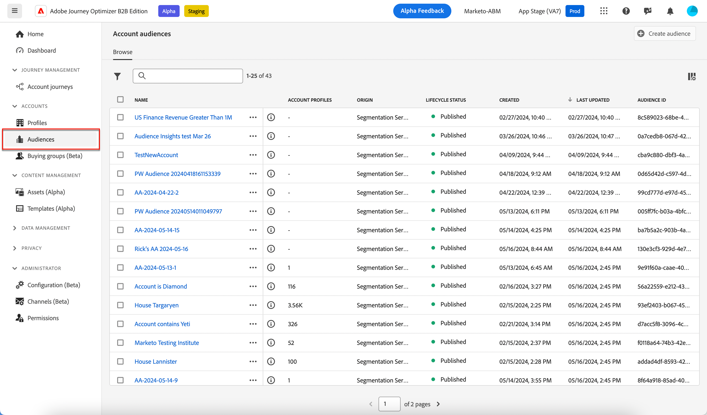

# Accountdoelgroepen

Een publiek is een groep personen die vergelijkbare gedragingen en/of kenmerken delen. Journey Optimizer B2B edition gebruikt de functies voor de segmentatie van de account die in Adobe Real-Time Customer Data Platform B2B- en B2P-edities zijn gevonden. Met accountsegmentatie kunnen gebruikers een publiek voor de account genereren door gegevens van een van de B2B-entiteiten in het systeem te gebruiken. Dit accountpubliek fungeert als input voor Journey Optimizer B2B edition-reizen, waardoor het gemakkelijker wordt om een naadloze activering en personalisatie uit te voeren.

Leer meer over rekeningspubliek en hoe te om hen in de [ documentatie van de Dienst van de Segmentatie van Adobe Experience Platform ](https://experienceleague.adobe.com/en/docs/experience-platform/segmentation/types/account-audiences){target="_blank"} te bepalen.

## Workflow voor accountpubliek

U kunt Journey Optimizer B2B edition zien als een Experience Platform-bestemming (AEP) die niet in de doelcatalogus wordt weergegeven. Activeer accountpubliek naar Journey Optimizer B2B edition door de volgende stappen uit te voeren:

1. Maak schema&#39;s voor uw gegevens in AEP.
1. Vermeld uw gegevens in AEP.
1. Maak een accountsegment om uw gegevens te evalueren.
1. Activeer je geëvalueerde gegevens naar Journey Optimizer B2B edition.

In Journey Optimizer B2B edition wordt het accountpubliek gebruikt als input voor reizen op basis van een account, zodat u zich op die accounts kunt richten. U kunt bijvoorbeeld accountpubliek gebruiken om gegevens op te halen van alle accounts die geen contactgegevens hebben voor personen met de titel Chief Operating Officer (COO) of Chief Marketing Officer (CMO).

Met Journey Optimizer B2B edition kunt u het publiek van de Adobe Experience Platform-account (AEP) rechtstreeks vanaf de linkernavigatie maken en deze opnemen in uw accountreizen.

{width="800" zoomable="yes"}

## Een publiek voor een account maken

Definieer het accountpubliek door een accountsegmentatie te maken. U hebt de optie om de rekeningssegmentatie direct binnen de toepassing van Journey Optimizer B2B edition tot stand te brengen, of u kunt de [ Bouwer van het Segment gebruiken UI ](https://experienceleague.adobe.com/en/docs/experience-platform/segmentation/ui/segment-builder){target="_blank"}. Hieronder vindt u de stappen waarmee u een accountsegmentatie kunt maken in Journey Optimizer B2B edition.

1. Kies in de linkernavigatie **[!UICONTROL Accounts]** > **[!UICONTROL Audiences]** .

1. Klik op **[!UICONTROL Create audience]** rechtsboven.

1. Bouw de segmentdefinitie.

   De accountkenmerken en het publiek worden weergegeven op de linkernavigatiebalk. Onder het tabblad _[!UICONTROL Attributes]_kunt u zowel door het platform gemaakte als aangepaste kenmerken toevoegen. Sleep elk attribuut om de logica voor het segment te bouwen.

   >[!TIP]
   >
   >Houd er bij het maken van een accountpubliek rekening mee dat gebeurtenissen onder _[!UICONTROL People]_worden weergegeven, omdat deze kenmerken aan personen zijn gekoppeld. 
   >
   >Onder het tabblad _[!UICONTROL Audiences]_kunt u eerder gemaakte, op personen gebaseerde soorten publiek toevoegen om van af te bouwen bij het maken van uw eigen accountpubliek.

   In het volgende voorbeeld wordt een publiek gedefinieerd dat is gemaakt met `Country Code` , `Revenue Amount` en `Market segment` . De vraag in het Engels zou zijn: &quot;Ik wil alle rekeningen in de V.S. die in het Segment van Financiën zijn waarvan opbrengst $1M overschrijdt.&quot;

   {width="700" zoomable="yes"}
    

   >[!IMPORTANT]
   >
   >Het attribuut `Account Name` voor accountrecords moet een waarde bevatten die moet worden opgenomen in accountreizen. Als dit attribuut (ongeldig) leeg is, wordt het rekeningsverslag uitgesloten. 
   >Om ervoor te zorgen dat alleen accounts met een niet-lege accountnaam worden opgenomen, voegt u het attribuut **[!UICONTROL Account Name]** toe en selecteert u _[!UICONTROL exists]_als voorwaarde voor overeenkomst.  
   >{het attribuut van de Naam van 0} Account bestaat ](./assets/audience-segment-builder-account-name-exists.png){width="600"}![
   >  als u een douanekenmerk voor de rekeningsnaam gebruikt, gebruik uw naam van het douanekenmerk in plaats van _[!UICONTROL Account Name]_.

1. Klik op **[!UICONTROL Save and Close]** rechtsboven.

Om uw rekeningspubliek voor Journey Optimizer B2B edition te activeren, moet u het [ toevoegen aan een rekeningsreis ](../journeys/journey-overview.md#add-the-account-audience-for-your-journey) en [ de reis ](../journeys/journey-overview.md) publiceren.
