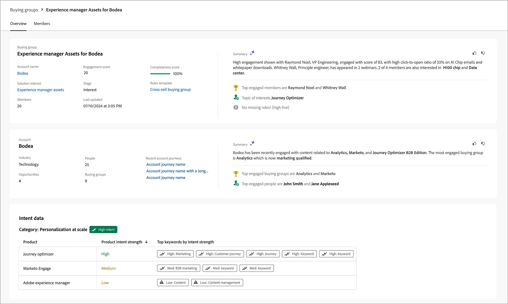
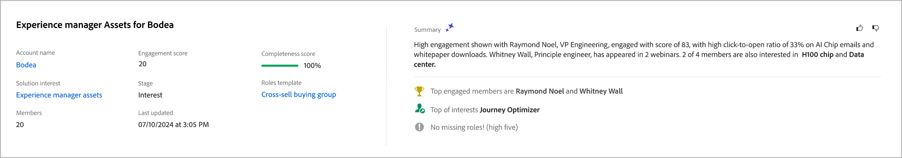

# Gegevens van groep kopen

Als u ergens in Journey Optimizer B2B edition op de naam van een inkoopgroep klikt, worden de gegevens van de inkoopgroep weergegeven. Dit overzicht bevat nuttige informatie over de inkoopgroep, waaronder generatieve AI-overzichten.

{width="800" zoomable="yes"}

{{intent-data-note}}

De pagina met details over de inkoopgroep bestaat uit drie primaire secties:

## Overzicht van de kopersgroep

{zoomable="yes"}

Het overzichtsgedeelte van de inkoopgroep bevat de volgende informatie over de inkoopgroep:

* Naam van kopersgroep
* Accountnaam (klik op de naam om de accountgegevens te openen)
* Aantal personen in de koopgroep
* Betrokkenheidsscore
* Volledigheidsscore
* Huidige groepsfase voor kopen
* Rolsjabloon (klik op de naam om de sjabloondetails voor rollen te openen)
* Laatst gewijzigd/bijgewerkt op
* Generatieve AI-samenvatting van de koopgroep

## Accountoverzicht

{zoomable="yes"}

Het gedeelte Accountoverzicht bevat de volgende accountgegevens:

* Accountnaam (klik op de naam om de accountgegevens te openen)
* Aantal personen op de account
* Marktsegment
* Open kansen
* Laatste drie rekeningreizen waar de account momenteel wordt gebruikt (klik op de naam om de reisgegevens te openen)
* Generatieve AI-samenvatting van de rekening

## Groepsleden kopen

{width="800" zoomable="yes"}

In de sectie _[!UICONTROL Buying group members]_&#x200B;worden twee rijen weergegeven die de kopende groepsleden markeren:

* **[!UICONTROL Decision maker]** - De drie belangrijkste besluitvormers op basis van de betrokkenheidsscore van de persoon
* **[!UICONTROL Top engaged members]** - Andere leden met de hoogste betrokkenheid op basis van de betrokkenheidsscore van de persoon

Elke lidkaart bevat de volgende gegevens:

* Naam
* Titel
* Functie
* Aanbiedingsscore

Klik op **[!UICONTROL View details]** voor toegang tot de volgende informatie over leden:

* Samenvatting van algemene AI
* Laatste interessante moment
* Meest recente activiteiten (twee)
* Andere kopersgroepen waarbij de lead lid is (beperkt tot drie inkoopgroepen op basis van de meest recente toegevoegde groep).
* E-mailadres
* Telefoonnummer

{width="600" zoomable="yes"}
