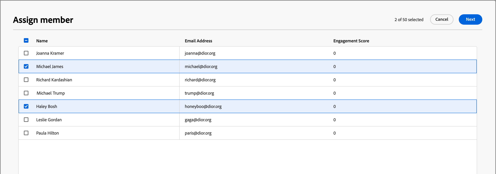

# Gegevens van groep kopen

Als u ergens in Journey Optimizer B2B edition op de naam van een inkoopgroep klikt, worden de gegevens van de inkoopgroep weergegeven. Dit overzicht bevat nuttige informatie over de inkoopgroep, waaronder generatieve AI-overzichten. Er zijn ook [ acties ](#buying-group-actions) die u voor contacten verbonden aan de rekening kunt uitvoeren.

{width="800" zoomable="yes"}

Gebruik het tabblad **[!UICONTROL Overview]** om informatie over de account te bekijken en het tabblad **[!UICONTROL Members]** om een lijst met de leden van de inkoopgroep te openen.

## Tabblad Overzicht

Het tabblad Overzicht bestaat uit drie primaire secties:

### Samenvatting van kopersgroep

{zoomable="yes"}

De overzichtssectie voor inkoopgroepen bevat de volgende informatie over inkoopgroepen:

* Naam van kopersgroep
* De naam van de rekening (klik de naam om de [ rekeningsdetails ](../accounts/account-details.md) te openen)
* Aantal leden in de koopgroep
* Betrokkenheidsscore
* Volledigheidsscore
* Huidige groepsfase voor kopen
* Het malplaatje van de rol (klik de naam om het [ rolmalplaatje ](buying-groups-role-templates.md#access-and-browse-role-templates) te openen)
* Laatst gewijzigd/bijgewerkt op
* Generatieve AI-samenvatting van de koopgroep

### Accountoverzicht

{zoomable="yes"}

Het gedeelte Accountoverzicht bevat de volgende accountgegevens:

* Accountnaam (klik op de naam om de accountgegevens te openen)
* Aantal personen op de account
* Marktsegment
* Open kansen
* Laatste drie rekeningreizen waar de account momenteel wordt gebruikt (klik op de naam om de reisgegevens te openen)
* Generatieve AI-samenvatting van de rekening

### Intentgegevens

In Journey Optimizer B2B edition voorspelt het Intent Detection-model een oplossing/product van interesse met voldoende vertrouwen op basis van de activiteit van de koopgroepsleden. De intentie om groepsleden te kopen kan worden geïnterpreteerd als de waarschijnlijkheid dat zij belang hebben in een product.

{{intent-data-note}}

{width="700" zoomable="yes"}

* Intentieniveaus
* Typen intentsignalen - Trefwoorden, product en oplossing

### Groepsleden kopen

{width="800" zoomable="yes"}

In de sectie _[!UICONTROL Buying group members]_worden twee rijen weergegeven die de kopende groepsleden markeren:

* **[!UICONTROL Decision maker]** - De drie belangrijkste besluitvormers op basis van de betrokkenheidsscore van de persoon
* **[!UICONTROL Top engaged members]** - Andere leden met de hoogste betrokkenheid op basis van de betrokkenheidsscore van de persoon

Elke lidkaart bevat de volgende gegevens:

* Naam
* Titel
* Functie
* Aanbiedingsscore

Klik op **[!UICONTROL View details]** voor toegang tot de volgende informatie over leden:

* Samenvatting van algemene AI
* Laatste interessante moment
* Meest recente activiteiten (twee)
* Andere kopersgroepen waarbij de lead lid is (beperkt tot drie inkoopgroepen op basis van de meest recente toegevoegde groep).
* E-mailadres
* Telefoonnummer

{width="600" zoomable="yes"}

## Tabblad Leden

Selecteer het tabblad **[!UICONTROL Members]** om een lijst weer te geven met alle leden van de inkoopgroep. Elke lijst met leden bevat de naam, rol, functie, e-mailadres, telefoonnummer en bron.

{width="700" zoomable="yes"}

Er zijn veelvoudige acties die u van het _Leden_ lusje kunt uitvoeren:

### Een nieuw lid toewijzen

Aan een account kunnen een of meer inkoopgroepen zijn gekoppeld. Het kopen van groepsleden is doorgaans een subset van contactpersonen van de account. U kunt handmatig om het even welk contact van de bijbehorende rekening aan de koordgroep toevoegen.

1. Klik op **[!UICONTROL Assign new member]** rechtsboven.

1. Selecteer in het dialoogvenster _[!UICONTROL Assign member]_de accountleads die u aan de inkoopgroep wilt toevoegen en klik op **[!UICONTROL Next]**.

   {width="700" zoomable="yes"} toe

1. Selecteer in het dialoogvenster _[!UICONTROL Edit new member role]_de rol die u aan elk van de nieuwe leden wilt toewijzen.

   {width="700" zoomable="yes"} toe

1. Klik op **[!UICONTROL Save]**.

### Een lid verwijderen

U kunt een of meer geselecteerde leden (maximaal 50 per keer) verwijderen uit de inkoopgroep.

1. Schakel de selectievakjes in voor de leden die u wilt verwijderen.

1. Klik op **[!UICONTROL Remove members]** in de selectiebalk onderaan.

   {width="700" zoomable="yes"}

1. Klik op **[!UICONTROL Remove]** in het bevestigingsdialoogvenster.

### Rol bewerken

U kunt de rol voor een of meer geselecteerde leden (maximaal 50 per keer) van de koopgroep wijzigen.

1. Schakel de selectievakjes in voor de leden die u rollen wilt wijzigen.

1. Klik op **[!UICONTROL Edit roles]** in de selectiebalk onderaan.

   {width="700" zoomable="yes"}

1. Selecteer in het dialoogvenster _[!UICONTROL Edit member role]_de rol die u aan elk van de leden wilt toewijzen.

   {width="700" zoomable="yes"}

1. Klik op **[!UICONTROL Save]**.

### E-mail verzenden

U kunt een door een markter goedgekeurde e-mail verzenden naar een of meer geselecteerde leden (maximaal 50 per keer) van een koopgroep. De lijst met beschikbare e-mails is beperkt tot goedgekeurde e-mailberichten van het aangesloten Marketo Engage-exemplaar.

1. Schakel de selectievakjes in voor de leden die u het e-mailbericht wilt ontvangen.

1. Klik op **[!UICONTROL Send email]** rechtsboven of in de selectiebalk onderaan.

   {width="700" zoomable="yes"}

1. Selecteer in het dialoogvenster _[!UICONTROL Send email]_de Marketo Engage-werkruimte en schakel vervolgens het selectievakje in voor de e-mail die u wilt verzenden.

   {width="700" zoomable="yes"}

1. Klik op **[!UICONTROL Send]**.
