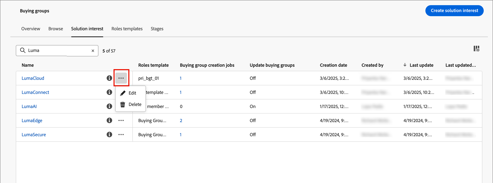
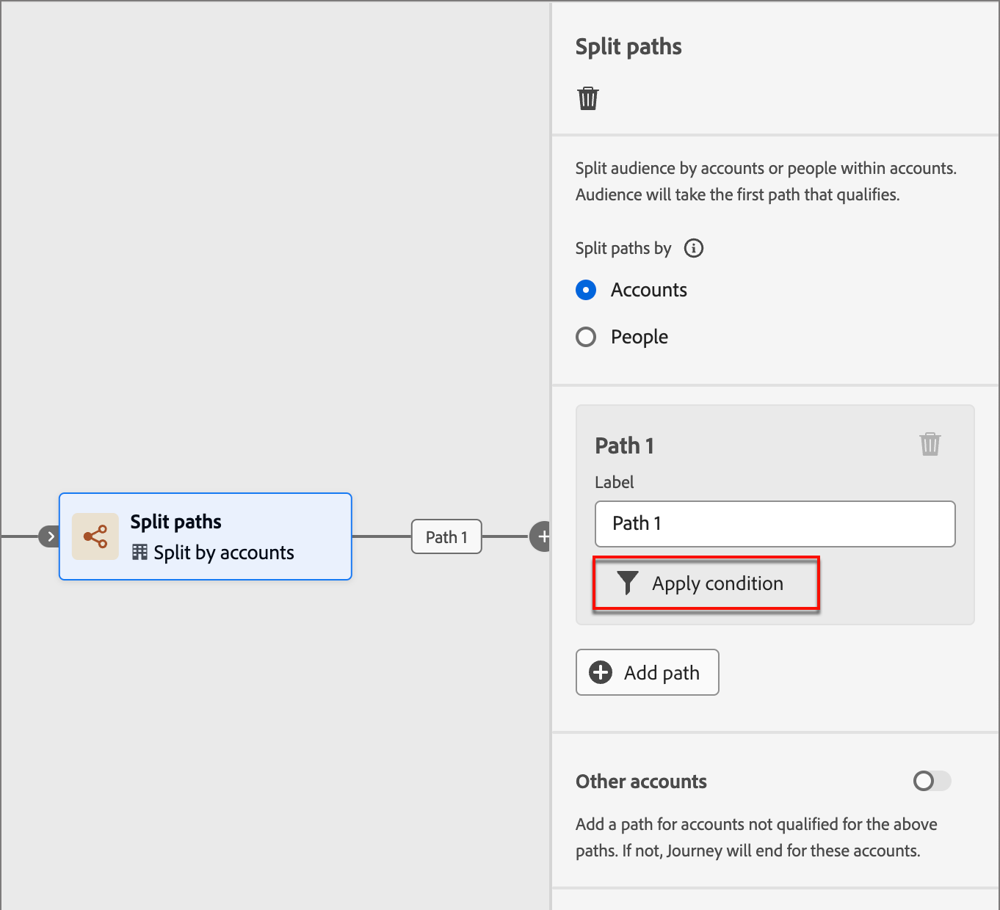
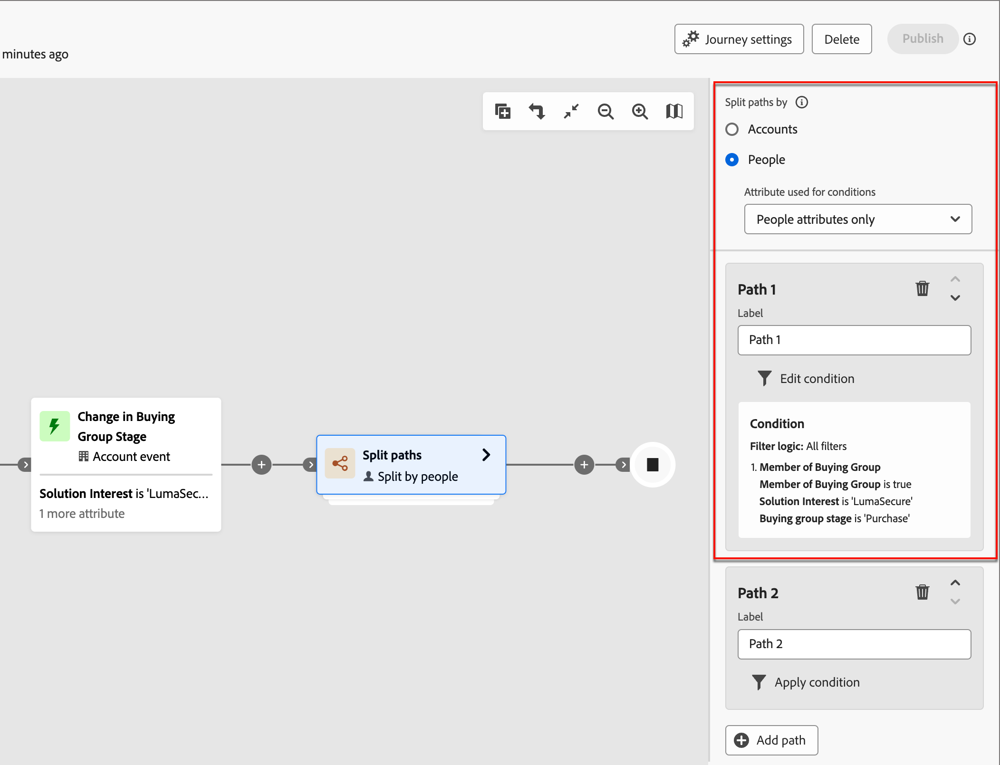
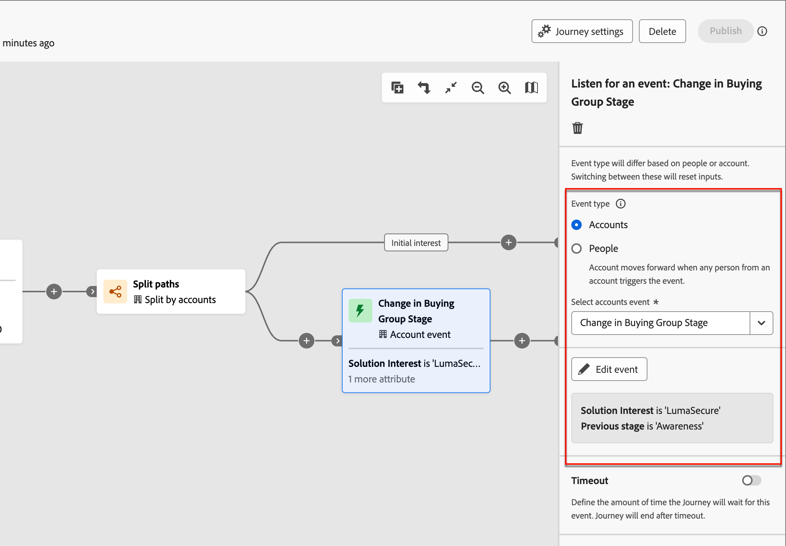

# Groepsfasen voor kopen

De het kopen groepsstadia worden ontworpen om de vooruitgang van het kopen van groepen in het omzetten van kansen in klanten te volgen. Gebruik deze functie om de voortgang van de inkoopgroep te volgen en de volgende beste acties voor het kopen van groepsleden te identificeren.

Definieer de fasen in één staging-model, waarbij u meerdere fasen definieert en de overgangsstroom tussen de fasen definieert. Een of meer fasen zijn bedoeld om in de levenscyclus te worden binnengebracht. Het model maakt ook niet-lineaire progressie mogelijk, waarbij u overgangen van de ene naar de andere fase kunt opgeven, zoals van fase A naar fase B, C of D. Er moet één fase worden aangewezen als de succesfase, zoals een aankoop of een ondertekend contract. Het is facultatief dat een andere fase als een mislukkingsfase wordt aangewezen, zoals een afgewezen contract of de aankoop van een concurrerende oplossing van een andere verkoper. Dit wordt bereikt door [ intelligente dashboards ](../dashboards/intelligent-dashboard.md) die tonen hoe het kopen groepen in termen van het voltooien van een verkoopkans of het omzetten van een kans in een klant vooruitgaat.

{width="800" zoomable="yes"}

{width="30"} [ bekijk het videooverzicht ](#overview-video)

## Uw model voor inkoopgroepfasen definiëren

U creeert en vormt een het kopen model van groepsstadia door:

* De levenscyclusfasen toevoegen
* De overgangsstromen definiëren
* Aanwijzing van de entry- en bestemmingsfasen

Slechts één model wordt gesteund, zodat is het belangrijk om over u de Marketing en teams van de Verkoop te werken om het optimale model voor uw organisatie te plannen alvorens u het in Journey Optimizer B2B edition creeert en publiceert.<!-- Initially, only one stage model can be created, but future releases will support multiple stage models, allowing users to select which model to use in a journey. -->

Wanneer u het het kopen model van het groepsstadium creeert, is het automatisch in _Laag_ status en kan niet worden geschrapt of worden anders genoemd. Deze status blijft behouden wanneer u de fasen definieert en de overgangsstroom tussen de fasen configureert. Wanneer het model in een gepubliceerde (_Levende_) status is, kan het niet worden veranderd.

### Het model maken

1. Ga in de linkernavigatie naar **[!UICONTROL Accounts]** > **[!UICONTROL Buying Groups]** .

1. Selecteer de tab **[!UICONTROL Stages]** op de pagina Groepen kopen.

   {width="800" zoomable="yes"}

   Dit _[!UICONTROL Stages]_&#x200B;lusje is in een_ lege _staat tot u het model creeert.

1. Klik op **[!UICONTROL Create model]** in het midden van de pagina.

1. Voer in het dialoogvenster de opties **[!UICONTROL Name]** (vereist) en **[!UICONTROL Description]** (optioneel) voor het model in.

   {width="700" zoomable="yes"} toe

   Als u _[!UICONTROL Cancel]_&#x200B;in deze dialoog klikt, keert u aan het&#x200B;_[!UICONTROL Stages]_ lusje in een _lege_ staat terug.

1. Klik op **[!UICONTROL Create]**.

### De fasen definiëren

Nadat u het model hebt gemaakt, wordt het geopend in de werkruimte en wordt u gevraagd om de fasen voor het model te maken.

1. Klik op **[!UICONTROL Edit stages]**.

   {width="700" zoomable="yes"} toe

1. Definieer het eerste werkgebied door de waarden **[!UICONTROL Name]** (vereist) en **[!UICONTROL Description]** (optioneel) in te voeren.

   {width="700" zoomable="yes"}

   De fasen hoeven niet in een specifieke volgorde te worden toegevoegd, maar het bepaalt wel hoe de fasen worden weergegeven op de pagina met modeldetails. Wanneer u de overgangsregels definieert, geeft u de invoerfase en de stroom tussen de fasen aan.

1. Klik op **[!UICONTROL Add stage]** en herhaal stap 2 om een ander werkgebied te definiëren.

   Herhaal deze stap totdat u de benodigde stappen voor het model hebt uitgevoerd.

   {width="700" zoomable="yes"}

1. Klik op **[!UICONTROL Save]** als u tevreden bent met de stappen die u hebt gedefinieerd.

   >[!IMPORTANT]
   >
   >**nadat de het kopen groepsstadia worden bewaard, kunnen zij niet worden verwijderd.** Nochtans, kunt u de naam en de beschrijving voor om het even welke stadia veranderen zolang het model in _2&rbrace; status van het Ontwerp &lbrace;blijft._

### De workflow en overgangsregels configureren

Nadat u de fasen hebt opgeslagen, gaat u terug naar de modelwerkruimte. De kolom _[!UICONTROL Allowed transit to]_&#x200B;is leeg, wat aangeeft dat de overgangsregels voor de modelfasen nog niet zijn gedefinieerd.

{width="700" zoomable="yes"}

De overgangsregels bepalen hoe een inkoopgroep van de ene fase naar de andere kan gaan. Het kan bijvoorbeeld van een entry-stage naar een middle-stage gaan, en van een middenfase naar verschillende andere fasen. Een invoerfase is een eerste fase die een inkoopgroep vanuit een leeg land kan betreden, en de bestemmingsfasen worden geclassificeerd als een succes- of een mislukkingsfase.

1. Klik op **[!UICONTROL Edit transition rules]** rechtsboven.

   Met deze handeling wordt het dialoogvenster _[!UICONTROL Edit stage rules]_&#x200B;geopend waarin u de logica voor de flow definieert.

   Terwijl u de opties instelt, zijn er ingebouwde instructies en berichten om u te helpen logische fouten in de flow te voorkomen. U kunt op _[!UICONTROL Cancel]_&#x200B;klikken om het dialoogvenster te sluiten en zonder wijzigingen terug te keren naar de tabpagina van&#x200B;_[!UICONTROL Stages]_ .

1. Wijs in de sectie _[!UICONTROL Select stage]_&#x200B;de begin- en eindfasen van de flow aan:

   * **[!UICONTROL Entry point stage]** (vereist) - Wijs één of meerdere ingangsstadia voor de het kopen groepskans aan.

   * **[!UICONTROL Success stage]** (vereist) - Wijs het werkgebied aan dat aangeeft dat de kans voor de inkoopgroep succesvol is (bestemming).

   * **[!UICONTROL Failure stage]** (optioneel) - Wijs een of meer fasen aan die aangeven dat de kans op een inkoopgroep een punt van mislukking heeft bereikt (bestemming).

   {width="700" zoomable="yes"}

1. Definieer voor elk niet-doelstadium een of meer stadia die volgende in de flow (overgang) komen.

   Voor alle niet-doelfasen moet ten minste één **[!UICONTROL Allowed transit to]** werkgebied zijn geselecteerd. Anders, is de modellogica niet geldig en de rekeningen kunnen _geplakt_ in dat stadium zonder manier aan succes of mislukking worden.

   {width="700" zoomable="yes"}

   U kunt desgewenst een overgang opgeven vanuit een mislukkingsfase. Bijvoorbeeld, zou u een stadium kunnen aanwijzen genoemd _Geen reactie_ als mislukkingsstadium. Maar wijs ook een stadium genoemd _Heropleving_ als mogelijke overgang aan om gevallen te identificeren waar een slapende rekening wordt opnieuw geactiveerd.

1. Klik op **[!UICONTROL Save]**.

   Met de terugkeer naar de pagina van modeldetails, zijn de stadia vermeld in een lijst met de toegestane overgangen, en de bestemming en ingangseigenschappen.

| Kolom | Beschrijving |
| ------ | ---------- |
| **[!UICONTROL Stage name]** | Naam van het werkgebied. Klik op het informatiepictogram om de beschrijving van het werkgebied weer te geven. |
| **[!UICONTROL Allowed transit to]** | Maakt een lijst van de stadia die voor a _beweging_ binnen het model geldig zijn. |
| **[!UICONTROL Entry point stage]** | Geeft aan of het werkgebied geldig is als een werkgebied met een ingangspunt ([!UICONTROL Yes] of [!UICONTROL No]). |
| **[!UICONTROL Destination]** | Geeft aan of het werkgebied is aangewezen als een doelwerkgebied ([!UICONTROL Success] of [!UICONTROL Failure]). |

{width="700" zoomable="yes"} worden bepaald

## Een conceptmodel bewerken

Zolang het het kopen model van groepsstadia in a _Ontwerp_ staat blijft, kunt u de stadia en overgangsregels uitgeven.

_om het ontwerp model te bekijken:_

1. Ga in de linkernavigatie naar **[!UICONTROL Accounts]** > **[!UICONTROL Buying Groups]** .

1. In de _het Kopen pagina van Groepen_, selecteer het **[!UICONTROL Stages]** lusje.

1. Klik op de modelnaam om de modeldetails te openen.

### De stappen in het model wijzigen

1. Klik op **[!UICONTROL Edit stages]**.

   In het dialoogvenster _[!UICONTROL Edit stages]_&#x200B;kunt u nieuwe fasen toevoegen of de naam en beschrijving van bestaande fasen wijzigen.

   * Wijzig desgewenst de **[!UICONTROL Name]** of **[!UICONTROL Description]** van een werkgebied.

   * Blader naar de onderkant en klik **[!UICONTROL Add stage]** om zo nodig een nieuw werkgebied voor het model te definiëren.

1. Klik op **[!UICONTROL Save]** als u tevreden bent met de stappen die u hebt gedefinieerd.

   U kunt ook op _[!UICONTROL Cancel]_&#x200B;klikken om het dialoogvenster te sluiten en zonder wijzigingen terug te keren naar de pagina met modeldetails.

### De overgangsregels voor het model bewerken

1. Klik op **[!UICONTROL Edit transition rules]**.

1. In _geef de dialoog van de het werkgebiedregels_ uit, verander de stroomopties zoals nodig.

   Zie [ het werkschema en de overgangsregels ](#configure-the-workflow-and-transition-rules) voor meer informatie over deze opties vormen en hoe zij de modelstroom beïnvloeden.

1. Klik op **[!UICONTROL Save]** als u tevreden bent met de gedefinieerde overgangsregels.

   U kunt ook op _[!UICONTROL Cancel]_&#x200B;klikken om het dialoogvenster te sluiten en zonder wijzigingen terug te keren naar de pagina met modeldetails.

## Het model voor de inkoopgroepfasen publiceren

Als er geen validatiefouten zijn, kan het model worden gepubliceerd. Wanneer het wordt gepubliceerd, verandert het in a _Levende_ staat en kan worden gebruikt om het kopen groepsstadia in rekeningsreizen te bevorderen.

>[!IMPORTANT]
>
>**nadat het model wordt gepubliceerd, kan het niet worden bijgewerkt of worden geschrapt.** Controleer of u de juiste gegevens hebt voordat u het model publiceert.

1. Bekijk de gedefinieerde fasen en overgangen zorgvuldig.

   Als revisies nodig zijn, bewerkt u de modelfasen.

1. Klik op **[!UICONTROL Publish]**.

1. Klik op **[!UICONTROL Publish]** in het bevestigingsdialoogvenster.

   Als u terugkeert naar de pagina met modeldetails, wordt het model aangeduid als _[!UICONTROL Live]_. Klik de_ Achterste _pijl bij de hoogste linkerzijde om aan de&#x200B;_[!UICONTROL Stages]_ lusjepagina terug te keren.

{width="700" zoomable="yes"}
<!-- list these later when the Published columns are working correctly

Columns - Name, Status, Created by, Created date, Last updated by, Last update, Published by, Published on.
Name - Name of the stage model, hyperlinked. Clicking on it will navigate to the stage inventory page. 
Info icon beside the name - display the description on click.
Status - Live, Draft. If a draft stage model is Published, then its status is updated to Live. -->

## Het model voor inkoopgroepfasen verwijderen

U kunt het model voor de inkoopgroepfasen verwijderen wanneer dit zich in een concept of een gepubliceerde status bevindt. Als het (levend) wordt gepubliceerd, kunt u het schrappen slechts wanneer het niet met een oplossingsbelang wordt geassocieerd.

1. Ga in de linkernavigatie naar **[!UICONTROL Accounts]** > **[!UICONTROL Buying Groups]** .

1. In de _het Kopen pagina van Groepen_, selecteer het **[!UICONTROL Stages]** lusje.

1. Klik het _Meer_ menupictogram (**...**) naast de naam van het fasemodel en kies **[!UICONTROL Delete]**.

   {width="700"}

1. Klik in het dialoogvenster op **[!UICONTROL Delete]** om te bevestigen.

## Gebruik het model voor reizen in rekening

Wanneer het het kopen fasemodel in a _Levende_ (gepubliceerde) status is, voeg het model aan de oplossingsbelangen toe waar u het wilt gebruiken om het kopen groepsvooruitgang te volgen. In uw accountreizen kunt u acties opnemen om een overgangsaccount naar een opgegeven werkgebied te maken en werkgebiedovergangen toe te voegen als gebeurtenissen die bepalen hoe accounts door de reis gaan.

### Vereniging van het belang van de oplossing

Voor elke bestaande oplossingsbelang waar u het de prijsverhogende model van groepsstadia wilt associëren, open de details van de oplossingsrente en voeg het model toe. U kunt het model aan de eigenschappen ook toevoegen wanneer u [ een oplossingsrente ](./solution-interests.md#create-a-solution-interest) creeert.

1. Selecteer de tab _[!UICONTROL Solution interest]_.

1. Open de oplossingsrente gebruikend één van de volgende methodes om de eigenschappen voor de oplossingsrente te openen die u wilt uitgeven:

   * Klik de naam van de oplossingsrente.
   * Klik op de ellips (**..**) naast de ellips en kies **[!UICONTROL Edit]** .

   {width="500" zoomable="no"}

1. Selecteer de **[!UICONTROL Buying group stage model]** om de progressie van het koopgedrag-groepswerkgebied te gebruiken (optioneel).

   {width="700" zoomable="yes"}

1. Wijzig indien nodig de instelling voor **[!UICONTROL Update existing buying groups]** .

   Als deze optie is ingeschakeld, worden alle bestaande inkoopgroepen die met de interesse van de oplossing zijn gekoppeld, bijgewerkt via de synchronisatiecyclus van 24 uur.

1. Klik op **[!UICONTROL Save]**.

### Paden splitsen

Gebruikend a [ gespleten wegknoop ](../journeys/journey-nodes.md#split-paths), kunt u op het rekeningsniveau of het personenniveau filtreren volgens het kopen van groepsstadia. Voeg bijvoorbeeld een inkoopgroepsstadium als padvoorwaarde toe bij het splitsen van paden door groepslid te kopen.

>[!BEGINTABS]

>[!TAB  het niveau van de Rekening ]

1. Open de accountreis in de editor.

1. Klik op de plusknop ( **+** ) op een pad en kies **[!UICONTROL Split paths]** .

   {width="300"}

1. In de knoopeigenschappen op het recht, kies **[!UICONTROL Accounts]** voor de spleet.

1. Als u een voorwaarde wilt definiëren die van toepassing is op _[!UICONTROL Path 1]_, klikt u op **[!UICONTROL Apply condition]**.

   {width="500"} toe

1. Voeg in de Conditions-editor het filter voor de inkoopgroep toe om het gesplitste pad te definiëren.

   * Vouw links in het venster de **[!UICONTROL Special filters]** onderaan uit en sleep het kenmerk **[!UICONTROL Has Buying Group]** naar de filterwerkruimte.

   * Stel de **[!UICONTROL Solution Interest]** in op een waarde die is gekoppeld aan het model voor de inkoopgroepfasen.

   * Klik op **[!UICONTROL Add constraint]** en kies **[!UICONTROL Buying group stage]** .

     {width="700" zoomable="yes"}

   * Klik op **[!UICONTROL Done]**.

   Het gesplitste pad wordt gedefinieerd in de knoopeigenschappen aan de rechterkant.

   {width="600" zoomable="yes"}

1. Blijf andere wegen voor de gespleten knoop bepalen en sparen de reis.

>[!TAB  het niveau van Mensen ]

1. Open de accountreis in de editor.

1. Klik op de plusknop ( **+** ) op een pad en kies **[!UICONTROL Split paths]** .

   {width="300"}

1. In de knoopeigenschappen op het recht, kies **[!UICONTROL People]** voor de spleet.

   Laat de standaardwaarde voor _[!UICONTROL Attribute used for conditions]_&#x200B;als **[!UICONTROL People attributes only]**&#x200B;staan.

1. Als u een voorwaarde wilt definiëren die van toepassing is op _[!UICONTROL Path 1]_, klikt u op **[!UICONTROL Apply condition]**.

   {width="500"} toe

1. Voeg in de Conditions-editor het filter voor de inkoopgroep toe om het gesplitste pad te definiëren.

   * Vouw links in het venster de **[!UICONTROL Special filters]** onderaan uit en sleep het kenmerk **[!UICONTROL Member of Buying Group]** naar de filterwerkruimte.

   * Stel de **[!UICONTROL Solution Interest]** in op een waarde die is gekoppeld aan het model voor de inkoopgroepfasen.

   * Klik op **[!UICONTROL Add constraint]** en kies **[!UICONTROL Buying group stage]** .

     {width="700" zoomable="yes"}

   * Klik op **[!UICONTROL Done]**.

   Het gesplitste pad wordt gedefinieerd in de knoopeigenschappen aan de rechterkant.

   {width="600" zoomable="yes"}

1. Blijf andere wegen voor de gespleten knoop bepalen en sparen de reis.

>[!ENDTABS]

### Actie voor groepsgewijze account voor kopen bijwerken

Gebruikend een [ knoop van de rekeningsactie ](../journeys/journey-nodes.md#add-an-account-action), kunt u het het kopen groepsstadium bijwerken. Wanneer u dit knooppunt definieert, selecteert u de interesse van de oplossing en definieert u het nieuwe stadium voor de inkoopgroep.

>[!NOTE]
>
>Als het nieuwe werkgebied geen geldige overgang is (zoals gedefinieerd in het model), wordt de actie niet toegepast op de account.

1. Open de accountreis in de editor.

1. Klik op de plusknop ( **+** ) op een pad en kies **[!UICONTROL Take an action]** .

   {width="400"}

1. In de knoopeigenschappen op het recht, kies **[!UICONTROL Accounts]** voor de actie.

1. Definieer de actie voor het bijwerken van het werkgebied van de inkoopgroep.

   * Selecteer **[!UICONTROL Update Buying Group Stage]** bij **[!UICONTROL Action on accounts]** .

   * Selecteer bij **[!UICONTROL Select solution interest]** een element dat is gekoppeld aan het model voor de inkoopgroep.

   * Selecteer bij **[!UICONTROL New stage]** het werkgebied waarin u de account wilt overbrengen.

   De actie wordt bepaald in de knoopeigenschappen op het recht.

   {width="600" zoomable="yes"}

1. Blijf andere wijzigingen aanbrengen en sla de reis op.

### Account, gebeurtenis

Gebruik het optreden van een wijziging in de inkoopgroep om de account naar de volgende stap in de rit te verplaatsen. Wanneer u dit knooppunt definieert, selecteert u de rente van de oplossing en aanvullende beperkingen om aan de gebeurtenistrigger te voldoen.

1. Open de accountreis in de editor.

1. Klik op de plusknop ( **+** ) op een pad en kies **[!UICONTROL Listen for an event]** .

   {width="400"}

1. In de knoopeigenschappen op het recht, kies **[!UICONTROL Accounts]** voor het gebeurtenistype.

1. Kies **[!UICONTROL Change in Buying Group Stage]** bij **[!UICONTROL Select accounts event]** .

1. Klik op **[!UICONTROL Edit event]** en definieer details voor de gebeurtenis.

   * Voor **[!UICONTROL Solution Interest]**, pas de voorwaarde voor een oplossingsbelang aan dat met het het kopen model van groepsstadia wordt geassocieerd.

   * Klik op **[!UICONTROL Add constraint]** en selecteer de wijziging in het inkoopgroepwerkgebied die u wilt gebruiken om de gebeurtenis te activeren.

     {width="700" zoomable="yes"}

   * Klik op **[!UICONTROL Done]**.

   De gebeurtenis wordt bepaald in de knoopeigenschappen op het recht.

   {width="700" zoomable="yes"}

1. Blijf andere wijzigingen aanbrengen en sla de reis op.

## Video over overzicht

>[!VIDEO](https://video.tv.adobe.com/v/3448700/?learn=on&captions=dut)
