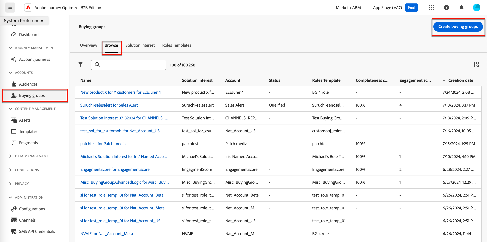
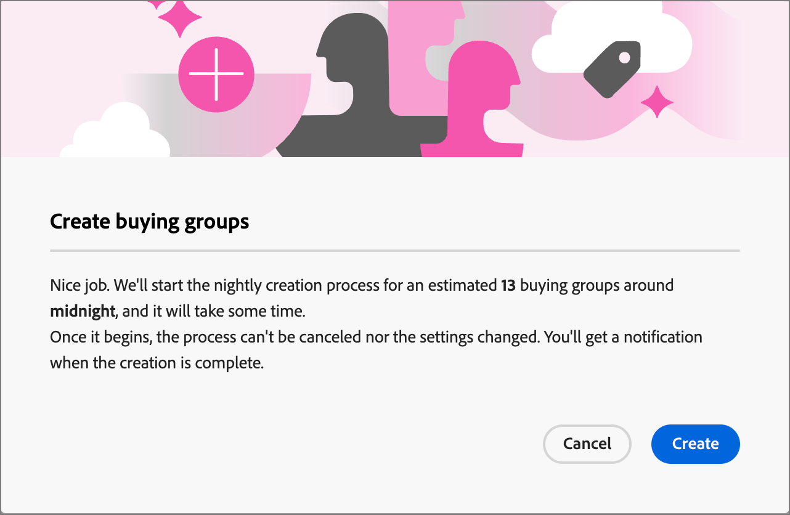

# Koopgroepen maken

Nadat de het kopen groep wordt gecreeerd, is het beschikbaar voor gebruik in een rekeningsreis door de [&#x200B; oplossingsrente &#x200B;](./solution-interests.md).

1. Klik in de linkernavigatie op **[!UICONTROL Buying groups]** .

1. Klik in de _[!UICONTROL Buying groups]_-pagina op **[!UICONTROL Create buying groups]**&#x200B;rechtsboven op de pagina.

   {width="700" zoomable="yes"}

1. Volg de aanwijzingen op elke pagina en klik op **[!UICONTROL Next]** om door te gaan.

{width="30"} [&#x200B; bekijk hoe te video &#x200B;](#how-to-video)

## Richtlijnen, pagina

De eerste pagina biedt richtlijnen over de voorwaarden/componenten die vereist zijn voor het maken van inkoopgroepen. Als u weet dat u de benodigde componenten hebt, klikt u op **[!UICONTROL Next]** .

## Onderdelen

1. Selecteer elke component die u wilt gebruiken:

   * **[!UICONTROL Solution interest]** - selecteer het oplossingsbelang van de lijst.

   * **[!UICONTROL Account audience]** - Klik op # en selecteer een accountpubliek in de lijst.

   Onder _[!UICONTROL Properties]_&#x200B;wordt de naam voor de inkoopgroepen automatisch gegenereerd (alleen-lezen) als &lt; Naam van belang voor oplossing > voor &lt; naam van account >.

   {width="700" zoomable="yes"}

1. Klik op **[!UICONTROL Create]** nadat u de interesse van de oplossing en het publiek van de account hebt geselecteerd.

## Bevestiging

Het bevestigingsvenster bevat een overzicht van het proces van de inkoopgroepen en een geschatte tijd voor voltooiing. Klik op **[!UICONTROL Create]** om het proces te bevestigen en te starten.

{width="400" zoomable="yes"}

## Groepvaartbanen kopen

De aanmaaktaak maakt automatisch inkoopgroepen voor elke nieuwe account in het accountpubliek. U kunt naar het tabblad _[!UICONTROL Solution interest]_&#x200B;navigeren, waarin het aantal gemaakte aanmaaktaken voor elke interesse van de oplossing wordt weergegeven. Klik op het nummer in de kolom **[!UICONTROL Buying group creation jobs]**&#x200B;om de lijst met aanmaaktaken weer te geven.

{width="700" zoomable="yes"}

<!-- Other buying group activities:

Member of buying group.
Assign a member of the buying group.
Remove a member of the buying group. -->

## Hoe kan ik-video

>[!VIDEO](https://video.tv.adobe.com/v/3451767/?learn=on&captions=dut)
