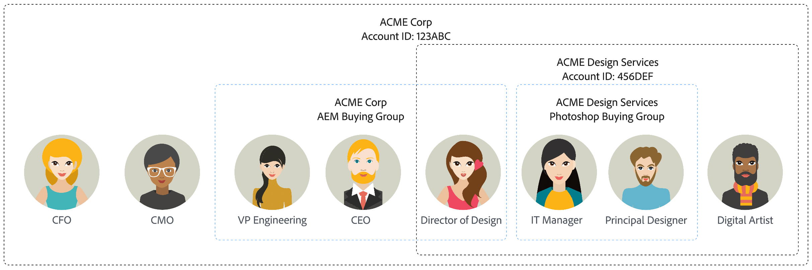

# Koopgroepen

Voor B2B-verkoop- en marketingactiviteiten zijn rekeningen van essentieel belang voor elke strategie. Elke account heeft een groep personen die erbij betrokken zijn, en deze personen kunnen werknemers van de account of contractanten zijn die met de account werken. Accounts zijn hiërarchisch en verschillende producten kunnen op verschillende niveaus in de hiërarchie worden verkocht. Adobe Experience Platform kan bijvoorbeeld op bedrijfsniveau worden verkocht aan een top-level account. En Adobe Photoshop kan worden verkocht aan een rekening die een afdeling of afdeling binnen een organisatie vertegenwoordigt, zoals een ontwerpafdeling binnen een grotere onderneming.

{width="800"}

Binnen de rekening, zou er een ondergroep van mensen kunnen zijn die uit de _het kopen groep_ bestaan. Deze mensen nemen uiteindelijk het aankoopbesluit, dus ze hebben speciale aandacht van de marketeer nodig en hebben mogelijk andere informatie nodig die ze ontvangen dan de andere personen die bij de rekening horen. Kopersgroepen kunnen een verschillende groep personen voor verschillende productlijnen of aanbiedingen omvatten. Een product voor cyberbeveiliging kan bijvoorbeeld gewoonlijk een Chief Information Officer of Chief Security Officer vereisen, en een vertegenwoordiger van de Juridische Dienst om een aankoop goed te keuren. Een insectenvolgend product zou typisch een VP van Techniek en een Directeur van IT als leden van de het kopen groep kunnen hebben.

{width="30"} [&#x200B; bekijk het videooverzicht &#x200B;](#overview-video)

## Belangrijkste componenten

U kunt de doeltreffendheid van de marketing verhogen door koopgroepen te vestigen die leden voor uw doelaccountlijsten voor de oplossingen identificeren die uw teams van de Verkoop verantwoordelijk voor het verkopen zijn. Voordat u en uw marketingteam beginnen met het maken van uw inkoopgroepen, moet u controleren of de belangrijkste componenten zijn gedefinieerd. Deze componenten zijn kritiek voor het ontmoeten van uw bedrijfsdoelstellingen en doelstellingen.

| Component | Doel |
| --------- | ------- |
| Oplossingsrente | Deze component geeft het antwoord op: <ul><li>Wat verkoopt u als marketingorganisatie?</li><li>Welk product of welke inzameling van producten richt u om te verkopen?</li></ul>  **_Voorbeeld:_** Het dwars-verkopen van nieuw Product X aan bestaande klanten |
| Accountpubliek | Deze component geeft het antwoord op: <ul><li>Aan wie verkoopt u?</li><li>Wat is de lijst van rekeningen die u richt?</li></ul> **_Example:_** het segment van de Rekening die door rekeningen met Product Y wordt bepaald die opbrengst over 1M hebben |
| Rolinesjablonen voor groepen kopen | Deze component geeft het antwoord op: <ul><li>Welke rollen richt u zich?</li><li>Welke reeks regels worden gebruikt om te bepalen wie aan het kopen van groepsrollen wordt toegewezen?</li></ul>  **_Voorbeeld:_** Wijs een persoon met de titel van Com aan de rol van de Maker van het Besluit toe |
| Groepsfasen voor kopen | (Optioneel) Deze component geeft het antwoord op: Hoe volgt de inkoopgroep op succes of falen? |

## Lidopdracht

Er zijn drie manieren waarop leden worden toegewezen aan of verwijderd uit een inkoopgroep. In de volgende lijst worden deze methoden voor toevoegen en verwijderen in de volgorde van prioriteit beschreven. De bovenste methode heeft de hoogste prioriteit en een lagere methode kan deze niet overschrijven.

1. **_Handmatige actie_** - een handboek voegt lid toe of verwijdert lidactie die door een verkoopgebruiker voor de het kopen groep wordt uitgevoerd
2. **_actie van de Reis_** - Reis [&#x200B; actieknooppunten voor het kopen van groepslidmaatschap &#x200B;](../journeys/action-nodes.md#add-a-people-based-action) (_wijs aan het Kopen groep_ toe of _verwijder uit het Kopen groep_)
3. **_de banen van het Systeem_** - het Kopen groep [&#x200B; creatie &#x200B;](../buying-groups/buying-groups-create.md#buying-group-creation-jobs) en onderhoudstaken.

Om te voorkomen dat een lidtoewijzing in een inkoopgroep onjuist wordt overschreven, heeft deze lijst de volgorde van prioriteit die in het systeem wordt gevolgd om ervoor te zorgen dat leden correct worden toegewezen. Wanneer een verkoopgebruiker bijvoorbeeld handmatig een lid aan de inkoopgroep toevoegt, wil hij niet dat een onderhoudstaak die toevoeging wijzigt. Gebruikend de belangrijkheidsorde, worden de volgende scenario&#39;s afgedwongen:

* Als een gebruiker manueel een lid aan een het kopen groep toewijst, en het door een het kopen baan van het groepsonderhoud wordt gevolgd die het zelfde lid uit de het kopen groep verwijdert, verwijdert de onderhoudstaak **niet** dat lid en kan niet de handtaak met voeten treden.
* Als een gebruiker manueel een lid aan een het kopen groep toewijst, en het door een teweeggebrachte reisknoop wordt gevolgd die het zelfde lid uit de het kopen groep verwijdert, verwijdert de knoopactie **niet** dat lid en kan niet de handtaak met voeten treden.
* Als een teweeggebrachte knoop van de reisactie een lid aan een het kopen groep toevoegt, en het door een het kopen baan van het groepsonderhoud wordt gevolgd die het zelfde lid uit de het kopen groep verwijdert, verwijdert de onderhoudstaak **niet** dat lid en kan niet de taak van de reisactie met voeten treden.

>[!NOTE]
>
>De geautomatiseerde het kopen banen van het groepsonderhoud lopen dagelijks, beginnend met de versie van 2025.10.

## Workflow voor groepen kopen

1. Maak koopgroepen.

   * Bepaal [&#x200B; oplossingsrente &#x200B;](./solution-interests.md) en [&#x200B; rolmalplaatje &#x200B;](./buying-groups-role-templates.md)
   * [&#x200B; creeer de het kopen groep &#x200B;](./buying-groups-create.md#create-buying-groups) en wijs [&#x200B; het kopen groepsstadia &#x200B;](./buying-group-stages.md) toe.

1. Ontbrekende personen volledig identificeren.

   Analyseer de inkoopgroep met gebruik van filters.

   **_Example:_** de rol van de Maker van het Besluit mist en de volledigheidsscore is &lt; 50

1. Vul de definities van inkoopgroepen in.
<!--
   * Acquire missing people
   * Send to LinkedIn Destination
   * Enrich with Zoominfo -->

1. Voeg groepsacties voor kopen toe aan uw accountreizen.

## Koopgroepen en componenten weergeven

Vouw **[!UICONTROL Accounts]** uit in de linkernavigatie en klik op **[!UICONTROL Buying groups]** .

De pagina _[!UICONTROL Buying groups]_&#x200B;is ingedeeld als tabbladen:

| Tab | Beschrijving |
| --- | ----------- |
| [!UICONTROL Overview] | Dit lusje is het gebrek en toont [&#x200B; het Kopen groepen dashboard &#x200B;](../dashboards/buying-groups-dashboard.md). |
| [!UICONTROL Browse] | Dit tabblad biedt ondersteuning voor de volgende activiteiten: <ul><li>De lijst met bestaande inkoopgroepen weergeven. </li><li>Zoeken op de naam van de inkoopgroep. </li><li>Filteren op interesse van oplossing. </li><li>Meld u aan bij het kopen van groepsgegevens. </li><li>Maak een inkoopgroep. </li></ul> |
| [!UICONTROL Solution interests] | Dit tabblad biedt ondersteuning voor de volgende activiteiten: <ul><li>De lijst met bestaande inkoopgroepen weergeven. </li><li>Zoeken op de naam van de inkoopgroep. </li><li>De toegang en geeft de eigenschappen van oplossingsbelang uit. </li><li>Creëer een oplossingsbelang. </li><li>Verwijder een belang voor de oplossing. </li><li>Groeptaken voor kopen weergeven en verwijderen. </li></ul> |
| [!UICONTROL Roles Templates] | Dit tabblad biedt ondersteuning voor de volgende activiteiten: <ul><li>Bekijk de lijst met bestaande rolmalplaatjes. </li><li>Zoeken op naam van rolsjabloon. </li><li>Toegang tot en geef de eigenschappen en voorwaarden van het rolmalplaatje uit. </li><li>Een rolsjabloon maken. </li><li>Een rolsjabloon verwijderen. </li></ul> |
| [!UICONTROL Stages] | Dit tabblad biedt ondersteuning voor de volgende activiteiten: <ul><li>Bekijk het bestaande model voor inkoopgroepen. </li><li>Open en bewerk het concept groepsfasemodel voor het kopen. </li><li>Maak het model voor de inkoopgroepfasen. </li></ul> |

## Zoeken en filteren van groepen

Gebruik het tabblad _[!UICONTROL Browse]_&#x200B;om de lijst met inkoopgroepen weer te geven. U kunt op naam zoeken en de lijst door oplossingsbelang filtreren.

{width="800" zoomable="yes"}

## Gegevens van groep kopen

Klik op de naam van de inkoopgroep op het tabblad _[!UICONTROL Browse]_&#x200B;als u details voor een inkoopgroep wilt weergeven. [Meer informatie](./buying-group-details.md)

{width="600" zoomable="yes"}

### Volledige score van inkoopgroep

De volledigheidsscore wordt gebruikt om te bepalen als de het kopen groep het juiste aantal leden heeft die aan de vereiste rollen worden toegewezen en klaar is om in een rekeningsreis te worden gebruikt. Deze score is een percentage gebaseerd op het aantal rollen binnen de het kopen groep en de volledigheid voor elk van de bepaalde rollen.

De eerste berekening voor de volledigheidsscore begint zodra u de koopgroep maakt en wordt elke keer dat een koopgroep wordt gemaakt of bijgewerkt, opnieuw berekend.

Zie [&#x200B; de scores van de Voltooiing &#x200B;](./completeness-scores.md) voor gedetailleerde informatie over volledigheid het scoren en berekeningen.

### Betrokkenheidsscore voor groep kopen {#engagement-score}

De betrokkenheidsscore is gebaseerd op de activiteiten van de inkoopgroepsleden, gewogen acties en gewogen rollen. De resulterende score wordt genormaliseerd binnen de huurder/instantie om verenigbare vergelijking toe te laten en voor actionable inzichten toe te staan.

De initiële berekening van de betrokkenheidsscore begint zodra u de inkoopgroep maakt en dagelijks opnieuw wordt berekend.

Zie [&#x200B; de scores van de Betrokkenheid &#x200B;](./engagement-scores.md) voor gedetailleerde informatie over de activiteiten en de berekeningen van de betrokkenheidsscore.

## Video over overzicht

>[!VIDEO](https://video.tv.adobe.com/v/3452939/?captions=dut&learn=on)
