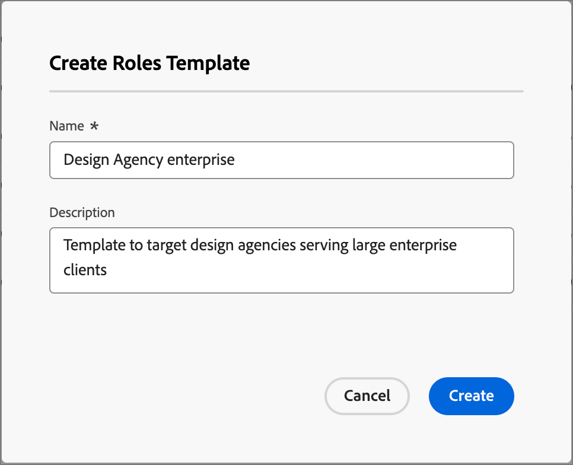
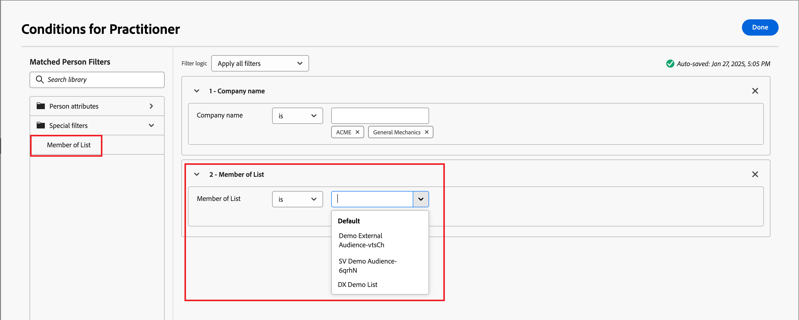
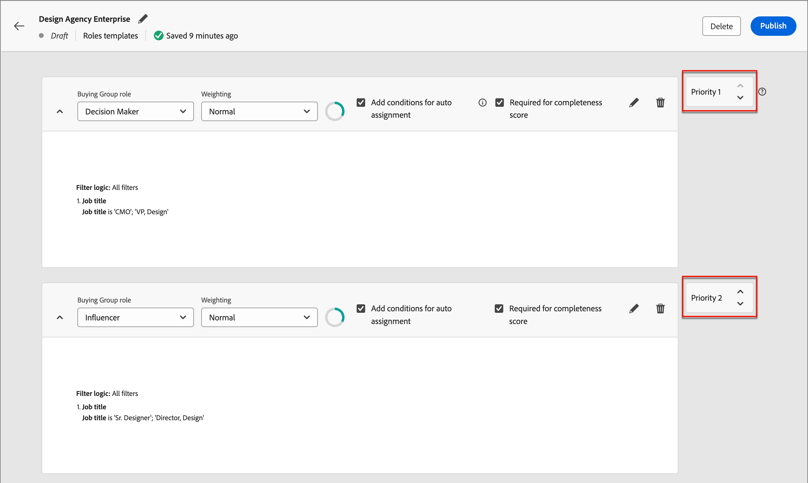

# Rolinesjablonen voor groepen kopen

Op een B2B-markt worden aankoopbeslissingen meestal door meerdere personen genomen. Deze personen nemen deel aan het besluitvormingsproces overeenkomstig hun rol binnen de organisatie. Creëer de rolmalplaatjes van de Groep van de Koophandel die deze roldefinities volgens elk product bevatten die type of rekeningsgebruik aanbieden geval.

{width="30"} [ bekijk de overzichtsvideo ](#overview-video)

## Rolsjablonen openen en doorbladeren

1. Klik in de linkernavigatie op **[!UICONTROL Buying groups]** .

1. Selecteer op de pagina _[!UICONTROL Buying groups]_&#x200B;de tab **[!UICONTROL Roles Templates]**.

   {width="700" zoomable="yes"}

   Het tabblad bevat een overzicht van alle bestaande rolsjablonen en geeft de volgende informatie weer in kolomindeling:

   * [!UICONTROL Name]
   * [!UICONTROL Status]
   * [!UICONTROL Creation date]
   * [!UICONTROL Created by]
   * [!UICONTROL Last update]
   * [!UICONTROL Last updated by]
   * [!UICONTROL Published on]
   * [!UICONTROL Published by]

   De lijst wordt standaard gesorteerd op _[!UICONTROL Last update]_. Alle rolmalplaatjes hebben een status van `Draft` of `Live`.

1. Als u de lijst op naam wilt filteren, gebruikt u het zoekveld boven aan de lijst.

   Voer de eerste paar tekens van de naam in om de weergegeven lijst te beperken tot de overeenkomende items.

   {width="700" zoomable="yes"}

## Een rolsjabloon maken

1. Klik in het tabblad _[!UICONTROL Roles Templates]_&#x200B;op **[!UICONTROL Create template]**&#x200B;in de rechterbovenhoek.

1. Voer in het dialoogvenster een unieke **[!UICONTROL Name]** (vereist) en **[!UICONTROL Description]** (optioneel) voor de sjabloon in.

   {width="400"}

1. Klik op **[!UICONTROL Create]**.

### Sjabloonrollen toevoegen

Nadat u het malplaatje creeert, opent het in de werkruimte en u wordt ertoe aangezet om de rollen te bepalen. De eerste rolkaart wordt standaard weergegeven.

Elke rol die u voor het malplaatje bepaalt gebruikt een reeks filters, of _voorwaarden_, om de leden te bepalen die aan de rol worden toegewezen. Gebruik de volgende filtertypen om de voorwaarden voor een rol te definiëren:

| Type | Voorwaarde |
| ---- | --------- |
| Persoonskenmerken | <li>E-mailadres <li>E-mail is ongeldig <li>E-mail is geschorst <li>Fax <li>Voornaam <li>Overgenomen deelstaatgebied <li>Functie <li>Achternaam <li>Tweede voornaam <li>Mobiel telefoonnummer <li>Telefoonnummer <li>Postcode <li>Staat <li>Niet geabonneerd <li>Reden waarop geen abonnement is genomen |
| Speciale filters | <li>Lid van de lijst <li>Lid van het programma |
| Intentgegevens | Categorie-intentie <li>Productintentie <li>De intentie van het sleutelwoord  [ leert over intentgegevens ](../admin/intent-data.md). |

1. Voor de eerste rolkaart, bepaal de roleigenschappen.

   * Kies de **[!UICONTROL Buying group role]** in de lijst.

     Voor de huidige release zijn er zes rollen: `Decision Maker`, `Influencer`, `Practitioner`, `Executive Steering Committee`, `Champion` en `Other` .

     {width="700" zoomable="yes"}

   * Stel de **[!UICONTROL Weighting]** in voor de rol, die wordt gebruikt om de betrokkenheidsscore te berekenen.

     De waarde voor elke optie wordt omgezet in een percentage voor de berekening van de score: [!UICONTROL Trivial] = 20, [!UICONTROL Minor] = 40, [!UICONTROL Normal] = 60, [!UICONTROL Important] = 80 en [!UICONTROL Vital] = 100.

     Bijvoorbeeld, wordt een rolmalplaatje met rollen gebruikend Vital, Belangrijk, en Normaal, dan omgezet als 100/240, 80/240, 60/240.

   * **[!UICONTROL Add conditions for auto-assignment]** - Schakel dit selectievakje in om voorwaarden toe te voegen waaraan automatisch leden worden toegewezen aan de kopende groep die aan de voorwaarde voldoet. Als het selectievakje niet is ingeschakeld, is het NIET nodig voorwaarden toe te voegen.

   * **[!UICONTROL Required for completeness score]** - Selecteer dit selectievakje voor de rol als u wilt dat dit een vereiste is voor het berekenen van een volledigheidsscore.

1. Klik op **[!UICONTROL Add Condition]** en definieer de voorwaardelijke regel voor de rol.

   * Vouw in het dialoogvenster _[!UICONTROL Condition]_&#x200B;de lijst met **[!UICONTROL Person attributes]**&#x200B;uit en zoek een kenmerk dat u wilt gebruiken om de rol aan te passen. Sleep het naar rechts en zet het neer in de filterruimte.

     {width="700" zoomable="yes"}

     >[!NOTE]
     >
     >Als u aangepaste persoonvelden hebt gedefinieerd in het accountpublieksschema in Experience Platform, zijn deze velden ook beschikbaar voor gebruik als persoonkenmerken in voorwaarden.

   * Gebruik het kenmerk om een overeenkomend filter te maken met een of meer waarden.

     In het volgende voorbeeld, wordt het attribuut van de Titel van de Baan gebruikt om een gelijke voor de Maker van het Besluit te identificeren. Elke waarde voor een titel die begint met `Director` of `Sr Director` wordt als true beschouwd voor de voorwaarde.

     {width="700" zoomable="yes"}

   * Voeg zo nodig een ander kenmerk en een andere voorwaarde toe die de criteria voor een overeenkomst met de rol verder verfijnen.

   * Klik op **[!UICONTROL Done]**.

1. Voor elke aanvullende rol die u voor de sjabloon wilt opnemen, klikt u op **[!UICONTROL Add another role]** en herhaalt u stap 1 en 2 om de rol te definiëren.

   {width="700" zoomable="yes"}

>[!BEGINSHADEBOX  &quot;Marketo Engage list membership&quot;]

In Marketo Engage, _Slimme Campagnes_ controlelidmaatschap van programma&#39;s om ervoor te zorgen dat de leads geen dubbele e-mail ontvangen en niet leden van veelvoudige stromen van e-mails tezelfdertijd zijn. In Journey Optimizer B2B kunt u controleren op lidmaatschap van een Marketo Engage-lijst als voorwaarde voor uw rolsjabloon om te voorkomen dat er dubbel werk wordt gedaan bij het kopen van groepslidmaatschap en reisactiviteiten.

Vouw **[!UICONTROL Special Filters]** uit en sleep de voorwaarde **[!UICONTROL Member of List]** naar de filterruimte als u een lijstlidmaatschap als rolvoorwaarde wilt gebruiken. Voer vervolgens de filterdefinitie in om het lidmaatschap in een of meer Marketo Engage-lijsten te evalueren.

{width="700" zoomable="yes"}

>[!ENDSHADEBOX]

Uw veranderingen worden auto-bewaard in de _status van het Ontwerp_. Als u niet bereid bent om het rolmalplaatje te publiceren, klik de linker (rug) pijl bij de bovenkant van de pagina en terugkeer aan de _[!UICONTROL Roles templates]_&#x200B;lijst.

### Rollensjabloon publiceren

Als de sjabloon gereed is voor gebruik, klikt u op **[!UICONTROL Publish]** rechtsboven.

Het publiceren van het malplaatje plaatst de status aan _Levende_ status en maakt het beschikbaar voor vereniging met een oplossingsrente. Er moet minstens één bepaalde rol zijn om het rolmalplaatje te publiceren.

## Een sjabloon voor conceptrollen bewerken

Wanneer een rolmalplaatje in de staat van het Ontwerp van het a __ is, kunt u de bepaalde rollen blijven uitgeven. Wijzigingen die u aanbrengt, worden automatisch opgeslagen.

Wijzig een van de instellingen in de koptekst van de rolkaart, inclusief de rol van de inkoopgroep, weging, automatische toewijzing en de vereiste voor het bijhouden van volledigheid.

{width="600"}

### De voorwaarden voor een rol wijzigen

Om de voorwaarde/het filtreren logica voor om het even welk van de rollen te veranderen, klik _uitgeven_ ( ) op hoogste recht van de rolkaart uit. Met deze actie opent u de werkruimte van _[!UICONTROL Conditions]_&#x200B;waar u een bestaand filter kunt wijzigen, een filter kunt toevoegen of verwijderen of de filterlogica kunt wijzigen.

### Een rolkaart verwijderen

Als u een rol uit het malplaatje wilt verwijderen, klik _Schrapping_ ( ) pictogram in de rolkaart.

### De prioriteit voor rollen instellen

U kunt de rollen binnen het malplaatje opnieuw in orde brengen, dat de prioriteit voor het toewijzen bepaalt leidt tot een rol. Rechts van elke rolkaart wordt een **[!UICONTROL Priority]** -controller weergegeven. Klik _Omhoog_ of _Omlaag_ pijl bij het recht om de rolkaart omhoog of neer in prioriteit te bewegen.

{width="700"}

## Een rolsjabloon verwijderen

U kunt een rolmalplaatje schrappen als het in de _status van het Ontwerp_ is.

1. Selecteer de rolmalplaatje van de lijst om het te openen.

1. Klik op **[!UICONTROL Delete]** rechtsboven.

   {width="700"}

1. Klik in het dialoogvenster op **[!UICONTROL Delete]** om te bevestigen.

## Video over overzicht

>[!VIDEO](https://video.tv.adobe.com/v/3453307/?learn=on&captions=dut)
