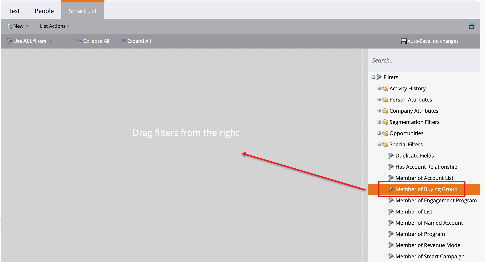

# Groepsfilters kopen in Marketo Engage

>[!IMPORTANT]
>
>**Veroudering van de Eigenschap**  
>
>Met de [ vereenvoudigde architectuur ](../simplified-architecture.md) voor Journey Optimizer B2B edition, zijn de het kopen groepsfilters niet meer beschikbaar in een verbonden instantie van Marketo Engage.  
>
>Als alternatief, kunt u een statische lijst voor elke oplossingsrente tot stand brengen en dan [ gebruiken _toevoegt aan de lijst van Marketo_ actie ](../journeys/action-nodes.md#marketo-engage-actions) van een vervoerknoop. Met deze handeling voegt u kopende groepsleden toe aan een bepaalde statische lijst in een verbonden Marketo Engage-instantie. Dan, gebruik de oplossing op rente-geconcentreerde statische lijst voor een slim lijstfilter.

Als marketeer wilt u misschien de campagnes in Marketo Engage onderdrukken voor mensen die deel uitmaken van het kopen van groepen in Journey Optimizer B2B edition. U kunt ook de workflows voor scoren van leads in Marketo Engage informeren aan de hand van informatie over de leads die aan inkoopgroepen zijn gekoppeld. Bijvoorbeeld:

* Maakt dit deel uit van een koopgroep?
* Is de koopgroep volledig en betrokken?

Als deze voorwaarden waar zijn, kunt u verkiezen om de lood te scoren hoger. Als dat niet het geval is, kunt u ervoor kiezen deze niet te markeren als een voor de markt gekwalificeerde lead (MQL).

In uw Marketo Engage-instantie die is verbonden met Journey Optimizer B2B edition, kunt u het filter _[!UICONTROL Member of Buying Group]_in uw slimme lijsten gebruiken om deze leads te identificeren op basis van uw campagnestrategie.

1. Nadat u [ een Slimme Lijst in Marketo Engage ](https://experienceleague.adobe.com/en/docs/marketo/using/product-docs/core-marketo-concepts/smart-lists-and-static-lists/creating-a-smart-list/create-a-smart-list){target="_blank"} creeert, selecteer het **[!UICONTROL Smart List]** lusje om de filterredacteur te openen.

1. Blader in de lijst met filters aan de rechterkant omlaag en vouw de map **[!UICONTROL Special Filters]** uit.

1. Klik op het filter **[!UICONTROL Member of Buying Group]** en sleep het naar het filterdefinitiegebied.

   {width="700" zoomable="yes"} toe

1. Stel de optie _[!UICONTROL Member of Buying Group]_in op **[!UICONTROL true]**of **[!UICONTROL false]**.

   Deze beperking is vereist voor de definitie.

1. (Optioneel) Voeg aan het filter andere inkoopgroepsgerelateerde beperkingen toe op basis van de manier waarop u leads voor de slimme lijst wilt identificeren.

   * Klik op **[!UICONTROL Add Constraint]** rechtsboven op de filterkaart.

     {width="700" zoomable="yes"}

   * Selecteer de beperking die u, zoals _Score van de Voltooiing_ of _Interesse van de Oplossing_ wilt toevoegen.

   * Plaats de evaluatie die u voor een gelijke wilt gebruiken.

     Voor een score kunt u een exacte overeenkomst gebruiken of een bereik dat boven of onder het getal ligt dat u invoert.

     Als u leden wilt uitsluiten die zijn verwijderd uit een inkoopgroep, gebruikt u de beperking _[!UICONTROL Is Removed]_ingesteld op `false` . U kunt ook expliciet verwijderde leden opnemen in de slimme lijst door deze beperking in te stellen op `true` .

     Voor een afzonderlijk item, zoals de belangen van de oplossing die in Journey Optimizer B2B edition zijn gedefinieerd, kunt u een of meer items voor de lijst selecteren.

     {width="600" zoomable="yes"}

     Selecteer de eerste en klik nogmaals op de kiezer om het dialoogvenster _[!UICONTROL Multiple Value Chooser]_te openen.

     {width="500" zoomable="yes"}

     Plaats de resterende items naar rechts en klik op **[!UICONTROL OK]** wanneer u de lijst met items hebt die u voor de beperking wilt gebruiken.

   * Herhaal deze handelingen om zoveel beperkingen toe te voegen als u nodig hebt.

   {width="600" zoomable="yes"}
