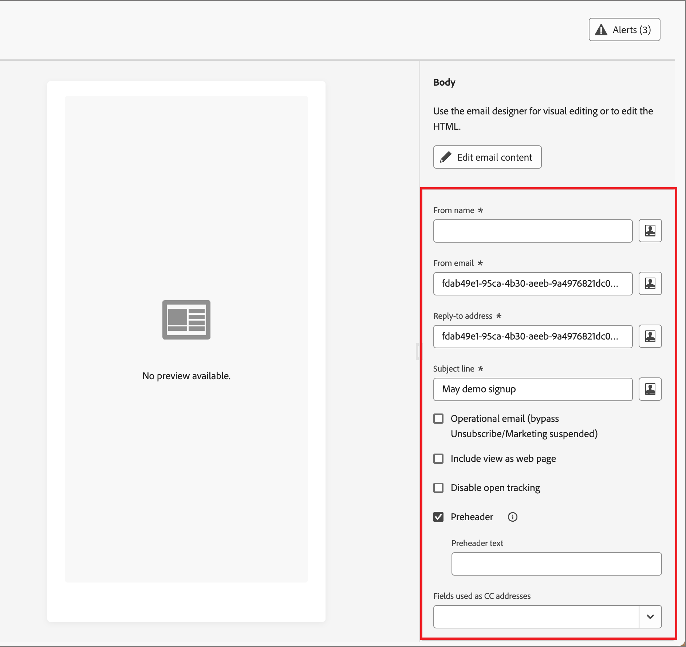

# Voeg een e-mail aan uw reis toe

Gebruik Adobe Journey Optimizer B2B edition om e-mailberichten naar uw klanten te verzenden via een accountreis. U kunt ervoor kiezen om berichten te maken, aan te passen en voor te vertonen in de ontwerpruimte voor e-mail. U kunt er ook voor kiezen een e-mail te verzenden die al is gedefinieerd in het gekoppelde Marketo Engage-exemplaar.

>[!NOTE]
>
>Als u een e-mail voor het eerst verzendt, zorg ervoor dat het e-mailkanaal van binnen Adobe Marketo Engage wordt gevormd. Meer leren, zie [ Protocollen voor het volgen en e-maillevering ](../start/email-protocols.md).

## Een e-mailactieknooppunt toevoegen tijdens een rit

U kunt opstelling e-mailleveringen in een reis plaatsen wanneer u [ a _[!UICONTROL Take an action]_knoop ](../journeys/action-nodes.md) toevoegt en het volgende doet:

1. Kies _[!UICONTROL Action on]_voor het doel **[!UICONTROL People]**.

1. Kies _[!UICONTROL Action on people]_bij **[!UICONTROL Send email]**.

1. Kies in het tekstvak _[!UICONTROL Email source]_hoe u de e-mail die u wilt verzenden, wilt verzenden.

   {width="700" zoomable="yes"}

   * Kies **[!UICONTROL Create new email]** om het e-mailbericht zelf te maken in Journey Optimizer B2B edition.

     Met deze optie kunt u de e-mailinhoud zelf beheren in Journey Optimizer B2B edition. Klik **[!UICONTROL Create email]** om _te openen creeer nieuwe e-mail_ dialoog. U kunt een nieuw e-mailinhoudselement maken of een bestaand e-mailinhoudselement dupliceren.

     +++Nieuwe e-mail

     Gebruik de optie _[!UICONTROL New email]_als u een e-mailbericht wilt maken met een leeg canvas of een e-mailsjabloon.

      1. Kies **[!UICONTROL New email]** in het dialoogvenster.

      1. Voer een unieke **[!UICONTROL Name]** in voor de e-mail en een **[!UICONTROL Subject line]** .

         {width="400"}

      1. Klik op **[!UICONTROL Create]**.

         In de sectie _[!UICONTROL Email properties]_van de pagina met e-mailinhoud zijn de velden_[!UICONTROL From email]_ en _[!UICONTROL Reply to address]_al geconfigureerd. U kunt waarden invoeren voor de velden_[!UICONTROL From name]_ en _[!UICONTROL Description]_(optioneel).

      1. Klik **[!UICONTROL Edit email]** om de e-mail [ montages ](#define-the-email-settings) te bepalen en de [ inhoud ](./email-authoring.md) te ontwerpen.

     +++

     +++Bestaande e-mail dupliceren

     Als u een e-mail wilt maken met een bestaande e-mail van de huidige reis of van een andere reis, gebruikt u de optie _[!UICONTROL Duplicate existing email]_. U kunt wijzigingen aanbrengen in het gedupliceerde e-mailadres, afhankelijk van uw doel voor het knooppunt van de rit.

      1. Kies _[!UICONTROL Create new email]_in het dialoogvenster **[!UICONTROL Duplicate existing email]**.

      1. Voor **[!UICONTROL Existing email to duplicate]**, klik het _pictogram van de Selectie_ ( ) en selecteer e-mail die u voor de reisknoop wilt dupliceren en gebruiken.

         U kunt de lijst met e-mailberichten filteren door een tekstreeks in te voeren in het zoekveld, zodat deze overeenkomt met de e-mailnaam.

         {width="600" zoomable="yes"}

         Schakel het selectievakje in voor de e-mail die u wilt dupliceren en klik op **[!UICONTROL Select]** .

      1. Voer een unieke **[!UICONTROL Name]** in voor de e-mail en een **[!UICONTROL Subject line]** .

         {width="400"}

      1. Klik op **[!UICONTROL Create]**.

         In de sectie _[!UICONTROL Email properties]_van de pagina met e-mailinhoud zijn de velden_[!UICONTROL From email]_ en _[!UICONTROL Reply to address]_al geconfigureerd. U kunt waarden invoeren voor de velden_[!UICONTROL From name]_ en _[!UICONTROL Description]_(optioneel).

      1. Indien nodig, klik **[!UICONTROL Edit email]** om e-mail [ montages ](#define-the-email-settings) en [ inhoud ](./email-authoring.md) te wijzigen.

     +++

   * Kies **[!UICONTROL Select email from Adobe Marketo Engage]** om een van de vooraf geschreven e-mails in Marketo Engage te gebruiken en te verzenden als onderdeel van de reis.

     Als u meer dan één werkruimte beschikbaar in de aangesloten instantie van de Ingenieur van de Markt hebt, selecteer de werkruimte. Selecteer vervolgens de goedgekeurde e-mail die u wilt verzenden voor het knooppunt van de rit.

     {width="500" zoomable="yes"}

     Met deze optie wordt het knooppunt ingesteld en hoeft de e-mailinhoud tijdens de rit niet verder te worden gedefinieerd.

## De e-mailinstellingen definiëren

Met het **[!UICONTROL Details]** lusje dat in het _Summiere_ paneel op het recht wordt geselecteerd, rol aan de bodem om de e-mailmontages te bekijken en te bepalen.

{width="700" zoomable="yes"}

| Optie | Beschrijving |
| ------ | ----------- |
| [!UICONTROL From name] | De naam van de afzender die in de e-mailkoptekst wordt gebruikt. Ga de naam van de afzender in aangezien u het aan de ontvanger wilt verschijnen. Klik _personaliseren_ pictogram ( ) om een verpersoonlijkingstoken op het gebied te gebruiken. |
| [!UICONTROL From email] | Het adres van de afzender dat in de e-mailkopbal wordt gebruikt. De standaardwaarde wordt bevolkt van de [ montages van de e-mailkanaallevering ](../admin/configure-channels-emails.md#delivery-settings). Klik _personaliseren_ pictogram ( ) om een verpersoonlijkingstoken op het gebied te gebruiken. |
| [!UICONTROL Reply-to address] | Het adres van de afzender dat in de e-mailkopbal wordt gebruikt. De standaardwaarde wordt bevolkt van de [ montages van de e-mailkanaallevering ](../admin/configure-channels-emails.md#delivery-settings) ([!UICONTROL From Label]). Voer het e-mailadres in dat u wilt invullen als de ontvanger de antwoordfunctie gebruikt (deze kan anders zijn of hetzelfde zijn als het afzenderadres). Klik _personaliseren_ pictogram ( ) om een verpersoonlijkingstoken op het gebied te gebruiken. |
| [!UICONTROL Subject line] | De tekst die in het onderwerpveld voor de e-mail wordt weergegeven. De standaardwaarde wordt gevuld met de tekst die u hebt ingevoerd in het dialoogvenster _[!UICONTROL Create new email]_. U kunt de tekst desgewenst wijzigen. Klik_ personaliseren _pictogram ( ) om een verpersoonlijkingstoken op het gebied te gebruiken.<!-- Click the AI Assistant button ( {width="30" zoomable="no"} ) to generate the subject line based on the current email content.--> |
| [!UICONTROL Branding domain] | Als u meer dan één [ brandend domein ](../admin/configure-channels-emails.md#branding-domains) hebt dat in het systeem wordt bepaald, selecteer het brandende domein voor het verzenden van e-mail te gebruiken. Gebruik een specifiek brandingdomein om e-mails te verzenden die van uw merk lijken te komen in plaats van het bedrijf als geheel. Het bouwt vertrouwen met het merk, past de e-mailervaring aan, en verhoogt open en reactiesnelheden. |
| [!UICONTROL Dedicated IP] | Als u meer dan één specifiek bepaald IP adres hebt, selecteer een specifiek IP adres voor het verzenden van e-mail te gebruiken. Wanneer u specifieke specifieke specifieke IP voor uw programma&#39;s gebruikt, kunt u prestaties volgen en volgen en aan om het even welke veranderingen in uw leveringsmetriek snel antwoorden. Voor meer informatie over het toevoegen van specifieke IP voor de verbonden instantie van Marketo Engage, verwijs naar de [ documentatie van Marketo Engage ](https://experienceleague.adobe.com/en/docs/marketo/using/product-docs/email-marketing/deliverability/use-your-dedicated-ip-addresses-to-send-emails){target="_blank"}. |
| [!UICONTROL Operational email] | Schakel het selectievakje in als u de e-mail als operationeel wilt aanmerken. Operationele e-mails zijn uitgesloten van de lijst met niet-geabonneerde of niet-geabonneerde e-mails en van de communicatielimieten. Selecteer deze optie alleen als de ontvanger het e-mailbericht niet als een ongevraagd commercieel bericht (SPAM) kan beschouwen. |
| [!UICONTROL Include view as web page] | Schakel het selectievakje in om een koppeling op te nemen naar een webpagina die wordt gegenereerd op basis van de inhoud van het e-mailbericht. E-mailberichten hebben meer mogelijkheden dan webpagina&#39;s, zodat het handig is voor JavaScript, uitgebreide CSS en formulieren. De tekst die wordt gebruikt om de verbinding te produceren wordt gevormd in de [ montages van de e-mailkanaallevering ](../admin/configure-channels-emails.md#delivery-settings) ([!UICONTROL View as web page HTML] en [!UICONTROL View as web page text]). |
| [!UICONTROL Disable open tracking] | Schakel het selectievakje in als u de activiteiten voor het openen van e-mail niet wilt bijhouden. Als de functie is uitgeschakeld, worden het aantal geopende e-mailactiviteiten alleen verhoogd wanneer een unieke persoon het e-mailbericht opent. U kunt [ e-mailinhoudkoppeling het volgen ](./email-authoring.md#content-authoring---link-tracking) beheren wanneer u de inhoud van het e-maillichaam ontwerpt. |
| [!UICONTROL Preheader] | Schakel het selectievakje in om een voorheader op te nemen. Een preheader is de korte samenvattingstekst die na de onderwerpregel in sommige e-mailclients wordt weergegeven. Het verstrekt gewoonlijk een korte samenvatting van e-mail, en is typisch één enkele zin. Ga de summiere tekst op het gebied <!-- , or click the AI Assistant button ( {width="30" zoomable="no"} ) to generate summary text based on the current email content --> in. |
| [!UICONTROL Fields used as CC addresses] | Selecteer, indien beschikbaar, maximaal 25 velden voor leads of bedrijven die in Marketo Engage zijn ingesteld met het type `Email` . |

## Waarschuwingen controleren

Terwijl u de inhoud van uw e-mailbericht ontwerpt, worden waarschuwingen weergegeven in de interface (rechtsboven op de pagina) wanneer er geen sleutelinstellingen aanwezig zijn. Als deze knop niet wordt weergegeven, zijn er geen problemen gedetecteerd.

{width="600" zoomable="yes"}

Er kunnen twee soorten waarschuwingen worden gedetecteerd:

* **_Waarschuwingen_** die naar aanbevelingen en beste praktijken, zoals verwijzen:

   * `The opt-out link is not present in the email body`: Het is aan te raden een koppeling zonder abonnement aan uw e-mailadres toe te voegen.

     >[!NOTE]
     >
     >E-mailberichten in marketingstijl moeten een opt-out-koppeling bevatten, die niet vereist is voor transactieberichten.

   * `Text version of HTML is empty`: vergeet niet een tekstversie van uw e-mailhoofdtekst te definiëren die wordt gebruikt wanneer HTML-inhoud niet kan worden weergegeven.

   * `Empty link is present in email body`: controleer of alle koppelingen in uw e-mail correct zijn.

   * `Email size has exceeded the limit of 100KB`: Voor optimale levering moet u ervoor zorgen dat de e-mailgrootte niet groter is dan 100 kB.

* **_Fouten_** die u verhinderen de reis/de campagne te testen of te activeren zolang zij niet, zoals worden opgelost:

   * `From name is empty`: Het e-mailgebied _van_ (vereist) wordt niet bepaald.

   * `The subject line is missing`: De onderwerpregel van de e-mail (vereist) is niet gedefinieerd.

   * `The email version of the message is empty`: De e-mailinhoud is niet gedefinieerd.
