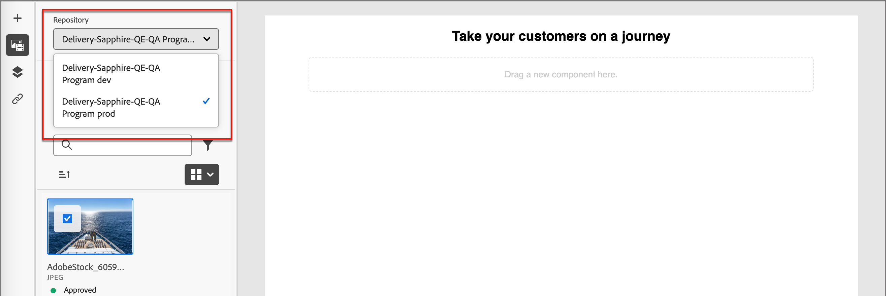
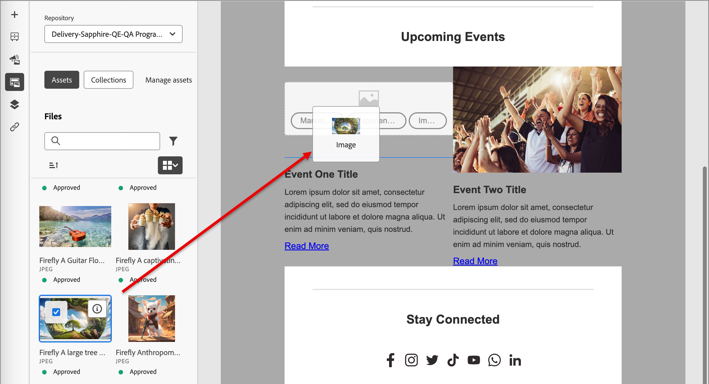

# Werken met Experience Manager-middelen

Wanneer Adobe Experience Manager Assets as a Cloud Service is geïntegreerd met Adobe Journey Optimizer B2B edition, kunt u eenvoudig digitale middelen detecteren en openen voor gebruik in uw marketinginhoud. Aangezien u uw inhoud ontwerpt, zijn de activa toegankelijk van het _Experience Manager Assets_ punt op de linkernavigatie, en wanneer het ontwerpen van e-mailinhoud voor een rekeningsreis.

{{aem-assets-licensing-note}}

Wanneer u deze digitale middelen gebruikt, geven de meest recente wijzigingen in Assets as a Cloud Service automatisch door aan live e-mailcampagnes via gekoppelde verwijzingen. Als afbeeldingen worden verwijderd in Adobe Experience Manager Assets as a Cloud Service, worden de afbeeldingen weergegeven met een verbroken verwijzing in de e-mails. Wanneer de activa die momenteel binnen rekeningreizen worden gebruikt worden gewijzigd of geschrapt, worden de reisauteurs op de hoogte gebracht van de beeldveranderingen en de lijst van reizen die het beeld gebruiken. Alle wijzigingen in de activa moeten plaatsvinden in de centrale gegevensbank van Adobe Experience Manager Assets.

Wanneer uw milieu één of meerdere [ Assets bewaart verbindingen ](../admin/configure-aem-repositories.md) heeft, kunnen de inhoudsauteurs AEM Assets als bron voor activa gebruiken wanneer het creëren van een e-mail, e-mailmalplaatje, of visueel fragment.

>[!IMPORTANT]
>
>Een beheerder moet gebruikers die toegang tot Assets nodig hebben, toevoegen aan de profielen Assets Consumer Users of/and Assets Users Product. [Meer informatie](https://experienceleague.adobe.com/nl/docs/experience-manager-cloud-service/content/security/ims-support#managing-products-and-user-access-in-admin-console){target="_blank"}

## AEM Assets-afbeeldingen openen

In de visuele inhoudsredacteur, klik het _Experience Manager Assets_ ( ) pictogram in linkerzijbalk. Hiermee wijzigt u het deelvenster Gereedschappen in een lijst met beschikbare middelen in de geselecteerde opslagplaats.

{width="700" zoomable="yes"} toegang te hebben

>[!NOTE]
>
>Momenteel worden alleen afbeeldingselementen van Adobe Experience Manager Assets ondersteund in Adobe Journey Optimizer B2B edition. Wijzigingen in de activa moeten worden aangebracht vanuit de centrale gegevensbank van Adobe Experience Manager Assets. [Meer informatie](https://experienceleague.adobe.com/nl/docs/experience-manager-cloud-service/content/assets/manage/manage-digital-assets){target="_blank"}

### De weergegeven opslagplaats wijzigen

Als u meer dan één aangesloten AEM-opslagplaats hebt, klikt u op de menupijl voor **[!UICONTROL Repository]** om de opslagplaats te kiezen die u in het linkerpaneel wilt weergeven.

{width="700" zoomable="yes"} toegang te hebben

Er zijn meerdere methoden om een afbeeldingselement toe te voegen aan het visuele canvas.

### Een afbeelding slepen en neerzetten

1. Blader door de miniaturen van de afbeelding die in het linkerdeelvenster worden weergegeven.

1. Sleep de miniatuur van de afbeelding en zet deze neer op het canvas waar u de nieuwe afbeeldingscomponent wilt toevoegen.

   {width="700" zoomable="yes"}

## Een afbeelding zoeken en selecteren

1. Voeg een afbeeldingscomponent toe aan het canvas en klik op **[!UICONTROL Experience Manager Assets]** om het dialoogvenster _[!UICONTROL Select Assets]_&#x200B;te openen.

   {width="600" zoomable="yes"}

1. Kies in het dialoogvenster een afbeelding met de beschikbare gereedschappen om te zoeken naar het element dat u nodig hebt:

   * Wijzig de **[!UICONTROL Repository]** rechtsboven.

   * Klik op **[!UICONTROL Manage assets]** rechtsboven om de Assets-opslagplaats te openen in een ander browsertabblad en AEM Assets-beheergereedschappen te gebruiken.

   * Klik het _type van Mening_ selecteur bij het hoogste recht om de vertoning in **[!UICONTROL List View]**, **[!UICONTROL Grid View]**, **[!UICONTROL Gallery View]**, of **[!UICONTROL Waterfall View]** te veranderen.

   * Klik het _pictogram van de Sorteervolgorde_ om de sorteervolgorde tussen het stijgen en het dalen te veranderen.

     {width="700" zoomable="yes"} te vinden en te selecteren

   * Klik op de menupijl **[!UICONTROL Sort by]** om de sorteercriteria te wijzigen in **[!UICONTROL Name]** , **[!UICONTROL Size]** of **[!UICONTROL Modified]** .

   * Klik het _pictogram van de Filter_ op de bovenkant verlaten om de getoonde punten volgens uw criteria te filtreren.

   * Typ tekst in het veld Zoeken om de weergegeven items te filteren op een overeenkomst met de elementnaam.

   {width="700" zoomable="yes"} de plaats te bepalen

1. Klik op **[!UICONTROL Select]**.
<!-- 

## Upload assets

To import files to Assets as a Cloud Service, you first need to browse or create the folder to be used for storage. You can then import an asset and add it to your email content. After assets are uploaded, you can [use the image assets as you author content](./assets-overview.md#add-assets-to-your-content).

1. While authoring your content in the email designer, drag an image element into the canvas. 

   The properties on the right reflect the image element selection. 

1. Click **[!UICONTROL Import media]** to open the _[!UICONTROL Upload image]_ dialog.

1. If your file system is open to your image file, drag and drop the file on the box in the dialog.

   {width="700" zoomable="yes"}

   You can also click the **[!UICONTROL Select a file from your computer]** link and use your file system to locate and select the image file. Click Open and the image file is displayed in the box.

1. Click **[!UICONTROL Import]**.
-->
