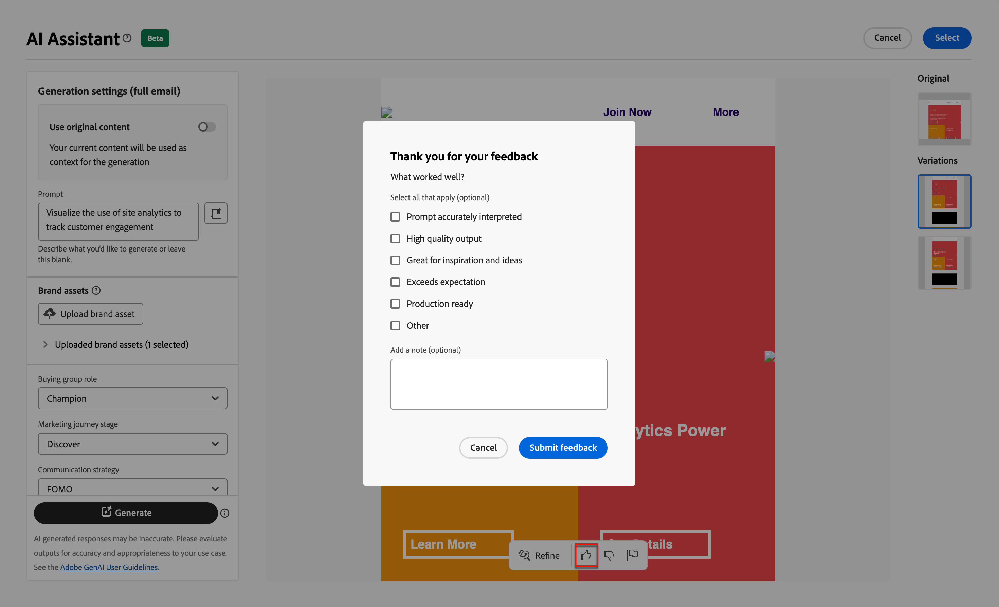
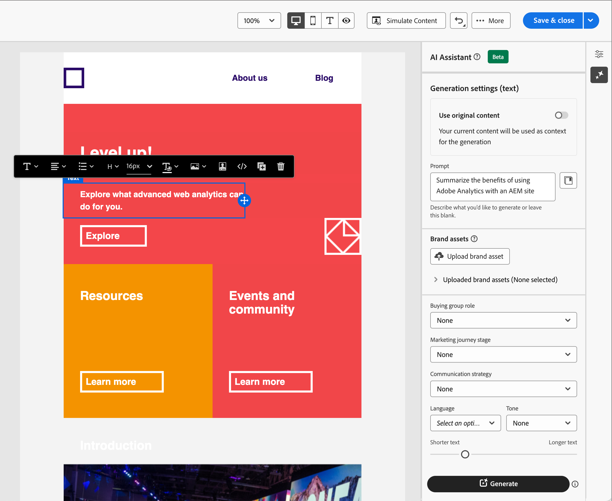

# AI Assistant voor het schrijven van e-mail

Naarmate de marketingindustrie concurrerender wordt, zoeken merken efficiënte manieren om snel en efficiënt onbruikbare inhoud te genereren. AI Assistant voor het schrijven van e-mails in Adobe Journey Optimizer B2B Edition is de door AI aangedreven mogelijkheid van de Adobe om inhoud te genereren die revolutionair is voor de manier waarop marketeers professionele en merkconsistente e-mailinhoud maken. Met geavanceerde GenAI-modellen en een goed begrip van de richtlijnen voor merken genereert AI Assistant automatisch persoonlijke, aantrekkelijke en effectieve inhoud die is gebaseerd op het marketingdoel, met inhoud die is geoptimaliseerd voor stijlen, lay-outs, kleurtinten en meer met een merk. AI Assistant maakt het maken en uitvoeren van e-mailmarketingcampagnes intuïtief, eenvoudig en probleemloos. Door deze mogelijkheid toe te voegen aan uw workflows kunt u tijd besparen, de efficiëntie verbeteren en betere resultaten behalen.

Deze nieuwe functie biedt een snelle tekstgeneratie, volledige e-mailgeneratie en het genereren van inhoud binnen e-mailstructuren. Afbeeldingen worden niet gegenereerd, maar worden aanbevolen vanuit de catalogus van afbeeldingen in het invoermerkelement naar het model. U kunt deze mogelijkheid ook gebruiken om optimale onderwerpregel en voorkoppen te genereren die van invloed zijn op de open snelheid.

>[!NOTE]
>
>Deze functie is beschikbaar in de Beta-versie en kan zonder voorafgaande kennisgeving worden gewijzigd.

## Richtlijnen en beperkingen

Lees de volgende richtlijnen voordat u aan de slag gaat met AI Assistant in Adobe Journey Optimizer B2B Edition voor het genereren van e-mailinhoud:

* Het marketingdoel of de marketingprompt die u definieert, is een belangrijke bepalende factor voor de kwaliteit van de gegenereerde inhoud. Gebruik een duidelijk gedefinieerde prompt voor een juiste interpretatie van het GenAI-model.
* Upload merkelementen zodat ze accuraat zijn, op inhoud van het merk. Zonder deze activa, is de inhoud gebaseerd op openbaar beschikbare informatie.
   * De geüploade elementen kunnen de volgende indelingen hebben: PDF-, JPEG-, PNG- of ZIP-bestanden (met ondersteunde bestandsindelingen).
   * De maximale grootte voor een geüpload merk is 50 MB. Grotere bestanden of grote hoeveelheden afbeeldingen kunnen werken, maar de verwerkingstijd neemt toe.
* Gebruik voor Adobe Journey Optimizer B2B Edition geschreven e-mailsjablonen, bij voorkeur de ingebouwde sjabloon of voorbeeldsjablonen, een merkspecifieke sjabloon of een aangepaste sjabloon om uw e-mailinhoud te maken. E-mailsjablonen met maximaal acht tot tien afbeeldingen worden aanbevolen.
* Zorg ervoor om het even welke problematische output te melden gebruikend duim neer of vlagpictogrammen tegen een geproduceerde variant.
* Uw gebruik van AI Medewerker is onderworpen aan de [ Generatieve AI Richtlijnen van de Gebruiker van de Adobe ](https://www.adobe.com/legal/licenses-terms/adobe-gen-ai-user-guidelines.html).

De volgende beperkingen gelden voor AI Assistant in Adobe Journey Optimizer B2B Edition voor het genereren van e-mailinhoud:

* Engels is de enige ondersteunde taal.
* Deze optie is alleen beschikbaar voor het e-mailkanaal.
* GenAI-inhoud is mogelijk niet correct. Deel uw feedback zodat Adobe engineers de modellen kunnen verfijnen.
* U kunt meerdere merkmiddelen uploaden, maar u kunt slechts één voor een specifieke generatie gebruiken.

>[!BEGINSHADEBOX]

## Promptbibliotheek

Een effectieve prompt is essentieel voor het genereren van de best mogelijke inhoud. Als u hulp bij het ontwerpen van uw herinnering nodig hebt, heb toegang tot de _Snelle Bibliotheek_. Deze bibliotheek biedt diverse snelle ideeën om het genereren van inhoud te verbeteren.

{width="500" zoomable="no"}

Selecteer de vraag die uw voorgenomen doelstellingen het best weerspiegelt en voeg de noodzakelijke waarden toe die uw merk, het aanbieden, campagne, en gebruiksgevallen specificeren.

>[!ENDSHADEBOX]

## Groeprollen kopen

Adobe Journey Optimizer B2B Edition biedt vijf standaard B2B-aankoopgroeprollen buiten de box. Elke het kopen groepsrol heeft een duidelijke overseinennadruk:

| Functie | Berichtenfocus |
| ---- | --------------- |
| Uitvoerend stuurcomité | De informatie van het product   Prijsende   Technische integratiedetails   de eigenschappen en de functies van het Product |
| Influencer | Bewijs van kwaliteit   Versnelling van implementatie   de materie deskundigheid van het Onderwerp   Concurrerende voordelen |
| Besluitvormer | Rendement op investering   Financiële waarde (RoI)   de verhalen van de Klant |
| Praktijkster | Versnelling van gebruiksgemak {de eigenschappen van het 0} Product en functionaliteit   de verenigbaarheid van het Product   Versnelling van productintegratie  |
| Champion | Onderwijsmateriaal   Gedachte leiderschapsinhoud   de verhalen van de Klant |

Het kiezen van één van deze het kopen groepsrollen past automatisch de output aan die op de kenmerken en de onderwerpen van belang voor elk van deze rollen wordt gebaseerd.

## E-maileigenschappen genereren met AI Assistant

Wanneer u [ een e-mailactie ](./email-authoring.md#add-an-email-action-in-an-account-journey) aan een rekeningsreis toevoegt, bepaalt u een reeks e-maileigenschappen die voor het verzenden van e-mail worden gebruikt. De Medewerker van AI kan helpen betere e-mailovereenkomst bereiken door geadviseerde inhoud voor de e-mail **onderwerpregel** en **preheader** te produceren.

1. Maak een e-mail van een accountreis of open een bestaande e-mail van een transportknooppunt.

   De voorvertoningspagina voor e-mail wordt weergegeven met de _[!UICONTROL Email properties]_&#x200B;aan de rechterkant.

1. Selecteer een van de volgende tabbladen voor informatie over het gebruik van AI Assistant in het ontwerpen van e-maileigenschappen.

>[!BEGINTABS]

>[!TAB  Onderwerpleiding ]

De volgende stappen beschrijven de taakopeenvolging voor het gebruiken van AI Medewerker om een geoptimaliseerde onderwerpregel voor uw e-mail te produceren:

1. In _[!UICONTROL Email Properties]_, klik het AI Hulppictogram ( {width="30" zoomable="no"}) rechts van het **[!UICONTROL Subject line]**&#x200B;gebied.

   {width="600" zoomable="yes"}

   Het pop-upvenster AI Assistant wordt geopend met de instellingen voor het genereren van de onderwerpregel van de e-mail.

   Afhankelijk van de e-mailinhoud die aan de e-mail is gekoppeld of de manier waarop u de onderwerpregel wilt gebruiken voor uw doel, zijn er een aantal opties voor het genereren van tekst voor de onderwerpregel:

   * U kunt direct op **[!UICONTROL Generate]** klikken zonder een vraag of merk om de bestaande e-mailtekst te gebruiken als context voor het genereren van onderwerpregel.

   * (Aanbevolen) U kunt een vraag, merkmiddel, en andere plaatsende waarden verstrekken om context te verstrekken voor het produceren van de meest optimale onderwerpregel tekst voor uw behoeften. (Stap 2 tot en met 7)

1. Voer in het veld **[!UICONTROL Prompt]** een beschrijving in van wat u wilt genereren.

   Gebruik de [ Snelle Bibliotheek ](#prompt-library) als u wat hulp met het ontwerpen van een efficiënte herinnering nodig hebt.

1. Geef een merkelement op dat inhoud bevat die als bron voor het genereren van tekst moet dienen.

   * Selecteer het element in de catalogus.

   * Klik op **[!UICONTROL Upload brand asset]** om het merkmiddelenbestand toe te voegen.

   {width="600" zoomable="yes"}

1. Blader zo nodig en selecteer de **[!UICONTROL Buying group role]** die u als doelgroep voor de gegenereerde tekst wilt gebruiken.

1. Gebruik zo nodig de berichtenopties om uw inhoud aan te passen:

   * **[!UICONTROL Communication strategy]** - Kies de meest geschikte communicatiestijl voor de gegenereerde tekst.
   * **[!UICONTROL Language]** - Selecteer de taal waarin u de inhoud wilt genereren.
   * **[!UICONTROL Tone]** - Kies een toon die op uw publiek aansluit. Als u specificeert dat u informatief, playful, of overredend wilt klinken, kan de Medewerker van AI het bericht dienovereenkomstig aanpassen.

1. Gebruik indien nodig de schuifregelaar om de gewenste lengte in te stellen voor de tekst die moet worden gegenereerd.

1. Wijzig de optie **[!UICONTROL Use emojis]** (aan of uit) naar wens.

1. Klik op **[!UICONTROL Generate]** wanneer de vraag en de instellingen gereed zijn.

1. Blader in het deelvenster AI-assistent en blader door de gegenereerde variaties om te bepalen welke variatie het beste past.

   * Klik op **[!UICONTROL Preview]** om een schermvullende versie van een geselecteerde variant weer te geven.

   * Verstrek terugkoppel voor de geproduceerde varianten door de _Duimen omhoog_, _duimen neer_, of _Vlag_ te klikken pictogram en de reden te kiezen die het best uw samenvat terugkoppelt.

1. Navigeer aan _verfijnen_ opties binnen het venster van de Voorproef om tot extra aanpassingseigenschappen toegang te hebben:

   * **[!UICONTROL Use as reference content]** - Selecteer deze optie als u de variant wilt gebruiken als referentie-inhoud voor het genereren van andere resultaten.

   * **[!UICONTROL Rephrase]** - AI Assistant kan uw bericht op verschillende manieren herformuleren, zodat u nog steeds fris schrijft en aantrekkelijk wordt voor verschillende soorten publiek.

   * **[!UICONTROL Use simpler language]** - Gebruik AI Assistant om uw taal te vereenvoudigen, zodat een groter publiek er helderheid en toegankelijkheid van krijgt.

   {width="600" zoomable="yes"}

1. Klik op **[!UICONTROL Select]** om de tekst van de onderwerpregel te vervangen door de geselecteerde variant en terug te keren naar de e-maileigenschappen.

>[!TAB  Preheader generatie ]

Een e-mailpreheader is de korte samenvattingstekst die volgt op de onderwerpregel wanneer een e-mailbericht wordt weergegeven in het Postvak IN. Het is een optioneel element voor een e-mail, maar een geweldige kans om de betrokkenheid te verbeteren. De volgende stappen beschrijven de taakopeenvolging voor het gebruiken van AI Medewerker om een geoptimaliseerde preheader voor uw e-mail te produceren:

1. In E-mailEigenschappen, selecteer **[!UICONTROL Preheader]** checkbox en klik het AI Hulppictogram ( {width="30" zoomable="no"}) bij het recht.

   {width="600" zoomable="yes"}

   Het pop-upvenster AI Assistant wordt geopend met de instellingen voor het genereren van de e-mailpreheader.

   Afhankelijk van de e-mailinhoud die aan het e-mailbericht is gekoppeld of de manier waarop u het e-mailbericht als doel wilt instellen, zijn er een aantal opties voor het genereren van de preheader:

   * U kunt direct op **[!UICONTROL Generate]** klikken zonder een vraag of merk om de bestaande e-mailhoofdtekst te gebruiken als context voor het genereren van voorvertoningen.

   * (Aanbevolen) U kunt een vraag, merkmiddel, en andere plaatsende waarden verstrekken om context te verstrekken voor het produceren van de meest optimale preheader voor uw behoeften. (Stap 2 tot en met 7)

1. Voer in het veld **[!UICONTROL Prompt]** een beschrijving in van wat u wilt genereren.

   Gebruik de [ Snelle Bibliotheek ](#prompt-library) als u wat hulp met het ontwerpen van een efficiënte herinnering nodig hebt.

1. Geef een merkelement op dat inhoud bevat die als bron voor het genereren van tekst moet dienen.

   * Selecteer het element in de catalogus.

   * Klik op **[!UICONTROL Upload brand asset]** om het merkmiddelenbestand toe te voegen.

   {width="600" zoomable="yes"}

1. Blader zo nodig en selecteer de **[!UICONTROL Buying group role]** die u als doelgroep voor de gegenereerde tekst wilt gebruiken.

1. Gebruik zo nodig de berichtenopties om uw inhoud aan te passen:

   * **[!UICONTROL Communication strategy]** - Kies de meest geschikte communicatiestijl voor de gegenereerde tekst.
   * **[!UICONTROL Language]** - Selecteer de taal waarin u de inhoud wilt genereren.
   * **[!UICONTROL Tone]** - Kies een toon die op uw publiek aansluit. Als u specificeert dat u informatief, playful, of overredend wilt klinken, kan de Medewerker van AI het bericht dienovereenkomstig aanpassen.

1. Gebruik indien nodig de schuifregelaar om de gewenste lengte in te stellen voor de tekst die moet worden gegenereerd.

1. Wijzig de optie **[!UICONTROL Use emojis]** (aan of uit) naar wens.

1. Klik op **[!UICONTROL Generate]** wanneer de vraag en de instellingen gereed zijn.

1. Blader in het deelvenster AI-assistent en blader door de gegenereerde variaties om te bepalen welke variatie het beste past.

   * Klik op **[!UICONTROL Preview]** om een schermvullende versie van een geselecteerde variant weer te geven.

   * Verstrek terugkoppel voor de geproduceerde varianten door de _Duimen omhoog_, _duimen neer_, of _Vlag_ te klikken pictogram en de reden te kiezen die het best uw samenvat terugkoppelt.

1. Navigeer aan _verfijnen_ opties binnen het venster van de Voorproef om tot extra aanpassingseigenschappen toegang te hebben:

   * **[!UICONTROL Use as reference content]** - Selecteer deze optie als u de variant wilt gebruiken als referentie-inhoud voor het genereren van andere resultaten.

   * **[!UICONTROL Rephrase]** - AI Assistant kan uw bericht op verschillende manieren herformuleren, zodat u nog steeds fris schrijft en aantrekkelijk wordt voor verschillende soorten publiek.

   * **[!UICONTROL Use simpler language]** - Gebruik AI Assistant om uw taal te vereenvoudigen, zodat een groter publiek er helderheid en toegankelijkheid van krijgt.

   {width="600" zoomable="yes"}

1. Klik op **[!UICONTROL Select]** om de voorheader te vervangen door de geselecteerde variant en terug te keren naar de e-maileigenschappen.

>[!ENDTABS]

## E-mailinhoud genereren met AI Assistant

Nadat u [ creeert en uw e-mail ](./email-authoring.md#create-the-email-content) personaliseert, gebruik AI Medewerker in de Uitgave van Adobe Journey Optimizer B2B, aangedreven door generatieve AI om uw e-maillichaaminhoud tot het volgende niveau op te heffen.

In de e-mailontwerper, kan AI Medewerker u helpen de invloed van uw leveringen optimaliseren door het volledige e-maillichaam, gerichte tekstinhoud, en aanbevelingen voor beelden te produceren die met uw publiek resoneren. Deze optimalisatie van uw e-mailcampagnes is ontworpen om een betere betrokkenheid te creëren.

1. Maak een e-mail van een accountreis en klik op **[!UICONTROL Open Email Designer]** of **[!UICONTROL Add Email Content]** .

1. Selecteer en open een e-mailsjabloon in de visuele e-mailontwerper.

1. Pas de e-mail naar wens aan voor het knooppunt van de reis.

1. Selecteer een van de volgende tabbladen om te leren hoe u AI Assistant kunt gebruiken bij het ontwerpen van inhoud van de e-mail.

>[!BEGINTABS]

>[!TAB  Volledige e-mailgeneratie ]

In de volgende stappen wordt de taakvolgorde beschreven voor het gebruik van AI Assistant voor het verfijnen van een bestaande e-mailsjabloon:

1. In de e-mailontwerper, heb toegang tot het AI Hulpmenu door het pictogram ( {width="30" zoomable="no"}) bij het recht te klikken.

   {width="600" zoomable="yes"}

   De AI Hulp montages op het recht wijzen op _montages van de Generatie (volledige e-mail)_.

1. Voer in het veld **[!UICONTROL Prompt]** een beschrijving in van wat u wilt genereren.

   Gebruik de [ Snelle Bibliotheek ](#prompt-library) als u wat hulp met het ontwerpen van een efficiënte herinnering nodig hebt.

   {width="600" zoomable="yes"}

1. Geef een merkelement op dat inhoud bevat die extra context voor AI Assistant kan bieden.

   * Selecteer het element in de catalogus.

   * Klik op **[!UICONTROL Upload brand asset]** om het merkmiddelenbestand toe te voegen.

   Dit invoerelement fungeert als bron voor het genereren van inhoud en het aanbevelen van afbeeldingen in de e-mail.

1. Selecteer **[!UICONTROL Buying group role]** als doelgroep voor de e-mailcommunicatie.

1. Gebruik zo nodig de berichtenopties om uw inhoud aan te passen:

   * **[!UICONTROL Communication strategy]** - Kies de meest geschikte communicatiestijl voor de gegenereerde tekst.
   * **[!UICONTROL Language]** - Selecteer de taal waarin u de inhoud wilt genereren.
   * **[!UICONTROL Tone]** - Kies een toon die op uw publiek aansluit. Als u specificeert dat u informatief, playful, of overredend wilt klinken, kan de Medewerker van AI het bericht dienovereenkomstig aanpassen.
   * **Type van Inhoud** - kies een optie die op de aard van de visuele elementen wijst. Deze instelling maakt onderscheid tussen verschillende vormen van visuele weergave, zoals foto&#39;s, afbeeldingen of illustraties.

1. Klik op **[!UICONTROL Generate]** wanneer de vraag gereed is.

1. Blader in het deelvenster AI-assistent en blader door de gegenereerde variaties om te bepalen welke variatie het beste past.

   * Klik op **[!UICONTROL Preview]** om een schermvullende versie van een geselecteerde variant weer te geven.

   * Verstrek terugkoppel voor de geproduceerde varianten door de _Duimen omhoog_, _duimen neer_, of _Vlag_ te klikken pictogram en de reden te kiezen die het best uw samenvat terugkoppelt.

     {width="600" zoomable="yes"}

1. Klik op **[!UICONTROL Select]** om de sjablooninhoud te vervangen door de geselecteerde variant en terug te keren naar de e-mailontwerper.

   In de e-mailontwerper kunt u de bewerkings- en opmaakgereedschappen op het canvas gebruiken om de inhoud en de opties _[!UICONTROL Settings]_&#x200B;en&#x200B;_[!UICONTROL Style]_ aan de rechterkant te wijzigen.

>[!TAB  generatie van de Tekst ]

De volgende stappen beschrijven de taakopeenvolging voor het gebruiken van AI Medewerker om de tekstinhoud voor een bestaande e-mail te verfijnen of te verbeteren:

1. In de e-mailontwerper, heb toegang tot het AI Hulpmenu door het pictogram ( {width="30" zoomable="no"}) bij het recht te klikken.

   {width="600" zoomable="yes"}

1. Selecteer de component van de a _Tekst_ om de specifieke inhoud te richten.

   De AI Hulp montages op het recht wijzen _montages van de Generatie (tekst)_ terug.

1. Voer in het veld **[!UICONTROL Prompt]** een beschrijving in van wat u wilt genereren.

   {width="600" zoomable="yes"}

   Gebruik de [ Snelle Bibliotheek ](#prompt-library) als u wat hulp met het ontwerpen van een efficiënte herinnering nodig hebt.

1. Geef een merkelement op dat inhoud bevat die als bron voor het genereren van tekst moet dienen.

   * Selecteer het element in de catalogus.

   * Klik op **[!UICONTROL Upload brand asset]** om het merkmiddelenbestand toe te voegen.

1. Selecteer de **[!UICONTROL Buying group role]** die u als doelgroep voor de gegenereerde tekst wilt gebruiken.

1. Gebruik zo nodig de taal- en berichtenopties om uw inhoud aan te passen:

   * **[!UICONTROL Communication strategy]** - Kies de meest geschikte communicatiestijl voor de gegenereerde tekst.
   * **[!UICONTROL Language]** - Selecteer de taal waarin u de inhoud wilt genereren.
   * **[!UICONTROL Tone]** - Kies een toon die op uw publiek aansluit. Als u specificeert dat u informatief, playful, of overredend wilt klinken, kan de Medewerker van AI het bericht dienovereenkomstig aanpassen.

1. Gebruik indien nodig de schuifregelaar om de gewenste lengte in te stellen voor de tekst die moet worden gegenereerd.

1. Klik op **[!UICONTROL Generate]** wanneer de vraag gereed is.

1. Blader door de geproduceerde _Variaties_ en klik **[!UICONTROL Preview]** om een volledig-schermversie van de geselecteerde variatie te bekijken.

1. Navigeer aan _verfijnen_ opties binnen het venster van de Voorproef om tot extra aanpassingseigenschappen toegang te hebben:

   * **[!UICONTROL Use as reference content]** - Selecteer deze optie als u de variant wilt gebruiken als referentie-inhoud voor het genereren van andere resultaten.

   * **[!UICONTROL Elaborate]** - AI Assistant kan u helpen om meer te doen over specifieke onderwerpen en biedt extra informatie voor een beter begrip en betrokkenheid.

   * **[!UICONTROL Summarize]** - Met langdurige informatie kunnen e-mailontvangers worden overbelast. Met AI Assistant kunt u belangrijke punten samenvoegen tot heldere, beknopte samenvattingen die aandacht trekken en hen aanmoedigen om verder te lezen.

   * **[!UICONTROL Rephrase]** - AI Assistant kan uw bericht op verschillende manieren herformuleren, zodat u nog steeds fris schrijft en aantrekkelijk wordt voor verschillende soorten publiek.

   * **[!UICONTROL Use simpler language]** - Gebruik AI Assistant om uw taal te vereenvoudigen, zodat een groter publiek er helderheid en toegankelijkheid van krijgt.

   {width="700" zoomable="yes"}

1. Als u de gewenste inhoud hebt, klikt u op **[!UICONTROL Select]** om de tekst te vervangen door de geselecteerde variant en terug te keren naar de e-mailontwerper.

   In de e-mailontwerper kunt u de bewerkings- en opmaakgereedschappen op het canvas gebruiken om de tekst en de opties _[!UICONTROL Settings]_&#x200B;en&#x200B;_[!UICONTROL Style]_ aan de rechterkant te wijzigen.

>[!TAB  Aanbevelingen van het Beeld ]

U kunt AI Assistant gebruiken om uw elementen te optimaliseren en te verbeteren en een gebruiksvriendelijkere ervaring te garanderen. De volgende stappen beschrijven de taakopeenvolging voor het gebruiken van AI Medewerker om de beeldinhoud van e-mail te verbeteren:

1. Heb toegang tot het AI Hulpmenu door het pictogram ( {width="30" zoomable="no"}) bij het recht te klikken.

   {width="600" zoomable="yes"}

1. Selecteer een _component van het Beeld_ om de specifieke inhoud te richten en tot het AI Hulpmenu toegang te hebben.

   De instellingen aan de rechterkant weerspiegelen _[!UICONTROL Generation settings (image)]_.

1. Voer in het veld **[!UICONTROL Prompt]** een beschrijving in van wat u wilt om het element te perfectioneren.

   {width="600" zoomable="yes"}

   Gebruik de [ Snelle Bibliotheek ](#prompt-library) als u wat hulp met het ontwerpen van een efficiënte herinnering nodig hebt.

1. Klik op **[!UICONTROL Upload brand asset]** om merkelementen met inhoud toe te voegen die extra context voor AI Assistant kunnen bieden.

   Als het benodigde element al beschikbaar is, vouwt u **[!UICONTROL Uploaded brand assets]** uit en selecteert u het element.

   Uw vraag moet altijd aan een bestaand middel worden verbonden.

1. Gebruik de afbeeldingsinstellingen om de vraag te verfijnen:

   * **[!UICONTROL Aspect ratio]** - Deze instelling bepaalt de breedte en hoogte van het element. U kunt kiezen uit veelgebruikte verhoudingen, zoals 16:9, 4:3, 3:2 of 1:1, of u kunt een aangepaste grootte invoeren.
   * **[!UICONTROL Color & tone]** - Deze instelling heeft invloed op de algehele vormgeving van de kleuren in een afbeelding en op de stemming of sfeer die in de afbeelding wordt weergegeven.
   * **[!UICONTROL Content type]** - Deze instelling categoriseert de aard van het visuele element, waarbij onderscheid wordt gemaakt tussen verschillende vormen van visuele representatie, zoals foto&#39;s, afbeeldingen of illustraties.
   * **[!UICONTROL Lighting]** - Met deze instelling past u de bliksemschicht in een afbeelding aan, waardoor de atmosfeer wordt bepaald en specifieke elementen worden gemarkeerd.
   * **[!UICONTROL Composition]** - Deze instelling bepaalt de rangschikking van elementen binnen het kader van een afbeelding.

1. Wanneer u met uw snelle configuratie wordt tevredengesteld, klik **[!UICONTROL Generate]**.

   AI Assistant verwerkt het verzoek en raadt de meest geschikte afbeeldingen aan vanuit het invoermerkelement en op basis van de vraag en andere ingangen.

   >[!IMPORTANT]
   >
   >Als er geen afbeeldingen voorkomen in het invoermerkelement of als er geen afbeeldingen zijn die relevant zijn voor de invoerprompt, is de uitvoer leeg.

1. Blader door _[!UICONTROL Variations]_&#x200B;en selecteer het bestand dat het beste bij de e-mail past.

   Klik op **[!UICONTROL Preview]** om een versie van de geselecteerde variatie op het volledige scherm weer te geven.

1. Markeer de gewenste afbeelding en klik op **[!UICONTROL Select]** om de afbeelding of tijdelijke aanduiding te vervangen door het geselecteerde item en terug te keren naar de e-mailontwerper.

   In de e-mailontwerper kunt u de bewerkings- en opmaakgereedschappen op het canvas gebruiken om de inhoud en de opties _[!UICONTROL Settings]_&#x200B;en&#x200B;_[!UICONTROL Style]_ aan de rechterkant te wijzigen.

>[!ENDTABS]
