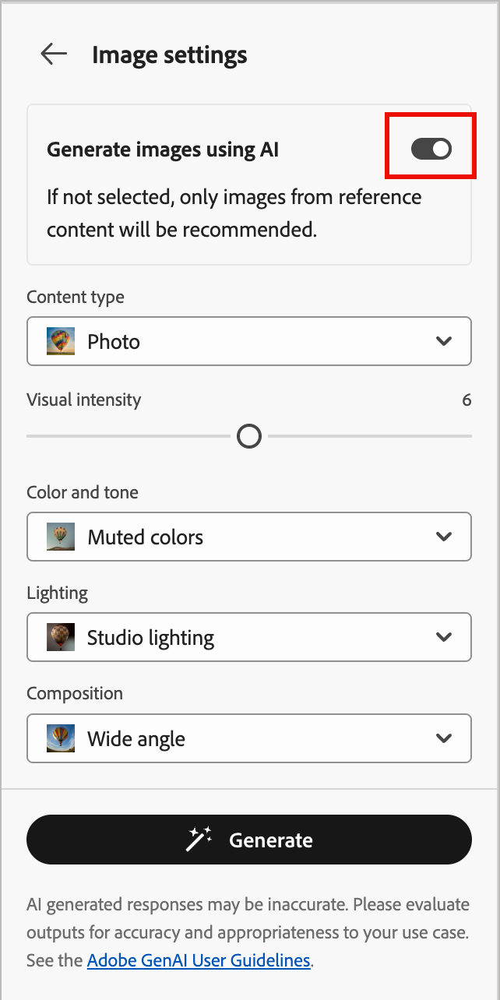
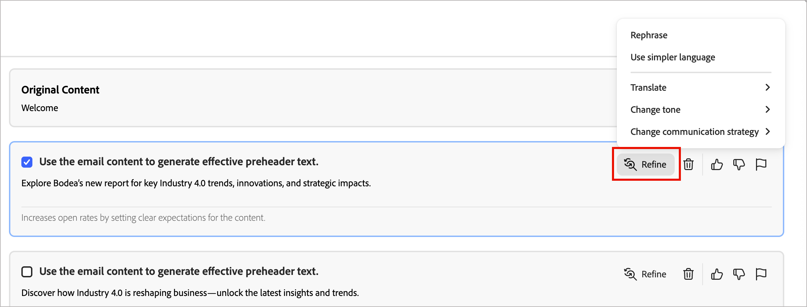

# AI Assistant voor e-mailinhoud

Naarmate de marketingindustrie concurrerender wordt, zoeken merken efficiënte manieren om snel en efficiënt onbruikbare inhoud te genereren. AI Assistant voor het schrijven van e-mails in [!DNL Adobe Journey Optimizer B2B Edition] is een Adobe AI-functie voor het genereren van inhoud die een revolutie betekent in de manier waarop marketeers professionele en merkconsistente e-mailinhoud maken. Met geavanceerde generatieve AI-modellen en een goed begrip van de richtlijnen voor merken genereert AI Assistant automatisch persoonlijke, aantrekkelijke en effectieve inhoud. Hierbij wordt uw marketingdoelstelling gebruikt en de inhoud geoptimaliseerd voor stijlen, lay-outs, tinten en meer met een merknaam. AI Assistant maakt het maken en uitvoeren van e-mailmarketingcampagnes intuïtief, eenvoudig en probleemloos. Door deze mogelijkheid toe te voegen aan uw workflows kunt u tijd besparen, de efficiëntie verbeteren en betere resultaten behalen.

Deze nieuwe functie biedt een snelle verzameling van inhoud voor volledige e-mailgeneratie of gericht binnen structuurelementen voor e-mail. Voor afbeeldingen kunt u nieuwe afbeeldingselementen genereren of eenvoudig aanbevelingen genereren vanuit de catalogus met afbeeldingen in het invoermerkelement. U kunt deze mogelijkheid ook gebruiken om optimale onderwerpregel en voorheaders te genereren voor invloed op de open snelheid van e-mail.

>[!IMPORTANT]
>
>Als u toegang wilt tot deze functies in Adobe Journey Optimizer B2B edition, moet u beschikken over _[!UICONTROL AI Assistant]_>_[!UICONTROL Generate Content]_ machtiging. Voor meer informatie over hoe een productbeheerder eigenschaptoestemmingen kan verlenen, zie [&#x200B; rollen voor producttoestemmingen &#x200B;](../admin/user-management.md#edit-roles-for-product-permissions) uitgeven.

## Richtlijnen en beperkingen

Alvorens u begint dit vermogen te gebruiken, herzie de [&#x200B; richtlijnen en de beperkingen &#x200B;](../ai-assistant/generative-ai-content.md#general-guidelines-and-limitations). [De aanvaarding van de gebruikersovereenkomst &#x200B;](https://www.adobe.com/legal/licenses-terms/adobe-dx-gen-ai-user-guidelines.html){target="_blank"} wordt ook vereist alvorens u de mogelijkheden van AI in [!DNL Journey Optimizer B2B Edition] kunt gebruiken. Neem voor meer informatie contact op met uw Adobe-vertegenwoordiger.

Met Adobe verplichting om transparantie in het gebruik van generatieve hulpmiddelen AI in media verwezenlijking te bevorderen, past Adobe [&#x200B; inhoudsgeloofsbrieven &#x200B;](https://helpx.adobe.com/firefly/web/get-started/learn-the-basics/content-credentials-overview.html){target="_blank"} voor om het even welke inhoud of project toe dat Firefly-Gegenereerde activa omvat wanneer het wordt gedownload of uitgevoerd.

De volgende beperkingen en richtlijnen gelden voor AI Assistant-functies die worden gebruikt voor het genereren van e-mailinhoud in [!DNL Journey Optimizer B2B Edition] :

* Engels is de enige ondersteunde taal.
* Gegenereerde inhoud is mogelijk niet correct. Deel uw feedback zodat Adobe-technici de modellen kunnen verfijnen.
* U kunt meerdere inhoudsreferentieelementen uploaden, maar u kunt slechts één element gebruiken voor een bepaalde generatie.
* Gebruik een merkspecifieke of aangepaste sjabloon voor het genereren van inhoud voor een volledige e-mail. E-mailsjablonen met maximaal 8-10 afbeeldingen worden aanbevolen.
* Zorg ervoor dat u eventuele problematische uitvoer meldt met het blokje omhoog, omlaag of de vlagpictogrammen wanneer u gegenereerde varianten selecteert.

## Invoer en instellingen voor het genereren van inhoud

U kunt volledige inhoud voor een e-mail, of voor geselecteerde componenten in e-mail produceren. Wanneer u de AI Assistant-gereedschappen gebruikt om de inhoud te genereren die u nodig hebt, geeft u de invoer op, inclusief vragen en inhoud ter referentie, en de instellingen voor tekst en afbeeldingen.

### Vragen

Gebruik duidelijk gedefinieerde aanwijzingen voor een nauwkeurige interpretatie van het generatieve AI-model. Het marketingdoel of de marketingprompt die u opgeeft, heeft een sterke invloed op de kwaliteit van de gegenereerde inhoud.

{width="320"}

Voor meer informatie over het creëren van efficiënte herinneringen, zie _[Snelle beste praktijken](../ai-assistant/generative-ai-content.md#generative-ai-prompting-guide)_.

>[!BEGINSHADEBOX]

#### Promptbibliotheek

Een effectieve prompt is essentieel voor het genereren van de best mogelijke inhoud. Als u hulp met het ontwerpen van uw herinnering wilt, klik het _ om tot een bibliotheek van snelle ideeën toegang te hebben die volgens doelstellingen worden georganiseerd._ Typ tekst in het zoekveld om een vraag te zoeken op basis van een trefwoordtekenreeks.

{width="600" zoomable="no"}

Selecteer de vraag die uw beoogde doelen het beste weerspiegelt en klik op **[!UICONTROL Try this Prompt]** . Vervang in het veld _[!UICONTROL Prompt]_&#x200B;alle plaatsaanduidingen (zoals `[Key Feature/Information]` ) door de benodigde waarden voor het merk, de aanbieding, de campagne en het gebruik.

>[!ENDSHADEBOX]

### Tekstinstellingen

Breid **[!UICONTROL Text settings]** in het juiste paneel uit en plaats de opties voor geproduceerde tekst.

* **[!UICONTROL Buying group]** - kies de [&#x200B; het kopen rol van de groep &#x200B;](../buying-groups/buying-groups-role-templates.md) voor het richten van uw overseinen te gebruiken. [!DNL Journey Optimizer B2B Edition] biedt vijf standaard B2B-aankoopgroeprollen buiten de box. Elke het kopen groepsrol heeft een duidelijke overseinennadruk:

  | Functie | Berichtenfocus |
  | ---- | --------------- |
  | Uitvoerend stuurcomité | De informatie van het product   Prijsende   Technische integratiedetails   de eigenschappen en de functies van het Product |
  | Influencer | Bewijs van kwaliteit   Versnelling van implementatie   de materie deskundigheid van het Onderwerp   Concurrerende voordelen |
  | Besluitvormer | Rendement op investering   Financiële waarde (RoI)   de verhalen van de Klant |
  | Praktijkster | Versnelling van gebruiksgemak {de eigenschappen van het 0} Product en functionaliteit   de verenigbaarheid van het Product   Versnelling van productintegratie  |
  | Champion | Onderwijsmateriaal   Gedachte leiderschapsinhoud   de verhalen van de Klant |

* **[!UICONTROL Marketing journey stage]** - kies het [&#x200B; het kopen groepsstadium &#x200B;](../buying-groups/buying-group-stages.md) om voor het richten van het overseinen te gebruiken.
* **[!UICONTROL Communication strategy]** - Kies de meest geschikte communicatiestijl voor de gegenereerde tekst.
* **[!UICONTROL Language]** - Kies de taal van de gegenereerde inhoud.
* **[!UICONTROL Tone]** - De toon zou met uw publiek moeten resoneren. U kunt het bericht bijvoorbeeld aanpassen om geluid informatief, afspeelbaar of overtuigend te maken.

{width="350" zoomable="yes"}

Klik op de pijl naar links om terug te keren naar de hoofdmap _[!UICONTROL Settings]_.

### Afbeeldingsinstellingen

Als u afbeeldingen in de gegenereerde inhoud wilt opnemen, vouwt u de **[!UICONTROL Image settings]** uit in het rechterdeelvenster en stelt u de opties in.

De optie **[!UICONTROL Generate images using AI]** is standaard uitgeschakeld. Schakel deze functie in en stel de volgende opties in om gegenereerde afbeeldingen op te nemen in de voorgestelde inhoudvariaties:

<!-- * **[!UICONTROL Generative model]**: Select from available built-in models, custom Firefly models trained on your brand assets, or third-party image generation providers to create images that align with your specific needs and brand requirements. -->
* **[!UICONTROL Aspect ratio]**: Wanneer een afbeeldingscomponent wordt geselecteerd, bepaalt deze instelling de breedte en hoogte van het element. U hebt de optie om van gemeenschappelijke verhoudingen zoals 16 te kiezen :9, 4 :3, 3 :2, of 1 :1, of u kunt een douanegrootte ingaan.
* **[!UICONTROL Content type]**: Het type categoriseert de aard van het visuele element, waarbij onderscheid wordt gemaakt tussen verschillende vormen van visuele representatie, zoals foto&#39;s, afbeeldingen of illustraties.
* **[!UICONTROL Visual intensity]**: U kunt de invloed van de afbeelding bepalen door de intensiteit aan te passen. Bij een lagere instelling (bijvoorbeeld 2) wordt het uiterlijk zachter en minder sterk, terwijl bij een hogere instelling (bijvoorbeeld 10) de afbeelding levendiger en visueel krachtiger wordt.
* **[!UICONTROL Color and tone]**: De algemene weergave van de kleuren in een afbeelding en de sfeer die of de sfeer die door de afbeelding wordt overgebracht.
* **[!UICONTROL Lighting]**: De belichtingsstijl die voor de afbeelding wordt gebruikt. Deze stijl bepaalt de atmosfeer en markeert specifieke elementen.
* **[!UICONTROL Composition]**: De rangschikking van elementen binnen het kader van een afbeelding.

{width="350" zoomable="yes"}

Klik op de pijl naar links om terug te keren naar de hoofdmap _[!UICONTROL Settings]_.

### Referentie-inhoud

Upload referentie-inhoud om nauwkeurige, on-brand-inhoud te genereren. Anders is gegenereerde inhoud gebaseerd op openbaar beschikbare informatie. Referentie-inhoud fungeert als bron voor het genereren van inhoud en aanbevelingen voor afbeeldingen. Voor richtlijnen en beste praktijken, zie _[Geoptimaliseerde verwijzingsinhoud](../ai-assistant/generative-ai-content.md#reference-content)_.

Klik in de instellingen van **[!UICONTROL Reference content]** op **[!UICONTROL Upload file]** om elementen toe te voegen die inhoud bevatten die u voor extra context wilt gebruiken.

{width="350" zoomable="yes"}

Het te uploaden bestand kan de volgende indelingen hebben: PDF-, JPEG-, PNG- of ZIP-bestanden (met ondersteunde bestandsindelingen). De maximale grootte voor een geüpload merk is 50 MB. Grotere bestanden of een groot aantal afbeeldingen kunnen werken, maar hierdoor neemt de verwerkingstijd toe.

Als u een eerder geüpload bestand wilt selecteren, vouwt u de lijst **[!UICONTROL Uploaded reference content]** uit en schakelt u het element in dat u wilt gebruiken voor het genereren van inhoud.

{width="350" zoomable="yes"}

## E-maileigenschappen genereren met AI Assistant

Wanneer u [&#x200B; een e-mailactie &#x200B;](./add-email.md#add-an-email-action-node-in-a-journey) aan een rekeningsreis toevoegt, bepaalt u een reeks e-maileigenschappen die voor het verzenden van e-mail worden gebruikt. De Medewerker van AI kan helpen betere e-mailovereenkomst bereiken door geadviseerde inhoud voor de e-mail **_onderwerpregel_** en **_preheader_** te produceren.

Wanneer u een e-mail maakt op basis van een rit of een bestaande e-mail opent via een knooppunt voor de rit, wordt de pagina met de voorvertoning van de e-mail weergegeven met de _[!UICONTROL Email properties]_&#x200B;aan de rechterkant. Op het tabblad&#x200B;_[!UICONTROL Summary]_ kunt u met de gereedschappen voor het genereren van inhoud van AI Assitant een onderwerpregel, voorheader of beide genereren.

>[!BEGINTABS]

>[!TAB  Onderwerpleiding ]

De volgende stappen beschrijven de taakopeenvolging voor het gebruiken van AI Medewerker om een geoptimaliseerde onderwerpregel voor uw e-mail te produceren:

1. In het _Summiere_ paneel met het _geselecteerde lusje van Details_, scrol neer aan het **[!UICONTROL Subject line]** gebied.

1. Klik het AI Hulp pictogram ( {width="30"}) rechts van het gebied.

   {width="600" zoomable="yes"}

   Het dialoogvenster _[!UICONTROL Generate Subject Line]_&#x200B;wordt geopend met de instellingen voor het genereren van de onderwerpregel van de e-mail.

1. (Vereist) Voer in het veld **[!UICONTROL Prompt]** een beschrijving in van wat u wilt genereren.

   Gebruik de [&#x200B; Snelle Bibliotheek &#x200B;](#prompt-library) als u wat hulp met het ontwerpen van een efficiënte herinnering nodig hebt.

1. (Optioneel) Vul de instellingen voor de inhoudshulp in om extra gegevens op te geven voor het genereren van de preheader:

   * [**[!UICONTROL Text settings]**](#text-settings) - Geef richtlijnen voor de gegenereerde tekstinhoud.
   * [**[!UICONTROL Reference content]**](#reference-content) - Geef het inhoudselement op dat fungeert als bron voor het genereren van inhoud.

1. Klik op **[!UICONTROL Generate]** wanneer de vraag en de instellingen gereed zijn.

   De gegenereerde varianten worden weergegeven in het dialoogvenster.

   {width="600" zoomable="yes"}

1. Blader in het deelvenster AI-assistent en blader door de gegenereerde variaties om te bepalen welke variatie het beste past.

   U kunt [&#x200B; voorleggen terugkoppelt &#x200B;](#submit-variation-feedback) voor een geproduceerde variant door de _Duimen omhoog_, _duimen neer_, of _Vlag_ pictogram voor te klikken en de reden te kiezen die het best uw samenvat terugkoppelt.

1. Klik op de optie **[!UICONTROL Refine]** voor meer aanpassingsfuncties:

   * **[!UICONTROL Rephrase]** - herschrijf het bericht terwijl het zijn betekenis behoudt. Met deze optie kunt u alternatieve bewoordingen genereren of de formulering aanpassen zonder het kernbericht te wijzigen.

   * **[!UICONTROL Use simpler language]** - Vereenvoudig de taal en zorg voor helderheid en toegankelijkheid voor een groter publiek.

   * **[!UICONTROL Translate]** - Vertaal de tekst naar een andere taal. (Momenteel is Engels de enige ondersteunde taal. Andere talen zijn gepland voor toekomstige versies.)

   * **[!UICONTROL Change tone]** - Pas de toon van het bericht aan om zich aan uw communicatie stijl aan te sluiten, zoals het vriendelijker, professioneel, urgente, of inspirerend maken.

   * **[!UICONTROL Change Communication strategy]** - Wijzig de berichtenbenadering op basis van uw doelstellingen, zoals het creëren van urgentie, of het benadrukken van opwindende aantrekkingskracht.

   {width="600" zoomable="yes"}

1. Klik op **[!UICONTROL Select]** om de tekst van de onderwerpregel te vervangen door de geselecteerde variant en terug te keren naar de e-maileigenschappen.

>[!TAB  Preheader generatie ]

Een e-mailpreheader is de korte samenvattingstekst die volgt op de onderwerpregel wanneer een e-mailbericht wordt weergegeven in het Postvak IN. Het is een optioneel element voor een e-mail, maar een geweldige kans om de betrokkenheid te verbeteren. De volgende stappen beschrijven de taakopeenvolging voor het gebruiken van AI Medewerker om een geoptimaliseerde preheader voor uw e-mail te produceren:

1. In het _Summiere_ paneel met het _Geselecteerde lusje van Details_, scrol neer en selecteer **[!UICONTROL Preheader]** checkbox.

   {width="600" zoomable="yes"}

   Het dialoogvenster _[!UICONTROL Generate Preheader]_&#x200B;wordt geopend met de instellingen voor het genereren van de e-mailpreheader.

1. (Vereist) Voer in het veld **[!UICONTROL Prompt]** een beschrijving in van wat u wilt genereren.

   Gebruik de [&#x200B; Snelle Bibliotheek &#x200B;](#prompt-library) als u wat hulp met het ontwerpen van een efficiënte herinnering nodig hebt.

1. (Optioneel) Vul de instellingen voor de inhoudshulp in om extra gegevens op te geven voor het genereren van de preheader:

   * [**[!UICONTROL Text settings]**](#text-settings) - Geef richtlijnen voor de gegenereerde tekstinhoud.
   * [**[!UICONTROL Reference content]**](#reference-content) - Geef het inhoudselement op dat fungeert als bron voor het genereren van inhoud.

1. Klik op **[!UICONTROL Generate]** wanneer de vraag en de instellingen gereed zijn.

   De gegenereerde varianten worden weergegeven in het dialoogvenster.

   {width="600" zoomable="yes"}

1. Blader in het deelvenster AI-assistent en blader door de gegenereerde variaties om te bepalen welke variatie het beste past.

   U kunt [&#x200B; voorleggen terugkoppelt &#x200B;](#submit-variation-feedback) voor een geproduceerde variant door de _Duimen omhoog_, _duimen neer_, of _Vlag_ pictogram voor te klikken en de reden te kiezen die het best uw samenvat terugkoppelt.

1. Klik op de optie **[!UICONTROL Refine]** voor meer aanpassingsfuncties:

   * **[!UICONTROL Rephrase]** - herschrijf het bericht terwijl het zijn betekenis behoudt. Met deze optie kunt u alternatieve bewoordingen genereren of de formulering aanpassen zonder het kernbericht te wijzigen.

   * **[!UICONTROL Use simpler language]** - Vereenvoudig de taal en zorg voor helderheid en toegankelijkheid voor een groter publiek.

   * **[!UICONTROL Translate]** - Vertaal de tekst naar een andere taal. (Momenteel is Engels de enige ondersteunde taal. Andere talen zijn gepland voor toekomstige versies.)

   * **[!UICONTROL Change tone]** - Pas de toon van het bericht aan om zich aan uw communicatie stijl aan te sluiten, zoals het vriendelijker, professioneel, urgente, of inspirerend maken.

   * **[!UICONTROL Change Communication strategy]** - Wijzig de berichtenbenadering op basis van uw doelstellingen, zoals het creëren van urgentie, of het benadrukken van opwindende aantrekkingskracht.

   {width="500" zoomable="yes"}

1. Klik op **[!UICONTROL Select]** om de voorheader te vervangen door de geselecteerde variant en terug te keren naar de e-maileigenschappen.

>[!ENDTABS]

## E-mailinhoud genereren met AI Assistant {#generative-ai-email-design}

Nadat u [&#x200B; creeert en uw e-mail &#x200B;](./email-authoring.md) personaliseert, gebruik AI Medewerker in [!DNL Journey Optimizer B2B Edition], aangedreven door generatieve AI om uw e-maillichaamsinhoud tot het volgende niveau op te heffen.

In de ontwerpruimte van e-mail, kan AI Medewerker u helpen de invloed van uw leveringen optimaliseren door het volledige e-maillichaam, gerichte tekstinhoud, en beelden te produceren die met uw publiek resoneren. Deze optimalisatie van uw e-mailcampagnes is ontworpen om een betere betrokkenheid te creëren. Selecteer de _AI Medewerker_ ( {width="25" zoomable="no"}) om de hulpmiddelen van de inhoudsgeneratie te tonen die voor de huidige inhoudselectie beschikbaar zijn.

{width="600" zoomable="yes"}

Voer de volgende stappen uit op basis van het type e-mailinhoud dat u wilt genereren:

>[!BEGINTABS]

>[!TAB  Volledige e-mailgeneratie ]

Voer de volgende stappen uit om AI Assistant te gebruiken voor het genereren van volledige e-mail door een bestaande e-mailsjabloon te verfijnen:

1. Na [&#x200B; creërend e-mail &#x200B;](./add-email.md), klik **[!UICONTROL Edit email content]**.

1. Selecteer een sjabloon.

   Voor het genereren van volledige inhoud is een sjabloon vereist. Dit kan een standaardsjabloon zijn die door Adobe wordt aangeboden, of een opgeslagen sjabloon. U kunt de optie _[!UICONTROL Import HTML]_&#x200B;ook gebruiken om een sjabloon te importeren.

   Voor meer informatie over het gebruiken van een e-mailmalplaatje, zie _[een malplaatje](./email-authoring.md#select-a-template)_ selecteren.

1. In de ruimte van het e-mailontwerp, heb toegang tot het AI Hulpmenu door het pictogram ( {width="25"}) bij het recht te klikken.

   De AI Hulp montages op het recht wijzen op _E-mail_ produceren.

   {width="600" zoomable="yes"}

1. Selecteer **[!UICONTROL Brand]** om ervoor te zorgen dat de door AI gegenereerde inhoud wordt uitgelijnd op de specificaties van uw merk.

   Als er geen gepubliceerde merken zijn, klik **[!UICONTROL Create a brand]** om uw [&#x200B; herbruikbare merkrichtlijnen &#x200B;](./brands-overview.md) te bepalen.

1. Voer in het veld **[!UICONTROL Prompt]** een beschrijving in van wat u wilt genereren.

   Gebruik de [&#x200B; Snelle Bibliotheek &#x200B;](#prompt-library) als u wat hulp met het ontwerpen van een efficiënte herinnering nodig hebt.

   >[!TIP]
   >
   >Als u aan het veroorzaken voor geproduceerde inhoud nieuw bent, herzie _[het Vragen beste praktijken](../ai-assistant/generative-ai-content.md#generative-ai-prompting-guide)_.

1. Voltooi de instellingen voor de inhoudshulp om de gegenereerde inhoud aan te passen:

   * [**[!UICONTROL Text settings]**](#text-settings) - Geef richtlijnen voor de gegenereerde tekstinhoud.
   * [**[!UICONTROL Image settings]**](#image-settings) - Als u afbeeldingen in de gegenereerde inhoud wilt opnemen, schakelt u het genereren van afbeeldingen in en biedt u aanwijzingen.
   * [**[!UICONTROL Reference content]**](#reference-content) - Geef het inhoudselement op dat fungeert als bron voor het genereren van inhoud.

1. Klik op **[!UICONTROL Generate]** wanneer de vraag en de instellingen gereed zijn.

   De gegenereerde variaties worden weergegeven in het rechterdeelvenster.

1. Doorblader door de geproduceerde variaties of klik het _Volledige scherm_ ( ) pictogram om de _[!UICONTROL Generate Email]_&#x200B;dialoog te openen.

   Het dialoogvenster bevat extra ruimte voor het vergelijken van de variaties, het aanpassen van de instellingen voor tekst en de referentie-inhoud (indien nodig) en het opnieuw genereren van de variaties.

   U kunt een variatie ook verfijnen door verfijningsacties toe te passen en feedback voor de gegenereerde variaties te verzenden. Zie _[Voorproef en inhoudsverfijning](#preview-and-content-refinement)_ voor meer details over variatieverfijning en terugkoppelt.

   {width="700" zoomable="yes"}

1. Klik op **[!UICONTROL Select]** om de inhoud van de sjabloon te vervangen door de geselecteerde variant en terug te keren naar de ontwerpruimte van de e-mail.

   U kunt de bewerkings- en opmaakgereedschappen op het canvas gebruiken om de gegenereerde inhoud te wijzigen, evenals de opties _[!UICONTROL Settings]_&#x200B;en&#x200B;_[!UICONTROL Style]_ aan de rechterkant.

>[!TAB  slechts Tekst ]

Ga als volgt te werk om AI Assistant te gebruiken om de tekstinhoud voor een bestaande e-mail te verfijnen of te verbeteren:

1. In de e-mailontwerpruimte, selecteer de component van de Tekst van de a __ om de specifieke inhoud te richten.

1. Op de buitenspoor van het juiste paneel, selecteer het _AI Medewerker_ ( {width="25"}) pictogram.

   De instellingen aan de rechterkant weerspiegelen de instellingen voor het genereren van inhoud voor de tekstcomponent.

1. Selecteer **[!UICONTROL Brand]** om ervoor te zorgen dat de door AI gegenereerde inhoud wordt uitgelijnd op de specificaties van uw merk.

   Als er geen gepubliceerde merken zijn, klik **[!UICONTROL Create a brand]** om [&#x200B; uw herbruikbare merkrichtlijnen &#x200B;](./brands-overview.md) te bepalen.

1. Voer in het veld **[!UICONTROL Prompt]** een beschrijving in van wat u wilt genereren.

   {width="600" zoomable="yes"}

   Gebruik de [&#x200B; Snelle Bibliotheek &#x200B;](#prompt-library) als u wat hulp met het ontwerpen van een efficiënte herinnering nodig hebt.

1. Voltooi de instellingen voor de inhoudshulp om de gegenereerde inhoud aan te passen:

   * [**[!UICONTROL Text settings]**](#text-settings) - Geef richtlijnen voor de gegenereerde tekstinhoud.

   * [**[!UICONTROL Reference content]**](#reference-content) - Geef de inhoudselementen op die als bron dienen voor het genereren van inhoud.

1. Klik op **[!UICONTROL Generate]** wanneer de vraag en de instellingen gereed zijn.

1. Doorblader door de geproduceerde variaties of klik het _Volledige scherm_ ( ) pictogram om de _[!UICONTROL Generate Text]_&#x200B;dialoog te openen.

   Het dialoogvenster bevat extra ruimte voor het vergelijken van de variaties, het aanpassen van de instellingen voor tekst en de referentie-inhoud (indien nodig) en het opnieuw genereren van de variaties.

   U kunt een variatie ook verfijnen door verfijningsacties toe te passen en feedback voor de gegenereerde variaties te verzenden. Zie _[Voorproef en inhoudsverfijning](#preview-and-refine-the-content)_ voor meer details over variatieverfijning en terugkoppelt.

   {width="700" zoomable="yes"}

1. Als u de gewenste inhoud hebt, klikt u op **[!UICONTROL Select]** om de tekst te vervangen door de geselecteerde variant en terug te keren naar de ontwerpruimte van de e-mail.

   U kunt de bewerkings- en opmaakgereedschappen op het canvas gebruiken om de tekst, maar ook de opties _[!UICONTROL Settings]_&#x200B;en&#x200B;_[!UICONTROL Style]_ aan de rechterkant te wijzigen.

>[!TAB  Beeld slechts ]

Ga als volgt te werk om AI Assistant te gebruiken om de afbeeldingsinhoud voor een bestaande e-mail te verfijnen of te verbeteren:

1. In de e-mailontwerpruimte, selecteer een _component van het Beeld_ om de specifieke inhoud te richten.

1. Op de buitenspoor van het juiste paneel, selecteer het _AI Medewerker_ ( {width="25"}) pictogram.

   De instellingen van de AI-assistent aan de rechterkant weerspiegelen de instellingen voor het genereren van de afbeeldingscomponent.

1. Selecteer **[!UICONTROL Brand]** om ervoor te zorgen dat de door AI gegenereerde inhoud wordt uitgelijnd op de specificaties van uw merk.

   Als er geen gepubliceerde merken zijn, klik **[!UICONTROL Create a brand]** om [&#x200B; uw herbruikbare merkrichtlijnen &#x200B;](./brands-overview.md) te bepalen.

1. Voer in het veld **[!UICONTROL Prompt]** een beschrijving in van wat u wilt.

   {width="600" zoomable="yes"} in

   Gebruik de [&#x200B; Snelle Bibliotheek &#x200B;](#prompt-library) als u wat hulp met het ontwerpen van een efficiënte herinnering nodig hebt.

1. Voltooi de instellingen voor de inhoudshulp om de gegenereerde inhoud aan te passen:

   * [**[!UICONTROL Image settings]**](#image-settings) - Als u afbeeldingen in de gegenereerde inhoud wilt opnemen, schakelt u het genereren van afbeeldingen in en gebruikt u de instellingen voor hulplijnen.

   * [**[!UICONTROL Reference content]**](#reference-content) - Geef de inhoudselementen op die als bron dienen voor het genereren van inhoud.

1. Klik op **[!UICONTROL Generate]** als u tevreden bent met de vraag en de instellingen.

   AI Assistant verwerkt de aanvraag en genereert de meest geschikte afbeeldingen op basis van de vraag en andere invoer.

   >[!IMPORTANT]
   >
   >Als de referentie-inhoud geen afbeeldingen bevat of als er geen afbeeldingen zijn die relevant zijn voor de invoerprompt, is de uitvoer leeg.

1. Doorblader door de geproduceerde variaties of klik het _Volledige scherm_ ( ) pictogram om de _[!UICONTROL Generate Image]_&#x200B;dialoog te openen.

   Het dialoogvenster biedt extra ruimte om de variaties te vergelijken, de instellingen voor de afbeelding en de referentie-inhoud aan te passen (indien nodig) en de variaties opnieuw te genereren.

   U kunt een variatie selecteren en op **[!UICONTROL Generate Similar]** klikken om extra afbeeldingen te genereren die vergelijkbaar zijn met de geselecteerde variant. U kunt ook op **[!UICONTROL Edit in Adobe Express]** klikken om uw eigen wijzigingen in de afbeelding aan te brengen. Zie [&#x200B; Snelle acties in Adobe Express &#x200B;](./image-edit-adobe-express.md#quick-actions-in-adobe-express) voor meer informatie over het gebruiken van Adobe Express om uw beelden te verfijnen.

   {width="700" zoomable="yes"}

   U kunt ook [&#x200B; voorleggen terugkoppelt &#x200B;](#submit-variation-feedback) voor de geproduceerde variaties.

1. Markeer de gewenste afbeelding en klik op **[!UICONTROL Select]** om de afbeelding of tijdelijke aanduiding te vervangen door het geselecteerde item en terug te keren naar de ontwerpruimte van de e-mail.

   U kunt de bewerkings- en opmaakgereedschappen op het canvas gebruiken om de afbeelding te wijzigen, maar ook de opties _[!UICONTROL Settings]_&#x200B;en&#x200B;_[!UICONTROL Style]_ aan de rechterkant.

>[!ENDTABS]

## De inhoud voorvertonen en verfijnen {#refine-finalize}

Na het produceren van inhoudvariaties, kunt u de resultaten verfijnen om ervoor te zorgen dat zij aan uw nauwkeurige vereisten voldoen. Controleer de uitlijning van het merk, pas de tint en de taal aan en bereid de inhoud voor een herzien concept. U kunt ook feedback verzenden voor een variatie om AI Assistant te trainen en de toekomstige uitvoer te verbeteren.

### De volledige schermweergave openen

1. Blader na het genereren van de inhoud door de **[!UICONTROL Variations]** .

1. Identificeer de variatie die de beste gelijke voor uw doelstellingen is en klik het _Volledige scherm_ ( ) pictogram om de geselecteerde variatie in meer diepte te bekijken.

   {width="700" zoomable="yes"}

1. Als u tevreden bent met de geselecteerde variatie, klikt u op **[!UICONTROL Select]** om deze toe te passen op het canvas.

### Een wijziging verfijnen

Klik op de optie **[!UICONTROL Refine]** voor aanvullende aanpassingsfuncties voor e-mail- en tekstvariaties:

* **[!UICONTROL Elaborate]** - AI Assistant kan u helpen om meer te doen over specifieke onderwerpen en biedt extra informatie voor een beter begrip en betrokkenheid.

* **[!UICONTROL Summarize]** - langdurige informatie kan paginaviewers overladen. Met AI Assistant kunt u belangrijke punten samenvoegen tot heldere, beknopte samenvattingen die aandacht trekken en hen aanmoedigen om verder te lezen.

* **[!UICONTROL Rephrase]** - herschrijf het bericht terwijl het zijn betekenis behoudt. Met deze optie kunt u alternatieve bewoordingen genereren, de stroom verbeteren of de formulering aanpassen zonder het kernbericht te wijzigen.

* **[!UICONTROL Use simpler language]** - Vereenvoudig de taal en zorg voor helderheid en toegankelijkheid voor een groter publiek.

* **[!UICONTROL Translate]** - Vertaal de tekst naar een andere taal. (Momenteel is Engels de enige ondersteunde taal. Andere talen zijn gepland voor toekomstige versies.)

* **[!UICONTROL Change tone]** - Pas de toon van het bericht aan om zich aan uw communicatie stijl aan te sluiten, zoals het vriendelijker, professioneel, urgente, of inspirerend maken.

* **[!UICONTROL Change Communication strategy]** - Wijzig de berichtenbenadering op basis van uw doelstellingen, zoals het creëren van urgentie, of het benadrukken van opwindende aantrekkingskracht.

<!-- is this option coming back? * **[!UICONTROL Use as reference content]** - Select this option to use the variant as the reference content for generating other results. -->

{width="700" zoomable="yes"}

### Feedback verzenden

Verstrek terugkoppel voor de geproduceerde varianten door de _Duimen omhoog_, _duimen neer_, of _Vlag_ te klikken pictogram en de reden te kiezen die het best uw samenvat terugkoppelt.

{width="700" zoomable="yes"}

### Controleer of je merk is uitgelijnd (Beta)

<!-- Are we surfacing scoring here in the future, or will it be a separate post-creation task? 1. Click the percentage icon to view your **[!UICONTROL Brand Alignment Score]** and identify any misalignments with your brand. -->

De evaluatie en het scoren van de merkgroepering helpen u om consistentie in toon, overseinen, en visuele identiteit over uw e-mailcampagnes te verzekeren, terwijl ook als kwaliteitscontrole dient alvorens uw inhoud live gaat. Wanneer de e-mailinhoud volledig is, klik de _groepering van het Merk_ (  ) op het recht om het _Merk groeperings_ juiste paneel in de e-mailontwerpruimte te openen.

{width="600" zoomable="yes"}

Voor gedetailleerde informatie, zie [&#x200B; uw merkgroepering &#x200B;](./brand-alignment.md#validate-your-brand-alignment) bevestigen
