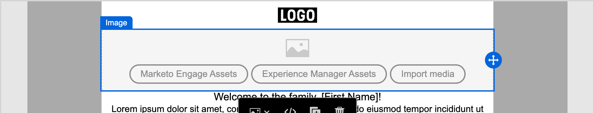

# Assets

In [!DNL Adobe Journey Optimizer B2B Edition] zijn elementen doorgaans de afbeeldingen die worden gebruikt bij het ontwerpen van inhoud ter ondersteuning van reizen naar accounts. U kunt deze afbeeldingen in de e-mails, e-mailsjablonen en fragmenten gebruiken via een assetenselector of een eenvoudige interface voor slepen en neerzetten in de visuele ontwerpruimte.

[!DNL Journey Optimizer B2B Edition] biedt marketers toegang tot twee typen elementenbibliotheken: [!DNL Adobe Marketo Engage] [!DNL Design Studio] en [!DNL Adobe Experience Manager Assets as a Cloud Service] . U kunt alleen de Adobe Marketo Engage Design Studio gebruiken of beide bibliotheken gebruiken die tegelijkertijd zijn geconfigureerd (op basis van de [!DNL Experience Manager Assets] -licentie die u hebt).

## Beheer van bedrijfsmiddelen

Als u beschikt over [!DNL Adobe Experience Manager as a Cloud Services] , hebt u toegang tot de opslagruimten voor zowel [!DNL Marketo Engage Design Studio] als [!DNL Adobe Experience Manager Assets as a Cloud Service] wanneer uw gebruikersaccount de vereiste machtigingen heeft. Deze opslagruimten zijn gescheiden en niet gesynchroniseerd. U kunt afbeeldingen uit beide bronnen gebruiken.

### Adobe Marketo Engage-middelen

De gegevensopslagruimte van [!DNL Adobe Marketo Engage Design Studio] is standaard voorzien van elk [!DNL Journey Optimizer B2B Edition] -abonnement. Dit betekent dat u toegang hebt tot alle afbeeldingselementen die zijn opgeslagen in [!DNL Adobe Marketo Engage] ( [!UICONTROL Design Studio] > [!UICONTROL Images & Files] ). U kunt deze gegevensopslagruimte gebruiken als uw lokale bibliotheek met middelen, waaronder functies voor het uploaden en downloaden van middelen. U kunt deze middelen ook gebruiken binnen uw reisinhoud.

Er zijn ingebouwde hulplijnen die voorkomen dat de elementen van [!DNL Marketo Engage] worden bewerkt vanuit [!DNL Journey Optimizer B2B Edition] en dat bewerkingen worden verwijderd en verplaatst. Deze beveiligingsopties zorgen ervoor dat de bronelementen (Marketo Engage Design Studio) behouden blijven en zorgen ervoor dat deze naadloos kunnen worden gelezen en hergebruikt in [!DNL Journey Optimizer B2B Edition] .

Ondersteunde bestandsindelingen: JPG, JPEG, GIF, PNG, EPS, SVG en RGB

### Adobe Experience Manager Assets as a Cloud Service

Maak gebruik van [!DNL Adobe Experience Manager Assets] om marketing- en creatieve workflows samen te brengen. Het is standaard geïntegreerd met [!DNL Journey Optimizer B2B Edition] , zodat u eenvoudig toegang hebt tot Assets as a Cloud Service om digitale elementen te detecteren en te gebruiken. Het biedt toegang tot uw Assets-opslagplaats voor elementen die u kunt gebruiken om uw berichten te vullen.

[!DNL Adobe Journey Optimizer B2B Edition] kan verbinding maken met [!DNL Adobe Experience Manager Assets as a Cloud Service] voor gecentraliseerd beheer van bedrijfsmiddelen, waarmee u uw creatieve systeem kunt uitbreiden en digitale middelen kunt verenigen voor een gebruiksvriendelijke ervaring. [!DNL Adobe Experience Manager Assets as a Cloud Service] biedt een gebruiksvriendelijke cloudoplossing voor efficiënt beheer van digitale bedrijfsmiddelen en dynamische mediabewerkingen. Het omvat naadloos geavanceerde eigenschappen, met inbegrip van Kunstmatige Intelligentie en het Leren van de Machine.

Leer meer in de [ documentatie van Adobe Experience Manager as a Cloud Service ](https://experienceleague.adobe.com/en/docs/experience-manager-cloud-service/content/assets/overview){target="_blank"}.

{{aem-assets-licensing-note}}

Open [!DNL Adobe Experience Manager Assets] rechtstreeks vanuit [!DNL Journey Optimizer B2B Edition] het **[!UICONTROL Experience Manager Assets]** -item in de linkernavigatie van het inhoudsontwerp. U kunt ook elementen en mappen openen tijdens het ontwerpen van uw e-mail-, e-mailsjabloon en visuele fragmentinhoud.

U kunt momenteel alleen afbeeldingen uit Adobe Experience Manager Assets in Adobe Journey Optimizer B2B edition gebruiken.

## Elementen gebruiken voor het ontwerpen van inhoud

Gebruik elementen bij het ontwerpen van uw e-mails, e-mailsjablonen en visuele fragmenten. De visuele inhoudeditor biedt toegang tot de afbeeldingen in uw verbonden opslagruimten voor elementen. Als u een abonnement hebt op Experience Manager Assets as a Cloud Service samen met de standaard Adobe Marketo Engage Design Studio, kunt u afbeeldingselementen kiezen uit een van beide bronnen. U kunt ook een afbeeldingselement uploaden, waardoor het in de [!DNL Journey Optimizer B2B Edition] -werkruimte van de gekoppelde [!DNL Marketo Engage Design Studio] -opslagplaats wordt geplaatst.

U kunt de afbeeldingsbron kiezen wanneer u de instellingen voor een afbeeldingscomponent bewerkt of rechtstreeks op het canvas:

* **_de componentenmontages van het Beeld_** - wanneer u een beeldcomponent hebt die in de visuele ontwerpruimte wordt geselecteerd, kunt u de montages in het juiste paneel bekijken en uitgeven. Als u het afbeeldingsbestand dat in de component wordt weergegeven, wilt toevoegen of wijzigen, kiest u het brontype en selecteert u een afbeeldingsbestand.

  {width="350"} uit

* **_Lege component_** - wanneer u een beeldcomponent in de visuele ontwerpruimte toevoegt, is het leeg en verleent gemakkelijke toegang om een bron te kiezen en een beelddossier te selecteren.

  {width="500"}

* **_de componententoolbar van het Beeld_** - wanneer u een beeldcomponent hebt die in de visuele ontwerpruimte wordt geselecteerd, verleent de toolbar gemakkelijke toegang om een bron te kiezen en het beelddossier te selecteren.

  {width="500"}

Afhankelijk van de bron van het afbeeldingselement kunt u tijdens het ontwerpen van de inhoud een afbeeldingselement toevoegen. U kunt ook een afbeeldingselement kiezen in de achtergrondinstellingen voor een structuurcomponent.

>[!BEGINTABS]

>[!TAB  Marketo Engage Assets ]

Klik op **[!UICONTROL Marketo Engage Assets]** om de elementenkiezer te openen, waar u een afbeelding kunt kiezen in een [!DNL Marketo Engage] -werkruimte of in de Journey Optimizer B2B edition-werkruimte.

{width="700" zoomable="yes"}

U kunt zoeken en filters gebruiken om het gewenste afbeeldingselement te zoeken. Selecteer het element en klik op **[!UICONTROL Select]** om het te gebruiken voor de afbeeldingscomponent.

Voor meer gedetailleerde informatie over het gebruiken van [!DNL Marketo Engage] beeldactiva, zie [ activa van het Gebruik in uw inhoud ](./marketo-engage-design-studio.md#use-assets-in-your-content).

>[!TAB  Experience Manager Assets ]

Klik op **[!UICONTROL Experience Manager Assets]** om de elementenkiezer te openen, waar u een afbeelding kunt kiezen in de Experience Manage Assets-opslagplaats.

{width="700" zoomable="yes"}

U kunt zoeken en filters gebruiken om het gewenste afbeeldingselement te zoeken. Selecteer het element en klik op **[!UICONTROL Select]** om het te gebruiken voor de afbeeldingscomponent.

Voor meer gedetailleerde informatie over het gebruiken van beelddossiers van [!DNL Experience Manager Assets], zie [ de beelden van AEM Assets van de Toegang ](./aem-assets.md#access-aem-assets-images).

>[!TAB  de media van de Invoer ]

Klik op **[!UICONTROL Import media]** om een afbeeldingsbestand te selecteren en te importeren als een element dat kan worden gebruikt voor Journey Optimizer B2B edition-inhoud.

{width="500" zoomable="yes"} in te voeren

Klik op **[!UICONTROL Import]** nadat u het bestand hebt gesleept en neergezet of vanuit het bestandssysteem hebt geselecteerd. Het geïmporteerde element wordt opgeslagen in de [!DNL Journey Optimizer B2B Edition] -werkruimte van de [!DNL Adobe Marketo Engage Design Studio] -opslagplaats.

>[!ENDTABS]
