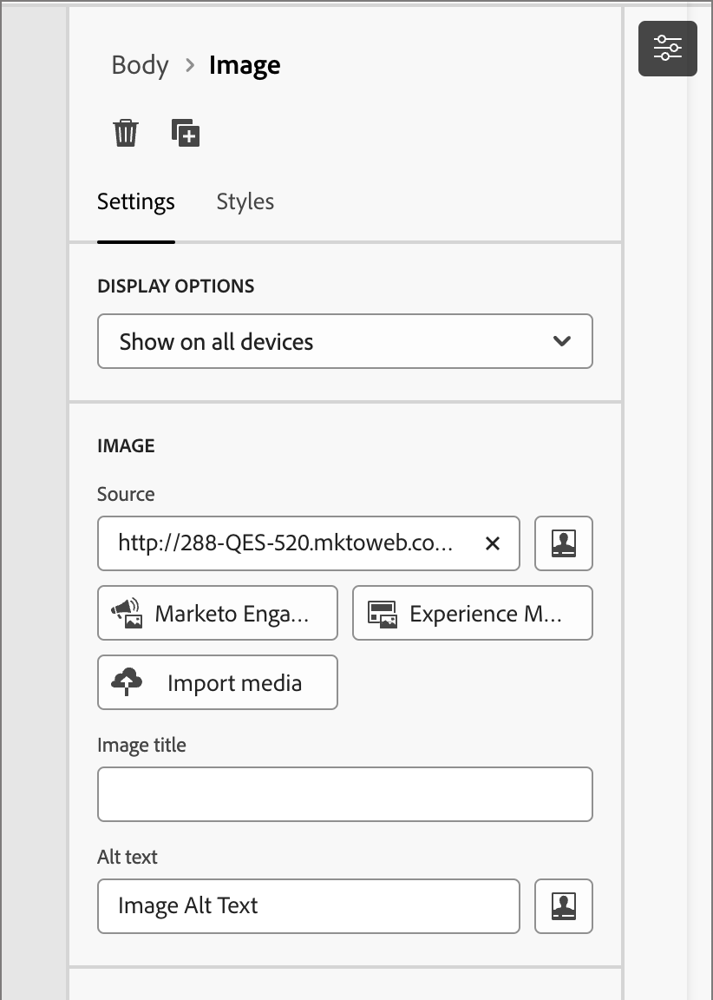

# Assets

In Adobe Journey Optimizer B2B edition zijn middelen doorgaans de afbeeldingen die worden gebruikt bij het ontwerpen van inhoud ter ondersteuning van reizen naar accounts. U kunt deze afbeeldingen in de e-mails, e-mailsjablonen en fragmenten gebruiken via een assetenselector of een eenvoudige interface voor slepen en neerzetten in de visuele inhoudeditor.

Adobe Journey Optimizer B2B edition biedt marketers toegang tot twee typen assets bibliotheken: Adobe Marketo Engage Design Studio en Adobe Experience Manager Assets as a Cloud Service. U kunt alleen de Adobe Marketo Engage Design Studio gebruiken of beide bibliotheken gebruiken die tegelijkertijd zijn geconfigureerd (op basis van de AEM Assets-licentie die u hebt).

## Beheer van bedrijfsmiddelen

Als u van Adobe Experience Manager als Cloud Servicen voorzien bent, hebt u toegang tot de bewaarplaatsen voor zowel Marketo Engage Design Studio als Adobe Experience Manager Assets as a Cloud Service wanneer uw gebruikersrekening de vereiste toestemmingen heeft. Deze opslagruimten zijn gescheiden en niet gesynchroniseerd. U kunt afbeeldingen uit beide bronnen gebruiken.

### Adobe Marketo Engage-middelen

De Adobe Marketo Engage Design Studio Asset-opslagplaats wordt standaard geleverd bij elk Journey Optimizer B2B edition-abonnement. Dit betekent dat u toegang hebt tot alle afbeeldingselementen die zijn opgeslagen in Adobe Marketo Engage ([!UICONTROL Design Studio] > [!UICONTROL Images & Files] ). U kunt deze gegevensopslagruimte gebruiken als uw lokale bibliotheek met middelen, waaronder functies voor het uploaden en downloaden van middelen. U kunt deze middelen ook gebruiken binnen uw reisinhoud.

Er zijn ingebouwde instructies die voorkomen dat de Marketo&#39;s Engage van Journey Optimizer B2B edition worden bewerkt en bewerkingen worden verwijderd en verplaatst. Deze bescherming zorgt ervoor dat de bronactiva (de Studio van het Ontwerp van het Marketo Engage) worden gehandhaafd terwijl het toestaan van naadloos lees en hergebruik in Journey Optimizer B2B edition.

Ondersteunde bestandsindelingen: JPG, JPEG, GIF, PNG, EPS, SVG en RGB

### Adobe Experience Manager Assets as a Cloud Service

Maak gebruik van Adobe Experience Manager Assets om marketing- en creatieve workflows samen te brengen. Het is standaard geïntegreerd met Adobe Journey Optimizer B2B edition, zodat u eenvoudig toegang hebt tot Assets as a Cloud Service voor het detecteren en gebruiken van digitale middelen. Het biedt toegang tot uw Assets-opslagplaats voor elementen die u kunt gebruiken om uw berichten te vullen.

Adobe Journey Optimizer B2B edition kan verbinding maken met Adobe Experience Manager Assets as a Cloud Service voor gecentraliseerd beheer van bedrijfsmiddelen, waardoor uw creatieve systeem wordt uitgebreid en digitale middelen worden verenigd voor een betere ervaring. Adobe Experience Manager Assets as a Cloud Service biedt een gebruiksvriendelijke cloudoplossing voor efficiënt beheer van digitale bedrijfsmiddelen en Dynamic Media. Het omvat naadloos geavanceerde eigenschappen, met inbegrip van Kunstmatige Intelligentie en het Leren van de Machine.

Leer meer in de [ documentatie van Adobe Experience Manager as a Cloud Service ](https://experienceleague.adobe.com/en/docs/experience-manager-cloud-service/content/assets/overview).

{{aem-assets-licensing-note}}

Open Adobe Experience Manager Assets rechtstreeks in Journey Optimizer B2B edition vanuit het **[!UICONTROL Experience Manager Assets]** -item in het inhoudsontwerp, maar ga naar de linkernavigatie. U kunt ook elementen en mappen openen tijdens het ontwerpen van uw e-mail-, e-mailsjabloon en visuele fragmentinhoud.

U kunt momenteel alleen afbeeldingen uit Adobe Experience Manager Assets in Adobe Journey Optimizer B2B edition gebruiken.

## Elementen gebruiken voor het ontwerpen van inhoud

Gebruik elementen bij het ontwerpen van uw e-mails, e-mailsjablonen en visuele fragmenten. De visuele inhoudeditor biedt toegang tot de afbeeldingen in uw verbonden opslagruimten voor elementen. Als u een abonnement op Experience Manager Assets as a Cloud Service hebt samen met de standaard Adobe Marketo Engage Design Studio, kunt u afbeeldingselementen kiezen uit een van beide bronnen. U kunt ook een image-element uploaden, waarmee het in de Journey Optimizer B2B edition-werkruimte van de aangesloten Design Studio-opslagplaats van het Marketo Engage wordt geplaatst.

U kunt de afbeeldingsbron kiezen wanneer u de instellingen voor een afbeeldingscomponent bewerkt of rechtstreeks op het canvas.

* **_de componentenmontages van het Beeld_** - wanneer u een beeldcomponent hebt die in de visuele ontwerper wordt geselecteerd, kunt u de montages in het juiste paneel bekijken en uitgeven. Als u het afbeeldingsbestand dat in de component wordt weergegeven, wilt toevoegen of wijzigen, kiest u het brontype en selecteert u een afbeeldingsbestand.

  {width="350"} uit

* **_Lege component_** - wanneer u een beeldcomponent in de visuele ontwerper toevoegt, is het leeg en verleent gemakkelijke toegang om een bron te kiezen en een beelddossier te selecteren.

  {width="500"}

* **_de componententoolbar van het Beeld_** - wanneer u een beeldcomponent hebt die in de visuele ontwerper wordt geselecteerd, verleent de toolbar gemakkelijke toegang om een bron te kiezen en het beelddossier te selecteren.

  {width="500"}

Afhankelijk van de bron van het afbeeldingselement kunt u tijdens het ontwerpen van de inhoud een afbeeldingselement toevoegen.

>[!BEGINTABS]

>[!TAB  Marketo Engage Assets ]

Klik op **[!UICONTROL Marketo Engage Assets]** om de elementenkiezer te openen, waar u een afbeelding kunt kiezen in een werkruimte van een Marketo Engage of in de Journey Optimizer B2B edition-werkruimte.

{width="700" zoomable="yes"}

U kunt zoeken en filters gebruiken om het gewenste afbeeldingselement te zoeken. Selecteer het element en klik op **[!UICONTROL Select]** om het te gebruiken voor de afbeeldingscomponent.

Voor meer gedetailleerde informatie over het gebruiken van de activa van het beeldbeeld van het Marketo Engage, zie [ activa van het Gebruik in uw inhoud ](./marketo-engage-design-studio.md#use-assets-in-your-content).

>[!TAB  Experience Manager Assets ]

Klik op **[!UICONTROL Experience Manager Assets]** om de elementenkiezer te openen, waar u een afbeelding kunt kiezen in de Experience Manage Assets-opslagplaats.

{width="700" zoomable="yes"}

U kunt zoeken en filters gebruiken om het gewenste afbeeldingselement te zoeken. Selecteer het element en klik op **[!UICONTROL Select]** om het te gebruiken voor de afbeeldingscomponent.

Voor meer gedetailleerde informatie over het gebruiken van beelddossiers van Experience Manager Assets, zie [ de beelden van AEM Assets van de Toegang ](./aem-assets.md#access-aem-assets-images).

>[!TAB  de media van de Invoer ]

Klik op **[!UICONTROL Import media]** om een afbeeldingsbestand te selecteren en te importeren als een element dat kan worden gebruikt voor Journey Optimizer B2B edition-inhoud.

{width="500" zoomable="yes"} in te voeren

Klik op **[!UICONTROL Import]** nadat u het bestand hebt gesleept en neergezet of vanuit het bestandssysteem hebt geselecteerd. Het geïmporteerde element wordt opgeslagen in de Journey Optimizer B2B edition-werkruimte van de Adobe Marketo Engage Design Studio-opslagplaats.

>[!ENDTABS]
