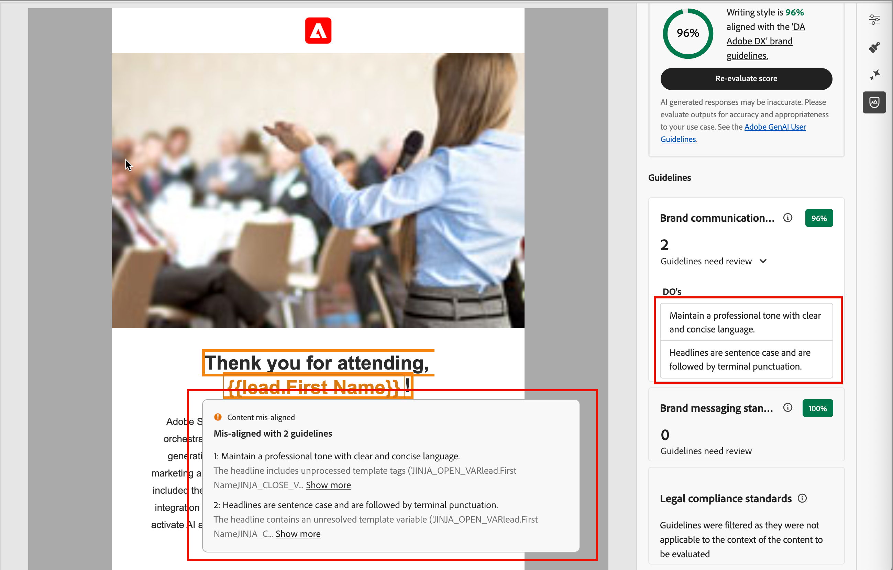

# Brand alignment scoring {#brand-score}

>[!CONTEXTUALHELP]
>id="ajo-b2b_brand_score_overview"
>title="Merk selecteren"
>abstract="Selecteer uw merk om ervoor te zorgen dat uw inhoud is samengesteld in overeenstemming met de specifieke richtlijnen, standaarden en identiteit, zodat consistentie en brandintegriteit behouden blijven."

>[!CONTEXTUALHELP]
>id="ajo-b2b_brand_score"
>title="Brand-uitlijningsscore"
>abstract="Met de uitlijningsscore van uw merk kunt u meten hoe goed uw inhoud voldoet aan de richtlijnen voor het merk. Zo bent u verzekerd van consistentie in kleuren, lettertypen, logo, afbeeldingen en schrijfstijl."

>[!CONTEXTUALHELP]
>id="ajo-b2b_brand_colors"
>title="Kleurscore"
>abstract="Kleurscore"

>[!CONTEXTUALHELP]
>id="ajo-b2b_brand_fonts"
>title="Lettertypescore"
>abstract="Lettertypescore"

>[!CONTEXTUALHELP]
>id="ajo-b2b_brand_logos"
>title="Logos score"
>abstract="Logos score"

De merkgroeperingsevaluatie en de scores helpen u om, inhoud tot stand te brengen te herzien en te beheren die aan de richtlijnen [ volgt die in het geselecteerde merk ](./brands-manage-create.md#brand-definitions) worden bepaald. Het zorgt voor consistentie in toon, overseinen, en visuele identiteit over uw e-mailcampagnes, terwijl ook als kwaliteitscontrole dient alvorens uw inhoud live gaat.

>[!AVAILABILITY]
>
>Dit vermogen is momenteel beschikbaar als privé bèta, met progressieve beschikbaarheid die voor alle klanten in toekomstige versies wordt gepland.
>
>De a [ gebruikersovereenkomst ](https://www.adobe.com/legal/licenses-terms/adobe-dx-gen-ai-user-guidelines.html){target="_blank"} wordt vereist alvorens u AI-aangedreven eigenschappen in Adobe Journey Optimizer B2B edition kunt gebruiken. Neem voor meer informatie contact op met uw Adobe-vertegenwoordiger.
>
>Zie [ merk-verwante toestemmingen ](./brands-overview.md#brand-related-permissions) voor informatie over hoe de productbeheerders deze eigenschappen kunnen toelaten.

## De uitlijning van uw merk valideren

Wanneer uw merk goed gedefinieerd en gepubliceerd is, kunt u de score voor uitlijning van uw merk direct binnen de ontwerpruimte van de e-mail beoordelen om ervoor te zorgen dat de inhoud in overeenstemming is met de richtlijnen van uw merk:

1. Nadat u de e-mailinhoud creeert, klik de _groepering van het Merk_ (  ) op het recht om het _Merk groeperings_ juiste paneel in de e-mailontwerpruimte te openen.

   Het [ standaardmerk ](./brands-manage-create.md#default-brand) wordt automatisch geselecteerd.

   {width="600" zoomable="yes"}

   U kunt het _Volledige scherm_ ( ) pictogram bij de bovenkant van het paneel klikken om de merkgroeperingshulpmiddelen op het volledig-schermwijze te tonen.

1. Indien nodig, klik de **[!UICONTROL Brand]** menupijl ( ) om een ander gepubliceerd merk te kiezen.

1. Klik op **[!UICONTROL Evaluate score]** om de inhoud uit te lijnen met het geselecteerde merk.

   Het systeem evalueert de inhoud tegen de richtlijnen voor het geselecteerde merk en geeft de resulterende score weer.

   {width="600" zoomable="yes"}

## Herziening van de evaluatie

De score wordt berekend op basis van geconstateerde overtredingen in de geëvalueerde e-mailinhoud:

* 100 = Perfect - Geen overtredingen gevonden
* 80-99 = Goed - Alleen kleine overtredingen
* 60-79 = Redelijk - Sommige belangrijke schendingen
* Onder 60 = Slecht - Grote schendingen verdienen aandacht

U kunt de evaluatieresultaten in meer detail herzien om u te helpen schendingen identificeren en uw scores van de categorielijn verbeteren (_Hoog_, _Medium_, en _Laag_) en de details herzien. Voor **[!UICONTROL Writing style]** of **[!UICONTROL Visual content]**, klik _uitbreiden_ ( ) pijl uit om de details voor de evaluatie te tonen.

{width="600" zoomable="yes"}

Selecteer een gemarkeerde hulplijn om specifieke feedback en suggesties weer te geven.

U kunt wijzigingen aanbrengen in de inhoud en op **[!UICONTROL Re-evaluate score]** klikken om een andere evaluatie uit te voeren en te controleren op een verbeterd resultaat.
