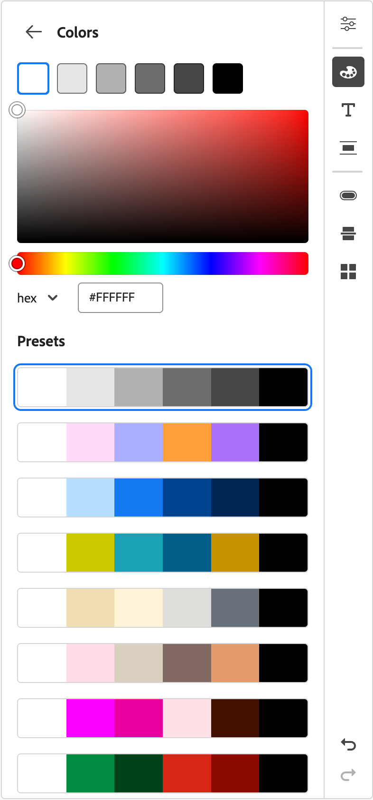
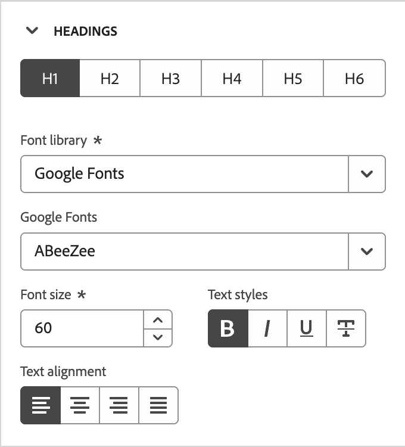
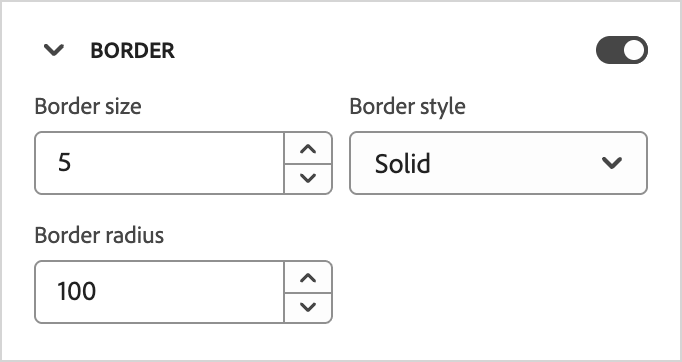
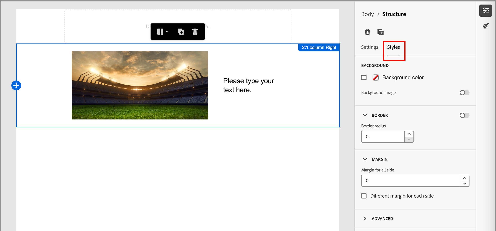

# Brandthema&#39;s gebruiken voor e-mailinhoud {#email-brand-themes}

>[!CONTEXTUALHELP]
>id="ajo-b2b_email_brand_theme"
>title="Een merkthema toepassen op uw e-mail- of e-mailsjabloon"
>abstract="Selecteer een thema voor uw e-mailsjabloon of e-mailsjabloon om een stijl toe te passen die past bij uw merk en ontwerp."

Met thema&#39;s kunnen niet-technische ontwerpers herbruikbare richtlijnen voor het ontwerpen van e-mailinhoud maken die zijn afgestemd op een specifiek merk en een specifieke stijl. Thema&#39;s stellen marketers in staat visueel aantrekkelijke, merkgebonden e-mails sneller en met minder moeite te gebruiken en bieden geavanceerde aanpassingsopties voor unieke ontwerpbehoeften.

## Themarichtsnoeren en -beperkingen {#themes-guidelines}

Houd bij het werken met thema&#39;s rekening met de volgende richtlijnen en beperkingen:

* Wanneer u een e-mail of e-mailmalplaatje van een leeg canvas (_ontwerp van kras_) creeert, kunt u _wijze van het Thema_ kiezen beginnen uw inhoud te bouwen gebruikend een thema om specifieke het stileren toe te passen die uw merk en ontwerp past. Als u _Handmatige wijze_ kiest, kunt u geen thema toepassen tenzij u het ontwerp voor het e-mailmalplaatje of e-mailmalplaatje terugstelt.

* [ de Fragmenten ](./fragments.md) zijn niet dwars-compatibel tussen de _wijze van het Thema_ en _Handmatige wijze_ in de e-mailinhoud. Om een fragment in e-mailinhoud te gebruiken waar een thema wordt toegepast, moet het fragment ook op _wijze van het Thema_ worden gecreeerd.

* Als u een aangepast thema wijzigt, worden niet automatisch alle e-mails of e-mailsjablonen opgeslagen die het al gebruiken. Bewerk de inhoud voor elk thema om het thema te vernieuwen.

* Als u een thema verwijdert, heeft dit geen invloed op een e-mail- of e-mailsjabloon waarop het al is toegepast.
<!-- 
* If using a content created in HTML, you will be in [compatibility mode](existing-content.md) and you cannot apply themes to this content.
-->

## Een merkthema maken {#create-theme}

Definieer uw eigen merkthema dat u kunt toepassen op de inhoud van uw e-mailsjabloon en e-mailsjabloon in uw toekomstige e-mailinhoud.

1. Gebruik een van de volgende methoden om toegang te krijgen tot de themagereedschappen:

   * [ creeer een nieuw e-mailmalplaatje ](./email-templates.md#create-an-email-template) en klik **[!UICONTROL Edit email template]** om de _[!UICONTROL Design your template]_&#x200B;pagina te lanceren.

   * Klik op **[!UICONTROL ... More]** rechtsboven in de ontwerpruimte voor e-mailinhoud en kies **[!UICONTROL Change your design]** .

     {width="700" zoomable="yes"}

     Klik in het bevestigingsdialoogvenster op **[!UICONTROL Change template]** om de ontwerppagina te openen.

1. Kies **[!UICONTROL Create or edit themes]** in de ontwerppagina.

   {width="800" zoomable="yes"}

1. Selecteer het standaardthema of gebruik een van de Adobe-thema&#39;s die u wilt gebruiken als beginpunt.

   >[!NOTE]
   >
   >Als u één van uw douanethema&#39;s (_[!UICONTROL My themes]_) als uitgangspunt wilt gebruiken, kunt u het [ dupliceren ](#delete-or-duplicate-a-theme) en de themanaam veranderen wanneer u [ het thema ](#edit-a-theme) uitgeeft.

1. Klik op **[!UICONTROL Create]**.

   {width="750" zoomable="yes"}

   De pagina _[!UICONTROL Create a theme]_&#x200B;bevat een canvas met de bestaande elementen van alle typen tekst, knoppen en containers uit het beginthema.

1. Gebruik de juiste navigatie om de verschillende tabbladen voor themastijlen te openen en de themainstellingen te wijzigen:

   * [Algemene instellingen](#general-settings)
   * [Kleuren](#colors)
   * [Tekstinstellingen](#text-settings)
   * [Tussenruimte en rand](#spacing-and-border)
   * [Knop](#button)
   * [Scheidingslijn](#divider)
   * [Raster](#grid)

   De visuele elementen veranderen op het canvas aangezien u de nieuwe themamontages bepaalt. Als het resultaat niet is wat u wilt, kunt u _klikken ongedaan maakt_ ( {width="16"}) pictogram bij de bodem van het juiste paneel. Klik _opnieuw_ ( {width="16"}) pictogram om de verandering opnieuw toe te passen.

1. Klik op **[!UICONTROL Save]** wanneer de themadefinitie is voltooid.

1. Klik op **[!UICONTROL Close]** om terug te keren naar de _[!UICONTROL Create a theme]_&#x200B;pagina en vervolgens op **[!UICONTROL Cancel]**&#x200B;om terug te keren naar de ontwerppagina.

   U kunt **[!UICONTROL Design from scratch]** dan kiezen om de visuele ontwerpruimte te openen en [ het thema ](#use-your-theme-for-email-content-authoring) voor e-mail of malplaatje gebruiken.

### Algemene instellingen

Definieer op het tabblad **[!UICONTROL General settings]** de basisparameters voor uw thema:

* Voer een uniek **[!UICONTROL Theme name]** in.

* Pas de **[!UICONTROL Viewport width]** aan voor de e-mailinhoud (tekst). Gebruik de pijlen omhoog en omlaag om de breedte te vergroten of te verkleinen of voer de waarde in (in pixels).

{width="450"}
<!--  and also export the current theme to [share it across sandboxes](../configuration/copy-objects-to-sandbox.md).-->

### Kleuren

Selecteer het tabblad **[!UICONTROL Colors]** en gebruik de instellingen om het themakleurenpalet te definiëren.

{width="450"}

* Klik op **[!UICONTROL Edit]** om het kleurenpalet weer te geven dat de kleuren voor uw thema bevat.

  Kies een **[!UICONTROL Preset]** om een kleurenschema voor het thema te gebruiken, of pas elke kleur in de reeks aan. U kunt ook een combinatie van beide gebruiken.

  {width="350"}

  Voor het geselecteerde gekleurde vierkant bovenaan kunt u de kleur instellen door een bekende RGB-, HSL-, HSB- of hexadecimale waarde in te voeren. U kunt ook de schuifregelaar Kleur en het kleurveld gebruiken om de kleur te selecteren.

  Klik de _Achterste_ pijl om de hulpmiddelen van het kleurenpalet te sluiten.

* Klik **[!UICONTROL Add variant]** om veelvoudige kleurenvarianten, zoals a _licht_ en _donkere_ wijze tot stand te brengen, waar elke variant zijn eigen kleurenpalet en nuancecontroles heeft. U kunt maximaal zes varianten hebben.

  Voor elke variant, klik _uitgeven_ (  uit) pictogram. U kunt het standaardpalet of aangepaste kleuren gebruiken.

  {width="450"} uit

  Verplaats voor elke kleur die u voor de variant wilt wijzigen de schakeloptie naar links of rechts om deze uit te schakelen of in te schakelen. Voor een ingeschakelde kleurinstelling klikt u op het kleurvakje om de kleur te kiezen.

  {width="450"}

  +++Kleurinstellingen variëren

  De instellingen worden gegroepeerd op type:

  | Type | Instellingen | Beschrijving |
  | ---- | -------- | ----------- |
  | [!UICONTROL General] | {width="300"} | Deze instellingen bepalen de kleuren voor tekst, structuren, containers, achtergronden, koppelingen, rasters en randen. |
  | [!UICONTROL Headings] | {width="300"} | Deze instellingen zijn van toepassing op `Heading` -elementen, waar u tekst en randkleuren kunt instellen voor elk van de zes kopniveaus. Breid elk kopniveau uit dat u de kleur voor de variant wilt plaatsen. |
  | [!UICONTROL Paragraphs] | {width="300"} | Deze instellingen zijn van toepassing op `Paragraph` -elementen, waar u tekst en randkleuren kunt instellen voor elk van de drie alineatypen. Breid elk paragraaftype uit dat u de kleur voor de variant wilt plaatsen. |
  | [!UICONTROL Buttons] | {width="300"} | De montages zijn op knoopelementen van toepassing, waar u de vullingskleur, grenskleur, en tekstkleur voor elk van de drie knoop vooraf instelt: _Primair_, _Secundair_, en _Tertiair_. |

  +++

### Tekstinstellingen

Op het tabblad **[!UICONTROL Text settings]** kunt u de algemene lettertypen, stijlen en grootten instellen die u voor uw thema wilt gebruiken. Voor meer korrelige controle, kunt u deze parameters voor rubriek en paragraaftypes ook uitgeven.

{width="450"}

+++Tekstinstellingen op type

| Type | Instellingen | Beschrijving |
| ---- | -------- | ----------- |
| [!UICONTROL Global] | {width="300"} | Stel de **[!UICONTROL Font library]** in op _[!UICONTROL Standard]_&#x200B;of&#x200B;_[!UICONTROL Google Fonts]_ . Kies vervolgens de lettertypefamilie die u wilt gebruiken. Deze algemene tekstinstellingen worden overal toegepast, tenzij u verschillende tekststijlen instelt voor de kopniveaus en alineatypen. |
| [!UICONTROL Headings] | {width="300"} | Selecteer **[!UICONTROL H1]** , **[!UICONTROL H2]** , enzovoort voor het kopniveau dat u wilt instellen. Stel de **[!UICONTROL Font library]** in op _[!UICONTROL Standard]_&#x200B;of&#x200B;_[!UICONTROL Google Fonts]_ . Kies vervolgens de lettertypefamilie, -grootte en -stijl. Kies **[!UICONTROL Text alignment]**: _Linker_, _Gecentreerd_, _Juist_, of _Uitgelijnd_. |
| [!UICONTROL Paragraphs] | {width="300"} | Selecteer **[!UICONTROL P1]** , **[!UICONTROL HP]** , enzovoort voor het kopniveau dat u wilt instellen. Stel de **[!UICONTROL Font library]** in op _[!UICONTROL Standard]_&#x200B;of&#x200B;_[!UICONTROL Google Fonts]_ . Kies vervolgens de lettertypefamilie, -grootte en -stijl. Pas de **[!UICONTROL Line height]** naar wens aan. Kies **[!UICONTROL Text alignment]**: _Linker_, _Gecentreerd_, _Juist_, of _Uitgelijnd_. |

+++

### Tussenruimte en rand

Op het tabblad **[!UICONTROL Spacing]** kunt u de opvulling en marge voor de verschillende elementtypen instellen. Kies bij **[!UICONTROL Select type]** het inhoudstype. Stel vervolgens de opvulling, marges, hoeken en randen in die van toepassing zijn op dat elementtype.

{width="450"}

+++Instellingen voor tussenruimte

| Type | Instellingen | Beschrijving |
| ---- | -------- | ----------- |
| [!UICONTROL Margins] | {width="300"} | Kies het _pictogram van de Marge_ aan vertoningsmontages die de CSS `margin` parameter herhalen, die aan de ruimte buiten een componentengrens controleert en het van andere componenten/elementen scheidt. Er ontstaat een tussenruimte rondom de component om de positionering en lay-out van omringende inhoud te beïnvloeden. Stel de margewaarden in pixels in op basis van uw ontwerpvereisten. U kunt de marge voor alle zijden, de bovenkant-bodem, de linkerkant, of elke kant van de component onafhankelijk plaatsen. Klik het _Slot_ en _ontgrendelen_ pictogrammen om de top-bottom en linker-juiste margewaarden te synchroniseren of te ontsynchroniseren. |
| [!UICONTROL Paddings] | {width="300"} | Kies het _Opvullen_ pictogram aan vertoningsmontages die de CSS `padding` parameter herhalen, die de ruimte tussen de inhoud van een component/element en zijn grens is. De opvulling biedt interne ruimte die u kunt gebruiken om de afstand tussen de inhoud en de rand van de component te bepalen. Stel de opvullingswaarden in pixels in op basis van uw ontwerpvereisten. U kunt de opvulling voor alle zijden, de bovenkant-bodem, de linkerkant, of elke kant van de component afzonderlijk instellen. Klik het _Slot_ en _ontgrendelen_ pictogrammen om de top-bottom en linker-juiste het opvullen waarden te synchroniseren of te ontsynchroniseren. |
| [!UICONTROL Corners] | {width="300"} | Kies het _pictogram van Hoeken_ aan vertoningsmontages die de CSS `border-radius` parameter herhalen, die de straal van de component/elementhoeken bepaalt. Stel de numerieke waarde in op basis van de curve die u voor de hoeken wilt gebruiken. Met de waarde 0 (standaardwaarde) wordt een vierkante hoek gemaakt. |

+++

+++Randinstellingen

Verplaats de schakeloptie **[!UICONTROL Border]** naar rechts om de weergaveopties voor de randen in te schakelen en stel deze in op basis van uw ontwerpcriteria:

* Als u **[!UICONTROL Border size]** (lijnbreedte) wilt instellen, klikt u op de pictogrammen Pijl-omhoog en Pijl-omlaag om het aantal pixels te verhogen of te verlagen.

* Om **[!UICONTROL Border style]** te plaatsen, verkies een waarde van de lijst van standaardCSS `border-style` waarden, zoals _Ononderbroken_, _Gestippeld_, en _Gepashte_.

* Om te bepalen waar de rand wordt weergegeven, schakelt u elk selectievakje **[!UICONTROL Border position]** in.

{width="250"}

+++

### Knoppen

Op het tabblad **[!UICONTROL Buttons]** kunt u verschillende kenmerken (anders dan kleur) voor knopelementen instellen, zoals de randstraal (vorm), tekst en grootte. U kunt de instellingen voor elk van de drie voorinstellingen voor knoppen wijzigen: _[!UICONTROL Primary]_,_[!UICONTROL Secondary]_ en _[!UICONTROL Tertiary]_.

{width="450"}

+++Knopinstellingen

| Type | Instellingen | Beschrijving |
| ---- | -------- | ----------- |
| [!UICONTROL Text] | {width="300"} | Stel de **[!UICONTROL Font library]** in op _[!UICONTROL Standard]_&#x200B;of&#x200B;_[!UICONTROL Google Fonts]_ . Kies vervolgens de lettertypefamilie, -grootte en -stijl. Kies **[!UICONTROL Text alignment]**: _Linker_, _Gecentreerd_, _Juist_, of _Uitgelijnd_. |
| [!UICONTROL Border] | {width="300"} | Verplaats de schakeloptie **[!UICONTROL Border]** naar rechts om de weergaveopties voor knopranden in te schakelen en stel deze in op basis van uw ontwerpcriteria. Stel de **[!UICONTROL Border size]** (lijndikte) in door het aantal pixels te verhogen of te verlagen. Plaats **[!UICONTROL Border style]** door een waarde van de lijst van standaardCSS `border-style` waarden, zoals _Ononderbroken_ te kiezen, _Gestippeld_, en _Gebroken_. |
| [!UICONTROL Size] | {width="300"} | Klik voor de optie **[!UICONTROL Height]** op de pictogrammen pijl-omhoog en pijl-omlaag om het aantal pixels te vergroten of te verkleinen. Een lege waarde (Auto) is de standaardwaarde en wijzigt de hoogte van de knop in overeenstemming met de inhoud ervan. Voor **[!UICONTROL Width]**, gebruik knevel om de breedte door pixel of percentage te plaatsen. Gebruik de schuifregelaar voor een percentage van de breedte om het percentage in te stellen. Het percentage bepaalt de knopgrootte op basis van het inhoudsvak van het bevattende blok, dat opvulling en randen uitsluit. Met een waarde van 50 stelt u de breedte van de knop in op 50% van de breedte van het blok met inhoud. Voor een op pixels gebaseerde breedte klikt u op de pijlpictogrammen omhoog en omlaag om het aantal pixels te vergroten of te verkleinen. Een lege waarde (_Auto_) is het gebrek en de grootte van de knoop volgens zijn inhoud. |

+++

### Scheidingslijn

Op het tabblad **[!UICONTROL Divider]** kunt u de regelstijlen en containerinstellingen voor een scheidingscomponent instellen.

{width="450"}

+++Scheidingsinstellingen

| Type | Instellingen | Beschrijving |
| ---- | -------- | ----------- |
| [!UICONTROL Line] | {width="300"} | Plaats **[!UICONTROL Border style]** door een waarde van de lijst van standaardCSS `border-style` waarden, zoals _Ononderbroken_ te kiezen, _Gestippeld_, en _Gebroken_. |
| [!UICONTROL Container size] | {width="300"} | Klik voor de optie **[!UICONTROL Height]** op de pictogrammen pijl-omhoog en pijl-omlaag om het aantal pixels voor de component of het element te verhogen of te verlagen. Een lege waarde (Auto) is de standaardinstelling en wijzigt de hoogte in overeenstemming met de inhoud (regelopmaak). Voor **[!UICONTROL Width]**, gebruik knevel om de breedte door pixel of percentage te plaatsen. Gebruik de schuifregelaar voor een percentage van de breedte om het percentage in te stellen. Het percentage bepaalt de elementbreedte op basis van het inhoudsvak van het bevattende blok. Met een waarde van 50 stelt u de breedte van de scheidingslijn in op 50% van de breedte van het omvattende blok. Voor een op pixels gebaseerde breedte klikt u op de pijlpictogrammen omhoog en omlaag om het aantal pixels te vergroten of te verkleinen. Een lege waarde (_Auto_) is het gebrek en de grootte van de verdeler volgens zijn inhoud. |
| [!UICONTROL Alignment] | {width="300"} | Kies de horizontale groepering binnen het bevattende blok: _Linker_, _Gecentreerd_, of _Juist_. |

+++

### Raster

Op het tabblad **[!UICONTROL Grid]** kunt u de tussenruimten tussen kolommen en rijen voor een rasterelement instellen:

* **[!UICONTROL Column gap]** - Klik op de pictogrammen pijl-omhoog en pijl-omlaag om het aantal pixels voor de tussenruimte tussen de rasterkolommen te vergroten of te verkleinen. U kunt ook een getal in het veld invoeren.

* **[!UICONTROL Rows gap]** - Klik op de pictogrammen pijl-omhoog en pijl-omlaag om het aantal pixels voor de tussenruimte tussen de rasterrijen te vergroten of te verkleinen. U kunt ook een getal in het veld invoeren.

{width="700" zoomable="yes"}

## Een thema bewerken

U kunt een thema bewerken met dezelfde workflow en gereedschappen die u gebruikt wanneer u een thema maakt. Het verschil is dat u de tab **[!UICONTROL My themes]** selecteert en het aangepaste thema selecteert dat u wilt wijzigen.

{width="750" zoomable="yes"}

Gebruik de rails aan de rechterkant om door de verschillende tabbladen te navigeren en thema-instellingen te wijzigen:

* [Algemene instellingen](#general-settings)
* [Kleuren](#colors)
* [Tekstinstellingen](#text-settings)
* [Tussenruimte en rand](#spacing-and-border)
* [Knop](#button)
* [Scheidingslijn](#divider)
* [Raster](#grid)

{width="800" zoomable="yes"}

De weergegeven visuele elementen veranderen wanneer u de instellingen wijzigt. Als het resultaat op het canvas niet is wat u wilt, kunt u _klikken ongedaan maakt_ ( {width="16"}) pictogram bij de bodem van het juiste paneel. Klik _opnieuw_ ( {width="16"}) pictogram om de verandering opnieuw toe te passen.

Klik op **[!UICONTROL Save]** wanneer de themawijzigingen zijn voltooid.

>[!NOTE]
>
>De opgeslagen wijzigingen worden niet automatisch getrapt naar alle e-mailsjablonen of e-mailsjablonen die momenteel het thema gebruiken. Bewerk de inhoud voor elk thema om het thema te vernieuwen en de bijgewerkte stijlen aan te passen.

## Aangepaste thema&#39;s beheren

U kunt uw aangepaste thema&#39;s beheren met dezelfde workflow en gereedschappen die u gebruikt wanneer u een thema maakt. Het verschil is dat u de tab **[!UICONTROL My themes]** selecteert en uw thema&#39;s in de weergegeven lijst beheert.

Als u een grote lijst van douanethema&#39;s hebt, gebruik het _gebied van het Onderzoek_ en andere filters om de getoonde lijst te verminderen. Terwijl u de lijst met beschikbare thema&#39;s beheert, kunt u een aangepast thema op elk gewenst moment bewerken, verwijderen of dupliceren.

{width="750" zoomable="yes"}

### Een thema bewerken

1. Selecteer het thema dat u wilt wijzigen en klik op **[!UICONTROL Edit]** rechtsboven.

   {width="750" zoomable="yes"}

1. Gebruik de navigatie aan de rechterkant om de verschillende tabbladen voor opmaak te gebruiken en thema-instellingen te wijzigen:

   * [Algemene instellingen](#general-settings)
   * [Kleuren](#colors)
   * [Tekstinstellingen](#text-settings)
   * [Tussenruimte en rand](#spacing-and-border)
   * [Knop](#button)
   * [Scheidingslijn](#divider)
   * [Raster](#grid)

   {width="800" zoomable="yes"}

   De weergegeven visuele elementen veranderen wanneer u de instellingen wijzigt. Als het resultaat op het canvas niet is wat u wilt, kunt u _klikken ongedaan maakt_ pictogram bij de bodem van het juiste spoor. Klik _opnieuw_ pictogram om de verandering opnieuw toe te passen.

1. Klik op **[!UICONTROL Save]** wanneer de themawijzigingen zijn voltooid.

>[!NOTE]
>
>De opgeslagen themawijzigingen worden niet automatisch getrapt naar alle e-mails of e-mailsjablonen die momenteel het thema gebruiken. Bewerk de inhoud voor elk thema om het thema te vernieuwen en de bijgewerkte stijlen aan te passen.

### Een thema verwijderen of dupliceren

Wanneer u van het thema de plaats bepaalt, klik _Meer menu_ (**..**) pictogram bij het lagere recht van de themakaart en kies de actie die u wilt nemen:

{width="220"}

* **[!UICONTROL Duplicate]** - Kies deze actie om het thema te dupliceren. Het nieuwe thema is identiek met _Exemplaar van_ toegevoegd aan de naam van origineel. U kunt de naam veranderen wanneer u [ het thema ](#edit-a-theme) uitgeeft.

* **[!UICONTROL Delete]** - Kies deze actie om het aangepaste thema te verwijderen. Klik op **[!UICONTROL Delete]** in het bevestigingsdialoogvenster.

  >[!NOTE]
  >
  >Het verwijderen van het thema heeft geen invloed op een e-mail- of e-mailsjabloon waarop het al is toegepast.

## Een thema gebruiken voor het ontwerpen van e-mailinhoud {#use-email-theme}

Wanneer u een nieuwe e-mail- of e-mailsjabloon maakt, kunt u ervoor kiezen een merkthema te gebruiken dat het ontwerpproces voor inhoud stroomlijnt en ervoor zorgt dat het ontwerp wordt afgestemd op gedefinieerde standaarden. Voor een nieuw fragment kunt u ook een thema toepassen voordat u het fragment opslaat. Het fragment blijft op _wijze van het Thema_ van dat punt en is compatibel om aan e-mail en e-mailmalplaatjes toe te voegen die ook op _wijze van het Thema_ zijn.

1. Selecteer een van de volgende handelingen:

   * Selecteer een e-mailmalplaatje dat een thema (dat in _wordt gecreeerd wijze van het Thema_) opneemt. Het thema dat specifiek is voor elke sjabloon wordt automatisch toegepast.

   * Gebruik de optie _[!UICONTROL Design from scratch]_&#x200B;en selecteer **[!UICONTROL Use Themes]**&#x200B;om te beginnen met een vooraf gedefinieerd opmaakthema.

     {width="450"}

     >[!IMPORTANT]
     >
     >Als u de modus _[!UICONTROL Manual Styling]_&#x200B;kiest, moet u het e-mailontwerp opnieuw instellen om een thema toe te passen.
     >
     >Als u _[!UICONTROL Themes]_&#x200B;wijze kiest, slechts [ fragmenten ](./fragments.md) die ook op_ Thema&#39;s _wijze worden gecreeerd zijn beschikbaar om aan de e-mailinhoud toe te voegen.

1. In de e-mailontwerpruimte, klik het _pictogram van Thema&#39;s_ ( ) op het recht.

   {width="600" zoomable="yes"}

   Het standaardthema of het thema dat op de sjabloon wordt toegepast, wordt weergegeven. U kunt schakelen tussen de kleurvarianten voor dit thema.

1. Klik op de pijl naast het weergegeven thema om de lijst met beschikbare aangepaste en Adobe-thema&#39;s weer te geven.

1. Klik op **[!UICONTROL My themes]** en selecteer het aangepaste thema.

   {width="325"}

1. Klik buiten de lijst.

   Het zojuist geselecteerde aangepaste thema past de stijlen toe op alle e-mailcomponenten op het canvas. U kunt schakelen tussen de kleurvarianten.

1. Als u de themastijlen voor een geselecteerde component moet met voeten treden, klik _de componentenstijlen van de Ontgrendeling_ (  ).

   {width="600" zoomable="yes"}

   Klik op **[!UICONTROL Unlock]** in het bevestigingsdialoogvenster.

   Selecteer de tab **[!UICONTROL Styles]** in het rechterdeelvenster om de instellingen voor de component te wijzigen.

   {width="600" zoomable="yes"}

## Het thema voor uw e-mailinhoud wijzigen

Voor een e-mail of e-mailmalplaatje dat in _wijze van het Thema_ wordt gecreeerd, kunt u het thema op elk ogenblik veranderen. De e-mailinhoud blijft ongewijzigd, maar de stijlen worden bijgewerkt met het nieuwe thema.

1. Open de sjabloon voor e-mail of e-mail in de ontwerpruimte.

1. Klik het _pictogram van Thema&#39;s_ ( ) op het recht.

   Het toegepaste thema wordt weergegeven in het rechterdeelvenster.

1. Klik op de pijl naast het weergegeven thema om de lijst met beschikbare aangepaste en Adobe-thema&#39;s weer te geven.

1. Selecteer een ander thema.

1. Klik buiten de lijst.

   Met het geselecteerde thema past u de stijlen toe op alle e-mailcomponenten op het canvas. U kunt schakelen tussen de kleurvarianten.

<!--
>[!NOTE]
> - Themes apply styles globally. Ensure your theme is finalized before applying it to multiple emails.
> - Switching themes may override custom styles applied to individual components.

>[!CAUTION]
> - When using fragments, the email's theme will override the fragment's styles. A warning will be displayed in the editor if there is a conflict.

## Example Use Cases {#example-use-cases}

### 1. Creating a New Theme
- A designer creates a theme with their brand's colors, fonts, and button styles.
- The theme is saved and reused by marketers to author multiple emails.

### 2. Switching Themes
- A marketer applies a holiday-themed design to an existing email by switching to a pre-designed holiday theme.-->
