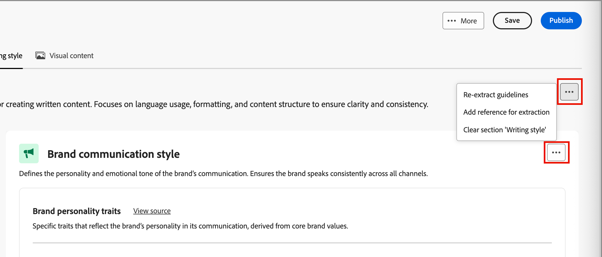
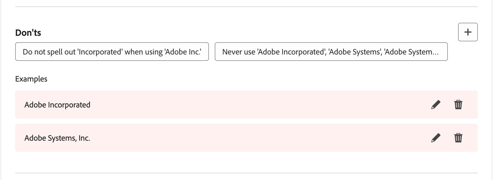
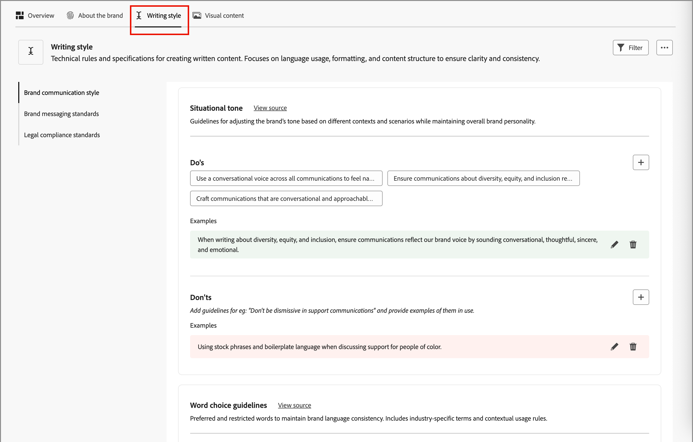

# Uw merken maken en beheren {#brand-library}

Definieer een merk om een gedetailleerde set regels en standaarden te bieden waarmee een visuele en verbale identiteit wordt vastgesteld. Deze richtlijnen bevatten een referentie om een consistente merkweergave te behouden op alle marketing- en communicatieplatforms. Door gebruik te maken van duidelijk gedefinieerde merkrichtlijnen, kunnen organisaties ervoor zorgen dat alle inspanningen voor het creëren van inhoud worden afgestemd op de strategische doelstellingen en de algehele merkidentiteit. Deze consistentie verbetert niet alleen de herkenning van merken en het vertrouwen, maar draagt ook bij tot een meer samenhangende en onveranderlijke klantervaring op alle aanraakpunten.

In Journey Optimizer B2B edition kunt u uw merkdefinities en -middelen handmatig definiëren en ordenen, of documenten met brandrichtlijnen uploaden voor automatische informatie en het ophalen van visuele middelen.

>[!AVAILABILITY]
>
>Dit vermogen is momenteel beschikbaar als privé bèta, met progressieve beschikbaarheid die voor alle klanten in toekomstige versies wordt gepland.
>
> 
>
>De a [ gebruikersovereenkomst ](https://www.adobe.com/legal/licenses-terms/adobe-dx-gen-ai-user-guidelines.html){target="_blank"} wordt vereist alvorens u AI-aangedreven eigenschappen in Adobe Journey Optimizer B2B edition kunt gebruiken. Neem voor meer informatie contact op met uw Adobe-vertegenwoordiger.
>
> 
>
>Zie [ merk-verwante toestemmingen ](./brands-overview.md#brand-related-permissions) voor informatie over hoe de productbeheerders deze eigenschappen kunnen toelaten.

## Toegang tot uw merkbibliotheek

Ga naar de linkernavigatie en klik op **[!UICONTROL Content Management]** > **[!UICONTROL Brands]** om merkpakketten te openen in Adobe Journey Optimizer B2B edition. Met deze actie opent u een pagina waarop de gemaakte merken als kaarten worden weergegeven.

{width="800" zoomable="yes"}

Als er nog geen gecreeerde merken zijn, wordt één enkele grafisch getoond met een knoop [ om uw eerste merk ](#create-and-define-a-brand) tot stand te brengen.

### Handelingen voor merkbeheer

Voor elke kaart, kunt u het _Meer menu_ klikken (  ) pictogram en een actie voor het merk kiezen:

* **[!UICONTROL View brand]** - Open de merkpagina en geef de definities weer.
* **[!UICONTROL Mark as default brand]** (Levend slechts) - [ Mark het merk als gebrek ](#default-brand) voor inhoudgroepering en generatie.
* **[!UICONTROL Edit]** - Open de merkpagina en bewerk de richtlijnen, uitsluitingen en voorbeelden van merken.
* **[!UICONTROL Duplicate]** - Maak een kopie als een nieuw conceptmerk.
* **[!UICONTROL Publish]** (Ontwerp slechts) - [ publiceer het merk ](#publish-the-brand) om het voor gebruik met inhoudgroepering en generatie beschikbaar te maken.
* **[!UICONTROL Unpublish]** (Alleen live) - Publiceer het merk ongedaan om het niet te gebruiken voor het uitlijnen en genereren van inhoud.
* **[!UICONTROL Delete]** - Verwijder het merk uit uw merkbibliotheek.

{width="440"}

### Standaardmerk

U kunt een standaardmerk aanwijzen dat automatisch moet worden toegepast bij het genereren van inhoud en het berekenen van uitlijningsscores tijdens het maken van inhoud. Slechts kan een gepubliceerd (_Levend_) merk het gebrek zijn.

In de bibliotheek van Merken, wordt de standaardmerkkaart getoond met een vlag.

{width="200"}

U kunt om het even welk gepubliceerd (_Levend_) merk als standaardmerk plaatsen. Voor de merkkaart, klik het _Meer menu_ ( ) pictogram en kies **[!UICONTROL Mark as default brand]**.

{width="350"} aan

## Een merk maken en definiëren {#create-brand}

>[!CONTEXTUALHELP]
>id="ajo-b2b_brands_create"
>title="Uw merk maken"
>abstract="Voer uw merknaam in en upload het bestand met uw merkrichtlijnen. Het hulpmiddel haalt zeer belangrijke details automatisch uit, die het gemakkelijker maken om uw merkidentiteit te handhaven."

Als u richtlijnen voor uw merk wilt maken en definiëren, kunt u de details invoeren of de documenten met uw merkaanwijzing uploaden voor automatische extractie.

### Voeg het merk toe

1. Klik rechtsboven op de pagina _[!UICONTROL Brands]_&#x200B;op **[!UICONTROL Create brand]**.

1. Voer een **[!UICONTROL Name]** in voor uw merk.

1. Sleep of selecteer het bestand om de richtlijnen van uw merk te uploaden en automatisch relevante merkgegevens te extraheren.

   {width="500"}

   >[!NOTE]
   >
   >Als u geen document hebt opgeslagen in de PDF-indeling, kunt u de richtlijnen handmatig toevoegen en afzonderlijke visuele elementen uploaden nadat u het merk hebt gemaakt.

1. Klik op **[!UICONTROL Create brand]**.

   Als u een of meer bestanden opneemt om het merk te maken, begint het informatieextractieproces. Het kan enkele minuten duren.

   Wanneer het extractieproces is voltooid, worden uw normen voor inhoud en visuele ontwikkeling automatisch ingevuld.

   {width="700" zoomable="yes"}

### Richtlijnen voor merken verfijnen en bijwerken

1. Blader door de verschillende tabbladen om desgewenst gedetailleerdere informatie aan te passen en te definiëren.

   * [!UICONTROL Overview]

   * [[!UICONTROL About the brand]](#about-the-brand)

   * [[!UICONTROL Writing style]](#writing-style)

   * [[!UICONTROL Visual content]](#visual-content)

   Als u bij het maken van het merk een of meer documenten hebt opgenomen, zijn bij het uitpakken van de informatie definities voor de tabbladen en secties gemaakt. De volledigheid hangt af van de reikwijdte en de details in de documenten. Terwijl u het resultaat bekijkt, kunt u alle gegevens wijzigen of verwijderen.

   Van het _Meer menu_ ( ) voor elke lusje of categorie, kunt u documenten toevoegen om relevante merkinformatie automatisch te halen. U kunt ook de bestaande inhoud wissen.

   {width="500" zoomable="yes"} toe

   Als u de bron voor de geëxtraheerde informatie in een subsectie wilt bekijken, klikt u op de koppeling **[!UICONTROL View source]** .

   {width="700" zoomable="yes"}

1. Controleer op elk tabblad Details de categorieën en verbeter het merk door uw definities toe te voegen, te verwijderen en te wijzigen.

   Een subsectie met het label **[!UICONTROL Do's]** geeft een overzicht van de richtlijnen voor de categorie. Gebruik dit gebied om beschrijvingen van richtlijnen en voorbeelden van de richtlijnen toe te voegen.

   {width="500" zoomable="yes"}

   In een subsectie met het label **[!UICONTROL Don'ts]** worden de uitsluitingen beschreven. In dit gebied kunt u uitsluitingsbeschrijvingen en voorbeelden van uitsluitingen toevoegen.

   {width="500" zoomable="yes"}

   * **voeg een richtlijn of een uitsluiting** toe.

     In de sectie waar u een richtlijn wilt toevoegen, klik _toevoegen_ (  toe) pictogram op het recht. Voer in het pop-updialoogvenster de hulplijn in en selecteer de selectievakjes om de kanalen en elementen aan te geven waarvoor de hulplijn geldt. Klik vervolgens op **[!UICONTROL Add]** .

     {width="600" zoomable="yes"} toe

   * **Verandering een richtlijn of een uitsluiting**.

     Klik in de sectie waar u een hulplijn wilt verwijderen op de widget voor hulplijnen. Wijzig in het pop-updialoogvenster zo nodig de inhoud voor de hulplijn en de geselecteerde selectievakjes. Klik vervolgens op **[!UICONTROL Update]** .

     {width="600" zoomable="yes"}

   * **verwijder een richtlijn of een uitsluiting**.

     Klik in de sectie waar u een hulplijn wilt verwijderen op de widget voor hulplijnen. In de popup dialoog, klik _Schrapping_ ( ) pictogram bij de bovenkant.

   * **voeg of herzie voorbeelden van uw richtlijnen en uitsluitingen** toe.

     In de getoonde voorbeeldtegel, klik _uitgeven_ (  uit) om het voorbeeld te veranderen, of klik _Schrapping_ ( ) om het te verwijderen.

1. Wanneer u alles hebt bepaald, klik **[!UICONTROL Save]**.

   U kunt wijzigingen in het concept blijven aanbrengen totdat u besluit dat het gereed is om te publiceren.

### Het merk publiceren

Als uw merk een volledige reeks definities bevat en aan uw vereisten voldoet, klikt u op **[!UICONTROL Publish]** om uw merkrichtlijnen beschikbaar te stellen voor het uitlijnen en genereren van inhoud.

De gepubliceerde merken zijn toegankelijk van de **[!UICONTROL Brand]** optie in de AI [ merkgroepering ](./brand-alignment.md) en de hulpmiddelen van de inhoudgeneratie. <!-- [Learn more about content generation](gs-generative.md) -->

{width="300"}

## Merkdefinities

De merkdefinities zijn ingedeeld in drie categorieën, weergegeven als tabbladen. Selecteer elk tabblad om de richtlijnen voor merken in te vullen en bij te werken.

### Informatie over het merk {#about-brand}

Gebruik het tabblad **[!UICONTROL About the brand]** om de belangrijkste identiteit van uw merk vast te stellen. Deze informatie schetst het doel, de persoonlijkheid, het etiketteren, en andere attributen op hoog niveau.

1. Voeg de basisinformatie voor uw merk toe in de categorie **[!UICONTROL Key details]** :

   * **[!UICONTROL Brand kit name]** - Werk de merknaam bij.

   * **[!UICONTROL When to use]** - Geef scenario&#39;s of contexten op waarin dit merk moet worden toegepast.

   * **[!UICONTROL Brand name]** - Voer de officiële naam van het merk in.

   * **[!UICONTROL Description of this brand]** - Geef een overzicht van wat dit merk vertegenwoordigt.

   * **[!UICONTROL Tagline (Default)]** - Voeg de primaire coderegel toe die aan het merk is gekoppeld.

   {width="600" zoomable="yes"}

1. Geef in de categorie **[!UICONTROL Guiding principles]** uitleg over de kernrichting en filosofie van uw merk:

   * **[!UICONTROL Mission]** - Geef details over het merkdoel.

   * **[!UICONTROL Vision]** - Beschrijf het langetermijndoel of de gewenste toekomstige staat.

   * **[!UICONTROL Market positioning]** - Leg uit hoe het merk zich op de markt bevindt.

   {width="600" zoomable="yes"}

   Reviseer vanuit de categorie **[!UICONTROL Core brand values]** de gedefinieerde merkwaarden en pas deze zo nodig aan.

   * Om een nieuwe kernwaarde te bepalen, klik _toevoegen_ ( ) pictogram op het recht toe en voltooi de details:

     {width="500" zoomable="yes"} toe

      * **[!UICONTROL Value]** - Voer de naam in voor de waarde van het kernmerk.

      * **[!UICONTROL Description]** - leg uit wat deze waarde aan uw merk betekent.

      * **[!UICONTROL Behaviors]** - Geef een overzicht van de handelingen of houdingen die deze waarde in de praktijk weerspiegelen.

      * **[!UICONTROL Manifestations]** - Geef voorbeelden van hoe deze waarde wordt uitgedrukt in echte branding.

   * Om een kernwaarde te veranderen of te schrappen, _te klikken geeft_ uit ( ) pictogram uit om een waarde van het kernmerk bij te werken of te schrappen.

     {width="500" zoomable="yes"}

     Wijzig de details en klik op **[!UICONTROL Update]** . Of, klik _Schrapping_ ( ) bij de bovenkant om de kernwaarde te verwijderen.

1. Controleer in de categorie **[!UICONTROL Brand guidelines documents]** de documenten die zijn gebruikt om de richtlijnen voor het merk te genereren.

   Klik op het menupictogram Meer en kies een optie om de richtlijnen voor het merk bij te werken aan de hand van geüploade referentiedocumenten:

   * **[!UICONTROL Re-extract guidelines]** - Kies deze actie om een extractietaak uit te voeren met de huidige documenten.
   * **[!UICONTROL Add reference for extraction]** - Kies deze handeling om een ander document te uploaden en een extractietaak uit te voeren.

   {width="600" zoomable="yes"}

U kunt te werk gaan om [ het schrijven stijl ](#writing-style) of [ visuele inhoud ](#visual-content) richtlijnen, uitsluitingen, en voorbeelden te verfijnen, of u kunt [ uw merk ](#publish-the-brand) publiceren.

### Schrijfstijl {#writing-style}

>[!CONTEXTUALHELP]
>id="ajo_brand_writing_style"
>title="Stijluitlijningsscore schrijven"
>abstract="De sectie Schrijfstijl definieert normen voor taal, opmaak en structuur om te zorgen voor duidelijke, consistente inhoud. De uitlijningsscore, van hoog naar laag, laat zien hoe goed uw inhoud deze richtlijnen volgt en geeft gebieden voor verbetering aan."

In de _[!UICONTROL Writing style]_-definities worden de standaarden voor het schrijven van inhoud beschreven en wordt beschreven hoe taal, opmaak en structuur moeten worden gebruikt om de duidelijkheid, samenhang en consistentie in alle materialen te behouden.

Selecteer de tab **[!UICONTROL Writing Style]** en bekijk elke categorie.

{width="600" zoomable="yes"}

| Categorie | Subcategorie | Voorbeeld van richtlijnen | Voorbeeld van uitsluitingen |
|----------------------------|----------------|-----------------------|-----------------------|
| [!UICONTROL Brand communication style] | [!UICONTROL Brand Personality Traits] | Vriendelijk en toegankelijk. | Wees geen nederlaag. |
|                            | [!UICONTROL Writing Mechanics] | Zorgt dat zinnen kort en ondoeltreffend blijven. | Gebruik geen overdreven jargon. |
|                            | [!UICONTROL Situational Tone] | Houd een professionele toon in crisiscommunicatie. | Wees niet afwijzend bij het ondersteunen van communicatie. |
|                            | [!UICONTROL Word Choice Guidelines] | De woorden van het gebruik zoals _innovatief_ en _slim_. | Vermijd woorden zoals _goedkoop_ of _hack_. |
|                            | [!UICONTROL Language Standards] | Volg de Amerikaanse conventies in het Engels. | Vermeng Brits en Amerikaans spelletje niet. |
| [!UICONTROL Brand messaging standards] | [!UICONTROL Brand messaging standards] | Benadruk innovatie en klant-eerste overseinen. | U mag de productmogelijkheden niet overbelasten. |
|                            | [!UICONTROL Tagline usage] | Plaats de tag onder het logo op alle digitale marketingmiddelen. | Wijzig of vertaal de taglijn niet. |
|                            | [!UICONTROL Core messaging] | Benadruk de belangrijkste voordeelverklaring, zoals betere productiviteit. | Gebruik geen ongerelateerde waardevoorstellen. |
|                            | [!UICONTROL Naming standards] | Gebruik eenvoudige, beschrijvende namen zoals _ProScheduler_. | Gebruik geen complexe termen of speciale tekens. |
| [!UICONTROL Legal compliance standards] | [!UICONTROL Trademark standards] | Gebruik altijd het symbool ™ of ®. | Laat juridische symbolen niet weg wanneer dat nodig is. |
|                            | [!UICONTROL Copyright standards] | Inclusief copyrightkennisgevingen over marketingmaterialen. | Gebruik geen inhoud van derden zonder toestemming. |
|                            | [!UICONTROL Disclaimer standards] | Dislaimers leesbaar weergeven op digitale middelen. | Verberg disclaimers niet in onzichtbare gebieden. |

<!-- #### Preferred and avoided terms

Supplement your work choice guidelines by adding preferred and avoided terms. 

#### Primary tagline and variations

#### Brand names and variations

#### Approved and restricted statements
-->

### Visuele inhoud {#visual-content}

>[!CONTEXTUALHELP]
>id="ajo-b2b_brand_imagery"
>title="Alignment score voor visuele inhoud"
>abstract="De visuele Score van de Uitlijning van Inhoud wijst erop hoe goed uw inhoud uw gevormde merkrichtlijnen aanpast. Met scores van hoog naar laag kunt u de uitlijning in één oogopslag beoordelen. Verken de verschillende categorieën om gebieden voor verbetering te identificeren en elementen te identificeren die buiten merknaam kunnen zijn."

In de _[!UICONTROL Visual content]_-definities worden de standaarden voor beeldbewerking en ontwerp beschreven en worden de specificaties beschreven die nodig zijn om een uniform en consistent merkgebruik te behouden.

Selecteer de tab **[!UICONTROL Visual content]** en bekijk elke categorie.

{width="600" zoomable="yes"}

| Categorie | Voorbeeld van richtlijnen | Voorbeeld van uitsluitingen |
|------------------------|---------------------|---------------------|
| [!UICONTROL Photography standards] | Gebruik natuurlijke belichting voor buitenschoten. | Vermijd te veel bewerkte of gepixeleerde afbeeldingen. |
| [!UICONTROL Illustration standards] | Gebruik schone, minimalistische stijlen. | Vermijd al te complex. |
| [!UICONTROL Icon standards] | Gebruik een consistent rastersysteem van 24 px. | U kunt pictogramafmetingen niet mengen, inconsistente lijndikten gebruiken of van rasterregels afwijken. |
| [!UICONTROL Usage guidelines] | Kies levensstijlafbeeldingen die overeenkomen met echte klanten die het product in professionele omgevingen gebruiken. | Gebruik geen afbeeldingen die de toon van het merk tegenspreken of die uit de context vallen. |

<!-- #### Styles

To define the overall style for the category, click **[!UICONTROL Add style]**. In the popup dialog, enter the style type and description. 

{width="500" zoomable="yes"}

#### Specifications

-->

#### Voorbeeldafbeeldingen

Als u een afbeelding wilt toevoegen waarin het juiste of onjuiste gebruik wordt getoond, kiest u **[!UICONTROL Example]** in het pop-updialoogvenster _[!UICONTROL Add guideline]_&#x200B;of&#x200B;_[!UICONTROL Add exclusion]_ . Klik op **[!UICONTROL Select image]** om een afbeeldingsbestand van uw systeem te kiezen. Klik op **[!UICONTROL Add]** om de afbeelding te uploaden en de miniatuur voor het gebied weer te geven.

{width="500" zoomable="yes"} toe

## Een gepubliceerd merk bewerken

U kunt geen wijzigingen aanbrengen in een gepubliceerd (live) merk, maar u kunt wel een conceptkopie maken om te bewerken. Wanneer u het concept met uw bewerkingen publiceert, vervangt die versie de live versie.

1. Open de merkpagina en klik op **[!UICONTROL Edit brand]** rechtsboven.

1. Klik op **[!UICONTROL Edit Brand]** in het bevestigingsdialoogvenster.

   Met deze actie maakt u een conceptkopie van het merk.

1. Blader door de verschillende tabbladen om de merkgegevens zo nodig bij te werken.

   * Overzicht

   * [Informatie over het merk](#about-the-brand)

   * [Schrijfstijl](#writing-style)

   * [Visuele inhoud](#visual-content)

1. Klik **[!UICONTROL Save]** aangezien u met de ontwerp updates werkt, en dan **[!UICONTROL Publish]** wanneer u bereid bent om de _Levende_ versie te vervangen.
