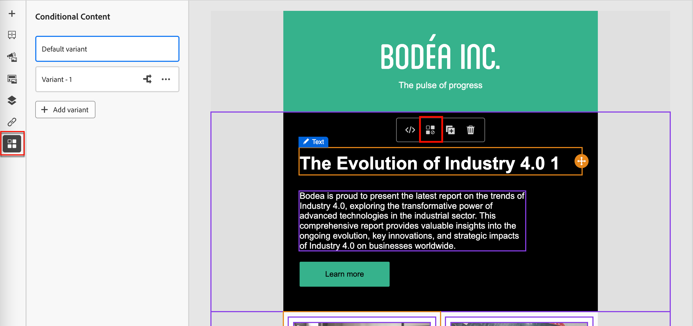
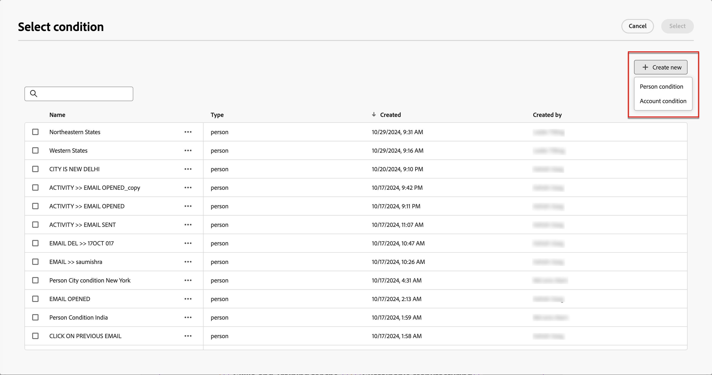

# Voorwaardelijke inhoud

Met voorwaardelijke inhoud kunt u e-mail- en fragmentinhoud aanpassen op basis van voorwaardelijke regels. Deze regels worden gedefinieerd met profielkenmerken of contextuele gebeurtenissen. U kunt voorwaardelijke regels maken in de builder van regels en deze opslaan voor hergebruik tijdens uw accountreizen.

Om voorwaardelijke inhoud aan uw fragmenten en e-mailberichten toe te voegen, staat Adobe Journey Optimizer u toe om voorwaardelijke regels toe te passen die in de _Voorwaarden_ bibliotheek worden opgeslagen. Pas voorwaardelijke regels binnen de visuele ontwerpruimte toe aangezien u auteur [&#x200B; e-mailinhoud voor een rekeningsreis &#x200B;](./email-authoring.md) of a [&#x200B; visueel fragment &#x200B;](./fragment-authoring.md).

## Voorwaardelijke inhoud toevoegen {#email-fragment-content}

>[!CONTEXTUALHELP]
>id="ajo-b2b_conditional_content"
>title="Voorwaardelijke inhoud"
>abstract="Gebruik voorwaardelijke regels om meerdere varianten van een inhoudscomponent te maken. Als aan geen van de voorwaarden wanneer het verzenden van het bericht wordt voldaan, de inhoud van de Standaard variantvertoningen."

>[!CONTEXTUALHELP]
>id="ajo-b2b_conditional_rule_select"
>title="Voorwaardelijke inhoud"
>abstract="Gebruik een voorwaardelijke regel die u in de bibliotheek hebt opgeslagen of maak een nieuwe regel."

Wanneer u een fragment of e-mail maakt in de visuele ontwerpruimte, gebruikt u voorwaardelijke regels om meerdere varianten voor een inhoudscomponent te definiëren.

1. Selecteer een inhoudscomponent en klik op het pictogram **[!UICONTROL Enable conditional content]** op de werkbalk van de component.

   De component wordt oranje omlijnd om aan te geven dat deze wordt geactiveerd als een voorwaardelijke component. De **[!UICONTROL Conditional Content]** paneelvertoningen op de linkerzijde met de _Standaard variant_ en _Variant - 1_.

   {width="700" zoomable="yes"} toe

   De oorspronkelijke inhoud die u hebt geselecteerd en geactiveerd, is de standaardinstelling en wordt toegepast als aan geen van de voorwaardelijke regels wordt voldaan voor een van de varianten die u definieert.

   In dit deelvenster kunt u meerdere varianten voor de geselecteerde inhoudscomponent definiëren aan de hand van voorwaardelijke regels.

1. Beweeg over de eerste variant (_Variant - 1_) en klik _Uitgezochte voorwaarde_ pictogram ( ).

   {width="700" zoomable="yes"}

   Het dialoogvenster _[!UICONTROL Select condition]_&#x200B;wordt geopend en de bibliotheek met voorwaarden wordt weergegeven.

   Als u details voor een voorwaarde wilt bekijken om het te verzekeren is wat u wilt, klik het _Meer menu_ pictogram (**...**) en kies **[!UICONTROL View Info]**.

   {width="600" zoomable="yes"}

   Als de voorwaarde die u nodig hebt niet bestaat, [&#x200B; creeer een voorwaardelijke regel &#x200B;](#create-condition) door **[!UICONTROL Create new]** te klikken.

1. Selecteer de voorwaardelijke regel en klik op **[!UICONTROL Select]** om deze aan de variant te koppelen.

   U kunt de bijbehorende voorwaarde herzien door het _Meer menu_ pictogram (**...**) voor de variant te klikken en **[!UICONTROL View condition]** te kiezen.

   {width="600" zoomable="yes"}

   Klik op X rechtsboven om het pop-upvenster te sluiten.

   {width="500"}

1. Voor betere leesbaarheid, verander de naam van de variant door het _Meer menu_ pictogram (**...**) voor de variant te klikken en **[!UICONTROL Rename]** te kiezen.

   Voer een betekenisvolle naam in voor de variant waarmee u de variant en de intentie kunt identificeren.

   {width="600" zoomable="yes"} anders

1. Selecteer de variant in het linkervenster en wijzig de component om aan te geven hoe deze in het e-mailbericht wordt weergegeven wanneer de voorwaarde true is.

   In dit voorbeeld gebruikt de variant voor de tekstcomponent een andere beschrijving op basis van het gebied van de ontvanger.

   {width="600" zoomable="yes"}

1. Definieer zo nodig een andere variant door op **[!UICONTROL Add variant]** te klikken.

   Herhaal stap 2-5 om een voorwaarde te selecteren, wijzig de naam van de variant en wijzig de component voor de variant.

   U kunt zo veel varianten toevoegen als u nodig hebt voor de inhoudscomponent. Wijzig de geselecteerde variant op elk gewenst moment in het linkervenster om te controleren hoe de inhoudscomponent voor de voorwaarde wordt weergegeven.

   >[!IMPORTANT]
   >
   >Voorwaardelijke inhoud wordt geëvalueerd op basis van de bijbehorende regels in de volgorde waarin de varianten worden weergegeven. De eerste variant met een voorwaarde die als waar evalueert wordt gebruikt voor de component.
   >
   >Als geen van de gedefinieerde variantvoorwaarden waar oplevert bij het verzenden van de e-mail, wordt de inhoudscomponent weergegeven volgens de **[!UICONTROL Default variant]** .

1. Om een variant te schrappen, klik het _Meer menu_ pictogram (**...**) voor de variant en kies **[!UICONTROL Delete]**.

   Klik op **[!UICONTROL Delete]** in het bevestigingsdialoogvenster.

## Voorwaardelijke regels

Voorwaardelijke regels zijn een set voorwaardelijke expressies die kan worden geëvalueerd als true of false. U kunt deze regels gebruiken om te bepalen welke inhoudvariant in een e-mailbericht wordt weergegeven op basis van verschillende filters, zoals profielkenmerken of contextuele gebeurtenissen.
De regels worden opgeslagen in de voorwaardenbibliotheek, waar zij voor hergebruik over e-mail en fragmentinhoud voor uw organisatie beschikbaar zijn.
<!--
>[!NOTE]
>
>You need the [Manage Library Items](../administration/ootb-product-profiles.md) permission to save or delete conditional rules. Saved conditions are available for use by all users within an organization.-->

### Conditiefilters {#condition-filters}

| Type voorwaarde | Filters | Beschrijving |
| -------------- | ------- | ----------- |
| **Rekening** | Accountkenmerken | Attributen van het accountprofiel, waaronder: <li>Jaarlijkse ontvangsten</li><li>Stad</li><li>Land</li><li>Werknemersgrootte</li><li>Marktsegment</li><li>Naam</li><li>SIC-code</li><li>Staat</li> |
| | [!UICONTROL Special filters] > [!UICONTROL Has Buying Group] | De account heeft al dan niet leden van kopersgroepen. Het filter kan ook worden beoordeeld aan de hand van een of meer van de volgende criteria: <li>Belang van oplossing</li><li>Status van kopersgroep</li><li>Complete score</li><li>Engagement Score</li> |
| **Persoon** | [!UICONTROL Activity history] > [!UICONTROL Email] | E-mailactiviteiten in verband met de reis: <li>[!UICONTROL Clicked link in email]</li><li>Geopende e-mail</li><li>Is per e-mail verzonden</li><li>Is per e-mail verzonden</li> Deze voorwaarden worden geëvalueerd aan de hand van een geselecteerd e-mailbericht uit een eerdere reis. |
|  | [!UICONTROL Person Attributes] | Attributen van het profiel van de persoon, met inbegrip van: <li>Stad</li><li>Land</li><li>Geboortedatum</li><li>E-mailadres</li><li>E-mail is ongeldig</li><li>E-mail is geschorst</li><li>Voornaam</li><li>Overgenomen deelstaatgebied</li><li>Functie</li><li>Achternaam</li><li>Mobiel telefoonnummer</li><li>Telefoonnummer</li><li>Postcode</li><li>Staat</li><li>Niet geabonneerd</li><li>Reden waarop geen abonnement is genomen</li> |
| | [!UICONTROL Special filters] > [!UICONTROL Member of Buying Group] | De persoon is al dan niet lid van de koopgroep, beoordeeld aan de hand van een of meer van de volgende criteria: <li>Belang van oplossing</li><li>Status van kopersgroep</li><li>Complete score</li><li>Engagement Score</li><li>Functie</li> |

### Een voorwaardelijke regel maken {#create-condition}

>[!CONTEXTUALHELP]
>id="ajo-b2b_conditions_rule_editor"
>title="Voorwaarde maken"
>abstract="Combineer kenmerken en contextafhankelijke gebeurtenissen om regels te maken die bepalen welke inhoudvariant in e-mailberichten moet worden weergegeven."

U kunt tot de voorwaardelijke regelbouwer van de e-mailontwerpruimte toegang hebben wanneer u een voorwaarde voor een componentenvariant selecteert.

1. Klik in het dialoogvenster _[!UICONTROL Select condition]_&#x200B;op **[!UICONTROL Create new]**&#x200B;en kies het voorwaardetype:

   * **[!UICONTROL Person condition]** - Kies dit type om de voorwaardelijke regel te maken met behulp van personekenmerken en contextuele gebeurtenissen.
   * **[!UICONTROL Account condition]** - Kies dit type om de voorwaardelijke regel samen te stellen met accountkenmerken.

   {width="600" zoomable="yes"}

1. Bouw de voorwaardelijke regel volgens uw behoeften.

   Voor elk attribuut of elke gebeurtenis die u in de regel wilt omvatten, sleep en laat vallen het punt op het regelcanvas. Vouw het filter uit en voltooi de expressie.

   {width="600" zoomable="yes"}

   Als u meerdere filters opneemt, stelt u de **[!UICONTROL Filter logic]** in:

   * **[!UICONTROL Apply all filters]** - de regel evalueert als waar als **alle** de filters waar zijn.
   * **[!UICONTROL Apply any filters]** - de regel evalueert als waar als **om het even welk** van de filters waar is.

1. Typ rechts in het scherm **[!UICONTROL Name]** en **[!UICONTROL Description]** (optioneel) voor de regel.

   Gebruik een betekenisvolle naam en handige beschrijving om anderen in uw organisatie te helpen deze opnieuw te gebruiken in plaats van een andere dubbele voorwaarde te maken.

   {width="600" zoomable="yes"} toe

1. Klik op **[!UICONTROL Save]** wanneer de voorwaardelijke regel is voltooid.

   De voorwaardelijke regel wordt opgeslagen in de bibliotheek en u kunt deze selecteren voor de huidige variant. Het is ook opgenomen in de bibliotheek voor gebruik door andere dynamische inhoudvarianten over reizen van accounts.

### Een regel dupliceren

Voorwaardelijke regels die zijn opgeslagen in de bibliotheek kunnen niet worden gewijzigd. Nochtans, kunt u een bestaande regel dupliceren en het veranderen om een nieuwe regel tot stand te brengen.

1. Klik het _Meer menu_ pictogram (**...**) voor de variant en kies **[!UICONTROL Duplicate]**.

   Een duplicaat van de regel wordt geopend in de regelbuilder. Gebruik het duplicaat als beginpunt voor de regel die u wilt maken.

   {width="600" zoomable="yes"} nodig hebt

1. In de regelbouwer, verander, voeg, of schrap voorwaarden volgens wat u nodig hebt toe.

1. Wijzig de naam en beschrijving zodat deze overeenkomen met het doel of de items in de regel.

1. Klik op **[!UICONTROL Save]** wanneer de voorwaardelijke regel is voltooid.
