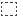
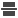
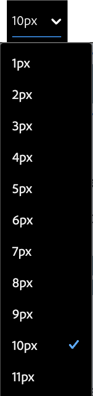
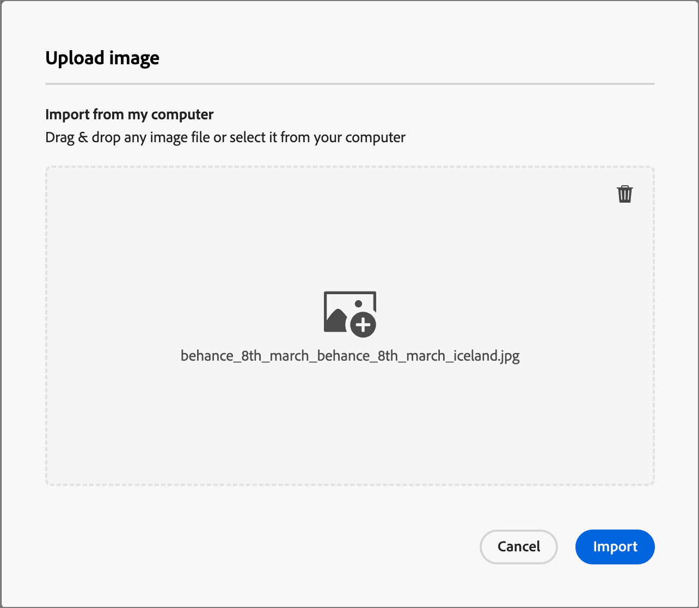
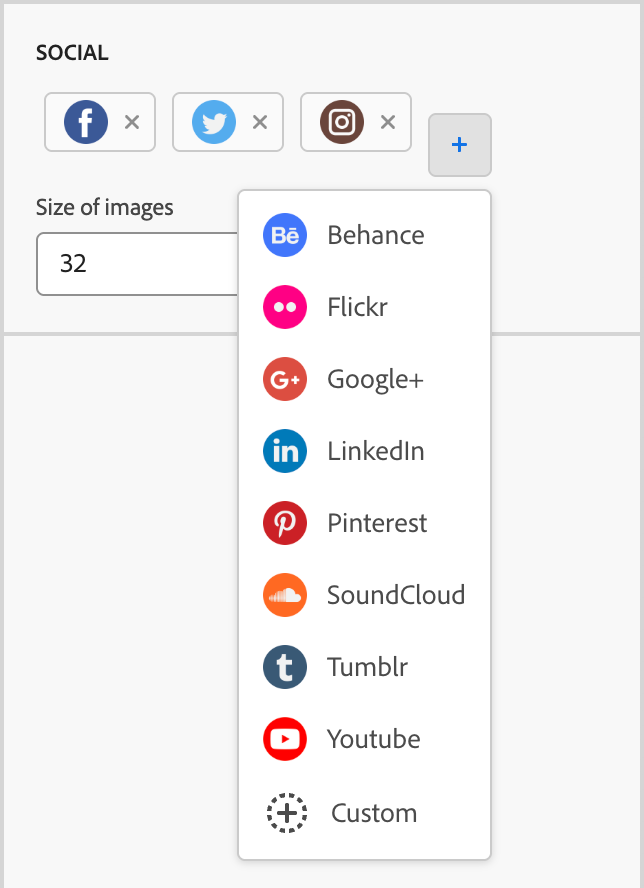

# Inhoudscomponenten {#content-components}

>[!CONTEXTUALHELP]
>id="ajo-b2b_content_components_email"
>title="Informatie over contentonderdelen"
>abstract="Inhoudscomponenten zijn lege plaatsaanduidingen voor inhoud die u kunt gebruiken om een e-mail te ontwerpen."

>[!CONTEXTUALHELP]
>id="ajo-b2b_content_components_landing_page"
>title="Informatie over contentonderdelen"
>abstract="Inhoudscomponenten zijn lege plaatsaanduidingen voor inhoud die u kunt gebruiken om een openingspagina te ontwerpen."

>[!CONTEXTUALHELP]
>id="ajo-b2b_content_components_fragment"
>title="Informatie over contentonderdelen"
>abstract="Inhoudscomponenten zijn lege plaatsaanduidingen voor inhoud die u kunt gebruiken om een fragment te ontwerpen."

>[!CONTEXTUALHELP]
>id="ajo-b2b_content_components_template"
>title="Informatie over contentonderdelen"
>abstract="Inhoudscomponenten zijn lege plaatsaanduidingen voor inhoud die u kunt gebruiken om een sjabloon te ontwerpen."

Wanneer u inhoud ontwerpt voor e-mails, bestemmingspagina&#39;s, sjablonen en visuele fragmenten, gebruikt u de [!UICONTROL Content components] om visuele ontwerpelementen toe te voegen. U kunt zoveel inhoudscomponenten toevoegen als u nodig hebt binnen een of meer structuurcomponenten, die de lay-out definiëren.

## inhoudsbibliotheek

In de sectie **[!UICONTROL Contents]** onder aan de Componentenbibliotheek worden de beschikbare inhoudcomponenten weergegeven:

| Pictogram | Component | Beschrijving |
| --------- | ---- | ----------- |
|  | [ Container ](#container) | Voeg deze component aan uw ontwerp toe om een rechthoekige container te omvatten die u kunt gebruiken om componenten te groeperen of achtergrond of randstijl op een gebied toe te passen. |
|  | [ Knoop ](#button) | Voeg deze component aan uw ontwerp toe om een klikbaar knoopelement te omvatten. |
|  | [ Tekst ](#text) | Voeg deze component aan uw ontwerp toe om een lichaam van tekst te omvatten. |
|  | [ Scheidingsreiziger ](#divider) | Voeg deze component aan uw ontwerp toe om een horizontale lijn te omvatten om gebieden van uw inhoud te scheiden. |
|  | [ HTML ](#html) | Voeg deze component aan uw ontwerp toe om de verschillende delen van uw bestaande HTML te kopiëren-kleven. Gebruik deze component om een vrij modulair HTML-blok te maken voor hergebruik van externe inhoud. |
|  | [ Beeld ](#image) | Voeg deze component aan uw ontwerp toe om een beelddossier op te nemen. |
|  | [ Sociale ](#social) | Voeg deze component aan uw ontwerp toe om verbindingen aan sociale media pagina&#39;s op te nemen. |
|  | [ Vorm ](#form) | **_beschikbaar voor het landen slechts pagina&#39;s._** Voeg deze component aan uw ontwerp toe om een gemaakt formulier in te voegen. |

## Werkbalken van de component Inhoud

Elk type inhoudscomponent geeft een werkbalk weer wanneer u de component op het canvas selecteert. De beschikbare hulpmiddelen, die door het componenttype variëren, verstrekken een gemakkelijke manier om met de component direct in de teruggegeven inhoud te werken. Het omvat het formatteren en functionele mogelijkheden die voor het componenttype van toepassing zijn.

{width="450"}

### Opmaakgereedschappen

+++Tekststijl wijzigen

<table>
    <tr>
        <th style="width: 30%;">Gereedschap</th>
        <th style="width: 50%;">Gebruik</th>
        <th style="width: 20%;">Onderdelen</th>
    </tr>
    <tr>
        <td></td>
        <td>Pas vette, cursieve, onderstreepte, of doorgehaalde, superscript, of subscript op het geselecteerde tekstkoord toe.</td>
        <td><li>Knop <li>Tekst</td>
    </tr>
</table>

+++

+++Horizontale uitlijning

<table>
    <tr>
        <th style="width: 30%;">Gereedschap</th>
        <th style="width: 50%;">Gebruik</th>
        <th style="width: 20%;">Onderdelen</th>
    </tr>
    <tr>
        <td></td>
        <td>Pas een horizontaal uitlijningstype toe op de inhoud van de component. Kies links, gecentreerd, rechts of uitgevuld. </td>
        <td><li>Knop <li>Tekst</td>
    </tr>
</table>

+++

+++lijst maken

<table>
    <tr>
        <th style="width: 30%;">Gereedschap</th>
        <th style="width: 50%;">Gebruik</th>
        <th style="width: 20%;">Onderdelen</th>
    </tr>
    <tr>
        <td></td>
        <td>Hiermee past u geordende of ongeordende lijstopmaak toe op de componenttekst.</td>
        <td><li>Tekst</td>
    </tr>
</table>

+++

+++Kop instellen

<table>
    <tr>
        <th style="width: 20%;">Gereedschap</th>
        <th style="width: 60%;">Gebruik</th>
        <th style="width: 20%;">Onderdelen</th>
    </tr>
    <tr>
        <td></td>
        <td>Hiermee past u opmaak op kopniveau toe op de alinea voor de cursorlocatie.</td>
        <td><li>Knop <li>Tekst</td>
    </tr>
</table>

+++

+++Fontgrootte

<table>
    <tr>
        <th style="width: 20%;">Gereedschap</th>
        <th style="width: 60%;">Gebruik</th>
        <th style="width: 20%;">Onderdelen</th>
    </tr>
    <tr>
        <td></td>
        <td>Pas doopvontgrootte op een geselecteerde tekst toe. Klik op het gereedschap en kies de grootte of voer de px-waarde in.</td>
        <td><li>Knop <li>Tekst</td>
    </tr>
</table>

+++

+++Fontkleur

<table>
    <tr>
        <th style="width: 40%;">Gereedschap</th>
        <th style="width: 40%;">Gebruik</th>
        <th style="width: 20%;">Onderdelen</th>
    </tr>
    <tr>
        <td></td>
        <td>Pas fontkleur toe op de geselecteerde tekst. Kies een kleur in de kleurkiezer en selecteer de kleur met de schuifregelaar en het kleurveld. U kunt ook een bekende RGB-, HSL-, HSB- of hexadecimale waarde invoeren. </td>
        <td><li>Knop <li>Tekst</td>
    </tr>
</table>

+++

+++Koppeling invoegen

<table>
    <tr>
        <th style="width: 40%;">Gereedschap</th>
        <th style="width: 40%;">Gebruik</th>
        <th style="width: 20%;">Onderdelen</th>
    </tr>
    <tr>
        <td></td>
        <td>Maak een klikbare koppeling (externe URL of landingspagina) voor de geselecteerde tekst of het geselecteerde element.</td>
        <td><li>Knop <li>Tekst <li>Afbeelding </td>
    </tr>
</table>

+++

+++Koppeling verwijderen

<table>
    <tr>
        <th style="width: 15%;">Gereedschap</th>
        <th style="width: 60%;">Gebruik</th>
        <th style="width: 25%;">Onderdelen</th>
    </tr>
    <tr>
        <td></td>
        <td> Verwijder de klikbare koppeling (externe URL of landingspagina) voor de geselecteerde tekst of het geselecteerde element.</td>
        <td><li>Knop <li>Tekst <li>Afbeelding </td>
    </tr>
</table>

+++

### Functionele gereedschappen

| Gereedschap | Naam | Gebruik |
| ---- | ---- | ----- |
| {width="40"} toe | Aanpassing toevoegen | Gebruik de verpersoonlijkingsredacteur om verpersoonlijkingstekenen in de componenteninhoud op te nemen. [Meer informatie](./email-authoring.md#personalize-content) |
| {width="40"} | De broncode weergeven | De HTML-broncode voor de component weergeven in een alleen-lezen pop-up.  {width="200"} |
| {width="40"} toe | Voorwaardelijke inhoud inschakelen | Voorwaardelijke varianten voor de component inschakelen. [Meer informatie](./conditional-content.md) |
| {width="40"} | Dupliceren | Maak een kopie van de component en voeg deze direct hieronder toe. |
| {width="40"} | Verwijderen | Verwijder de component. |

## Een inhoudscomponent toevoegen aan uw ontwerp

1. In de visuele ontwerpruimte gebruikt u een bestaande sjabloon of voegt u de benodigde structuurcomponenten toe aan een leeg canvas om de lay-out te definiëren.

1. In de **[!UICONTROL Components]** bibliotheek, pak het _handvat van de Belemmering_  voor de inhoudcomponent van uw keus, dan belemmering en laat vallen het op de structuurcomponenten.

   U kunt meerdere componenten toevoegen aan één structuurcomponent en aan elke kolom van een structuurcomponent.

   {width="600" zoomable="yes"}

1. Pas de componentweergave aan met de tabbladen **[!UICONTROL Settings]** en **[!UICONTROL Style]** aan de rechterkant of met de contextwerkbalk die op het canvas wordt weergegeven.

   U kunt bijvoorbeeld de tekststijl, opvulling of marge van de component wijzigen.

   {width="600" zoomable="yes"}

Aangezien u met uw ontwerp werkt, kunt u [ of ](#remove-a-content-component) ook verwijderen [ een component.](#duplicate-a-content-component)

## Instellingen en stijlen van de component Inhoud

Nadat u een component hebt toegevoegd, wordt deze geselecteerd in de ruimte van het visuele ontwerp en worden de eigenschappen ervan weergegeven in het rechterdeelvenster. U kunt ook op elk gewenst moment een component selecteren om de instellingen en stijlen te wijzigen. Veel instellingen en stijlen zijn specifiek voor de component, maar er zijn enkele standaardinstellingen en -stijlen die u op geselecteerde inhoudscomponenten kunt toepassen.

### Weergaveopties

Wijzig de instelling **[!UICONTROL Display Options]** als u de component wilt uitsluiten van de weergave van het bureaublad of het mobiele apparaat. Met de standaardwaarde, _[!UICONTROL Show on all devices]_, wordt weergave op alle apparaten ingeschakeld. Kies een andere instelling om de component op apparaattype exclusief te maken:

* _[!UICONTROL Show only on desktop devices]_- Kies deze instelling wanneer u de component wilt weergeven op bureaubladapparaten en deze wilt uitsluiten voor mobiele apparaten.
* _[!UICONTROL Show only on mobile devices]_- Kies deze instelling als u de component wilt weergeven op mobiele apparaten, zoals telefoons en tablets, en deze wilt uitsluiten voor bureaubladapparaten.

{width="400" zoomable="yes"}

### Container

Gebruik een container om specifieke opmaak toe te passen op een groep inhoudcomponenten. Voeg een [!UICONTROL Container] -component toe en voeg vervolgens andere inhoudscomponenten toe. Deze component is vergelijkbaar met het gebruik van een `div` -element in HTML. U kunt een afzonderlijke stijl op de container toepassen die verschilt van de stijl die is toegepast op de inhoudcomponenten die de container bevat.

Voeg bijvoorbeeld een component _[!UICONTROL Container]_toe en voeg vervolgens een component_[!UICONTROL Button]_ in die container toe. U kunt een specifieke gebiedsstijl voor de container gebruiken, en de knoop en zijn achtergrond opmaken zoals u nodig hebt.

{width="600" zoomable="yes"}

+++achtergrond

{{styles-background}}

+++

+++Rand

{{styles-border}}

+++

+++Grootte

{{styles-size}}

+++

+++Marge

{{styles-margin}}

+++

+++Opvulling

{{styles-padding}}

+++

### Knop

Gebruik de component [!UICONTROL Button] om een of meerdere klikbare knoppen in te voegen in uw inhoud. Gebruik knoppen om paginaviewers of e-mailontvangers om te leiden naar ondersteunende inhoud (gepubliceerde landingspagina of een externe koppeling).

#### Knoptekst toevoegen

Wanneer de knopcomponent op het canvas wordt weergegeven, bevat de werkbalk opties voor tekstopmaak, alsook voor het aanpassen van de tekst en voorwaardelijke varianten. Zie # voor meer informatie over de opties op de editor-werkbalk.

Wanneer u de tekst van het knoplabel invoert en de opmaak instelt, wordt de grootte van de knop aangepast aan de inhoud.

{width="500" zoomable="yes"} wordt getoond

#### Koppelingsopties instellen

Gebruik op het tabblad _[!UICONTROL Settings]_de opties van **[!UICONTROL Link]**om de knoptekst, het doel van de koppeling en het browsergedrag voor het laden van de doelpagina te definiëren.

1. Stel de **[!UICONTROL Type]** voor de koppeling in:

   * **[!UICONTROL External link]** - Kies dit type als u een standaard-URL als doel voor de koppeling wilt gebruiken.

     Voer in **[!UICONTROL Url]** de URL in voor het doel van de koppeling. Klik _personaliseren_ pictogram ( ) om een verpersoonlijkingstoken als parameter in URL te gebruiken.

     {width="200"}

   * **het Bestaan pagina** - kies dit type om een gepubliceerde het landen pagina in <!-- Journey Optimizer B2B Edition (_Beta_) or --> de verbonden instantie van Marketo Engage te selecteren.

     Selecteer voor de optie **[!UICONTROL Landing Page]** de gepubliceerde bestemmingspagina. Klik het _Uitgezochte pagina_ pictogram ( ) en [ selecteer de gepubliceerde het landen pagina ](./landing-pages.md#link-to-a-landing-page).

     {width="200"}

1. Voer bij **[!UICONTROL Label]** de tekst in die u in de knop wilt weergeven.

   De grootte van de knop wordt aangepast aan de tekst en de stijl die u instelt.

1. Voor ** [!UICONTROL Target**], kies hoe de verbonden bestemming van e-mail of pagina wordt opnieuw gericht:

   * _[!UICONTROL None]_- De koppeling wordt geopend met het standaardgedrag van de browser of client (standaard).
   * _[!UICONTROL Blank]_- Hiermee opent u de koppeling in een nieuw venster of op een nieuw tabblad.
   * _[!UICONTROL Self]_- Hiermee opent u de koppeling in hetzelfde frame.
   * _[!UICONTROL Parent]_- Hiermee opent u de koppeling in het bovenliggende frame.
   * _[!UICONTROL Top]_- Hiermee opent u de koppeling in de volledige tekst van het venster.

#### Stijlen instellen

Pas de knopopmaak aan op het tabblad **[!UICONTROL Styles]** .

+++achtergrond

{{styles-background}}

+++

+++Tekst

{{styles-text}}

+++

+++Rand

{{styles-border}}

+++

+++Grootte

{{styles-size}}

+++

+++Uitlijning

+++

+++knopmarge

+++

+++Containermarge

{{styles-margin}}

+++

+++Opvulling

{{styles-padding}}

+++

+++Geavanceerd

{{styles-advanced}}

+++

### Tekst

Gebruik de component Text om een tekstblok in te voegen in uw inhoud. Wanneer de tekstcomponent op het canvas is geselecteerd, voert u de tekst in en gebruikt u de werkbalkopties om inline-opmaak en opties toe te voegen, waaronder personalisatietokens en voorwaardelijke varianten. Zie Tekstontwerp voor gedetailleerde informatie over het maken van tekst, inclusief inline opmaak en opties, in de ontwerpruimte.

Pas de opmaak van de tekstcomponent aan op het tabblad **[!UICONTROL Styles]** .

+++achtergrond

{{styles-background}}

+++

+++Tekst

Deze stijlen worden toegepast op het hele tekstblok. U kunt inline opmaak toepassen op een geselecteerde tekstreeks.

{{styles-text}}

+++

+++Rand

{{styles-border}}

+++

+++Grootte

{{styles-size}}

+++

+++Marge

{{styles-margin}}

+++

+++Opvulling

{{styles-padding}}

+++

+++Geavanceerd

{{styles-advanced}}

+++

### Scheidingslijn

Voeg a _Scheidingscomponent_ toe om een lineaire afdeling tussen secties van uw inhoud op te nemen.

+++achtergrond

{{styles-background}}

+++

+++regel

+++

+++Grootte

{{styles-size}}

+++

+++Uitlijning

{{styles-alignment-h}}

+++

+++Marge

{{styles-margin}}

+++

+++Opvulling

{{styles-padding}}

+++

+++Geavanceerd

{{styles-advanced}}

+++

### HTML

Gebruik de HTML-component om delen van uw bestaande HTML toe te voegen. Met deze component kunt u eenvoudig modulaire HTML-elementen maken die uw externe inhoud opnieuw gebruiken.

1. Selecteer de component op het canvas en klik _tonen het pictogram van de broncode_ in de toolbar.

   [ open de coderedacteur om HTML ](./assets/content-components-html-show-code.png){width="450"} toe te voegen

1. Plak de HTML in het tekstvak en klik op **[!UICONTROL Save]** .

   [ geef de dialoog van HTML uit ](./assets/content-components-html-edit-dialog.png){width="600" zoomable="yes"}

   Als de HTML geldig is, wordt het element op het canvas weergegeven. Als het een element is dat aan één van de andere inhoudscomponenten toewijst, kunt u de montages en de stijlen in het juiste paneel volgens het componenttype veranderen. Als dit niet het geval is, blijft het een HTML-component.

Voor een HTML-component kunt u de volgende stijlen instellen voor de gehele HTML-component in het rechterdeelvenster:

+++achtergrond

{{styles-background}}

+++

+++Rand

{{styles-border}}

+++

+++Grootte

{{styles-size}}

+++

+++Uitlijning

{{styles-alignment-h-v}}

+++

+++Marge

{{styles-margin}}

+++

+++Opvulling

{{styles-padding}}

+++

+++Geavanceerd

{{styles-advanced}}

+++

### Afbeelding

Gebruik de component [!UICONTROL Image] om een afbeeldingselement in te voegen in uw inhoud. Wanneer de _component van het Beeld_ in het canvas wordt geselecteerd, kunt u het getoonde dossier van de beeldactiva toevoegen of veranderen.

{width="400" zoomable="yes"} wordt getoond

#### Afbeeldingselement toevoegen

Kies het [ type van middelbron 0} ](./assets-overview.md) en selecteer een beelddossier:

* **[!UICONTROL Marketo Engage Assets]** - Kies dit type om door een afbeeldingselement te bladeren en dit te selecteren in de Journey Optimizer B2B edition-bibliotheek of in de aangesloten Market Engage-instantie.

  {width="700" zoomable="yes"}

  In het dialoogvenster kunt u een afbeelding kiezen in de geselecteerde opslagplaats en werkruimte. Klik op **[!UICONTROL Select]** om het element toe te voegen.

  Er zijn hulpmiddelen beschikbaar om u te helpen van de activa de plaats bepalen die u nodig hebt:

   * Klik het _pictogram van de Filter_ op de bovenkant verlaten om de getoonde punten volgens uw criteria te filtreren.

   * Ga tekst op het _gebied van het Onderzoek_ in om de getoonde punten voor een gelijke van de activanaam te filtreren.

     {width="700" zoomable="yes"} nodig hebt

* **[!UICONTROL Experience Manager Assets]** - kies dit type om een beeldactiva van a te doorbladeren en te selecteren [ gevormde Ervaring beheert de bewaarplaats van Assets ](../admin/configure-aem-repositories.md).

  Kies in het dialoogvenster _[!UICONTROL Select Assets]_een afbeelding met de beschikbare gereedschappen om te zoeken naar het benodigde element en klik op **[!UICONTROL Select]**.:

   * Wijzig de **[!UICONTROL Repository]** rechtsboven.

   * Klik op **[!UICONTROL Manage assets]** rechtsboven om de Assets-opslagplaats te openen in een ander browsertabblad en AEM Assets-beheergereedschappen te gebruiken.

   * Klik het _type van Mening_ selecteur bij het hoogste recht om de vertoning in **[!UICONTROL List View]**, **[!UICONTROL Grid View]**, **[!UICONTROL Gallery View]**, of **[!UICONTROL Waterfall View]** te veranderen.

   * Klik het _pictogram van de Sorteervolgorde_ om de sorteervolgorde tussen het stijgen en het dalen te veranderen.

     {width="700" zoomable="yes"} te vinden en te selecteren

   * Klik op de menupijl **[!UICONTROL Sort by]** om de sorteercriteria te wijzigen in **[!UICONTROL Name]** , **[!UICONTROL Size]** of **[!UICONTROL Modified]** .

   * Klik het _pictogram van de Filter_ op de bovenkant verlaten om de getoonde punten volgens uw criteria te filtreren.

   * Ga tekst op het _gebied van het Onderzoek_ in om de getoonde punten voor een gelijke van de activanaam te filtreren.

  {width="700" zoomable="yes"} de plaats te bepalen

* **[!UICONTROL Import media]** - Kies dit type om een bestand op uw systeem te selecteren en in de Journey Optimizer B2B edition-bibliotheek met middelen te importeren.

  Sleep in het dialoogvenster _[!UICONTROL Upload image]_een bestand van uw systeem naar het bestandsvak. De maximale bestandsgrootte is 100 MB.

  {width="450"}

  De bestandsnamen van de geselecteerde afbeeldingen worden weergegeven in het dialoogvenster. Namen van elementbestanden moeten uniek zijn (in verschillende mappen). Als er al een bestand met de naam bestaat, wordt er een bericht weergegeven. Namen kunnen maximaal 100 tekens hebben en mogen geen speciale tekens bevatten (zoals `;` , `:` , `\` en `|` ).

  Klik op **[!UICONTROL Import]**.

U kunt een afbeeldingstitel en alternatieve tekst voor de afbeelding toevoegen in het rechterdeelvenster.

{width="250"}

#### Koppelingsopties instellen

Gebruik op het tabblad _[!UICONTROL Settings]_de opties van **[!UICONTROL Link]**om de afbeelding te koppelen aan een doel en het browsergedrag voor het laden van de doelpagina.

1. Stel de **[!UICONTROL Type]** voor de koppeling in:

   * **[!UICONTROL External link]** - Kies dit type als u een standaard-URL als doel voor de koppeling wilt gebruiken.

     Voer in **[!UICONTROL Url]** de URL in voor het doel van de koppeling. Klik _personaliseren_ pictogram ( ) om een verpersoonlijkingstoken als parameter in URL te gebruiken.

     {width="250"}

   * **het Bestaan pagina** - kies dit type om een gepubliceerde het landen pagina in <!-- Journey Optimizer B2B Edition (_Beta_) or --> de verbonden instantie van Marketo Engage te selecteren.

     Selecteer voor de optie **[!UICONTROL Landing Page]** de gepubliceerde bestemmingspagina. Klik het _Uitgezochte pagina_ pictogram ( ) en [ selecteer de gepubliceerde het landen pagina ](./landing-pages.md#link-to-a-landing-page).

     {width="250"}

1. Voer bij **[!UICONTROL Label]** de tekst in die u in de knop wilt weergeven.

   De grootte van de knop wordt aangepast aan de tekst en de stijl die u instelt.

1. Voor ** [!UICONTROL Target**], kies hoe de verbonden bestemming van e-mail of pagina wordt opnieuw gericht:

   * _[!UICONTROL None]_- De koppeling wordt geopend met het standaardgedrag van de browser of client (standaard).
   * _[!UICONTROL Blank]_- Hiermee opent u de koppeling in een nieuw venster of op een nieuw tabblad.
   * _[!UICONTROL Self]_- Hiermee opent u de koppeling in hetzelfde frame.
   * _[!UICONTROL Parent]_- Hiermee opent u de koppeling in het bovenliggende frame.
   * _[!UICONTROL Top]_- Hiermee opent u de koppeling in de volledige tekst van het venster.

#### Stijlen instellen

Stel de stijlen voor de afbeeldingscomponent in het rechterdeelvenster in.

+++achtergrond

{{styles-background}}

+++

+++Rand

{{styles-border}}

+++

+++Grootte

{{styles-size}}

+++

+++Uitlijning

{{styles-alignment-h}}

+++

+++Marge

{{styles-margin}}

+++

+++Opvulling

{{styles-padding}}

+++

+++Geavanceerd

{{styles-advanced}}

+++

### Sociaal

Gebruik de _Sociale_ component om verbindingen aan sociale media pagina&#39;s in uw inhoud op te nemen. Het omvat drie standaard sociale mediatypen, maar u kunt de typen naar wens toevoegen of verwijderen.

{width="600" zoomable="yes"}

* Om een sociaal media type toe te voegen, klik _toevoegen_ ( **+**) pictogram en kies een sociaal media type dat u wilt toevoegen.

  {width="250"} toe te voegen

* Om een sociaal media type te verwijderen, klik **X** naast het sociale media pictogram.

Selecteer een type sociale media en stel de opties voor dat type in:

* **[!UICONTROL URL]** - Voer de URL van de sociale media in die u aan de afbeelding of het pictogram van de sociale media wilt koppelen.
* **[!UICONTROL Source]** - Als u uw eigen afbeelding wilt gebruiken in plaats van de standaardafbeelding, kiest u en maakt u een afbeelding. U kunt een afbeelding selecteren in de verbonden opslagplaats voor Marketo Engage-middelen, een Experience Manager Assets-opslagplaats (indien geconfigureerd) of een afbeeldingsbestand importeren van uw systeem. Verwijs naar de [ componenteninformatie van het Beeld ](#add-the-image-asset) voor details over het selecteren van en het invoeren van beeldactiva.
* **[!UICONTROL Alt text]** - Voer de alternatieve tekst in voor de weergegeven afbeelding.

  {width="250"}

Als u een consistente weergavegrootte wilt definiëren voor alle sociale-mediagrafieken, stelt u de **[!UICONTROL Size of images]** in.

U kunt de volgende stijlopties voor de _Sociale_ component plaatsen:

+++achtergrond

{{styles-background}}

+++

+++Rand

{{styles-border}}

+++

+++Grootte

{{styles-size}}

+++

+++Uitlijning

{{styles-alignment-h}}

+++

+++Marge

{{styles-margin}}

+++

+++Opvulling

{{styles-padding}}

+++

+++Geavanceerd

{{styles-advanced}}

+++

### Formulier (bestemmingspagina&#39;s)

[!BADGE Bèta]{type=Informative url="/help/user/content/forms.md" tooltip="Beta-functie"}

Gebruik de _component van de Vorm_ om een gepubliceerde vorm aan een het landen pagina of het landen paginamalplaatje toe te voegen. Voor meer informatie over het creëren van en het publiceren van vormen, zie [ Forms ](./forms.md).

1. Klik het _hulpmiddel van de Vorm_ in de componententoolbar, of gebruik de **[!UICONTROL Embed Form]** eigenschappen op het recht om de gepubliceerde vorm te selecteren.

   {width="600"}

1. Als u de standaardinstelling **[!UICONTROL Follow up type]** voor het formulier wilt overschrijven, wijzigt u de instelling op basis van de vereisten voor de pagina of sjabloon.

   Deze pagina is ook gekend als _dank-u pagina_ voor de vorm en dit het plaatsen bepaalt wat gebeurt wanneer een bezoeker de vorm voorlegt:

   * **[!UICONTROL Stay on page]** - Kies deze optie als u de bezoeker op dezelfde pagina wilt houden wanneer het formulier wordt verzonden.

   * **[!UICONTROL Landing page]** - Kies deze optie als u een Journey Optimizer B2B edition- of Marketo Engage-bestemmingspagina wilt selecteren als follow-up.

   * **[!UICONTROL External URL]** - Kies deze optie om een URL op te geven als de vervolgpagina. Nadat de bezoeker het formulier heeft verzonden, laadt de browser de opgegeven URL.

     >[!TIP]
     >
     >Als u het formulier wilt gebruiken voor het downloaden van een bestand, kunt u een URL voor het gehoste bestand opgeven. Met deze configuratie werkt de verzendknop als een downloadknop.

     {width="280"}

Selecteer zo nodig de tab **[!UICONTROL Styles]** in het rechterdeelvenster om de formuliermarges in te stellen binnen de structuurcomponent.

{{styles-margin}}
