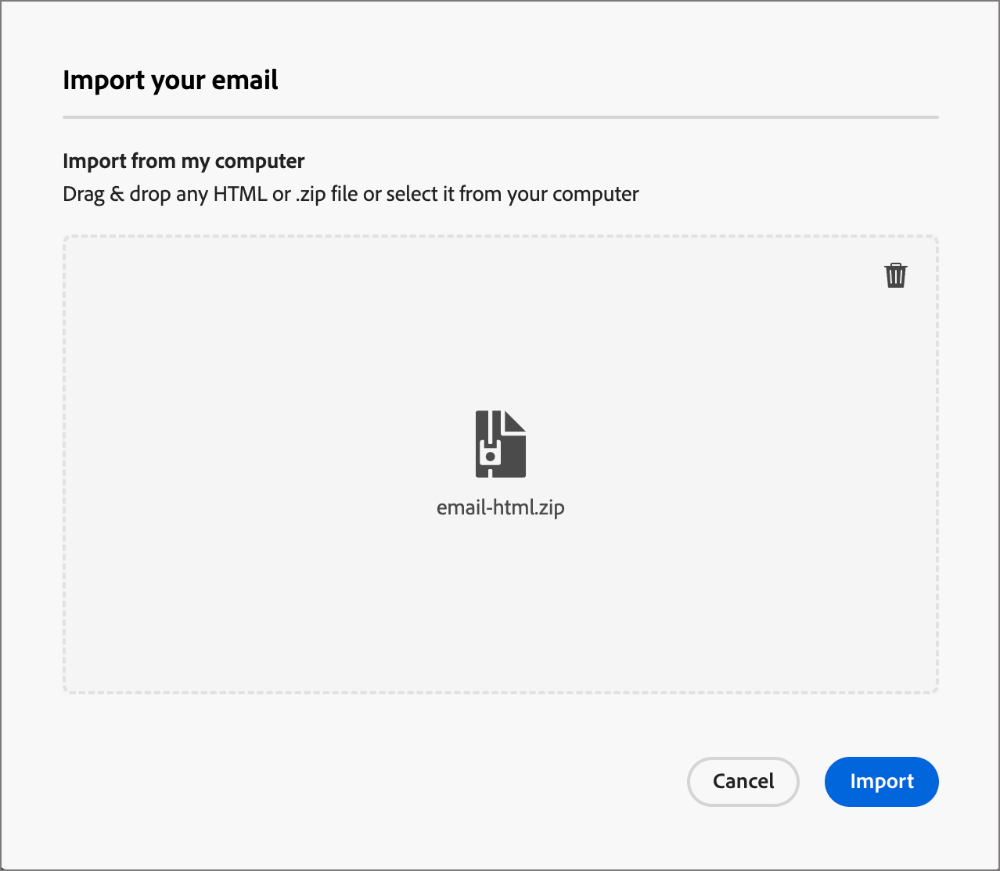

# E-mailontwerp

Gebruik Adobe Journey Optimizer B2B Edition om e-mailberichten naar uw klanten te verzenden. U kunt berichten maken, personaliseren en voorvertonen in de e-mailtoepassing van Designer.

## Een e-mailactie toevoegen aan een accountreis

U kunt e-mailleveringen instellen in een Account Journey wanneer u een _[!UICONTROL Take an action]_-knooppunt toevoegt en het volgende doet:

1. Kies **[!UICONTROL People]** voor het doel _[!UICONTROL Action on]_.
1. Kies **[!UICONTROL Send email]** bij _[!UICONTROL Action on people]_.
1. Kies **[!UICONTROL Create new email]** bij _[!UICONTROL Email source]_.

   U kunt ook de optie _[!UICONTROL Select email from Adobe Marketo Engage]_selecteren om een van de vooraf geschreven e-mails in het Marketo Engage te gebruiken en te verzenden als onderdeel van de Account Journey.

   >[!NOTE]
   >
   >Als u voor het eerst een e-mailbericht maakt, controleert u of het e-mailkanaal is geconfigureerd vanuit Adobe Marketo Engage. Meer leren, zie [ E-mailLeverbaarheid ](https://experienceleague.adobe.com/en/docs/marketo/using/getting-started/initial-setup/setup-steps#ensure-email-deliverability) in de documentatie van het Marketo Engage verzekeren.

   {width="700" zoomable="yes"}

1. Klik onder aan het deelvenster _[!UICONTROL Take an action]_op **[!UICONTROL Create email]**.

1. Voer in het dialoogvenster een unieke **[!UICONTROL Name]** in voor de e-mail en een **[!UICONTROL Subject line]** .

   {width="400"}

1. Klik op **[!UICONTROL Create]**.

   In de sectie _[!UICONTROL Email properties]_van de pagina met e-mailinhoud zijn de velden_[!UICONTROL From email]_ en _[!UICONTROL Reply to address]_al geconfigureerd. U kunt waarden invoeren voor de velden_[!UICONTROL From name]_ en _[!UICONTROL Description]_(optioneel).

## E-mailinhoud maken

Klik op **[!UICONTROL Add email content]** boven in het voorvertoningsvenster van _[!UICONTROL Email]_.

{width="700" zoomable="yes"}

Met deze actie start u de e-mailtoepassing Designer, waarin u kunt kiezen hoe u uw e-mailbericht wilt ontwerpen. Hiervoor kunt u de volgende opties kiezen:

* [ Ontwerp uw e-mail van kras ](#design-your-email-from-scratch) gebruikend de interface van Designer E-mail.

* [ de Inhoud van de Invoer bestaande HTML ](#import-existing-html-content) van een dossier of een .zip omslag.

* [ selecteer een bestaand malplaatje ](#select-a-template) van een lijst van ingebouwde of douane e-mailmalplaatjes.

Om de onderwerpregel met de uitdrukkingsredacteur te vormen en te personaliseren, klik het _pictogram van Personalization_ en voeg om het even welke Marketo Engage tokens toe.

Nadat u de e-mailinhoud hebt gemaakt en aangepast, kunt u de inhoud exporteren voor validatie of later gebruik. Klik op **[!UICONTROL Export HTML]** om de inhoud op te slaan als een ZIP-bestand dat uw HTML en elementen bevat.

>[!TIP]
>
>Gebruik AI Assistant in Adobe Journey Optimizer B2B Edition, aangedreven door generatieve AI om uw inhoud naar het volgende niveau te tillen. Met AI Assistant kunt u de impact van uw leveringen optimaliseren door volledige e-mails, gerichte tekstinhoud en aanbevelingen voor AI Assistant te genereren voor afbeeldingen die op uw publiek zijn afgestemd. [Meer informatie](./ai-assistant-emails.md)

### Ontwerp uw e-mail helemaal zelf {#design-from-scratch}

>[!CONTEXTUALHELP]
>id="ajo-b2b_structure_components_landing_page"
>title="Structuurcomponenten toevoegen"
>abstract="Structuurcomponenten definiëren de indeling van de bestemmingspagina. De belemmering en laat vallen component van de a **Structuur** in het canvas beginnen de inhoud van uw het landen pagina te ontwerpen."

>[!CONTEXTUALHELP]
>id="ajo-b2b_content_components_landing_page"
>title="Informatie over inhoudscomponenten"
>abstract="Inhoudscomponenten zijn lege plaatsaanduidingen voor inhoud die u kunt gebruiken om de lay-out van een bestemmingspagina te maken."

Gebruik de visuele inhoudeditor om de structuur van de e-mailinhoud te definiëren. Door structurele componenten toe te voegen en te bewegen met eenvoudige belemmering-en-dalingsacties, kunt u de vorm van de herbruikbare e-mailinhoud binnen seconden ontwerpen.

1. Selecteer de optie **[!UICONTROL Design from scratch]** op de startpagina van _[!UICONTROL Design your template]_.

1. [ voegt structuur en inhoud ](#add-structure-and-content) aan het e-mailbericht toe.
1. [ voeg beeldactiva ](#add-assets) aan het e-mailbericht toe.
1. [ personaliseer de e-mailinhoud ](#personalize-content).
1. [ Overzicht en werk verbindingen ](#preview-and-edit-linked-urls) bij.

<!-- If needed, you can further personalize your email by clicking **[!UICONTROL Switch to code editor]** from the advanced menu. The code editor allows you to edit the email source code, such as adding tracking or custom HTML tags.

>[!CAUTION]
>
>You cannot revert back to the visual designer for this email after switching to the code editor. -->

Wanneer de inhoud gereed is, klikt u op **[!UICONTROL Simulate content]** boven om de rendering te controleren. U kunt kiezen voor de weergave Computer of Mobiel.

Als u tevreden bent met de inhoud, klikt u op **[!UICONTROL Save]** .

### Bestaande HTML-inhoud importeren

{{$include /help/_includes/content-design-import.md}}

{width="500"}

>[!NOTE]
>
>Als u een `<table>` -tag als eerste laag in een HTML-bestand gebruikt, kan dit leiden tot stijlverlies, zoals de achtergrond- en breedte-instellingen in de bovenste laagtag.

U kunt de geïmporteerde inhoud naar wens aanpassen met de gereedschappen in de visuele e-maileditor.

### Een sjabloon selecteren

{{$include /help/_includes/content-design-select-template.md}}

## Structuur en inhoud toevoegen {#structure-content}

>[!CONTEXTUALHELP]
>id="ajo-b2b_structure_components_email"
>title="Structuurcomponenten toevoegen"
>abstract="Structuurelementen definiëren de indeling van de e-mail. De belemmering en laat vallen component van de a **Structuur** in het canvas beginnen uw e-mailinhoud te ontwerpen."

>[!CONTEXTUALHELP]
>id="ajo-b2b_content_components_email"
>title="Informatie over inhoudscomponenten"
>abstract="Inhoudscomponenten zijn lege plaatsaanduidingen voor inhoud die u kunt gebruiken om de lay-out van een e-mail te maken."

{{$include /help/_includes/content-design-components.md}}

### Fragmenten toevoegen

In de visuele inhoudsredacteur, wordt het _pictogram van Fragmenten_ getoond op de linkerzijde. In het volgende voorbeeld worden de stappen beschreven die moeten worden uitgevoerd om fragmenten toe te voegen aan de sjablooninhoud.

1. Om de fragmenten lijst te openen, klik het _pictogram van Fragmenten_.

   U kunt:

   * Sorteer de aanbieding.
   * Blader door de lijst, zoek de lijst of filter deze.
   * Schakelen tussen de miniatuur- en lijstweergave.
   * Vernieuw de lijst om een van de onlangs gemaakte fragmenten weer te geven.

   {width="700" zoomable="yes"}

1. Sleep een van de fragmenten naar de tijdelijke aanduiding voor het structurele onderdeel.

   De editor geeft het fragment weer binnen de sectie/het element van de e-mailstructuur.

De inhoud van het fragment wordt dynamisch bijgewerkt in de structuur om te tonen hoe de inhoud in de e-mail wordt weergegeven.

>[!TIP]
>
>Als u het fragment wilt toevoegen zodat het de volledige horizontale lay-out binnen e-mail bezet, voeg een 1:1 kolomstructuur toe en sleep en zet dan het fragment in het.

Nadat het e-mailbericht is opgeslagen, wordt het weergegeven op de pagina met fragmentdetails wanneer u het tabblad _[!UICONTROL Used By]_in het overzicht selecteert. Fragmenten die aan een e-mailsjabloon worden toegevoegd, kunnen niet worden bewerkt in de sjabloon. De inhoud wordt gedefinieerd door het bronfragment.

### Elementen toevoegen

{{$include /help/_includes/content-design-assets.md}}

### Navigeren door de lagen, instellingen en stijlen

{{$include /help/_includes/content-design-navigation.md}}

### Inhoud personaliseren

{{$include /help/_includes/content-design-personalization.md}}

### Gekoppelde URL-tracking bewerken

{{$include /help/_includes/content-design-links.md}}

### Weergaveopties

Gebruik de opties voor weergave- en inhoudsvalidatie die beschikbaar zijn in de visuele e-maileditor.

* Zoom in of uit op de inhoud met de vooraf ingestelde zoomopties.

* Schakel de weergave van de inhoud in op Desktop, Mobiel of Alleen tekst/Onbewerkte tekst.
   * Klik het _Oog_ pictogram voor inhoudsvoorproef over apparaten.
   * Selecteer een van de apparaten die buiten het vak vallen of voer aangepaste afmetingen in om een voorvertoning van de inhoud weer te geven.

## Waarschuwingen controleren

Terwijl u de inhoud van uw e-mailbericht ontwerpt, worden waarschuwingen weergegeven in de interface (rechtsboven op de pagina) wanneer er geen sleutelinstellingen aanwezig zijn.

Als deze knop niet wordt weergegeven, zijn er geen problemen gedetecteerd.

Er kunnen twee soorten waarschuwingen worden gedetecteerd:

* **_Waarschuwingen_** die naar aanbevelingen en beste praktijken, zoals verwijzen:

   * `The opt-out link is not present in the email body`: u kunt het beste een koppeling zonder abonnement toevoegen aan uw e-mailadres.

     >[!NOTE]
     >
     >E-mailberichten in marketingstijl moeten een opt-out-koppeling bevatten, die niet vereist is voor transactieberichten.

   * `Text version of HTML is empty`: vergeet niet een tekstversie van uw e-mailhoofdtekst te definiëren die wordt gebruikt wanneer HTML-inhoud niet kan worden weergegeven.

   * `Empty link is present in email body`: controleer of alle koppelingen in uw e-mail correct zijn.

   * `Email size has exceeded the limit of 100KB`: zorg ervoor dat de grootte van uw e-mail voor optimale levering niet groter is dan 100 kB.

* **_Fouten_** die u verhinderen de reis/de campagne te testen of te activeren zolang zij niet, zoals worden opgelost:

   * `The subject line is missing`: e-mailonderwerpregel is verplicht.

   * `The email version of the message is empty`: deze fout wordt weergegeven wanneer de e-mailinhoud niet is geconfigureerd.

## E-mail controleren en testen {#preview-test}

>[!CONTEXTUALHELP]
>id="ajo-b2b_email_preview_simulate"
>title="Controleren hoe uw inhoud wordt gerenderd"
>abstract="Wanneer uw inhoud is gedefinieerd, kunt u deze voorvertonen en controleren of de rendering correct is voor het kanaal dat u gebruikt."

Wanneer de inhoud van uw bericht is gedefinieerd, kunt u testprofielen gebruiken om deze voor te vertonen, proefdrukken te verzenden en de weergave ervan in populaire desktops, mobiele clients en webclients te beheren. Als u persoonlijke inhoud hebt ingevoegd, kunt u met testprofielgegevens een voorvertoning weergeven van de weergave van deze inhoud in het bericht.

Als u een voorbeeld van de e-mailinhoud wilt weergeven, klikt u op **[!UICONTROL Simulate content]** en voegt u vervolgens een testprofiel toe om uw bericht te controleren met behulp van de testprofielgegevens.

{width="700" zoomable="yes"}
