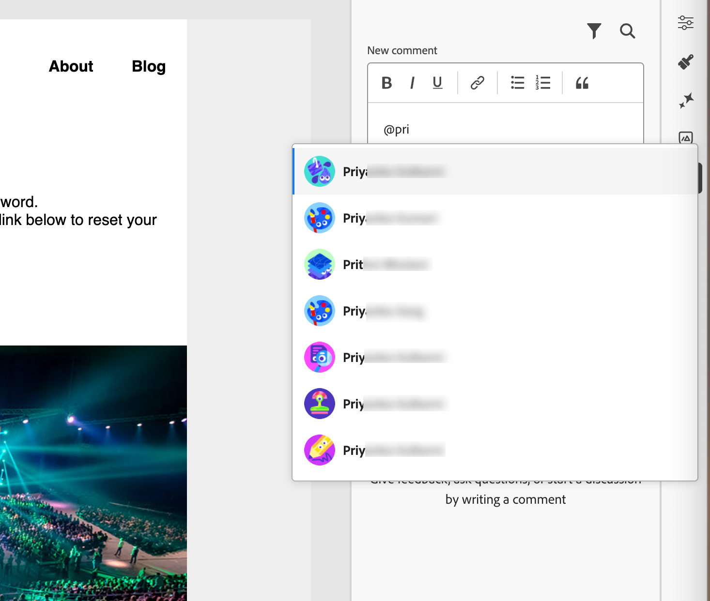

# Gereedschappen voor e-mailsamenwerking

De [ ruimte van het e-mailontwerp ](./email-authoring.md) omvat samenwerkingshulpmiddelen voor het becommentariëren en resolutie zodat de marketing teams, e-mailactiva direct binnen [!DNL Journey Optimizer B2B Edition] foutloos kunnen herzien bespreken en voltooien. In plaats van concepten te delen via externe tools (zoals chat, e-mailthreads of spreadsheets), kunnen gebruikers opmerkingen maken, wijzigingen voorstellen en feedback in de ontwerpruimte van de e-mail oplossen. Gebruik deze gereedschappen om uw workflow te stroomlijnen, fouten te reduceren en ervoor te zorgen dat alle betrokkenen op elkaar zijn afgestemd voordat u uw e-mailcampagne start binnen een accountreis:

* **_Gecentraliseerde terugkoppelt_** - verzamel en spoor alle terugkoppelen in één plaats.

* **_de Snellere revisies_** - de Medewerkers kunnen het e-mailexemplaar en de activa binnen het auteursmilieu herzien.

* **_Verbeterde nauwkeurigheid_** - vermindert het risico van verkeerde mededeling door alle uit te houden verbonden uitgeeft aan e-mail zelf.

* **_Transparantie_** - Alle commentaren en resoluties blijven het programma geopend, makend het duidelijk welke veranderingen werden gesuggereerd en werden uitgevoerd.

* **_Collaboration in context_** - het lichaamshoofdstuk van het overzicht, beelden, en de elementen van call-to-action (CTA) binnen de lay-out.

<!-- Enable asynchronous collaboration between team members for an email asset
Allow users to attach comments to specific design elements
Provide a unified interface for viewing and managing all comments within a project
Support comment placement, editing, deleting, and navigation
Display visual indicators (badges) for elements with associated comments -->

## Gereedschappen voor e-mailsamenwerking inschakelen voor revisoren

De beheerders van het product kunnen toegang tot de hulpmiddelen van de e-mailsamenwerking toelaten door de **[!UICONTROL Manage B2B Emails]** toestemming door _toestemmingen_ UI in Adobe Experience Cloud toe te wijzen.

+++ E-mailmachtigingen inschakelen

1. In de toepassing van Toestemmingen, ga naar het **[!UICONTROL Roles]** lusje en selecteer de gewenste [ rol ](https://experienceleague.adobe.com/en/docs/experience-platform/access-control/abac/permissions-ui/roles){target="_blank"}.

1. Klik op **[!UICONTROL Edit]** om de machtigingen te wijzigen.

1. Voeg de **[!UICONTROL B2B Assets]** -bron toe en selecteer vervolgens **[!UICONTROL Manage B2B Emails]** .

   {width="700" zoomable="yes"}

1. Klik op **[!UICONTROL Save]** om de wijzigingen toe te passen.

   De toestemmingen worden automatisch bijgewerkt voor om het even welke gebruikers die reeds aan de rol worden toegewezen.

1. Als u deze rol aan nieuwe gebruikers wilt toewijzen, selecteert u de tab **[!UICONTROL Users]** in het _[!UICONTROL Roles]_dashboard en klikt u op **[!UICONTROL Add User]**.

   * Voer de gebruikersnaam en het e-mailadres in of kies een bestaande gebruiker in de lijst.

     Als de gebruiker nog niet wordt gecreeerd, verwijs naar de [ documentatie van Experience Platform ](https://experienceleague.adobe.com/en/docs/experience-platform/access-control/abac/permissions-ui/users){target="_blank"}.

   * Klik op **[!UICONTROL Save]** om de wijzigingen toe te passen.

+++

## Gereedschappen voor samenwerking en opmerkingen weergeven

Terwijl het creëren van, het uitgeven van, of het herzien van inhoud in de e-mailontwerpruimte, kunt u tot het _Collaboration_ paneel toegang hebben om commentaren voor de e-mailinhoud toe te voegen of te beheren.

Klik het _pictogram van Collaboration_ ( ) in de juiste navigatie.

{width="700" zoomable="yes"}

## Collaboration-workflow

U kunt de samenwerkingshulpmiddelen gebruiken om een standaardinhoudswerkschema te volgen:

1. [ nodigt ](#invite-collaborators-and-reviewers) uw medewerkers en recensenten uit.
1. De recensenten [ voegen commentaren ](#add-comments) toe.
1. Lees commentaren, [ voeg antwoorden ](#reply-to-a-comment) toe om te bespreken terugkoppelt, en maak nodig uitgeeft.
1. De recensenten of de auteurs [ lossen commentaren ](#resolve-comments) op.

>[!BEGINSHADEBOX]

**Beste praktijken voor het gebruiken van de samenwerkingshulpmiddelen**

* Gebruik `@` -tags, zodat feedback snel naar het juiste teamlid gaat.

* Groepeer gerelateerde feedback in één thread voor opmerkingen in plaats van meerdere verspreide notities.

* Opmerkingen altijd oplossen zodra ze zijn verzonden, zodat er een schone workflow blijft bestaan.

* Sla een definitieve goedgekeurde versie op voor compatibiliteits-/auditdoeleinden.

>[!ENDSHADEBOX]

### Medewerkers en revisoren uitnodigen

1. Selecteer de hoofdtekst van de e-mail.

1. Klik het _pictogram van Collaboration_ ( ) in de juiste navigatie.

1. Boven aan het rechterdeelvenster voert u de uitnodigingstekst in waarmee gebruikers kunnen samenwerken en feedback kunnen geven.

   Gebruik het symbool `@` om gebruikers te adresseren en hiervan op de hoogte te stellen. Deze gebruikers ontvangen e-mail en in-product pulsmeldingen.

   Als u de eerste paar letters van de naam na het symbool invoert, wordt in een pop-uplijst een overeenkomende gebruikersnaam weergegeven. U kunt meer letters in de naam invoeren om de resultaten te verbeteren.

   {width="550"}

   Selecteer de naam die u wilt toevoegen voor een melding.

   Voeg zoveel deelnemers of revisoren toe als u wilt opnemen in de uitnodiging.

   {width="700" zoomable="yes"}

1. Klik op **[!UICONTROL Submit]**.

### Opmerkingen toevoegen

Open als medewerker of revisor van e-mail de e-mail in de ontwerpruimte en voeg uw feedback toe. U kunt algemene ingaan terugkoppelt in het _Collaboration_ paneel, of u kunt componenten in het canvas selecteren en een commentaar toevoegen dat voor dat ontwerpelement specifiek is. Codeer teamgenoten met `@`, zoals _@Jan Doe gelieve de exemplaar van CTA_ bij te werken.

Elke nieuwe opmerking begint een draad waar de medewerkers _Reageren_ kunnen gebruiken om de bespreking voort te zetten. Elke opmerking of thread die aan een ontwerpelement is gekoppeld, wordt genummerd, zodat u het element gemakkelijk kunt herkennen waar het van toepassing is.

#### Algemene opmerkingen en feedback

In het _Collaboration_ paneel, gebruik het tekstgebied bij de bovenkant om een algemene commentaar over de e-mailinhoud in te gaan. Gebruik het symbool `@` om gebruikers te adresseren en hiervan op de hoogte te stellen.

{width="400"}

Klik op **[!UICONTROL Submit]** om de opmerking te registreren en meldingen te verzenden naar alle gelabelde gebruikers.

#### Componentopmerkingen

1. Selecteer een structuur of inhoudscomponent.

1. In de toolbar, klik het _Collaboration_ hulpmiddel.

   {width="600"}

1. Voer uw opmerking in het tekstveld in.

1. Klik op **[!UICONTROL Submit]**.

Deelnemers kunnen op het pictogram voor genummerde pincodes op het e-mailcanvas klikken om opmerkingen weer te geven.

{width="450"}

#### Een opmerking beantwoorden

Voor elke opmerking kunt u de functie _[!UICONTROL Reply]_gebruiken om door te gaan met een discussie of een vraag te beantwoorden.

Klik op **[!UICONTROL Reply]** onder aan de opmerking en voer de tekst voor uw antwoord in. Om een citaat van de huidige commentaar in uw antwoord te omvatten, klik het _Meer menu_ ( **..**) pictogram en kies **[!UICONTROL Quote reply]**.

{width="350"}

### Opmerkingen oplossen

Als auteur of ontwerper beoordeelt u de feedback van revisoren en bepaalt u welke wijzigingen u wilt doorvoeren. Wanneer de veranderingen volledig zijn en het verzoek wordt tevredengesteld, klik _Meer menu_ ( **...**) pictogram en kies **[!UICONTROL Resolve]**.

{width="350"}

Klik op **[!UICONTROL Resolve]** in het bevestigingsdialoogvenster.

## Opmerkingen beheren

Beheer de commentaren en draden om de status van uw samenwerkingsinspanning te beoordelen.

### Een opmerking plaatsen

Als een commentaar niet met een element op het e-mailcanvas wordt geassocieerd, kunt u __ de commentaar aan een element vastzetten zoals nodig. Klik het _Meer menu_ ( **..**) pictogram en kies **[!UICONTROL Place the comment]**. Selecteer vervolgens de ontwerpcomponent op het canvas.

{width="350"}

### Opmerkingen verwijderen of verwijderen

U kunt het logboek met opmerkingen opschonen door deze te verwijderen. Klik het _Meer menu_ ( **..**) pictogram en kies **[!UICONTROL Remove Comment]** of **[!UICONTROL Delete]**.

{width="350"}

* Wanneer u een opmerking verwijdert, wordt die opmerking losgekoppeld van het ontwerpelement (geselecteerd toen de opmerking werd gemaakt). De opmerking maakt nog steeds deel uit van de commentaarrecord voor de e-mail.

* Wanneer u een opmerking verwijdert, wordt deze definitief uit de record verwijderd.

### Opgeloste opmerkingen

Door gebrek, worden de opgeloste commentaren verborgen in het _Collaboration_ paneel. U kunt opgeloste commentaren op elk ogenblik tonen door de filter te ontruimen. Klik de _Filter_ ( ) pictogram op en ontruim checkbox. **[!UICONTROL Hide resolved comments]**

{width="350"}

De opgeloste commentaren omvatten a _Onlos_ ( ). Als u vaststelt dat een opmerking/thread niet is omgezet en er verdere wijzigingen nodig zijn, klikt u op het pictogram om de aanwijzing _[!UICONTROL Resolved]_te verwijderen.

{width="300"}
