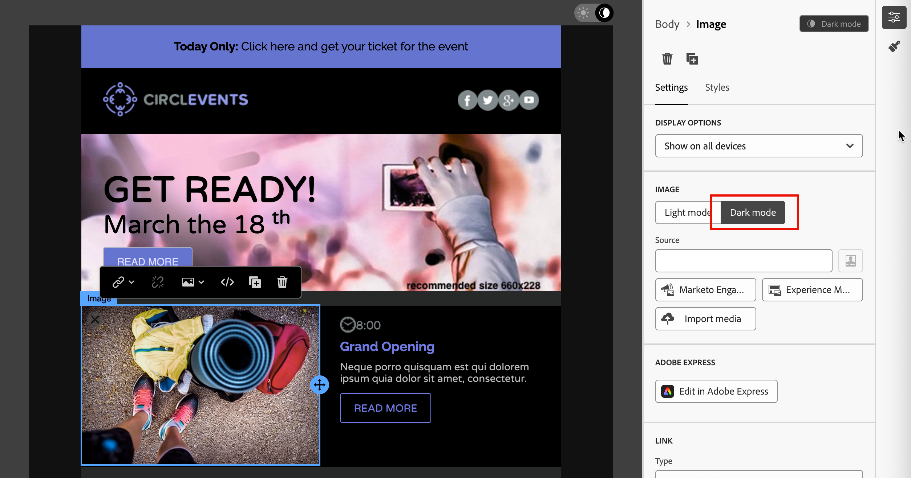

# Donkere modus voor e-mailinhoud {#dark-mode}

>[!CONTEXTUALHELP]
>id="ajo-b2b_dark_mode"
>title="Overschakelen naar donkere modus"
>abstract="Schakel over naar de donkere modus waar u een voorvertoning kunt weergeven van de rendermethode en specifieke aangepaste instellingen kunt definiëren.   het definitieve teruggeven hangt van de e-mailcliënt van de ontvanger af. Alle e-mailclients bieden geen ondersteuning voor de aangepaste donkere modus."

>[!CONTEXTUALHELP]
>id="ajo-b2b_dark_mode_preview"
>title="Overschakelen naar donkere modus"
>abstract="Schakel over naar de donkere modus om te bekijken hoe deze kan worden weergegeven bij ondersteunde e-mailclients.   het definitieve teruggeven hangt van de e-mailcliënt van de ontvanger af. Merk op dat alle e-mailcliënten donkere wijze niet steunen."

_Donkere wijze_ staat een ondersteunende e-mailcliënt of app toe om e-mail met donkere achtergronden en lichtere kleuren voor tekst, knopen, en andere visuele elementen te tonen. Dit type beeldscherm kan de oogdruk verminderen, de gebruiksduur van de batterij verminderen en de leesbaarheid in omgevingen met weinig licht verbeteren voor een comfortabeler kijkervaring. Het is nu een belangrijke overweging in het moderne e-mailontwerp om ervoor te zorgen dat de inhoud leesbaar blijft en visueel aantrekkelijk voor alle gebruikers is, omdat dit een groeiende trend is voor grote besturingssystemen en toepassingen.

{width="50%"}

Aangezien u [ uw e-mailinhoud ](./email-authoring.md) in de [!DNL Journey Optimizer B2B Edition] visuele ontwerpruimte creeert, kunt u op de _**[!UICONTROL Dark mode]**_mening schakelen. In deze weergave kunt u ook specifieke aangepaste instellingen definiëren voor ondersteuning van e-mailclients wanneer de donkere modus is ingeschakeld.

## Overwegingen voor e-mailclient

Er zijn aanzienlijke verschillen in de manier waarop verschillende e-mailclients en apps de donkere modus toepassen. Daarom is het verstandig voorzichtig te zijn met de verwachtingen voor rendering in de donkere modus. Overweeg de volgende gebruiksgevallen van e-mailclients voordat u de donkere modus gebruikt in de ontwerpruimte van de e-mail:
<!--
* Check out the list of [email clients supporting dark mode](https://www.caniemail.com/search/?s=dark){target="_blank"}

* Learn more on Dark mode in this [Litmus blog post](https://www.litmus.com/blog/the-ultimate-guide-to-dark-mode-for-email-marketers){target="_blank"}
-->

+++Clients die geen ondersteuning bieden voor de donkere modus

Sommige e-mailclients ondersteunen deze functie helemaal niet, zoals:

* [!DNL Yahoo! Mail]
* [!DNL AOL]

Als u aangepaste instellingen voor de donkere modus definieert in het e-mailontwerp, kunnen deze e-mailclients geen donkere modus weergeven. <!--Regardless of whether the interface is in light or dark mode, your email will render the same.-->

+++

+++Clients die hun eigen donkere modus toepassen {#default-support}

Sommige e-mailclients passen systematisch hun eigen donkere standaardmodus toe op alle ontvangen e-mails. Kleuren, achtergronden, afbeeldingen en andere elementen worden automatisch aangepast op basis van de instellingen in de donkere modus en externe instellingen zijn niet mogelijk. Tot deze clients behoren:

* Gmail (desktopwebmail, iOS, Android™, mobiele webmail)
* Outlook Windows
* Outlook Windows Mail

<!--It is important to note that less than 25% of email clients offer customization options for dark mode. Clients such as Gmail implement their own dark mode rendering, which is not subject to external modification.-->
In dit geval overschrijven de instellingen voor de donkere modus van de client de instellingen voor de aangepaste donkere modus die u definieert in [!DNL Journey Optimizer B2B Edition]

+++

+++Clients die aangepaste donkere modus ondersteunen

Veel van de populairste e-mailclients bieden de optie om de aangepaste donkere modus te renderen met de query `@media (prefers-color-scheme: dark)` . Dit is de methode die wordt gebruikt in de e-mailstijlen van [!DNL Journey Optimizer B2B Edition] . Deze lijst met clients bevat:

* Apple Mail macOS
* Apple Mail iOS
* Outlook macOS
* Outlook.com
* Outlook iOS
* Outlook Android™

In dit geval worden de specifieke instellingen die u in [!DNL Journey Optimizer B2B Edition] definieert, gerenderd. Sommige beperkingen kunnen echter van toepassing zijn voor elke e-mailclient. Sommige clients (zoals Apple Mail 16 (macOS 13)) genereren bijvoorbeeld geen donkere modus als de e-mailinhoud afbeeldingen bevat.

Voor optimale resultaten test u de inhoud met de e-mailclients waarop u zich richt. Om een simulatie te zien die zo dicht mogelijk bij het definitieve resultaat voor elke cliënt komt, gebruik de [ Loodse e-mailtest die ](./email-test-rendering.md) integratie teruggeeft in de e-mailontwerpruimte teruggeeft.

+++

## Ontwerpen voor donkere modus

Als u uw e-mailinhoud opmaakt in de donkere modus van [!DNL Journey Optimizer B2B Edition] , beschikt de visuele ontwerpruimte over twee typen gereedschappen:

* Gebruik de [ voorproeffunctie ](#preview-default-dark-mode) om het gebrek te herzien donkere wijze die voor de meeste steunende e-mailcliënten teruggeeft.

* Als u de standaardinstellingen voor het ondersteunen van e-mailclients wilt overschrijven, definieert en past u aangepaste instellingen voor de donkere modus toe op uw e-mailinhoud. [Meer informatie](#define-custom-dark-mode)

### Standaardmodus voor donker voorvertonen {#preview-dark-mode}

<!-- Should work with templates and themes, NOT for LP and fragments - but TBC with eng. 
>[!NOTE]
>
>Currently you may not be able to switch to dark mode if you select an [email template](use-email-templates.md) or if you apply a [theme](apply-email-themes.md).-->

1. Open de e-mailinhoud in de ontwerpruimte van de e-mail.

   Rechtsboven op het canvas ziet u een lichtdonkere kiezer die de weergave van de inhoud schakelt tussen de lichte (standaard) en donkere modus.

   {width="700" zoomable="yes"}

1. Verander de selecteur in _Donkere wijze_ (  ).

   Het canvas geeft de inhoud weer met behulp van de standaard donkere modus preview.x

   Standaard wordt in de voorvertoning in de donkere modus het kleurenschema `full color invert` toegepast op alle elementen behalve afbeeldingen en pictogrammen. Dit kleurenschema detecteert gebieden met lichte en donkere elementen en keert deze om. Lichte achtergronden worden donker en donkere tekst wordt licht, of donkere achtergronden worden licht en lichte tekst wordt donker.

   {width="700" zoomable="yes"}

>[!CAUTION]
>
>De uiteindelijke rendering kan variëren afhankelijk van de e-mailclient van de ontvanger. Om een simulatie te zien die zo dicht mogelijk bij het definitieve resultaat voor elke e-mailcliënt komt, gebruik de [ de testLeiding e-mail teruggevende ](./email-test-rendering.md) integratie.

### Aangepaste instellingen voor de donkere modus definiëren {#custom-dark-mode}

>[!CONTEXTUALHELP]
>id="ajo-b2b_dark_mode_image"
>title="Een specifieke afbeelding gebruiken voor de donkere modus"
>abstract="U kunt een andere afbeelding selecteren om weer te geven wanneer de donkere modus is ingeschakeld.   Toevoegend een specifiek beeld voor donkere wijze garandeert niet dat het correct in alle e-mailcliënten teruggeeft. Alle e-mailclients bieden geen ondersteuning voor de aangepaste donkere modus."

Na het schakelen naar de donkere modus kunt u specifieke opmaakelementen van uw inhoud bewerken die alleen worden weergegeven wanneer de donkere modus is ingeschakeld in de e-mailclient van de ontvanger (mits deze functie wordt ondersteund).

>[!NOTE]
>
>De uiteindelijke rendering in de donkere modus is afhankelijk van elke e-mailclient. De resultaten kunnen dus per e-mailclient verschillen. Herzie de [ overwegingen van de e-mailcliënt ](#email-client-considerations) voor meer informatie.

De douane donkere wijze het stileren in de e-mailontwerpruimte gebruikt <!-- `@media (prefers-color-scheme: dark)` method--> `@media (prefers-color-scheme: dark)` CSS-query, die detecteert of de e-mailclient is ingesteld op de donkere modus en past het donkere ontwerp toe dat is gedefinieerd in uw e-mail.

_Aangepaste instellingen voor de donkere modus definiëren :_

1. Indien nodig, verplaats de selecteur naar _Donkere wijze_ ( ) bij het hoogste recht van het ontwerpcanvas.

1. Bewerk alle opmaakkleurkenmerken, zoals tekst, achtergronden of knoppen.

   {width="700" zoomable="yes"}

1. Voor de afbeeldingen en pictogrammen definieert u specifieke elementen alleen voor de donkere modus.

   U kunt de kleuren van afbeeldingen en pictogrammen niet wijzigen, maar u kunt wel alternatieve elementen definiëren voor de donkere modus. U kunt experimenteren met verschillende kleurcombinaties voor uw pictogrammen of u kunt de kleur en verzadiging van fotografische afbeeldingen aanpassen.

   {width="80%"}

   Selecteer een willekeurige afbeelding en schakel over naar **[!UICONTROL Dark mode]** met de daarvoor bestemde schakeloptie in het deelvenster **[!UICONTROL Settings]** . Selecteer vervolgens een ander afbeeldingselement.

   {width="700" zoomable="yes"}

   Zie [ beeldactiva ](./email-authoring.md#add-image-assets) voor meer informatie over het selecteren van een beeldactiva toevoegen.

1. Selecteer **[!UICONTROL Switch to live view]** om te controleren hoe uw inhoud op verschillende apparaatgrootten kan worden gerenderd.

   Van deze mening, verander de selecteur in _Donkere wijze_ ( ) om de donkere wijzeversie van uw inhoud over de verschillende apparaten voor te vertonen.

   {width="800" zoomable="yes"}

   >[!CAUTION]
   >
   >De live weergave is een algemene voorvertoning die is ontworpen om te vergelijken hoe de rendering er tussen verschillende apparaatgrootten uitziet. De uiteindelijke rendering kan afhankelijk zijn van de e-mailclient van de ontvanger.

1. Klik op **[!UICONTROL Simulate Content]** wanneer de wijzigingen in de donkere modus zijn voltooid.

   {width="700" zoomable="yes"}

   Met de gereedschappen Voorvertoning en Proofing kunt u het e-mailontwerp testen. Zie [ Voorproef en test uw e-mailinhoud ](./email-simulate-content.md) voor meer informatie.

1. Als u een Litmus Enterprise-account hebt, selecteert u **[!UICONTROL Render email]** om de uiteindelijke rendering in donkere modus weer te geven voor verschillende e-mailclients in de Litmus.

   Zie [ e-mailteruggeven van de Test met Litmus ](./email-test-rendering.md) voor meer informatie.

   >[!CAUTION]
   >
   >Tijdens simulaties wordt de weergave van e-mails in de donkere modus nauwkeurig afgemeten, maar de werkelijke rendering kan afwijken als gevolg van verschillen in de instellingen van e-mailserviceproviders of apparaten.

## Best practices {#best-practices}

Aangezien de donkere wijzetoepassing over belangrijke e-mailcliënten stijgt, is het essentieel om te overwegen hoe uw e-mail in zowel lichte als donkere milieu&#39;s teruggeeft - of u [ douane donkere wijze ](#define-custom-dark-mode) of niet gebruikt.

In de donkere modus kunt u kleuren, achtergronden en afbeeldingen wijzigen. Soms worden ontwerpkeuzen genegeerd. Volg de volgende aanbevolen procedures om de visuele consistentie, toegankelijkheid en brandintegriteit te garanderen:

| Praktijk |            |
| -------- | ---------- |
| Afbeeldingen en logo&#39;s optimaliseren | Checklist:<ul><li>Logo&#39;s en pictogrammen opslaan als PNG-bestanden met transparante achtergronden om zichtbare witte vakken in de donkere modus te voorkomen. <li>Vermijd afbeeldingen met een hardcodeerde witte of lichte achtergrond. <li>Als transparantie geen optie is, plaatst u afbeeldingen op een effen achtergrond in uw ontwerp om ongewenste kleurinversies te voorkomen. |
| Achtergronden bekijken | Checklist:<ul><li>Zorg voor voldoende contrast tussen tekst en achtergrondkleuren voor leesbaarheid in zowel de lichte als de donkere modus. <li>Vertrouw niet alleen op achtergrondkleuren voor essentiële inhoud. Sommige clients overschrijven achtergrondkleuren in de donkere modus, zodat de essentiële informatie nog steeds zichtbaar is. |
| Toegankelijke inhoud ontwerpen in donkere modus | Checklist:<ul><li>Gebruik kleurcombinaties die u gemakkelijk kunt herkennen voor mensen met kleurenblindheid. <li>Gebruik een palet met middentonen om contrast tegen zowel lichte als donkere achtergronden te waarborgen. <li>Gebruik toegankelijke kleurcombinaties met hoog contrast om de leesbaarheid te verbeteren en aan [!DNL Web Content Accessibility Guidelines (WCAG)] -standaarden te voldoen. Gebruik gereedschappen zoals [!DNL WebAIM Contrast Checker] om het kleurcontrast te controleren. <li>Vermijd dunne lettertypen omdat dit van invloed is op de leesbaarheid. Als uw merk een dun lettertype nodig heeft, kunt u het vet in de donkere modus drukken. <li>Overslaan puur wit op puur zwart, wat oogdruk kan veroorzaken en automatisch kan worden omgekeerd in sommige e-mailclients. <li>Maak toegankelijke fallback-stijlen als de donkere modus niet wordt ondersteund. |
| Test uw e-mails in een donkere modus | Checklist:<ul><li>Gebruik de [ donkere wijzevoorproef ](#preview-dark-mode) in de e-mailontwerpruimte, die omgekeerde kleurenschema&#39;s aan vlekkwesties vroeg gebruikt. <li>Gebruik een Litmus Enterprise-account met de optie [[!UICONTROL Render email]](./email-test-rendering.md) om uw ontwerpen te simuleren voor verschillende grote e-mailclients (zoals Apple Mail, Gmail en Outlook) en om te zien hoe kleuren en afbeeldingen zich gedragen in de donkere modus. |

<!--KEEP dark mode accessibility best practices IN ONE SINGLE LOCATION - for now listed on this page.
If needed, it can be moved to the Design accessible content page:
The best practices for designing accesible content in dark mode are listed in [this section](accessible-content.md#dark-mode).-->

<!--**Inline critical styles**

Inline CSS helps maintain more control over styling, as some clients strip external styles in dark mode.-->
