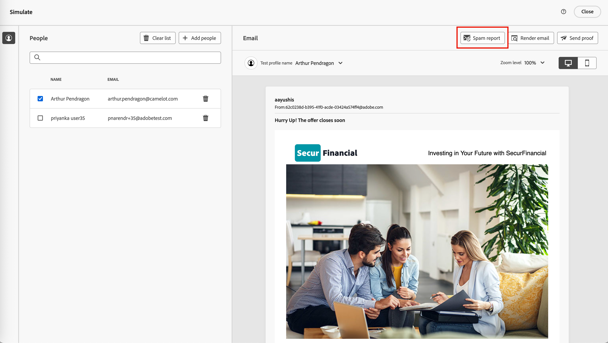

# Het spamrapport bekijken

Veel e-mailproviders en de meeste bedrijfssystemen maken gebruik van een spamfilterproces. Het verzenden van e-mails die deze filters activeren, kan de leesbaarheid ernstig beïnvloeden. In Journey Optimizer B2B edition kunt u spamscoring in e-mailinhoud controleren door een spamrapport te genereren. Dit rapport gebruikt [[!DNL SpamAssassin] ](https://spamassassin.apache.org/) om e-mail te testen en helpt u om te bepalen of een bericht als spam door anti-spamhulpmiddelen kon worden beschouwd. U kunt de informatie in het rapport gebruiken om acties te ondernemen die de score en de prestaties van de e-mailinhoud verbeteren.

Wanneer u uw e-mailmontages herziet of de inhoud uitgeeft, open de _[!UICONTROL Simulate]_pagina en produceer het rapport van a_ Spam _aan overzicht het scoren en de gemarkeerde elementen die anti-spam het filtreren kunnen teweegbrengen.

1. Klik op de pagina _[!UICONTROL Simulate]_rechtsboven op **[!UICONTROL Spam report]**.

   {width="700" zoomable="yes"}

   Het rapportageproces scant de e-mailinhoud en genereert een score met een lijst van de geactiveerde filterregels die worden gebruikt om de score te genereren. Factoren zijn de layout van de hoofdtekst, de structuur, de afbeeldingsgrootte, de trefwoorden voor spamtriggers en andere elementen. Voor een lijst van de tests van de regelevaluatie voor de e-mailelementen, verwijs naar de [[!DNL SpamAssassin]  testlijst ](https://spamassassin.apache.org/old/tests_3_0_x.html).

1. Controleer de scores en beschrijvingen voor elk item.

   >[!NOTE]
   >
   >De spamscore wordt berekend door SpamAssassin, en Adobe bezit niet de regels of het scoren logica. Voor meer details over het [!DNL SpamAssassin] open bronproject, verwijs naar de [[!DNL SpamAssassin]  documentatie ](https://cwiki.apache.org/confluence/display/SPAMASSASSIN/).

   Hoe lager de score, des te minder waarschijnlijk is het dat de e-mail als spam wordt gemarkeerd.

   {width="600" zoomable="yes"}

   Met een score die groter is dan 5, omvat het rapport een waarschuwing dat sommige berichten kunnen worden geblokkeerd of als spam wanneer ontvangen worden gemerkt. Het is een goede praktijk om ervoor te zorgen dat de score lager is dan 2.

   {width="600" zoomable="yes"}

1. Als de e-mailinhoud bepaalde elementen bevat die kunnen worden verbeterd, bewerkt u de inhoud om de benodigde updates toe te passen.

1. Wanneer de wijzigingen zijn voltooid, gaat u terug naar de pagina _[!UICONTROL Simulate]_en klikt u nogmaals op **[!UICONTROL Spam report]**om te controleren of de resultaten zijn verbeterd.
