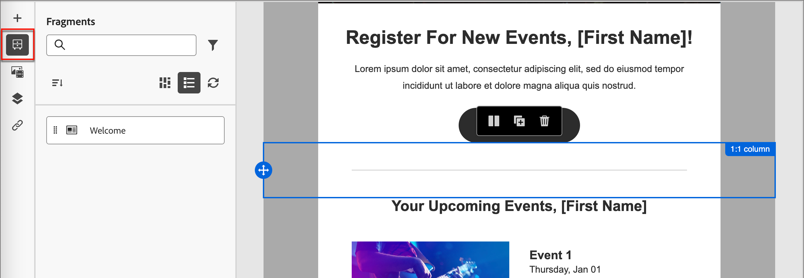

# E-mailsjabloonontwerp

Nadat u [ een e-mailmalplaatje ](./email-templates.md#create-an-email-template) creeert, gebruik de visuele ontwerper aan auteur de structuur en inhoudscomponenten in uw e-mailmalplaatje.

## Structuur en inhoud toevoegen {#structure-content}

>[!CONTEXTUALHELP]
>id="ajo-b2b_structure_components_template"
>title="Structuurcomponenten toevoegen"
>abstract="Structuurelementen definiëren de lay-out van de sjabloon. De belemmering en laat vallen component van de a **Structuur** in het canvas beginnen de inhoud voor uw malplaatje te ontwerpen."

>[!CONTEXTUALHELP]
>id="ajo-b2b_content_components_template"
>title="Informatie over inhoudscomponenten"
>abstract="Inhoudscomponenten zijn lege plaatsaanduidingen voor inhoud die u kunt gebruiken om de lay-out van een sjabloon te maken."

{{$include /help/_includes/content-design-components.md}}

### Fragmenten toevoegen

In de visuele inhoudsredacteur, wordt het _pictogram van Fragmenten_ getoond op de linkerzijde. In het volgende voorbeeld worden de stappen beschreven die moeten worden uitgevoerd om fragmenten toe te voegen aan de sjablooninhoud.

1. Om de fragmenten lijst te openen, selecteer het _pictogram van Fragmenten_ ( ).

   U kunt:

   * Sorteer de aanbieding.
   * Blader door de lijst, zoek de lijst of filter deze.
   * Schakelen tussen de miniatuur- en lijstweergave.
   * Vernieuw de lijst om een van de onlangs gemaakte fragmenten weer te geven.

   {width="700" zoomable="yes"}

1. Sleep een van de fragmenten naar de tijdelijke aanduiding voor het structurele onderdeel.

   De editor geeft het fragment weer binnen de sectie/het element van de e-mailstructuur.

De inhoud van het fragment wordt dynamisch bijgewerkt in de structuur om te tonen hoe de inhoud in de e-mail wordt weergegeven.

>[!TIP]
>
>Als u wilt dat het fragment de volledige horizontale lay-out binnen de e-mail in beslag neemt, voegt u een 1:1-kolomstructuur toe en sleept u het fragment er vervolgens in.

Nadat het e-mailbericht is opgeslagen, wordt het weergegeven op de pagina met fragmentdetails wanneer u het tabblad _[!UICONTROL Used By]_in het overzicht selecteert. Fragmenten die aan een e-mailsjabloon zijn toegevoegd, kunnen niet worden bewerkt in de sjabloon. Het bronfragment definieert de inhoud.

### Elementen toevoegen

{{$include /help/_includes/content-design-assets.md}}

### Navigeren door de lagen, instellingen en stijlen

{{$include /help/_includes/content-design-navigation.md}}

### Inhoud personaliseren

{{$include /help/_includes/content-design-personalization.md}}

### Gekoppelde URL-tracking bewerken

{{$include /help/_includes/content-design-links.md}}

## Weergaveopties

Gebruik de opties voor weergave- en inhoudsvalidatie die beschikbaar zijn in de visuele ontwerper.

* Zoom in of uit op de inhoud met de vooraf ingestelde zoomopties.

* Schakel de weergave van de inhoud in op Desktop, Mobiel of Alleen tekst/Onbewerkte tekst.
   * Klik het _Oog_ pictogram voor inhoudsvoorproef over apparaten.
   * Selecteer een van de apparaten die buiten het vak vallen of voer aangepaste afmetingen in om een voorvertoning van de inhoud weer te geven.

### Meer opties

Vanuit het menu _[!UICONTROL More ...]_boven aan de e-mailontwerper kunt u de volgende handelingen uitvoeren:

{width="500"} toegang te hebben

* **[!UICONTROL Reset template]** - Klik op deze optie om het canvas van de visuele ontwerper op een lege site te wissen en de bouwinhoud opnieuw te beginnen.
* **[!UICONTROL Save as fragment]** - Sla de sjabloon geheel of gedeeltelijk op als een fragment dat opnieuw moet worden gebruikt in meerdere e-mails of e-mailsjablonen. U geeft een naam en beschrijving voor het fragment op en slaat het op in de lijst met beschikbare fragmenten.
* **[!UICONTROL Change your design]** - terugkeer aan het _Ontwerp uw malplaatje_ pagina. Vanaf dat punt kunt u een geheel nieuwe sjabloon ontwerpen of een bestaande sjabloon gebruiken om het ontwerpproces opnieuw te starten.
* **[!UICONTROL Export HTML]** - Download de inhoud in het visuele canvas naar uw lokale systeem in de HTML-indeling die is verpakt als een zip-bestand.
