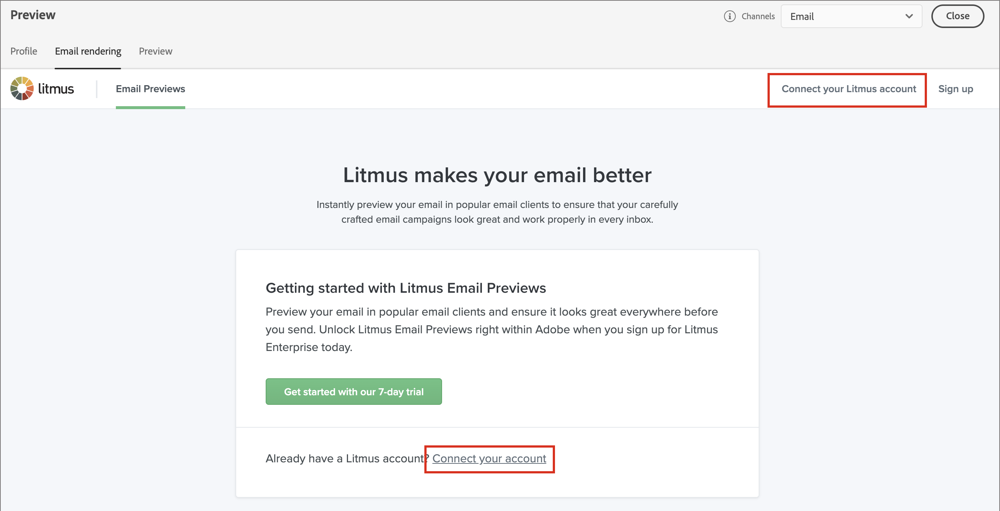

# E-mailrendering testen met Litmus

Om uw e-mails te testen, kunt u hefboomwerking a [ rekening van de Samenhang ](https://www.litmus.com/email-testing){target="_blank"} in Journey Optimizer B2B edition. Met deze integratie kunt u een voorvertoning van uw e-mailrendering weergeven in populaire e-mailclients. Met dit gereedschap kunt u ervoor zorgen dat uw e-mailinhoud er goed uitziet en werkt zoals deze in elke Postvak IN is ontworpen.

1. Wanneer uw e-mailontwerp gereed is en klaar is om te worden getest, klikt u op **[!UICONTROL Simulate content]** in de ontwerpruimte voor e-mail.

1. Klik op **[!UICONTROL Render email]** rechtsboven.

   

   Als u nog geen verbinding hebt gemaakt met uw Litmus-account vanuit Journey Optimizer B2B edition, biedt de weergegeven pagina een optie voor het starten van een proefaccount of het maken van verbinding met uw bestaande account.

1. Klik op **[!UICONTROL Connect your Litmus account]** rechtsboven of gebruik de koppeling in de pagina.

   

1. Voer uw referenties in en klik op **[!UICONTROL Sign in]** .

   >[!IMPORTANT]
   >
   >Wanneer u uw account Litmus verbindt met Journey Optimizer B2B edition, gaat u ermee akkoord dat testberichten naar Litmus worden verzonden. Na verzending worden deze e-mailberichten niet meer beheerd door Adobe. Dientengevolge, is het beleid van de Gegevens van de Litmus e-mail van toepassing op deze e-mail, met inbegrip van verpersoonlijkingsgegevens die in de testberichten kunnen worden omvat.

1. Klik op **[!UICONTROL Run test]** rechtsboven om e-mailvoorvertoningen te genereren.

1. Controleer uw e-mailinhoud in populaire desktops, mobiele en webclients.

   

   Klik op de weergegeven miniatuur om de details voor een van de gerenderde clienttests weer te geven.

1. Wanneer u klaar bent met het herzien, klik de achterpijl ( ) bij top-left om op de Simulate inhoudspagina terug te komen.

   U kunt een ander profiel selecteren en een andere renderingstest uitvoeren, of terugkeren naar de ontwerpruimte van de e-mail om de benodigde aanpassingen aan te brengen op basis van uw revisie.

