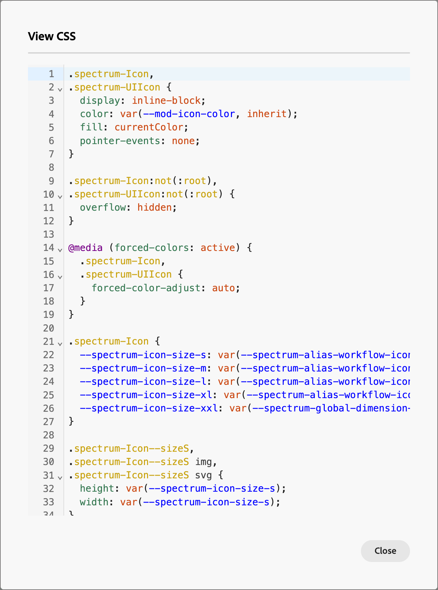

# Formulierontwerp

Nadat u [ een vorm ](./forms.md#create-forms) creeert, opent de visuele ontwerpruimte een ontwerp met een standaardbasisvormdefinitie. Klik in het deelvenster _[!UICONTROL Summary]_&#x200B;aan de rechterkant op **[!UICONTROL Edit form]**&#x200B;en gebruik de visuele ontwerpruimte om de formulieropmaak en veldcomponenten te definiëren.

{width="700" zoomable="yes"}

## Velden

Formuliervelden worden gebruikt om persoonprofielgegevens vast te leggen die kunnen worden gebruikt om personen als doel in te stellen en deze te koppelen aan accounts en inkoopgroepen. Alle nieuwe formulieren beginnen met de volgende velden in één kolomindeling:

* Voornaam
* Achternaam
* E-mailadres

Gebruik de hulpmiddelen van het gebiedsontwerp om de reeks gebieden en lay-out te construeren die u voor het verzamelen van de gegevens nodig hebt die u voor uw op rekening-gebaseerde marketing activiteiten wilt.

### Veld toevoegen {#add-field}

1. Sleep in het deelvenster _[!UICONTROL Components]_&#x200B;aan de linkerkant de inhoudcomponent **[!UICONTROL Field]**&#x200B;en zet deze neer op het canvas.

   {width="700" zoomable="yes"} toe

1. Klik op **[!UICONTROL Select field attribute]**.

1. Selecteer in het dialoogvenster _[!UICONTROL Select field attribute]_&#x200B;het selectievakje voor het personenprofielkenmerk dat u voor het veld wilt gebruiken en klik op **[!UICONTROL Select]**.

   De [ XDM bedrijfsschema&#39;s ](../data/field-mapping.md#xdm-business-person-attributes) bepalen de beschikbare attributen.  Alle aangepaste velden die zijn gedefinieerd voor uw Journey Optimizer B2B edition-exemplaar, zijn ook beschikbaar. Gebruik het tekstvak Zoeken om de lijst op naam te filteren of klik op het pictogram Filter om de lijst op schema/gegevenstype te filteren.

   {width="700" zoomable="yes"} toe

   Op het canvas wordt het standaardveldlabel voor het geselecteerde kenmerk gevuld op het canvas. De **[!UICONTROL Field details]** worden weergegeven in het deelvenster aan de rechterkant.

1. Wijzig zo nodig de tekst van **[!UICONTROL Label]** .

   Deze tekst wordt weergegeven naast het veld in het formulier. De standaardtekst wordt gevuld vanuit het veldkenmerk.

1. Stel **[!UICONTROL Field type]** in op basis van het type gegevens voor het veld:

   | Veldtype | Gebruik | Voorbeeld |
   | ---------- | ----- | ------- |
   | **[!UICONTROL Checkbox]** | Gebruik dit type zodat de bezoekers a _waar_ (gecontroleerd) of _vals_ (ongecontroleerd) waarde kunnen selecteren. | |
   | **[!UICONTROL Checkbox Group]** | Gebruik dit type zodat de bezoekers a _waar_ (gecontroleerd) of _vals_ (ongecontroleerd) waarde voor veelvoudige punten kunnen selecteren. | |
   | **[!UICONTROL Currency]** | Gebruik dit type om een zwevend veld toe te staan dat het standaardvalutatype vertegenwoordigt dat is geselecteerd voor de Journey Optimizer B2B edition-instantie. | |
   | **[!UICONTROL Date]** | Met dit type beperkt u de invoer tot een datumnotatie en verschaft u een kalenderkiezer in het veld. | |
   | **[!UICONTROL Double]** |  | |
   | **[!UICONTROL Email]** | Gebruik dit type om de toegang te beperken tot een indeling voor e-mailadressen. | |
   | **[!UICONTROL Number]** | Gebruik dit type om het veld te beperken tot een numerieke waarde. | |
   | **[!UICONTROL Radio Group]** | Gebruik dit type als bezoekers een van de opties mogen selecteren. | |
   | **[!UICONTROL Select]** | Gebruik dit type als bezoekers een van de opties in een vervolgkeuzelijst mogen selecteren. | |
   | **[!UICONTROL Slider]** | Gebruik dit type om bezoekers de mogelijkheid te geven een numerieke waarde in te stellen met een schuifregelaar. | |
   | **[!UICONTROL Telephone]** | Gebruik dit type voor een veld voor telefoonnummerinvoer. | |
   | **[!UICONTROL Text]** | Gebruik dit type voor een standaard tekstinvoerveld (tekenreeks). | |
   | **[!UICONTROL Textarea]** | Gebruik dit type om langere tekstinvoer te ondersteunen. | |
   | **[!UICONTROL URL]** | Gebruik dit type om tekstinvoer te beperken tot een URL, inclusief het standaard URL-protocol. | |

1. Afhankelijk van het geselecteerde veldtype stelt u de andere opties in voor het invoeren en valideren van velden:

   {width="400" zoomable="yes"}

   * **[!UICONTROL Placeholder]** - De plaatsaanduidingswaarde voor het veld die de bezoeker een voorbeeld geeft van wat er voor het veld wordt verwacht.

   * **[!UICONTROL Instructions]** - Instructieve tekst waarmee de bezoeker het veld kan voltooien. Ga de tekst in die u als _aanwijstekst_ voor het gebied wilt tonen.

     >[!TIP]
     >
     >_Instructies vs. placeholder tekst_ 
     >
     >Gebruik deze twee eigenschappen om bezoekers te begeleiden bij het invullen van het veld. Instructietekst wordt weergegeven als knopinfo/pop-uptekst wanneer u de aanwijzer op het veld plaatst. Plaatsaanduidingstekst verschijnt _gedimd_ binnen het gebied en verdwijnt als de bezoeker hun tekst in het gebied activeert. U kunt beide methoden gebruiken, of slechts één.

   * **[!UICONTROL Default value]** - Gebruik deze optie om een standaardwaarde voor het veld op te geven.

   * **[!UICONTROL Validation message]** - Gebruik deze optie om een validatiebericht voor het veld op te geven. Dit bericht wordt weergegeven als de bezoeker een ongeldige waarde voor het veld invoert. Het _[!UICONTROL Standard]_-bericht wordt standaard ingesteld. Kies **[!UICONTROL Custom]**&#x200B;en voer uw eigen bericht in.

   * **Max lengte** - ga het maximumaantal karakters in die in het gebied kunnen worden ingegaan.

1. Stel de **[!UICONTROL Field behaviors]** desgewenst in:

   * **Vereist** - selecteer checkbox om de gebiedsinput te maken die voor het voorleggen van de vorm wordt vereist.

   * **laat inputmasker** toe - selecteer checkbox om input van uw bezoeker te beperken gebruikend een inputmasker. U wilt bezoekers bijvoorbeeld wellicht telefoonnummers invoeren in een specifieke notatie. Voer in het dialoogvenster het masker in met `9` voor een willekeurig getal, `a` voor een willekeurige letter en `*` voor een van beide. Klik op Opslaan om het opgegeven invoermasker in te schakelen.

     {width="500" zoomable="yes"}

### Veldstijl wijzigen {#field-styling}

Selecteer de tab **[!UICONTROL Styles]** in het rechterdeelvenster om de opmaak voor het geselecteerde veld te wijzigen.

* **[!UICONTROL Background]** - Schakel het selectievakje in om een achtergrondkleur voor het veld toe te passen. Wit is de standaardkleur. Klik op het vierkantje **[!UICONTROL Background color]** om de kleurkiezer voor de pop-upkleur te openen en een kleur voor de achtergrond van het veld te kiezen.

  {width="600" zoomable="yes"}

* **[!UICONTROL Label]** - De labelopmaak bepaalt de visuele kenmerken van de tekst die naast het veld wordt weergegeven. Kies een boven- of zijlabelweergave ten opzichte van het veld. U kunt de tekengrootte, regelhoogte, tekststijl en tekstuitlijning instellen. Klik op het vierkantje **[!UICONTROL Font color]** om de kleurkiezer voor de pop-upkleur te openen en kies een kleur voor de labeltekst.

  {width="600" zoomable="yes"}

* **[!UICONTROL Border]** - Klik op het vierkantje **[!UICONTROL Border color]** om de kleurkiezer voor de pop-upkleur te openen en een kleur voor de rand te kiezen. U kunt een rand voor het veld definiëren, inclusief de kleur en lijnbreedte. Schakel het selectievakje uit om de weergegeven veldrand te verwijderen. U kunt ook de randgrootte (pixelbreedte), stijl en straalinstelling voor de hoeken wijzigen.

  {width="600" zoomable="yes"}

* **[!UICONTROL Size]** - Selecteer een formaatinstelling om de weergavebreedte voor het veld te bepalen. Kies _[!UICONTROL Full width]_,_[!UICONTROL Half width]_ of _[!UICONTROL Auto]_.

* **[!UICONTROL Margin]** - Stel marges (in pixels) in rond het veld. U kunt dezelfde marge op alle vier de zijden instellen of het selectievakje **[!UICONTROL Different margin for each side]** inschakelen om de horizontale en verticale marges afzonderlijk in te stellen.

* **[!UICONTROL Padding]** - Stel opvulling (in pixels) in rond het veld. U kunt dezelfde marge op alle vier de zijden instellen of het selectievakje **[!UICONTROL Different padding for each side]** inschakelen om de horizontale en verticale marges afzonderlijk in te stellen.

  {width="600" zoomable="yes"}

### Velden opnieuw ordenen {#field-reorder}

U kunt formuliervelden rechtstreeks in de visuele werkruimte verplaatsen. Klik het _hulpmiddel van de Beweging_ op de juiste rand van het geselecteerde gebied en sleep het aan een nieuwe plaats.

Voeg structurele componenten aan het formulier toe en verplaats velden naar kolommen om ze te groeperen en de indeling te wijzigen. Klik het _hulpmiddel van de Beweging_ op de linkerrand van de geselecteerde kolomcomponent en sleep het aan een nieuwe plaats binnen de vorm.

{width="500"}

### Een veld verwijderen of dupliceren {#field-delete-duplicate}

Klik het _pictogram van de Schrapping_ ( ) in de toolbar of het juiste paneel om een geselecteerd gebied te schrappen. Klik op **[!UICONTROL Delete]** in het bevestigingsdialoogvenster.

Klik het _Dubbele_ pictogram ( ) in de toolbar of het juiste paneel om een geselecteerd gebied te dupliceren. Het nieuwe veld wordt net onder het oorspronkelijke veld weergegeven. Klik op **[!UICONTROL Select field attribute]** om het kenmerk voor het veld in te stellen. Stel het veldtype, de details en de stijlen naar wens in.

{width="600" zoomable="yes"}

## Verzenden, knop

De verzendknop (voettekstveld) maakt standaard deel uit van het formulier en kan niet worden verwijderd. Selecteer de knop-/voettekstcomponent in het formulier om de tekst en opmaak voor de knop te wijzigen.

### De knopinhoud bewerken {#button-content}

Wijzig de tekst in het veld _[!UICONTROL Content]_&#x200B;terwijl de tab **[!UICONTROL Button text]**&#x200B;in het rechterdeelvenster wordt weergegeven. De knopgrootte wordt aangepast aan de lengte van de tekst.

{width="600" zoomable="yes"}

### De verzendknop opmaken {#button-styles}

Selecteer de tab **[!UICONTROL Styles]** in het rechterdeelvenster om de opmaak voor de geselecteerde knop-/voettekstcomponent te wijzigen.

* **[!UICONTROL Background]** - Schakel het selectievakje in om een achtergrondkleur voor de knop toe te passen. Blauw is de standaardkleur. Klik op het vierkantje **[!UICONTROL Background color]** om de kleurkiezer voor de pop-upkleur te openen en een kleur voor de achtergrond van de knop te kiezen.

  {width="600" zoomable="yes"}

* **[!UICONTROL Label]** - De labelopmaak bepaalt de visuele kenmerken van de tekst in de knop. U kunt de tekengrootte, regelhoogte, tekststijl en tekstuitlijning instellen. Klik op het vierkantje **[!UICONTROL Font color]** om de kleurkiezer voor de pop-upkleur te openen en kies een kleur voor de labeltekst.

* **[!UICONTROL Border]** - Klik op het vierkantje **[!UICONTROL Border color]** om de kleurkiezer voor de pop-upkleur te openen en een kleur voor de rand te kiezen. U kunt een rand voor de knop definiëren, inclusief de kleur en lijnbreedte. Schakel het selectievakje uit om de weergegeven knoprand te verwijderen. U kunt ook de instelling voor de randgrootte (pixelbreedte), stijl en straal voor afgeronde hoeken wijzigen.

* **[!UICONTROL Size]** - Selecteer een grootte die de vertoningsbreedte voor de knoop plaatst te bepalen. Kies _[!UICONTROL Full width]_,_[!UICONTROL Half width]_ of _[!UICONTROL Auto]_. De opvulling wordt aangepast aan de instellingen voor grootte en uitlijning.

  {width="600" zoomable="yes"}

* **[!UICONTROL Button Alignment]** - wanneer u a _Halve breedte_ of _Auto_ grootte voor de knoop kiest, plaats de groepering bij verlaten, recht, of centrum. De opvulling wordt aangepast aan de instellingen voor grootte en uitlijning.

* **[!UICONTROL Margin]** - Stel marges (in pixels) in rond het veld. U kunt dezelfde marge op alle vier de zijden instellen of het selectievakje **[!UICONTROL Different margin for each side]** inschakelen om de horizontale en verticale marges afzonderlijk in te stellen.

* **[!UICONTROL Padding]** - Stel opvulling (in pixels) in rond het veld. U kunt dezelfde marge op alle vier de zijden instellen of het selectievakje **[!UICONTROL Different padding for each side]** inschakelen om de horizontale en verticale marges afzonderlijk in te stellen. De opvulling wordt aangepast als u de instellingen voor grootte en uitlijning wijzigt.

  {width="600" zoomable="yes"}

## Formulierstijl {#form-styling}

U kunt stijlen voor het formuliergebied wijzigen wanneer u buiten de structuur- of formuliercomponenten klikt. De vormcomponenten (gebieden en knoop) erven de _1&rbrace; stijlen van het Lichaam &lbrace;bepaald de top-level stijlen, tenzij andere stijlen op het gebied of knoop/footer niveau worden bepaald._

{width="600" zoomable="yes"}

### CSS-stijlen

Nieuwe formulieren gebruiken de standaard-CSS voor opmaak. Als u de stijlen wilt wijzigen door de CSS te wijzigen, kunt u deze kopiëren en vervolgens gebruiken om een aangepaste CSS voor het formulier te definiëren.

_Een aangepaste CSS voor het formulier definiëren :_

1. Klik op **[!UICONTROL View CSS]** in het rechterdeelvenster om de CSS-code te bekijken.

   {width="450" zoomable="yes"}

1. Selecteer de CSS-code in het schuifvenster en kopieer deze naar het klembord.

1. Klik op **[!UICONTROL Close]**.

1. (Optioneel) Plak de gekopieerde code in uw favoriete CSS-gereedschap en bewerk de CSS om de gewenste opmaak weer te geven.

1. Klik op **[!UICONTROL Add custom CSS]** in het rechterdeelvenster.

1. Plak de CSS-code in het venster.

   {width="450" zoomable="yes"}

   U kunt de geplakte tekst in dit venster bewerken.

1. Klik op **[!UICONTROL Save]**.

### Handmatige stijl

Wijzig de instellingen in het rechtervenster om de weergave voor het hele formulier te definiëren.

* **[!UICONTROL Background color]** - Schakel het selectievakje in om een achtergrondkleur toe te passen rond het formuliergebied. Wit is de standaardkleur. Klik op het gekleurde vierkant om de kleurkiezer voor de pop-upkleur te openen en een kleur voor de achtergrond van het formulier te kiezen.

* **[!UICONTROL Viewport background]** - Schakel het selectievakje in om een achtergrondkleur toe te passen op alle formuliercomponenten. De standaardwaarde is geen kleur (overerven van de buitenste achtergrond). Klik op het kleurvakje om de kleurkiezer voor de pop-upkleur te openen en kies een kleur voor de structuurcomponenten van het formulier.

  {width="600" zoomable="yes"}

* **[!UICONTROL Text]** - Kies een **[!UICONTROL Font family]** voor het formulier, dat invloed heeft op de labels, de tip en de plaatsaanduidingstekst voor formuliervelden. Het heeft ook invloed op de standaardtekst van de verzendknop.

* **[!UICONTROL Size]** - Wijzig de grootte (breedte) van het formulier in pixels.

* **[!UICONTROL Margin]** - Stel marges (in pixels) in rond de formuliercomponenten. U kunt dezelfde marge op alle vier de zijden instellen of het selectievakje **[!UICONTROL Different margin for each side]** inschakelen om de horizontale en verticale marges afzonderlijk in te stellen.

  {width="600" zoomable="yes"}
