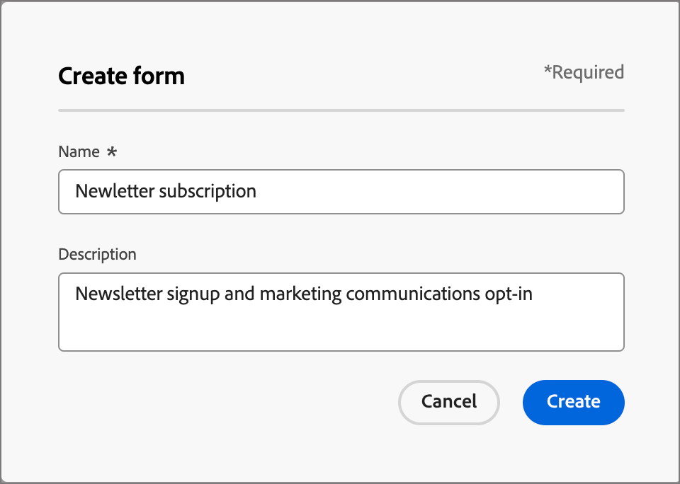
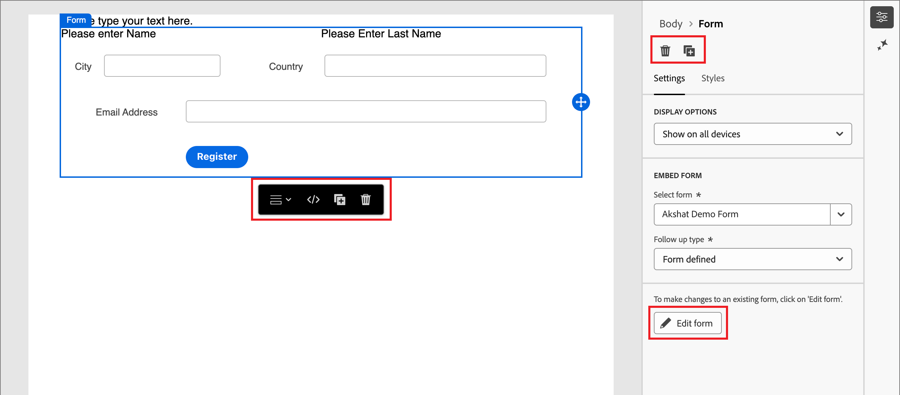

# Forms

Als u informatie van bezoekers van webpagina&#39;s wilt vastleggen, maakt u formulieren en voegt u deze toe aan uw bestemmingspagina&#39;s. Een formulier is een set velden die bezoekers van pagina&#39;s invullen en verzenden voor een bepaald type inhoud of aanbieding, zoals een whitepaper, webinar op aanvraag of een gratis proefversie.

De hoeveelheid informatie die het formulier moet vastleggen, is afhankelijk van de waarde van de inhoud of het aanbod. Als u iets eenvoudigs aanbiedt, zoals een witboek, zou u slechts minimale informatie, zoals hun naam, e-mail, en bedrijf moeten verzamelen. Als de aanbieding iets van hogere waarde is, zoals een demo of een gratis proefversie, kunt u meer informatie verzamelen. Het vereisen van een voorgelegde vorm om inhoud het bekijken toe te laten wordt genoemd _ingegateerde inhoud_. Uw organisatie beslist welke inhoud zou moeten worden behandeld en die niet (_vrij_) is. De beste manier is om bepaalde inhoud gratis toe te staan en alleen uw premium of inhoud met een hoge vraag af te geven.

## Formulieren openen en beheren

Ga naar de linkernavigatie en klik op **[!UICONTROL Content Management]** > **[!UICONTROL Forms]** om formulieren te openen in Journey Optimizer B2B edition. Met deze actie opent u een pagina met lijsten met alle formulieren die in het exemplaar in een tabel zijn gemaakt.

{width="700" zoomable="yes"}

De tabel wordt gesorteerd op de kolom _[!UICONTROL Modified]_, waarbij de laatst bijgewerkte formulieren standaard bovenaan staan. Klik op de kolomtitel om te schakelen tussen oplopend en aflopend.

### Formulierstatus en levenscyclus

De formulierstatus bepaalt de beschikbaarheid voor gebruik in een sjabloon van een landingspagina of landingspagina en de wijzigingen die u daarin kunt aanbrengen.

| Status | Beschrijving |
| -------------------- | ----------- |
| Concept | Wanneer u een formulier maakt, bevindt het zich in de conceptstatus. Deze status blijft behouden wanneer u de velden definieert of bewerkt totdat u deze publiceert voor gebruik in een landingspagina of een sjabloon voor een bestemmingspagina. Beschikbare handelingen:  <ul><li>Alle details bewerken<li>Bewerken in visuele ontwerpruimte<li>Publiceren<li>Dupliceren<li>Verwijderen |
| Gepubliceerd | Wanneer u een formulier publiceert, wordt het beschikbaar voor gebruik in een landingspagina of een landingspagina-sjabloon. Gepubliceerde formulierinhoud kan niet worden gewijzigd in de ruimte van het visuele ontwerp. Beschikbare handelingen:  <ul><li>Naam, beschrijving of bedankpagina bewerken<li>Toevoegen aan een landingspagina of een sjabloon voor een bestemmingspagina<li>Conceptversie maken<li>Dupliceren<li>Verwijderen (indien niet in gebruik)<li>Code insluiten |
| Gepubliceerd met concept | Wanneer u een concept maakt op basis van een gepubliceerd formulier, blijft de gepubliceerde versie beschikbaar voor gebruik in een landingspagina of een sjabloon voor een bestemmingspagina en kan de conceptinhoud worden gewijzigd in de visuele ontwerpruimte. Als u de conceptversie publiceert, vervangt deze de huidige gepubliceerde versie en wordt de inhoud bijgewerkt op de bestemmingspagina&#39;s of de landingspagina&#39;s waar deze wordt gebruikt. Beschikbare handelingen:  <ul><li>Geef naam, beschrijving of dank-u pagina&#39;s uit<li>Toevoegen aan een landingspagina of een sjabloon voor een bestemmingspagina<li>Conversie bewerken in visuele ontwerpruimte<li>Conceptversie publiceren<li>Dupliceren<li>Verwijderen (indien niet in gebruik)<li>Code insluiten |

{zoomable="yes"}

### De formulierlijst filteren

Als u naar een formulier op naam wilt zoeken, voert u in de zoekbalk een tekenreeks in voor een overeenkomst. Klik het _pictogram van de Filter_ ( ) om de beschikbare filteropties te tonen en de montages te veranderen om de getoonde punten volgens uw gespecificeerde criteria te filtreren.

{width="700" zoomable="yes"}

### De kolomweergave aanpassen

Pas de kolommen aan die u in de lijst wilt tonen door _te klikken aanpassen lijst_ pictogram ( ) bij het hoogste recht.

Selecteer in het dialoogvenster de kolommen die u wilt weergeven en klik op **[!UICONTROL Apply]** .

{width="300"}

## Formulieren maken

Voordat u herbruikbare formulieren gaat maken in Journey Optimizer B2B edition, moet u rekening houden met een aantal zaken:

* Bepaal welke formulieren u nodig hebt.

  Het kan mogelijk zijn slechts vier standaardformulieren te gebruiken. Eén voor toegang tot downloadbare inhoud, één voor toegang tot geavanceerde webpagina&#39;s, één voor weergave van video&#39;s en één voor registratie voor bijvoorbeeld webinars. Als u ooit een veld in een formulier moet wijzigen, is het eenvoudiger om vier standaardformulieren bij te werken die globaal worden gebruikt in plaats van meerdere formulieren te wijzigen die zich verspreiden over al uw marketingprogramma&#39;s. <!-- Global forms also make progressive profiling much easier to implement. -->

* Bepaal voor elk standaardformulier welke velden moeten worden gebruikt en hoe deze moeten worden weergegeven.

  U kunt ook kortere formulieren gebruiken, omdat deze beter zijn voor conversies. Wanneer u door elk formulier nadenkt, bepaalt u welke velden redelijk en noodzakelijk zijn voor het doel ervan.

  Overweeg of formuliervelden vooraf moeten worden ingevuld, zodat basisgegevens zoals naam en e-mail vooraf worden ingevuld. Maar andere informatie, zoals de functie en de grootte van de organisatie, is dat niet. Op deze manier hoeft de bezoeker slechts twee velden in te vullen en het formulier te verzenden. U kunt ook een sociale-formuliervulling gebruiken met gegevens van Facebook of Twitter.

* Plan welke follow-up pagina wordt getoond nadat een bezoeker een vorm voorlegt (_dank u_ pagina).

  Krijgt iedereen de zelfde pagina of is het dynamisch en gebaseerd op hun gegevens? Zo kan iemand in de gezondheidszorg bijvoorbeeld een andere pagina-inhoud zien dan iemand in de technische industrie.

* Overweeg of u een formulier volledig wilt overslaan als u al over de benodigde informatie beschikt.

  Wanneer u een formulierbypass toestaat voor een bekende persoon die uw landingspagina bezoekt, heeft deze persoon rechtstreeks toegang tot de inhoud. Het omzeilen van het formulier zorgt voor een gestroomlijnde ervaring voor bezoekers.

### Een nieuw formulier toevoegen

U kunt een formulier maken in Journey Optimizer B2B edition door te klikken op **[!UICONTROL Create form]** rechtsboven op de lijstpagina van _[!UICONTROL Forms]_.

1. Voer in het dialoogvenster _[!UICONTROL Create form]_een handige **[!UICONTROL Name]**(vereist) en **[!UICONTROL Description]**(optioneel) in.

   Formuliervereisten:

   * Naam - maximaal 100 tekens, moet uniek en hoofdlettergevoelig zijn

   * Beschrijving - Maximaal 300 tekens

   * Alpha, numerieke en speciale tekens zijn toegestaan

   * Gereserveerde karakters zijn **_niet toegestaan_**: `\ / : * ? " < > |`

   {width="400"}

1. Klik op **[!UICONTROL Create]**.

   De pagina met formulierdetails wordt geopend met een standaardbasisformulierdefinitie.

   {width="700" zoomable="yes"}

### Het standaardformulierontwerp wijzigen

Met de gereedschappen voor visueel ontwerp kunt u de formulierinhoud naar wens wijzigen:

* [Velden toevoegen](./form-design.md#add-a-field)
* [Veldstijl wijzigen](./form-design.md#change-field-styling)
* [Velden opnieuw ordenen](./form-design.md#reorder-fields)
* [Tekst en opmaak van verzendknop wijzigen](./form-design.md#edit-and-style-the-submit-button)
* [De formulieropmaak wijzigen](./form-design.md#change-form-styling)

Klik op **[!UICONTROL Save & close]** om wijzigingen in het ontwerp van de formulierinhoud op te slaan en naar de formulierdetails te gaan.

### De pagina Hartelijk dank instellen

Blader in het deelvenster _[!UICONTROL Summary]_aan de rechterkant naar de sectie **[!UICONTROL Thank you page]**en gebruik de instelling **[!UICONTROL Follow up with]**om te bepalen wat er gebeurt wanneer een bezoeker het formulier verzendt:

* **[!UICONTROL Stay on page]** - Kies deze optie als u de bezoeker op dezelfde pagina wilt houden wanneer het formulier wordt verzonden.

* **[!UICONTROL Landing page]** - Kies deze optie als u een Journey Optimizer B2B edition- of Marketo Engage-bestemmingspagina wilt selecteren als follow-up.

* **[!UICONTROL External URL]** - Kies deze optie om een URL op te geven als de vervolgpagina. Nadat de bezoeker het formulier heeft verzonden, laadt de browser de opgegeven URL.

  >[!TIP]
  >
  >Als u het formulier wilt gebruiken voor het downloaden van een bestand, kunt u een URL voor het gehoste bestand opgeven. Met deze configuratie werkt de verzendknop als een downloadknop.

### Het formulierconcept publiceren

Als u het formulier beschikbaar wilt maken voor gebruik in een landingspagina of een sjabloon voor een openingspagina, klikt u op **[!UICONTROL Publish]** .

{width="400"}

Met deze handeling wordt een bevestigingsvenster geopend. U kunt het publicatieproces afbreken door op **[!UICONTROL Cancel]** te klikken of door op **[!UICONTROL Publish]** te klikken om te bevestigen.

## Formulierdetails weergeven

Klik op de naam van een formulier in de lijstpagina om de pagina met fragmentdetails te openen. U kunt het formulier bewerken, de naam van het formulier wijzigen of de formulierbeschrijving bijwerken. Voer updates uit en klik buiten het naam- of beschrijvingsveld om wijzigingen automatisch op te slaan.

>[!NOTE]
>
>Als een gepubliceerd formulier wordt gebruikt door een landingspagina of een sjabloon voor een bestemmingspagina, kunt u de inhoud niet bewerken of de pagina voor bedankt wijzigen. U kunt een conceptversie maken als u wijzigingen wilt aanbrengen in het formulier.

{width="600" zoomable="yes"}

Klik op **[!UICONTROL Edit form]** om het fragment te openen in de visuele ontwerpruimte.

Ga de mening op elk ogenblik weg door de _Vorige_ pijl bij de hoogste linkerzijde te klikken, die u aan de _[!UICONTROL Forms]_lijstpagina terugkeert.

## Formuliervoorkeuren weergeven

Klik in het deelvenster _[!UICONTROL Summary]_aan de rechterkant op het tabblad **[!UICONTROL Used By]**om details weer te geven over de plaats waar het formulier momenteel wordt gebruikt in Journey Optimizer B2B edition, op de landingspagina&#39;s en in de sjabloon voor de openingspagina.

>[!IMPORTANT]
>
>Een formulier dat momenteel wordt gebruikt door een landingspagina of sjabloon van een landingspagina, kan niet worden verwijderd.

{width="600" zoomable="yes"}

De verwijzingen worden getoond volgens categorie: _het Bestaan pagina_ of _het Bestaan paginamalplaatje_. Klik op de koppeling om de bijbehorende pagina of sjabloon te openen waarin het formulier wordt gebruikt.

## Formulieren verwijderen

Een formulier dat momenteel wordt gebruikt door een landingspagina of een landingspagina-sjabloon, kan niet worden verwijderd. U kunt _gebruiken-door_ verwijzingen controleren alvorens een vormverwijdering in werking te stellen. Een verwijdering kan ook niet ongedaan worden gemaakt. Controleer dit voordat u een verwijderactie start.

U kunt een formulier op een van de volgende manieren verwijderen:

* Klik rechtsboven op **[!UICONTROL ... More]** en kies **[!UICONTROL Delete]** .
* Klik op de lijstpagina _[!UICONTROL Forms]_op het ovaal naast de formuliernaam en kies **[!UICONTROL Delete]**.

Met deze handeling wordt een bevestigingsvenster geopend. U kunt het proces afbreken door op **[!UICONTROL Cancel]** te klikken of op **[!UICONTROL Delete]** te klikken om het verwijderen te bevestigen.

{width="400"}

Als het formulier momenteel in gebruik is, wordt een informatief dialoogvenster geopend waarin u wordt gewaarschuwd dat het formulier niet kan worden verwijderd. Klik op **[!UICONTROL OK]** om het verwijderen af te breken.

{width="400"}

## Dubbele formulieren

Dupliceer een formulier als een snelle en eenvoudige manier om een nieuw formulier te maken op basis van een bestaand formulier als beginpunt voor uw formulierontwerp.

U kunt een formulier op een van de volgende manieren dupliceren:

* Klik rechtsboven op de pagina met formulierdetails op **[!UICONTROL ... More]** en kies **[!UICONTROL Duplicate]** .
* Klik op de lijstpagina _[!UICONTROL Forms]_op het ovaal naast de formuliernaam en kies **[!UICONTROL Duplicate]**.

{width="450"}

Voer in het dialoogvenster een nuttige naam (uniek) en beschrijving in. Klik op **[!UICONTROL Duplicate]** om de handeling te voltooien.

{width="400"}

Bewerk het gedupliceerde formulier om de naam naar wens te wijzigen en wijzig het formulier voor het beoogde gebruik.

## Formulieren bewerken

Wijzigingen in een formulier zijn afhankelijk van de huidige status:

* Wanneer een vorm in _Laag_ status is, kunt u om het even welk van zijn details en inhoud (gebieden, knoop, en het stileren) uitgeven.
* Wanneer een vorm in _Gepubliceerde_ status is, kunt u de vormnaam of beschrijving uitgeven. U kunt de inhoud niet bewerken.
* Wanneer een vorm in _met ontwerp_ status wordt gepubliceerd, kunt u de vormnaam of beschrijving uitgeven. In de conceptversie kunt u ook de inhoud en de pagina&#39;s voor bedankt bewerken

>[!BEGINTABS]

>[!TAB  Ontwerp ]

1. Klik op de lijstpagina _[!UICONTROL Forms]_op de naam van het formulier om het te openen.

   Er wordt een voorbeeld van de formulierinhoud weergegeven, met de formulierdetails aan de rechterkant.

1. Wijzig de gewenste details, zoals de naam en beschrijving.

   {width="600" zoomable="yes"}

1. Als u wijzigingen in het formulier wilt aanbrengen in de visuele ontwerpruimte, klikt u op **[!UICONTROL Edit form]** .

   Gebruik de gereedschappen voor visueel ontwerp naar wens:

   * [Velden toevoegen](./form-design.md#add-a-field)
   * [Veldstijl wijzigen](./form-design.md#change-field-styling)
   * [Velden opnieuw ordenen](./form-design.md#reorder-fields)
   * [Tekst en opmaak van verzendknop wijzigen](./form-design.md#submit-button)
   * [De formulieropmaak wijzigen](./form-design.md#change-form-styling)

   Klik op **[!UICONTROL Save & close]** om terug te keren naar de formulierdetails.

1. Als het formulier aan uw criteria voldoet en u wilt het beschikbaar maken voor gebruik in een landingspagina of een landingspagina-sjabloon, klikt u op **[!UICONTROL Publish]** .

>[!TAB  Gepubliceerd ]

1. Klik op de lijstpagina _[!UICONTROL Forms]_op de naam van het formulier om het te openen.

   Er wordt een voorbeeld van de formulierinhoud weergegeven, met de formulierdetails aan de rechterkant.

1. Als u een conceptversie wilt maken voor het bewerken van het formulier, klikt u op **[!UICONTROL Edit form]** in het deelvenster _[!UICONTROL Summary]_aan de rechterkant.

1. Klik op **[!UICONTROL Create draft version]** in het dialoogvenster om de conceptversie te openen in de ruimte van het visuele ontwerp.

   {width="400"}

1. Gebruik de gereedschappen voor visueel ontwerp om de formulierinhoud bij te werken:

   * [Velden toevoegen](./form-design.md#add-a-field)
   * [Veldstijl wijzigen](./form-design.md#change-field-styling)
   * [Velden opnieuw ordenen](./form-design.md#reorder-fields)
   * [Tekst en opmaak van verzendknop wijzigen](./form-design.md#submit-button)
   * [De formulieropmaak wijzigen](./form-design.md#change-form-styling)

   Klik op **[!UICONTROL Save & close]** om terug te keren naar de formulierdetails.

1. Wanneer het conceptformulier aan uw criteria voldoet en u wilt de wijzigingen beschikbaar maken voor gebruik in een landingspagina of een sjabloon voor een bestemmingspagina, klikt u op **[!UICONTROL Publish]** .

   Wanneer u de conceptversie publiceert, vervangt deze de huidige gepubliceerde versie en wordt de formulierinhoud bijgewerkt op de bestemmingspagina&#39;s of de landingspagina-sjablonen waar deze al in gebruik is.

>[!TAB  Gepubliceerd met ontwerp ]

1. Klik op de naam van het formulier om het te openen.

1. Selecteer de tab **[!UICONTROL Draft]** .

   Aan de rechterkant wordt een voorbeeld van de inhoud van het concept-formulier weergegeven met de formuliergegevens.

   {width="700" zoomable="yes"}

1. Klik op **[!UICONTROL Edit form]** in het deelvenster _[!UICONTROL Summary]_aan de rechterkant en gebruik de gereedschappen voor visueel ontwerp:

   * [Velden toevoegen](./form-design.md#add-a-field)
   * [Veldstijl wijzigen](./form-design.md#change-field-styling)
   * [Velden opnieuw ordenen](./form-design.md#reorder-fields)
   * [Tekst en opmaak van verzendknop wijzigen](./form-design.md#submit-button)
   * [De formulieropmaak wijzigen](./form-design.md#change-form-styling)

   Klik op **[!UICONTROL Save & close]** om terug te keren naar de formulierdetails.

1. Als het conceptformulier aan uw criteria voldoet en u wilt de wijzigingen beschikbaar maken voor gebruik in openingspagina&#39;s en sjabloon voor openingspagina&#39;s, klikt u op **[!UICONTROL Publish]** .

   Wanneer u de conceptversie publiceert, wordt de huidige gepubliceerde versie vervangen en wordt het formulier bijgewerkt op de bestemmingspagina&#39;s en sjablonen waar het al in gebruik is.

>[!ENDTABS]

## Formulieren toevoegen aan een bestemmingspagina of sjabloon

Forms wordt ontworpen voor hergebruik en kan worden opgenomen wanneer u a [ landend pagina ](./landing-page-design.md) of [ landend paginamalplaatje ](./landing-page-templates.md) ontwerpt.

{{$include /help/_includes/content-design-add-forms.md}}

## Formulierhandelingen voor het ontwerpen van pagina&#39;s en sjablonen

Als een formulier is opgenomen in een landingspagina of een sjabloon voor een bestemmingspagina, kan de formulierinhoud niet worden gewijzigd binnen de pagina of sjabloon. U kunt echter de volgende handelingen toepassen:

* **[!UICONTROL Delete]** - Met deze actie verwijdert u het formulier van de huidige pagina of de sjablooninhoud (de fragmentbron blijft ongewijzigd).
* **[!UICONTROL Duplicate]** - Met deze actie dupliceert u het formulier binnen dezelfde pagina of sjabloon in de editor, met dezelfde afmetingen en voegt u het net eronder toe.
* **[!UICONTROL View HTML]** - Met deze handeling wordt een pop-up met de HTML voor het formulier geopend. U kunt de HTML bewerken of kopiëren voor gebruik in andere webinhoud.
* **[!UICONTROL Edit Form]** - Met deze actie opent u een nieuw browsertabblad met de pagina met formuliereditors en details.

Wanneer u het formulier selecteert in de ontwerpruimte van de bestemmingspagina, zijn deze handelingen beschikbaar op de contextwerkbalk en in het deelvenster Eigenschappen aan de rechterkant.

{width="600" zoomable="yes"} toe
