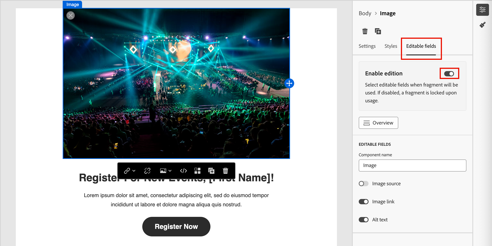

# Fragmentauthoring

Nadat u [ een fragment ](./fragments.md#create-fragments) creeert, gebruik de visuele redacteur aan auteur de structuur en inhoudscomponenten in uw fragment.

## Structuur en inhoud toevoegen {#design-fragment}

>[!CONTEXTUALHELP]
>id="ajo-b2b_structure_components_fragment"
>title="Structuurcomponenten toevoegen"
>abstract="Structuurcomponenten definiëren de indeling van het fragment. De belemmering en laat vallen component van de a **Structuur** in het canvas beginnen de inhoud van uw fragment te ontwerpen."

>[!CONTEXTUALHELP]
>id="ajo-b2b_content_components_fragment"
>title="Informatie over contentonderdelen"
>abstract="Inhoudscomponenten zijn lege plaatsaanduidingen voor inhoud die u kunt gebruiken om de lay-out van een fragment te maken."

{{$include /help/_includes/content-design-components.md}}

## Elementen toevoegen

{{$include /help/_includes/content-design-assets.md}}

## Navigeren door de lagen, instellingen en stijlen

{{$include /help/_includes/content-design-navigation.md}}

## Inhoud personaliseren

{{$include /help/_includes/content-design-personalization.md}}

## Aangepaste velden inschakelen

Wanneer een auteur van een e-mail- of e-mailsjabloon het fragment toevoegt, wordt de fragmentinhoud standaard vergrendeld. Wijzigingen in het gepubliceerde fragment worden automatisch doorgegeven aan alle inhoudselementen waar het fragment wordt gebruikt. Wanneer u een parameter voor een component in het fragment toewijst als bewerkbaar, kan de auteur van de e-mail of sjabloon een aangepaste veldwaarde opgeven die specifiek is voor zijn of haar behoeften. Deze aanpassingsvlag is beperkt tot beeld, tekst, en knoop visuele componenten.

Als u bijvoorbeeld een herbruikbare banner ontwerpt die een klikbare knop bevat, kunt u de URL-parameter voor de knop instellen als bewerkbaar. E-mailauteurs kunnen vervolgens een URL gebruiken die specifieker is voor hun e-mailcampagne. Met deze aanpasbare velden kunnen marketers inhoud beheren en aanpassen zonder dat ze geheel nieuwe inhoudsblokken hoeven te maken of de overgeërfde updates van het oorspronkelijke fragment moeten onderbreken.

1. Selecteer in de visuele inhoudeditor de afbeelding, tekst of knopelement waar u aanpassing wilt inschakelen.

1. Selecteer de tab **[!UICONTROL Editable fields]** in de componentdetails aan de rechterkant.

1. Klik op de optie **[!UICONTROL Enable edition]** om te schakelen en stel de bewerkbare velden in.

   {width="700" zoomable="yes"} toe

   U kunt aanpassingen inschakelen voor de weergegeven velden, afhankelijk van het componenttype en de parameters die in het fragment zijn gedefinieerd.

   Verander de knevel in toegelaten staat voor elk gebied waar u aanpassing wilt toestaan.

1. Klik op **[!UICONTROL Overview]** om alle bewerkbare velden en de bijbehorende standaardwaarden te bekijken.

   {width="700" zoomable="yes"}

1. Sla uw wijzigingen op.

## Gekoppelde URL-tracking bewerken

{{$include /help/_includes/content-design-links.md}}
