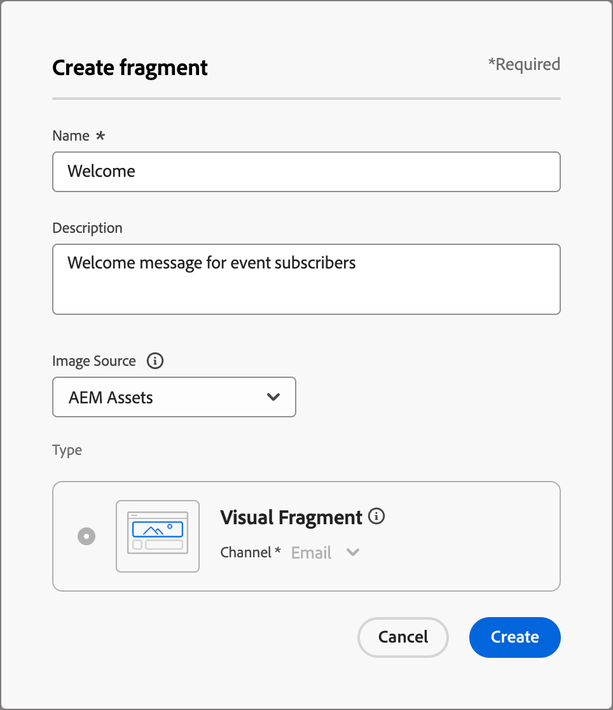

# Fragmenten

Een fragment is een herbruikbare component waarnaar in een of meer e-mailsjablonen in Adobe Journey Optimizer B2B Edition kan worden verwezen. Het is doorgaans een blok inhoud (tekst, afbeelding of beide) dat u vooraf kunt maken en snel kunt invoegen in een e-mailsjabloon. Met deze functionaliteit kunt u meerdere aangepaste inhoudsblokken vooraf samenstellen die door uw leden van uw marketingteam kunnen worden gebruikt om e-mailinhoud samen te stellen voor een verbeterd ontwerpproces. Veelvoorkomende gebruiksgevallen zijn inhoudsblokken voor kop- en voetteksten voor e-mail, uitnodigingsbanners voor gebeurtenissen en seizoensgebonden begroetingen.

U kunt zo veel mogelijk gebruikmaken van fragmenten in uw workflows:

* _creeer uw eigen fragmenten_ - creeer visuele fragmenten, of van kras of door inhoud als fragment op om het even welk ogenblik van de visuele inhoudsredacteur op te slaan.
* _Fragment_s opnieuw gebruiken - Gebruik deze zo vaak als nodig is in de inhoud.

## Visuele fragmenten

Visuele fragmenten zijn vooraf gedefinieerde visuele blokken die zijn gemaakt met de visuele inhoudeditor die u kunt hergebruiken in meerdere e-mails of e-mailsjablonen. Het huidige bereik van Journey Optimizer B2B Edition en deze documentatie zijn alleen van visuele fragmenten. Op expressie gebaseerde fragmenten worden nog niet ondersteund in Journey Optimizer B2B Edition.

## Fragmenten openen en beheren

Ga naar de linkernavigatie en klik op **[!UICONTROL Content Management]** > **[!UICONTROL Fragments]** om visuele fragmenten in de Adobe Journey Optimizer B2B-editie te openen. Met deze actie opent u een pagina met lijsten met alle fragmenten die in de instantie in een tabel zijn gemaakt.

{width="700" zoomable="yes"}

De tabel wordt gesorteerd op de kolom _[!UICONTROL Modified]_. Standaard staan de meest recente bijgewerkte fragmenten boven aan de lijst. Klik op de kolomtitel om te schakelen tussen oplopend en aflopend.

Zoek naar om het even welk fragment door een tekstkoord in de onderzoeksbar voor een gelijke door fragmentnaam in te gaan. Klik het _pictogram van de Filter_ om de getoonde punten volgens uw gespecificeerde criteria te filtreren.

{width="700" zoomable="yes"}

Pas de kolommen aan die u in de lijst wilt tonen door _te klikken aanpassen lijst_ pictogram op het hoogste recht. Selecteer de kolommen die u wilt weergeven en klik op **[!UICONTROL Apply]** .

## Fragmenten maken

U kunt nieuwe visuele fragmenten maken in Journey Optimizer B2B Edition door op **[!UICONTROL Create fragment]** rechtsboven te klikken.

1. Voer in het dialoogvenster _[!UICONTROL Create fragment]_een handige **[!UICONTROL Name]**en **[!UICONTROL Description]**(optioneel) in.

   Fragmentvereisten:

   * Naam - maximaal 100 tekens, moet uniek en hoofdlettergevoelig zijn

   * Beschrijving - Maximaal 300 tekens

   * Alpha, numerieke tekens en speciale tekens zijn toegestaan

   * Gereserveerde tekens zijn niet toegestaan: `\ / : * ? " < > |`

   {width="500"}

1. Klik op **[!UICONTROL Create]**.

   De visuele inhoudeditor wordt geopend met een leeg canvas. Raadpleeg de onderwerpen over het schrijven van inhoud voor het samenstellen van een fragment met de visuele inhoudeditor:

<!-- To be linked to the corresponding sections on this page: Adobe Journey Optimizer B2B Edition - Email Templates

Adding structure & content
Adding assets
Navigating the layers
Previewing & editing URLs
View options
More options -->

## Fragmentdetails weergeven

Klik op de naam van een fragment in de lijstpagina om de pagina met fragmentdetails te openen.

Van hieruit kunt u kiezen om het fragment te bewerken, het fragment een andere naam te geven of de fragmentbeschrijving bij te werken (werk de fragmentbeschrijving bij en klik buiten het vak Naam/beschrijving om de wijzigingen automatisch op te slaan).

Klik op **[!UICONTROL Edit]** om het fragment te openen in de visuele inhoudeditor.

Ga de mening op elk ogenblik weg door de _Achter_ pijl bij de hoogste linkerzijde te klikken, die u aan de _pagina van de de 3} lijst van Fragmenten {terugkeert._

## Fragment weergeven dat wordt gebruikt door verwijzingen

Klik op het tabblad **[!UICONTROL Used By]** op de pagina met fragmentdetails om details weer te geven over waar het fragment momenteel wordt gebruikt in Journey Optimizer B2B Edition, in e-mails, e-mailsjablonen en fragmenten.

>[!IMPORTANT]
>
>Elk fragment dat momenteel wordt gebruikt door een e-mailsjabloon of e-mailsjabloon, kan niet worden verwijderd.

De verwijzingen worden getoond volgens categorie: _E-mail_ of _E-mailmalplaatje_. E-mails in Journey Optimizer B2B Edition worden ingesloten en geschreven binnen accountreizen, zodat de bovenliggende reis van de e-mail die het fragment gebruikt, in verwijzingen wordt weergegeven.

Klik op de koppeling om de bijbehorende sjabloon voor e-mail of e-mail te openen waarin het fragment wordt gebruikt.

## Fragmenten verwijderen

Om het even welk fragment dat momenteel in gebruik door om het even welk e-mail of e-mailmalplaatje is kan niet worden geschrapt, zodat controleert u _gebruikt-door_ verwijzingen alvorens een fragmentverwijdering in werking te stellen. Een verwijdering kan ook niet ongedaan worden gemaakt. Controleer dit voordat u een verwijderactie start.

U kunt een fragment op een van de volgende manieren verwijderen:

* Klik op **[!UICONTROL Delete]** in de fragmentdetails aan de rechterkant.
* Klik op de aanbiedingspagina van _[!UICONTROL Fragments]_op de ovaal naast het fragment en kies **[!UICONTROL Delete]**.

Met deze handeling wordt een bevestigingsvenster geopend. U kunt het proces afbreken door op **[!UICONTROL Cancel]** te klikken of op **[!UICONTROL Delete]** te klikken om het verwijderen te bevestigen.

Als het fragment momenteel in gebruik is, wordt een informatief dialoogvenster geopend waarin u wordt gewaarschuwd dat het fragment niet kan worden verwijderd. Klik op **[!UICONTROL OK]** , die het verwijderen afbreekt.

## Fragmenten bewerken

U kunt een fragment op een van de volgende manieren bewerken:

* Klik op **[!UICONTROL Edit]** in de fragmentdetails aan de rechterkant.
* Klik op de aanbiedingspagina van _[!UICONTROL Fragments]_op de ovaal naast het fragment en kies **[!UICONTROL Edit]**.

Deze actie opent het fragment in een visuele inhoudsredacteur, waar u het fragment kunt uitgeven gebruikend om het even welke eigenschappen voor [ creërend een fragment ](#create-fragments).

## Fragmenten dupliceren

U kunt een fragment op een van de volgende manieren dupliceren:

* Klik op **[!UICONTROL Duplicate]** in de fragmentdetails aan de rechterkant.
* Klik op de aanbiedingspagina van _[!UICONTROL Fragments]_op de ovaal naast het fragment en kies **[!UICONTROL Duplicate]**.

Voer in het dialoogvenster een nuttige naam (uniek) en beschrijving in. Klik op **[!UICONTROL Duplicate]** om de handeling te voltooien.

Het gedupliceerde (nieuwe) fragment verschijnt dan in de _lijst van Fragmenten_.

## Een fragment opslaan vanuit de e-mail- of sjablooneditor

Wanneer u zich in de visuele inhoudeditor bevindt voor het maken/bewerken van een e-mail- of e-mailsjabloon, kunt u de inhoud geheel of gedeeltelijk opslaan als een fragment, zodat deze opnieuw kan worden gebruikt.

1. Wanneer u inhoud als een fragment wilt opslaan, klikt u op **[!UICONTROL More]** en kiest u **[!UICONTROL Save as Fragment]** .

1. Selecteer de verschillende elementen die u in het fragment wilt opnemen.

   Meerdere structuren selecteren door de knop CTRL ingedrukt te houden

   U kunt alleen structuren selecteren die aan elkaar grenzen en met de interface kunt u geen niet-aangrenzende elementen selecteren.

1. Selecteer de inhoud en klik op **[!UICONTROL Create]** rechtsboven.

1. Voer in het dialoogvenster een nuttige naam en beschrijving voor het fragment in. Klik vervolgens op **[!UICONTROL Create]** .

   Het nieuwe fragment wordt dan getoond in de _Fragmenten_ het vermelden pagina en is ook beschikbaar voor gebruik binnen e-mail en e-mailmalplaatjes.

## Visuele fragmenten toevoegen aan een e-mail of sjabloon

Fragmenten zijn ontworpen voor hergebruik en kunnen worden ingevoegd voor het ontwerpen van sjablonen voor e-mail en e-mail. U kunt maximaal 30 fragmenten in een e-mail of sjabloon toevoegen. Fragmenten kunnen tot één niveau worden genest.

>[!BEGINTABS]

>[!TAB  voegt fragmenten aan e-mail  toe]

1. Navigeer naar Rekeningreizen en open een bestaande reis of maak een nieuwe reis.

1. Maak een knooppunt &#39;Handeling uitvoeren > Personen > E-mail verzenden&#39;.

1. Maak of bewerk e-mailinhoud voor het knooppunt.

1. De belemmering en laat vallen een punt van het menu van Componenten om a _structuur_ voor het fragment te verstrekken.

1. Om de fragmenten lijst te openen, klik het _pictogram van Fragmenten_.

   U kunt:
   * Sorteer de aanbieding.
   * Blader, zoek, filter de lijst.
   * Schakelen tussen de miniatuur- en lijstweergave.
   * Vernieuw de lijst om een van de onlangs gemaakte fragmenten weer te geven.

1. Sleep een van de fragmenten naar de tijdelijke aanduiding voor het structuuronderdeel.

   De editor geeft het fragment weer binnen de sectie/het element van de e-mailstructuur.

De inhoud van het fragment wordt dynamisch bijgewerkt binnen de structuur om een visuele weergave te geven van hoe de inhoud in de e-mail wordt weergegeven.

Als u het fragment wilt toevoegen zodat het de volledige horizontale lay-out binnen e-mail bezet, voeg een 1:1 kolomstructuur toe en sleep en zet dan het fragment in het.

Nadat het e-mailbericht is opgeslagen, wordt het weergegeven op de pagina met fragmentdetails > Gebruikt door sectie. Fragmenten die aan een e-mailbericht worden toegevoegd, kunnen niet worden bewerkt in de e-mail. De inhoud wordt gedefinieerd door het bronfragment.

>[!TAB  voegt fragmenten aan een e-mailmalplaatje  toe]

1. Klik in de linkernavigatie op **[!UICONTROL Content Management]** > **[!UICONTROL Templates]** .

1. Maak een nieuwe sjabloon of open een bestaande e-mailsjabloon en klik op **[!UICONTROL Edit Email Template]** .

1. De belemmering en laat vallen een punt van het menu van Componenten om a _structuur_ voor het fragment te verstrekken.

1. Om de fragmenten lijst te openen, klik het _pictogram van Fragmenten_.

   U kunt:
   * Sorteer de aanbieding.
   * Blader, zoek, filter de lijst.
   * Schakelen tussen de miniatuur- en lijstweergave.
   * Vernieuw de lijst om een van de onlangs gemaakte fragmenten weer te geven.

1. Sleep een van de fragmenten naar de tijdelijke aanduiding voor het structuuronderdeel.

   De editor geeft het fragment weer binnen de sectie/het element van de sjabloonstructuur voor e-mail.

1. Sleep een van de fragmenten naar de tijdelijke aanduiding voor het structuuronderdeel.

   De editor geeft het fragment weer binnen de sectie/het element van de sjabloonstructuur voor e-mail.

Als u het fragment wilt toevoegen zodat het de volledige horizontale lay-out binnen het e-mailmalplaatje bezet, voeg een 1:1 kolomstructuur toe en sleep dan en laat vallen het fragment in het.

Nadat de e-mailsjabloon is opgeslagen, wordt deze weergegeven in de sectie Fragmentdetails > _[!UICONTROL Used By]_. Fragmenten die aan een e-mailsjabloon zijn toegevoegd, kunnen niet worden bewerkt in de sjabloon. De inhoud wordt gedefinieerd door het bronfragment.

>[!ENDTABS]

## Fragmentacties tijdens het ontwerpen

Nadat een fragment aan een e-mail- of e-mailsjabloon is toegevoegd, kan de fragmentinhoud niet meer worden bewerkt in de e-mail of de sjabloon. U kunt echter de volgende handelingen toepassen:

* **[!UICONTROL Delete]** - Deze actie verwijdert het fragment uit de huidige e-mail- of e-mailsjablooninhoud (de fragmentbron blijft ongewijzigd).
* **[!UICONTROL Refresh]** - Met deze handeling wordt de inhoud van het fragment in de huidige e-mailsjabloon of de huidige e-mailsjabloon vernieuwd. Dit is handig als u recente bewerkingen aan het fragment wilt doorvoeren nadat het is toegevoegd aan de sjabloon voor e-mail of e-mail.
* **[!UICONTROL Duplicate]** - Met deze actie wordt het fragment binnen dezelfde e-mail- of e-mailsjabloon in de editor gedupliceerd, met dezelfde afmetingen en net eronder toegevoegd.
* **[!UICONTROL Open Fragment]** - Met deze actie opent u een nieuw browsertabblad met de pagina voor de fragmenteditor en details.
* **[!UICONTROL Break inheritance]** - Met deze actie wordt de overerving van het fragment (en de wijzigingen ervan) van de bron verbroken. Gebruik deze handeling om de fragmentinhoud beschikbaar te maken als onafhankelijke en bewerkbare inhoud binnen de e-mail- of e-mailsjabloon. Deze actie verwijdert ook het e-mail of e-mailmalplaatje uit _Gebruikt door_ verwijzing voor het originele fragment.

Wanneer u het fragment op de editorpagina selecteert, zijn deze acties beschikbaar bij de contexttoolbar en het eigenschappenpaneel op het recht.
