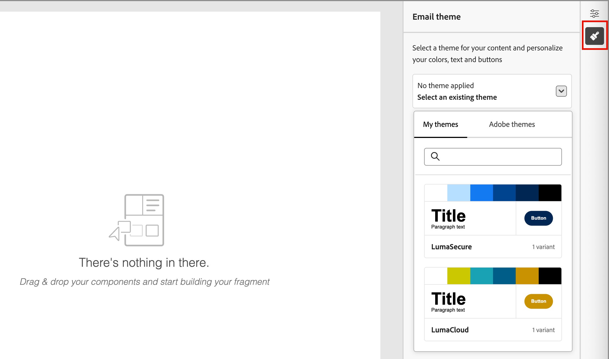
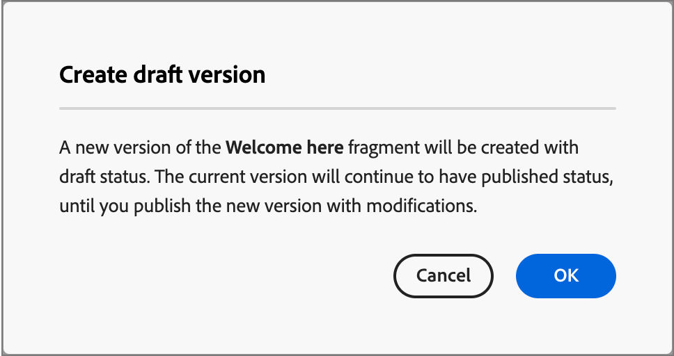

# Fragmenten

Een fragment is een herbruikbare component waarnaar in een of meer e-mailsjablonen in Adobe Journey Optimizer B2B edition kan worden verwezen. Het is doorgaans een blok inhoud (tekst, afbeelding of beide) dat u vooraf kunt maken en snel kunt invoegen in een e-mailsjabloon. Met deze functionaliteit kunt u meerdere aangepaste inhoudsblokken vooraf samenstellen voor gebruik door uw leden van uw marketingteam om e-mailinhoud samen te stellen voor een verbeterd ontwerpproces. Veelvoorkomende gebruiksgevallen zijn inhoudsblokken voor kop- en voetteksten voor e-mail, uitnodigingsbanners voor gebeurtenissen en seizoensgebonden begroetingen.

>[!BEGINSHADEBOX]

**Visuele fragmenten**

Visuele fragmenten zijn vooraf gedefinieerde visuele blokken die zijn gemaakt met de visuele ontwerpgereedschappen die u kunt hergebruiken in meerdere e-mails of e-mailsjablonen. Het huidige bereik van Journey Optimizer B2B edition en deze documentatie bevatten alleen visuele fragmenten.

>[!NOTE]
>
>Op expressie gebaseerde fragmenten worden nog niet ondersteund in [!DNL Journey Optimizer B2B Edition] .

>[!ENDSHADEBOX]

U kunt zo veel mogelijk gebruikmaken van fragmenten in uw workflows:

* _creeer uw eigen fragmenten_ - creeer visuele fragmenten, of van kras of door inhoud als fragment van de visuele inhoudsredacteur op te slaan.
* _hergebruik fragmenten_ - gebruik hen zo vele tijden zoals nodig in uw inhoud.

## Fragmenten openen en beheren

Ga naar de linkernavigatie en klik op **[!UICONTROL Content Management]** > **[!UICONTROL Fragments]** om visuele fragmenten te openen in Adobe Journey Optimizer B2B edition. Met deze actie opent u een pagina met lijsten met alle fragmenten die in de instantie in een tabel zijn gemaakt.

{width="700" zoomable="yes"}

De tabel wordt gesorteerd op de kolom _[!UICONTROL Modified]_, waarbij de meest recente bijgewerkte fragmenten standaard bovenaan staan. Klik op de kolomtitel om te schakelen tussen oplopend en aflopend.

### Fragmentstatus en levenscyclus

De fragmentstatus bepaalt de beschikbaarheid voor gebruik in een e-mail- of e-mailsjabloon en de wijzigingen die u daarin kunt aanbrengen.

| Status | Beschrijving |
| -------------------- | ----------- |
| Concept | Wanneer u een fragment maakt, bevindt het zich in de conceptstatus. Deze status blijft behouden wanneer u de visuele ontwerpruimte definieert of bewerkt totdat u deze publiceert voor gebruik in een e-mailsjabloon of e-mailsjabloon. Beschikbare handelingen:  <ul><li>Alle details bewerken<li>Bewerken in visuele ontwerpruimte<li>Publiceren<li>Dupliceren<li>Verwijderen |
| Gepubliceerd | Wanneer u een fragment publiceert, wordt dit beschikbaar voor gebruik in een e-mail- of e-mailsjabloon. Gepubliceerde fragmentinhoud kan niet worden gewijzigd in de ruimte van het visuele ontwerp. Beschikbare handelingen:  <ul><li>Beschrijving bewerken<li>Toevoegen aan een e-mail of sjabloon<li>Conceptversie maken<li>Dupliceren<li>Verwijderen (indien niet in gebruik) |
| Gepubliceerd met concept | Wanneer u een concept maakt op basis van een gepubliceerd fragment, blijft de gepubliceerde versie beschikbaar voor gebruik in een e-mail- of e-mailsjabloon en kan de conceptinhoud worden gewijzigd in de ruimte van het visuele ontwerp. Als u de conceptversie publiceert, vervangt deze de huidige gepubliceerde versie en wordt de inhoud bijgewerkt in de e-mails en e-mailsjablonen waar deze wordt gebruikt. Beschikbare handelingen:  <ul><li>Beschrijving bewerken<li>Toevoegen aan een e-mail of sjabloon<li>Conversie bewerken in de ruimte van het visuele ontwerp<li>Conceptversie publiceren<li>Dupliceren<li>Verwijderen (indien niet in gebruik) |

{zoomable="yes"}

>[!IMPORTANT]
>
>Fragmentstatus is geïntroduceerd in de Journey Optimizer B2B edition Augustus release. Alle fragmenten die vóór deze versie worden gecreeerd hebben de _status van het Ontwerp_, zelfs als zij in een e-mail of een malplaatje worden gebruikt. Als u wijzigingen aanbrengt in deze fragmenten, moet u het fragment publiceren om de wijzigingen door te geven.

### De lijst met fragmenten filteren

Als u naar een fragment op naam wilt zoeken, voert u in de zoekbalk een tekenreeks in voor een overeenkomst. Klik het _pictogram van de Filter_ ( ) om de beschikbare filteropties te tonen en de montages te veranderen om de getoonde punten volgens uw gespecificeerde criteria te filtreren.

{width="700" zoomable="yes"}

### De kolomweergave aanpassen

Pas de kolommen aan die u in de lijst wilt tonen door _te klikken aanpassen lijst_ pictogram ( ) bij het hoogste recht.

Selecteer in het dialoogvenster de kolommen die u wilt weergeven en klik op **[!UICONTROL Apply]** .

{width="300"} wilt tonen

## Fragmenten maken

U kunt nieuwe visuele fragmenten maken in Journey Optimizer B2B edition door op **[!UICONTROL Create fragment]** rechtsboven te klikken.

1. Voer in het dialoogvenster _[!UICONTROL Create fragment]_een handige **[!UICONTROL Name]**en **[!UICONTROL Description]**(optioneel) in.

   Fragmentvereisten:

   * Naam - maximaal 100 tekens, moet uniek en hoofdlettergevoelig zijn

   * Beschrijving - Maximaal 300 tekens

   * Alpha, numerieke en speciale tekens zijn toegestaan

   * Gereserveerde karakters zijn **_niet toegestaan_**: `\ / : * ? " < > |`

   {width="400"}

1. Klik op **[!UICONTROL Create]**.

   De visuele ontwerpruimte wordt geopend met een leeg canvas.

1. Gebruik de gereedschappen voor inhoudsontwerp om de visuele fragmentinhoud te maken:

   * [Structuur en inhoud toevoegen](./fragment-authoring.md#add-structure-and-content)
   * [Assets toevoegen](./fragment-authoring.md#add-assets)
   * [Navigeren door de lagen, instellingen en stijlen](./fragment-authoring.md#navigate-the-layers-settings-and-styles)
   * [Inhoud personaliseren](./fragment-authoring.md#personalize-content)
   * [Aangepaste velden inschakelen](./fragment-authoring.md#enable-fragment-customization)
   * [Gekoppelde URL-tracking bewerken](./fragment-authoring.md#edit-linked-url-tracking)

1. (Facultatief) pas a [ merkthema ](./brand-themes.md) op de fragmentinhoud toe om het fragmentauteursproces te stroomlijnen en ervoor te zorgen dat het ontwerp zich op bepaalde normen richt.

   >[!NOTE]
   >
   >Wanneer u een thema toepast, is de fragmentverenigbaarheid beperkt tot e-mail en e-mailmalplaatjes die op _wijze van het Thema_ worden gecreeerd.

   Klik het _pictogram van Thema&#39;s_ ( ) op het recht.

   {width="600" zoomable="yes"}

   Selecteer een van de aangepaste thema&#39;s op het tabblad **[!UICONTROL My themes]** of selecteer **[!UICONTROL Adobe themes]** als u een ingebouwd thema wilt gebruiken. Wanneer u buiten de lijst klikt, past het geselecteerde thema de stijlen voor alle componenten op het canvas toe. U kunt desgewenst schakelen tussen de kleurvarianten.

1. Klik op **[!UICONTROL Save]** om het conceptfragment op te slaan.

1. Als u het fragment beschikbaar wilt maken voor gebruik in een e-mailsjabloon of e-mailsjabloon, klikt u op **[!UICONTROL Publish]** .

## Fragmentdetails weergeven

Klik op de naam van een fragment in de lijstpagina om de pagina met fragmentdetails te openen. U kunt het fragment bewerken, de naam van het fragment wijzigen of de fragmentbeschrijving bijwerken. Voer updates uit en klik buiten het naam- of beschrijvingsveld om wijzigingen automatisch op te slaan.

>[!NOTE]
>
>Als een gepubliceerd fragment wordt gebruikt door een e-mailsjabloon, kunt u de naam niet wijzigen of de inhoud niet bewerken. U kunt een conceptversie maken als u wijzigingen in het fragment wilt aanbrengen.

{width="600" zoomable="yes"}

Klik op **[!UICONTROL Edit fragment]** om het fragment te openen in de visuele inhoudeditor.

Ga de mening op elk ogenblik weg door de _Achter_ pijl bij de hoogste linkerzijde te klikken, die u aan de _pagina van de de 3} lijst van Fragmenten {terugkeert._

## Fragment weergeven dat wordt gebruikt door verwijzingen

Klik op het tabblad **[!UICONTROL Used By]** op de pagina met fragmentdetails om details weer te geven over waar het fragment momenteel wordt gebruikt in Journey Optimizer B2B edition, in e-mails, e-mailsjablonen en fragmenten.

>[!IMPORTANT]
>
>Elk fragment dat momenteel wordt gebruikt door een e-mailsjabloon of e-mailsjabloon, kan niet worden verwijderd.

De verwijzingen worden getoond volgens categorie: _E-mail_ of _E-mailmalplaatje_. E-mails in Journey Optimizer B2B edition worden ingesloten en geschreven binnen accountreizen. De bovenliggende reis van de e-mail die het fragment gebruikt, wordt daarom weergegeven in verwijzingen.

{width="600" zoomable="yes"}

Klik op de koppeling om de bijbehorende sjabloon voor e-mail of e-mail te openen waarin het fragment wordt gebruikt.

## Fragmenten verwijderen

Om het even welk fragment dat momenteel in gebruik door om het even welk e-mail of e-mailmalplaatje is kan niet worden geschrapt, zodat controleert u _gebruikt-door_ verwijzingen alvorens een fragmentverwijdering in werking te stellen. Een verwijdering kan ook niet ongedaan worden gemaakt. Controleer dit voordat u een verwijderactie start.

U kunt een fragment op een van de volgende manieren verwijderen:

* Klik op **[!UICONTROL Delete]** in de fragmentdetails aan de rechterkant.
* Klik op de aanbiedingspagina van _[!UICONTROL Fragments]_op de ovaal naast het fragment en kies **[!UICONTROL Delete]**.

Met deze handeling wordt een bevestigingsvenster geopend. U kunt het proces afbreken door op **[!UICONTROL Cancel]** te klikken of op **[!UICONTROL Delete]** te klikken om het verwijderen te bevestigen.

{width="400"}

Als het fragment momenteel in gebruik is, wordt een informatief dialoogvenster geopend waarin u wordt gewaarschuwd dat het fragment niet kan worden verwijderd. Klik op **[!UICONTROL OK]** om het verwijderen af te breken.

{width="400"}

## Fragmenten bewerken

Bewerkingen aan een fragment zijn afhankelijk van de huidige status:

* Wanneer een fragment in _de status van het Ontwerp_ is, kunt u om het even welk van zijn details en de visuele inhoud uitgeven.
* Wanneer een fragment in _Gepubliceerde_ status is, kunt u de fragmentbeschrijving uitgeven, maar niet de naam. U kunt de visuele inhoud niet bewerken.
* Wanneer een fragment in _met ontwerp_ status wordt gepubliceerd, is het uitgeven van de details beperkt tot de beschrijving. U kunt ook de visuele inhoud van de conceptversie bewerken.

>[!BEGINTABS]

>[!TAB  Ontwerp ]

1. Klik op de aanbiedingspagina van _[!UICONTROL Fragments]_op de fragmentnaam om deze te openen.

   Er wordt een voorvertoning van de visuele inhoud weergegeven, met de fragmentdetails aan de rechterkant.

1. Wijzig de gewenste details, zoals de naam en beschrijving.

   {width="600" zoomable="yes"}

1. Klik op **[!UICONTROL Edit fragment]** om de inhoud in de visuele ontwerpruimte te wijzigen.

   Gebruik de gereedschappen voor visueel ontwerp naar wens:

   * [Structuur en inhoud toevoegen](./fragment-authoring.md#add-structure-and-content)
   * [Assets toevoegen](./fragment-authoring.md#add-assets)
   * [Navigeren door de lagen, instellingen en stijlen](./fragment-authoring.md#navigate-the-layers-settings-and-styles)
   * [Inhoud personaliseren](./fragment-authoring.md#personalize-content)
   * [Aangepaste velden inschakelen](./fragment-authoring.md#enable-fragment-customization)
   * [Gekoppelde URL-tracking bewerken](./fragment-authoring.md#edit-linked-url-tracking)

   Klik op **[!UICONTROL Save]** of **[!UICONTROL Save & close]** om terug te keren naar de fragmentdetails.

1. Als het fragment voldoet aan de criteria en u wilt het beschikbaar maken voor gebruik in een e-mailsjabloon of e-mailsjabloon, klikt u op **[!UICONTROL Publish]** .

>[!TAB  Gepubliceerd ]

1. Klik op de aanbiedingspagina van _[!UICONTROL Fragments]_op de fragmentnaam om deze te openen.

   Er wordt een voorvertoning van de visuele inhoud weergegeven, met de fragmentdetails aan de rechterkant.

1. Wijzig, indien nodig, de beschrijving.

   Voor een gepubliceerd fragment kunnen niet alle andere details worden gewijzigd.

1. Als u de inhoud wilt bijwerken, klikt u op **[!UICONTROL Create draft version]** rechtsboven.

   Klik op **[!UICONTROL OK]** in het dialoogvenster om de conceptversie te openen in de ruimte van het visuele ontwerp.

   {width="300"}

   Gebruik de gereedschappen voor visueel ontwerp naar wens:

   * [Structuur en inhoud toevoegen](./fragment-authoring.md#add-structure-and-content)
   * [Assets toevoegen](./fragment-authoring.md#add-assets)
   * [Navigeren door de lagen, instellingen en stijlen](./fragment-authoring.md#navigate-the-layers-settings-and-styles)
   * [Inhoud personaliseren](./fragment-authoring.md#personalize-content)
   * [Aangepaste velden inschakelen](./fragment-authoring.md#enable-fragment-customization)
   * [Gekoppelde URL-tracking bewerken](./fragment-authoring.md#edit-linked-url-tracking)

   Klik op **[!UICONTROL Save]** of **[!UICONTROL Save & close]** om terug te keren naar de fragmentdetails.

1. Als het concept van het fragment voldoet aan de criteria en u wilt de wijzigingen beschikbaar maken voor gebruik in een e-mailsjabloon of e-mailsjabloon, klikt u op **[!UICONTROL Publish]** .

   Wanneer u de conceptversie publiceert, vervangt deze de huidige gepubliceerde versie en wordt de inhoud bijgewerkt in de e-mails en e-mailsjablonen waar deze al in gebruik is.

>[!TAB  Gepubliceerd met ontwerp ]

U kunt de conceptversie op twee manieren openen om te bewerken op de pagina met _[!UICONTROL Fragments]_-aanbiedingen:

* Klik het _Meer_ pictogram (**..**) naast de fragmentnaam en kies **[!UICONTROL Open draft version]**.

  {width="300"}

* Klik op de fragmentnaam om deze te openen. Klik vervolgens rechtsboven op **[!UICONTROL Open draft version]** .

  Er wordt een voorbeeld van de visuele inhoud voor de conceptversie weergegeven, met de fragmentdetails aan de rechterkant.

De inhoud bijwerken:

1. Klik op **[!UICONTROL Edit fragment]** rechtsboven. Gebruik de gereedschappen voor visueel ontwerp naar wens:

   * [Structuur en inhoud toevoegen](./fragment-authoring.md#add-structure-and-content)
   * [Assets toevoegen](./fragment-authoring.md#add-assets)
   * [Navigeren door de lagen, instellingen en stijlen](./fragment-authoring.md#navigate-the-layers-settings-and-styles)
   * [Inhoud personaliseren](./fragment-authoring.md#personalize-content)
   * [Aangepaste velden inschakelen](./fragment-authoring.md#enable-fragment-customization)
   * [Gekoppelde URL-tracking bewerken](./fragment-authoring.md#edit-linked-url-tracking)

   Klik op **[!UICONTROL Save]** of **[!UICONTROL Save & close]** om terug te keren naar de fragmentdetails.

1. Als het concept van het fragment voldoet aan de criteria en u wilt de wijzigingen beschikbaar maken voor gebruik in een e-mailsjabloon of e-mailsjabloon, klikt u op **[!UICONTROL Publish]** .

   Wanneer u de conceptversie publiceert, vervangt deze de huidige gepubliceerde versie en wordt de inhoud bijgewerkt in de e-mails en e-mailsjablonen waar deze al in gebruik is.

>[!ENDTABS]

## Fragmenten dupliceren

U kunt een fragment op een van de volgende manieren dupliceren:

* Van de _[!UICONTROL Fragments]_lijstpagina, klik het_ Meer _pictogram (**...**) naast de fragmentnaam en kies **[!UICONTROL Duplicate]**.
* Klik rechtsboven op de pagina met fragmentdetails op **[!UICONTROL ... More]** en kies **[!UICONTROL Duplicate]** .

{width="600" zoomable="yes"}

Voer in het dialoogvenster een nuttige naam (uniek) en beschrijving in. Klik op **[!UICONTROL Duplicate]** om de handeling te voltooien.

{width="400"} in

Het gedupliceerde (nieuwe) fragment verschijnt dan in de _lijst van Fragmenten_.

## Een nieuw fragment opslaan vanuit e-mail- of sjablooninhoud

Wanneer u een e-mail- of e-mailsjabloon maakt/bewerkt in de visuele inhoudeditor, kunt u de inhoud geheel of gedeeltelijk opslaan als een fragment, zodat deze opnieuw kan worden gebruikt.

1. Wanneer u inhoud als een fragment wilt opslaan, klikt u op **[!UICONTROL More]** en kiest u **[!UICONTROL Save as Fragment]** .

1. Selecteer de verschillende elementen die u in het fragment wilt opnemen.

   Selecteer meerdere structuren door de knop Shift of Control ingedrukt te houden.

   U kunt alleen structuren selecteren die aan elkaar grenzen en met de interface kunt u geen niet-aangrenzende elementen selecteren.

1. Selecteer de inhoud en klik op **[!UICONTROL Create]** rechtsboven.

1. Voer in het dialoogvenster een nuttige naam en beschrijving voor het fragment in. Klik vervolgens op **[!UICONTROL Create]** .

   Het nieuwe fragment wordt dan getoond in de _Fragmenten_ het vermelden pagina en is ook beschikbaar voor gebruik binnen e-mail en e-mailmalplaatjes.

## Visuele fragmenten toevoegen aan uw e-mail- of sjablooninhoud

Fragmenten zijn ontworpen voor hergebruik en kunnen worden ingevoegd voor het ontwerpen van sjablonen voor e-mail en e-mail. U kunt maximaal 30 fragmenten in een e-mail of sjabloon toevoegen. Fragmenten kunnen tot één niveau worden genest.

>[!BEGINTABS]

>[!TAB  voegt fragmenten aan e-mail ] toe

1. Navigeer naar **[!UICONTROL Account Journeys]** en open een bestaande reis of maak een nieuwe reis.

1. Creeer een [_[!UICONTROL Send Email]_knoop ](./add-email.md#add-an-email-action-node-in-a-journey).

1. Creeer of geef [ e-mailinhoud voor de knoop ](./email-authoring.md) uit.

1. De belemmering en laat vallen een punt van het **[!UICONTROL Components]** menu om a _structuur_ voor het fragment te verstrekken.

1. Om de lijst van gepubliceerde fragmenten te openen, klik het _pictogram van Fragmenten_.

   U kunt:
   * Sorteer de aanbieding.
   * Blader naar de lijst, zoek de lijst en filter deze.
   * Schakelen tussen kaart- (miniatuur) en lijstweergaven.
   * Vernieuw de lijst om een van de onlangs gemaakte fragmenten weer te geven.

   {width="600"}

1. Sleep een van de fragmenten naar de tijdelijke aanduiding voor het structuuronderdeel.

   De editor geeft het fragment weer binnen de sectie/het element van de e-mailstructuur.

De inhoud van het fragment wordt dynamisch bijgewerkt binnen de structuur om een visuele weergave te geven van hoe de inhoud in de e-mail wordt weergegeven.

>[!TIP]
>
>Als u het fragment de volledige horizontale lay-out binnen e-mail wilt bezetten, voeg een [!UICONTROL 1:1 kolom ] structuur toe en sleep en zet dan het fragment in het.

Nadat het e-mailbericht is opgeslagen, wordt het weergegeven op de pagina met fragmentdetails wanneer het tabblad _[!UICONTROL Used By]_is geselecteerd. Fragmenten die aan een e-mail zijn toegevoegd, kunnen niet worden bewerkt in de e-mail of sjabloon. Het gepubliceerde bronfragment definieert de inhoud.

>[!TAB  voegt fragmenten aan een e-mailmalplaatje ] toe

1. Klik in de linkernavigatie op **[!UICONTROL Content Management]** > **[!UICONTROL Templates]** .

1. Maak een nieuwe sjabloon of open een bestaande e-mailsjabloon en klik op **[!UICONTROL Edit Email Template]** .

1. De belemmering en laat vallen een punt van het **[!UICONTROL Components]** menu om a _structuur_ voor het fragment te verstrekken.

1. Om de fragmenten lijst te openen, klik het _pictogram van Fragmenten_.

   U kunt:
   * Sorteer de aanbieding.
   * Blader naar de lijst, zoek de lijst en filter deze.
   * Schakelen tussen kaart- (miniatuur) en lijstweergaven.
   * Vernieuw de lijst om een van de onlangs gemaakte fragmenten weer te geven.

   {width="600"}

1. Sleep een van de fragmenten naar de tijdelijke aanduiding voor het structuuronderdeel.

   De editor geeft het fragment weer binnen de sectie/het element van de sjabloonstructuur voor e-mail.

1. Sleep een van de fragmenten naar de tijdelijke aanduiding voor het structuuronderdeel.

   De editor geeft het fragment weer binnen de sectie/het element van de sjabloonstructuur voor e-mail.

>[!TIP]
>
>Als u het fragment de volledige horizontale lay-out binnen het e-mailmalplaatje wilt bezetten, voeg een _[!UICONTROL 1:1kolom]_ structuur toe en sleep en zet dan het fragment in het.

Nadat de e-mailsjabloon is opgeslagen, wordt deze weergegeven op de pagina met fragmentdetails wanneer het tabblad _[!UICONTROL Used By]_is geselecteerd. Fragmenten die aan een e-mailsjabloon zijn toegevoegd, kunnen niet worden bewerkt in de sjabloon. Het gepubliceerde bronfragment definieert de inhoud.

>[!ENDTABS]

## Fragmentacties tijdens het ontwerpen van e-mail- en sjablonen

Wanneer een fragment aan een e-mailsjabloon of e-mailsjabloon wordt toegevoegd, kan de fragmentinhoud niet worden bewerkt in de e-mail of sjabloon. U kunt echter de volgende handelingen toepassen:

* **[!UICONTROL Delete]** - Deze actie verwijdert het fragment uit de huidige e-mail- of e-mailsjablooninhoud (de fragmentbron blijft ongewijzigd).
* **[!UICONTROL Refresh]** - Met deze handeling wordt de inhoud van het fragment in de huidige e-mailsjabloon of de huidige e-mailsjabloon vernieuwd. Vernieuwen is handig als u recente bewerkingen aan het fragment wilt spiegelen nadat u het fragment hebt toegevoegd aan de e-mailsjabloon of de e-mailsjabloon.
* **[!UICONTROL Duplicate]** - Met deze actie wordt het fragment binnen dezelfde e-mail- of e-mailsjabloon in de editor gedupliceerd, met dezelfde afmetingen en net eronder toegevoegd.
* **[!UICONTROL Open Fragment]** - Met deze actie opent u een nieuw browsertabblad met de pagina voor de fragmenteditor en details.
* **[!UICONTROL Break inheritance]** - Met deze actie wordt de overerving van het fragment (en de wijzigingen ervan) van de bron verbroken. Gebruik deze handeling om de fragmentinhoud beschikbaar te maken als onafhankelijke en bewerkbare inhoud binnen de e-mail- of e-mailsjabloon. Deze actie verwijdert ook het e-mail of e-mailmalplaatje uit _Gebruikt door_ verwijzing voor het originele fragment.

Wanneer u het fragment op de editorpagina selecteert, zijn deze acties beschikbaar bij de contexttoolbar en het eigenschappenpaneel op het recht.

{width="600" zoomable="yes"} toe
