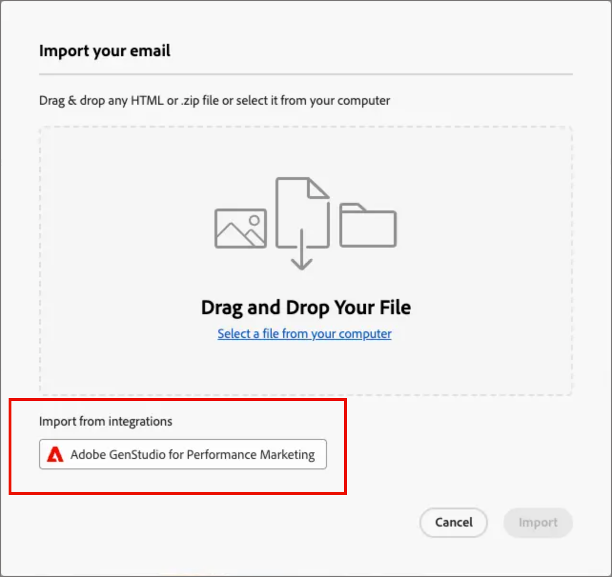

# E-mailinhoud maken met GenStudio for Performance Marketing {#genstudio-workflow}

>[!CONTEXTUALHELP]
>id="ajo-b2b_genstudio_button"
>title="Een sjabloon gebruiken die is gebouwd met GenStudio"
>abstract="Gebruik de integratie met Adobe GenStudio for Performance Marketing om een GenStudio-sjabloon te importeren die is verbeterd met de Adobe AI-technologie."

>[!AVAILABILITY]
>
>De integratie van GenStudio in [!DNL Adobe Journey Optimizer B2B Edition] is momenteel niet beschikbaar voor gebruik met het **Schild van de Gezondheidszorg** of **Privacy en het 4&rbrace; toe:voegen-op dienstenaanbod van het Schild van de Veiligheid.**
>
>Deze integratie is alleen beschikbaar voor het e-mailkanaal.

Om de efficiëntie van de workflow te verbeteren en de consistentie van uw merk te behouden, kunt u GenStudio for Performance Marketing-ervaringen combineren met Adobe Journey Optimizer B2B edition e-mailorchestratie. Dankzij deze uitgebreide workflow kunt u de tools voor het maken van AI-inhoud in GenStudio gebruiken om e-mailcommunicatie via een accountreis uit te breiden en te maximaliseren.

Een technische markator die bijvoorbeeld Journey Optimizer B2B edition gebruikt om e-mailcommunicatie naar belangrijke accounts te ontwikkelen en automatiseren, kan samenwerken met een prestatiemarkering die inhoud maakt met GenStudio. Met deze workflow kunnen beide bedrijven samenwerken om on-brand-inhoud van GenStudio te combineren tot Journey Optimizer B2B edition-marketingautomatisering op basis van account, waardoor boeiende e-mails worden geleverd die gericht zijn op specifieke inkoopgroepen en de verkoop van producten stimuleren.

>[!BEGINSHADEBOX]

## GenStudio-mogelijkheden voor het genereren van inhoud

[ Adobe GenStudio for Performance Marketing ](https://business.adobe.com/products/genstudio-for-performance-marketing.html){target="_blank"} is een generatieve AI-eerste toepassing die marketing teams machtigt om impactful, gepersonaliseerde advertenties en e-mails tot stand te brengen die aan merknormen voldoen en aan hun ondernemingsbeleid voldoen. Door gebruik te maken van Adobe AI-technologie, biedt deze technologie een uitgebreide reeks hulpmiddelen die de complexiteit van het maken en beheren van content vereenvoudigen, zodat creatieve mensen zich kunnen richten op innovatie.

{width="30"} [ creeer on-brand marketing e-mails ](https://experienceleague.adobe.com/en/docs/genstudio-for-performance-marketing-learn/tutorials/creating-experiences/creating-on-brand-emails){target="_blank"}

Leer meer over de mogelijkheden van GenStudio for Performance Marketing in de [ documentatie ](https://experienceleague.adobe.com/en/docs/genstudio-for-performance-marketing/user-guide/home){target="_blank"}

>[!ENDSHADEBOX]

## HTML exporteren vanuit Journey Optimizer B2B edition

Eerst exporteert u in Journey Optimizer B2B edition HTML vanuit een e-mailbericht dat de richtlijnen van uw merk bevat.

1. In Journey Optimizer B2B edition opent u de inhoud van uw e-mail in de ruimte van het visuele ontwerp.

1. Kies _[!UICONTROL More ...]_&#x200B;in het menu **[!UICONTROL Export HTML]**&#x200B;boven aan de e-mailontwerpruimte.

   {width="600"}

   Met deze handeling wordt een gedownload ZIP-bestand gegenereerd dat de HTML- en afbeeldingsbestanden bevat.

## De geëxporteerde HTML in GenStudio for Performance Marketing gebruiken

GenStudio for Performance Marketing herkent bepaalde elementen in de geïmporteerde e-mail-HTML wanneer deze worden geïdentificeerd met een herkende veldnaam. Voeg veldnamen toe in de geëxporteerde HTML met behulp van de syntaxis Handlebars waar u GenStudio for Performance Marketing nodig hebt om een bepaald type inhoud te genereren.

| Veld | Inhoudstype |
| ----------------- | ------------------------- |
| `{{pre_header}}` | Preheader |
| `{{headline}}` | Titel |
| `{{sub_headline}}` | Subkop |
| `{{body}}` | Platte tekst |
| `{{cta}}` | Call to action (button) |
| `{{image}}` | Afbeelding |
| `{{link}}` | Call to action op afbeelding |

### De sjabloon maken

Gebruik het HTML-bestand om een sjabloon te maken in GenStudio for Performance Marketing.

Voor gedetailleerde informatie over het uploaden van een malplaatje van HTML in GenStudio in Adobe GenStudio for Performance Marketing, verwijs naar [ een malplaatje ](https://experienceleague.adobe.com/en/docs/genstudio-for-performance-marketing/user-guide/content/templates/use-templates#add-a-template) in de documentatie van GenStudio for Performance Marketing toevoegen.

Wanneer u de geëxporteerde HTML als een sjabloon uploadt, zoekt GenStudio for Performance Marketing het HTML-bestand naar herkende velden. Gebruik de voorvertoning om uw sjabloonelementen te bekijken en te bevestigen dat u deze correct hebt geïdentificeerd met de herkende veldnamen.

### E-mailervaringen genereren

In GenStudio for Performance Marketing gebruikt u de sjabloon om verschillende variaties in e-mailervaringen te maken en op te slaan.

Voor gedetailleerde informatie over het produceren van gebrandde e-mailervaringen, verwijs naar [ creeer een e-mailervaring ](https://experienceleague.adobe.com/en/docs/genstudio-for-performance-marketing/user-guide/create/create-email-experience) in de documentatie van GenStudio for Performance Marketing.

## Gegenereerde e-mailervaringen toevoegen aan Journey Optimizer B2B edition

>[!NOTE]
>
>De GenStudio for Performance Marketing-integratie is alleen beschikbaar voor het maken van e-mails en is niet beschikbaar voor het maken van een e-mailsjabloon.

Ga als volgt te werk om de GenStudio-e-mailvariaties te gebruiken die zijn gemaakt van het geëxporteerde Journey Optimizer B2B edition e-mailbestand HTML:

1. In Journey Optimizer B2B edition, [ voeg een e-mail ](./add-email.md) aan een rekeningsreis toe gebruikend a _[!UICONTROL Take an action]_&#x200B;knoop.

   * Kies _[!UICONTROL Action on]_&#x200B;voor het doel **[!UICONTROL People]**.

   * Kies _[!UICONTROL Action on people]_&#x200B;bij **[!UICONTROL Send email]**.

     {width="700" zoomable="yes"}

   * Kies _[!UICONTROL Email source]_&#x200B;voor de optie **[!UICONTROL Create new email]**&#x200B;om de e-mail zelf te maken in Journey Optimizer B2B edition.

1. Voor _creeer uw E-mail_ pagina, uitgezochte **[!UICONTROL Import HTML]**.

1. Klik in het dialoogvenster _[!UICONTROL Import your email]_&#x200B;op **[!UICONTROL Adobe GenStudio for Performance Marketing]**.

   {width="500" zoomable="yes"}

1. Blader door de gepubliceerde ervaringen.

   U kunt de ervaringen op verscheidene criteria, zoals _Malplaatje_ filtreren en _creeerde door_.

   {width="600" zoomable="yes"}

1. Selecteer een ervaring en klik op **[!UICONTROL Use]** om uw e-mailinhoud samen te stellen.

   >[!NOTE]
   >
   >GenStudio-ervaringen die zijn gemaakt met een Journey Optimizer B2B edition- of Marketo Engage-sjabloon, worden rechtstreeks geïmporteerd in de ontwerpruimte voor e-mail. Ervaringen die zonder een Journey Optimizer B2B edition-sjabloon zijn gemaakt, worden geïmporteerd in de compatibiliteitsmodus.

1. Gebruik de [ e-mailinhoud en verpersoonlijkingshulpmiddelen ](./email-authoring.md) om uw e-mail zoals nodig uit te geven en het te bewaren.

   {width="800" zoomable="yes"}
