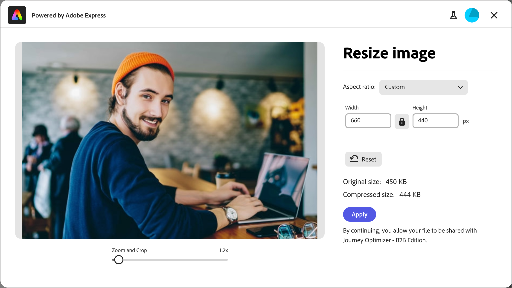

# Afbeeldingen bewerken met Adobe Express {#edit-images-adobe-express}

>[!CONTEXTUALHELP]
>id="ajo-b2b_assets_edit_adobe_express"
>title="Afbeeldingen bewerken in Adobe Express"
>abstract="Eenvoudige en intuïtieve hulpmiddelen voor beeldbewerking, aangedreven door Adobe Express, zijn rechtstreeks beschikbaar in Adobe Journey Optimizer B2B edition om de snelheid van de inhoud te verhogen."

Adobe Journey Optimizer B2B edition kan op een native manier worden geïntegreerd met Adobe Express en biedt toegang tot een set Adobe Express-gereedschappen voor het bewerken van afbeeldingen. Met deze gereedschappen kunt u de afbeeldingen wijzigen die zijn opgeslagen in de Journey Optimizer B2B edition-werkruimte voor de gekoppelde Marketo Engage-gegevensopslagruimte. De integratie biedt de volgende belangrijke voordelen:

* Meer hergebruik van inhoud door nieuwe afbeeldingselementen te bewerken en op te slaan in Journey Optimizer B2B edition.

* Minder tijd en moeite om afbeeldingselementen bij te werken of nieuwe versies van bestaande afbeeldingselementen te maken.

>[!NOTE]
>
>Alle Journey Optimizer B2B edition-abonnementen bevatten rechten voor Adobe Express-bewerkingsfuncties.

De Adobe Express-functies ondersteunen PNG- en JPEG-afbeeldingsbestandsindelingen.

_Een afbeelding wijzigen :_

1. Ga naar de linkernavigatie en klik **[!UICONTROL Content Management]** > **[!UICONTROL Assets]**.

Met deze handeling wordt een aanbiedingspagina geopend met alle vermelde elementen. De werkruimte van _[!UICONTROL Journey Optimizer B2B Edition]_is standaard geselecteerd.

1. Zoek de afbeelding die u wilt wijzigen of gebruik als origineel om een nieuw element te maken.

   * Om de activa door werkruimte en omslag te bekijken, open de structuur door _te klikken toont Omslagen_ pictogram bij de hoogste linkerzijde.

   * Als u de tabel op een van de kolommen wilt sorteren, klikt u op de kolomtitel. De pijl in de titelrij geeft de huidige sorteerkolom en -volgorde aan.

   * Als u wilt zoeken naar een afbeeldingselement in de geselecteerde werkruimte of map, voert u een tekenreeks in op de zoekbalk.

   {width="800" zoomable="yes"}

1. Klik op de naam van het afbeeldingselement om het te openen en de details ervan weer te geven.

   >[!TIP]
   >
   >Het is beste praktijken om [ het _[!UICONTROL Used By]_lusje ](./marketo-engage-design-studio.md#view-asset-used-by-references) in de beelddetails te selecteren en de inhoud te herzien waar het beeld momenteel wordt gebruikt alvorens u te werk gaat om aan het beelddossier uit te geven.

1. Klik in de afbeelding _[!UICONTROL Details]_aan de rechterkant op **[!UICONTROL Edit with Adobe Express]**.

   {width="600" zoomable="yes"}

   Als de afbeelding in gebruik is, verschijnt er een waarschuwingsvenster waarin u wordt gewaarschuwd dat de wijzigingen van invloed zijn op die inhoud. Klik op **[!UICONTROL Continue]** om door te gaan naar de Adobe Express-editor.

   {width="300"}

## Adobe Express Enterprise-licentie

Als u een Enterprise-licentie voor Adobe Express hebt, kunt u de Express Editor openen en gebruiken. Tot deze bewerkingsmogelijkheden behoren bewerkingen voor het aanpassen van afbeeldingen, zoals kleur, helderheid, scherpte, contrast en uitsnijden. Zij omvatten ook _AI magie_ verrichtingen, zoals verwijderen achtergronden, nemen en verwijderen voorwerpen op, en wissen delen van het beeld.

>[!NOTE]
>
>Uw Adobe Express Enterprise-licentie moet onder dezelfde IMS-organisatie worden aangeschaft om toegang te krijgen tot deze volledige editormogelijkheden van Journey Optimizer B2B edition. Als individueel lid van de organisatie IMS, hebt u een toegewezen vergunning in de instantie van Adobe Express nodig. Anders, wordt uw toegang van Adobe Express beperkt tot de [ snelle acties op Adobe Express ](#quick-actions-in-adobe-express) van Journey Optimizer B2B edition.

{width="600" zoomable="yes"}

De [ Gids van de Gebruiker van Adobe Express ](https://helpx.adobe.com/express/web.html){target="_blank"} verstrekt gedetailleerde informatie over de beschikbare het uitgeven mogelijkheden.

## Snelle acties in Adobe Express

Als u geen Adobe Express Enterprise-licentie hebt, hebt u toegang tot de Adobe Express-editor voor snelle acties.

1. Selecteer in de Snelle handelingeneditor van Adobe Express een van de functies voor het wijzigen van afbeeldingen om de afbeelding te wijzigen.

   * [**[!UICONTROL Resize image]**](#resize-image)
   * [**[!UICONTROL Remove background]**](#remove-background)
   * [**[!UICONTROL Crop image]**](#crop-image)
   * [**[!UICONTROL Convert to PNG]**](#convert-file-format) (wanneer een JPEG-afbeelding wordt geladen)
   * [**[!UICONTROL Convert to JPEG]**](#convert-file-format) (wanneer een PNG-afbeelding wordt geladen)

   {width="600" zoomable="yes"} te wijzigen

1. Wanneer u terugkeert naar de hoofdredacteur van de Snelle Acties van Adobe Express, klik **[!UICONTROL Save]** om het gewijzigde beelddossier in de de activawerkruimte van Journey Optimizer B2B edition op te slaan gebruikend de zelfde dossiernaam.

## Grootte afbeelding wijzigen

1. Gebruik de instellingen voor vergroten of verkleinen om de afbeelding te verkleinen of uit te breiden:

   * Selecteer een optie **[!UICONTROL Aspect ratio]** . Gebruik een standaardgrootte voor digitale inhoud of kies **[!UICONTROL Custom]** als u waarden wilt invoeren voor **[!UICONTROL Width]** en **[!UICONTROL Height]** .

   * In de weergaven _[!UICONTROL Original size]_en_[!UICONTROL Compressed size]_ ziet u de groottewijzigingen die optreden als u de wijzigingen toepast. Met het gereedschap **[!UICONTROL Zoom and Crop]** kunt u gedeelten van de weergegeven afbeelding beter inspecteren.

   * Als u de oorspronkelijke staat van de afbeelding wilt herstellen, klikt u op **[!UICONTROL Reset]** .

   {width="600" zoomable="yes"}

1. Klik op **[!UICONTROL Apply]** als u tevreden bent met het resultaat.

## Achtergrond verwijderen

{width="600" zoomable="yes"}

Adobe Express verwijdert automatisch de achtergrond om het primaire object in de afbeelding te isoleren. Als u tevreden bent met het resultaat, klikt u op **[!UICONTROL Apply]** .

## Afbeelding uitsnijden

1. Sleep de grepen op de hoeken van de afbeelding om de buitenste gebieden te verwijderen die u niet in het afbeeldingselement wilt opnemen.

   {width="600" zoomable="yes"}

1. Klik op **[!UICONTROL Apply]** als u tevreden bent met het resultaat.

## Bestandsindeling converteren

* **[!UICONTROL Convert to JPEG]** - Voor een PNG-afbeelding kunt u de afbeelding omzetten in een JPEG-afbeeldingsbestand en deze opslaan als een nieuw element in de werkruimte.
* **[!UICONTROL Convert to PNG]** - Voor een JPEG-afbeelding kunt u de afbeelding omzetten in een PNG-afbeeldingsbestand en deze opslaan als een nieuw element in de werkruimte.

{width="600" zoomable="yes"} om

1. Klik op **[!UICONTROL Apply]**.
