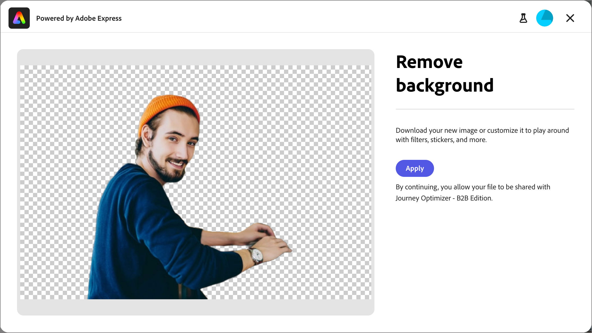

# Afbeeldingen bewerken met Adobe Express {#edit-images-adobe-express}

>[!CONTEXTUALHELP]
>id="ajo-b2b_assets_edit_adobe_express"
>title="Afbeeldingen bewerken in Adobe Express"
>abstract="Eenvoudige en intuïtieve hulpmiddelen voor beeldbewerking, aangedreven door Adobe Express, zijn rechtstreeks beschikbaar in Adobe Journey Optimizer B2B edition om de snelheid van de inhoud te verhogen."

[!DNL Adobe Journey Optimizer B2B Edition] kan op een native manier worden geïntegreerd met Adobe Express en biedt toegang tot een set [!DNL Adobe Express] -gereedschappen voor het bewerken van afbeeldingen. Met deze gereedschappen kunt u de afbeeldingen wijzigen die zijn opgeslagen in de gegevensopslagruimte van [!DNL Journey Optimizer B2B Edition] . De integratie biedt de volgende belangrijke voordelen:

* Meer hergebruik van inhoud door nieuwe afbeeldingselementen te bewerken en op te slaan in Journey Optimizer B2B edition.

* Minder tijd en moeite om afbeeldingselementen bij te werken of nieuwe versies van bestaande afbeeldingselementen te maken.

>[!NOTE]
>
>Alle Journey Optimizer B2B edition-abonnementen bevatten rechten voor Adobe Express-bewerkingsfuncties.

De [!DNL Adobe Express] -functies ondersteunen PNG- en JPEG-afbeeldingsbestandsindelingen.

_Een afbeelding wijzigen :_

1. Ga naar de linkernavigatie en klik **[!UICONTROL Content Management]** > **[!UICONTROL Assets]**.

Met deze handeling wordt een aanbiedingspagina geopend met alle vermelde elementen.

1. Zoek de afbeelding die u wilt wijzigen of gebruik als origineel om een nieuw element te maken.

   * Om de activa door omslag te bekijken, open de structuur door _te klikken toont Omslagen_ pictogram bij de hoogste linkerzijde.

   * Als u de tabel op een van de kolommen wilt sorteren, klikt u op de kolomtitel. De pijl in de titelrij geeft de huidige sorteerkolom en -volgorde aan.

   * Als u naar een afbeeldingselement in de geselecteerde map wilt zoeken, voert u een tekstreeks in de zoekbalk in.

   {width="800" zoomable="yes"}

1. Klik op de naam van het afbeeldingselement om het te openen en de details ervan weer te geven.

   >[!TIP]
   >
   >Het is beste praktijken om [&#x200B; het _[!UICONTROL Used By]_&#x200B;lusje &#x200B;](./internal-image-assets.md#view-asset-used-by-references) in de beelddetails te selecteren en de inhoud te herzien waar het beeld momenteel wordt gebruikt alvorens u te werk gaat om aan het beelddossier uit te geven.

1. Klik in de afbeelding _[!UICONTROL Details]_&#x200B;aan de rechterkant op **[!UICONTROL Edit with Adobe Express]**.

   {width="600" zoomable="yes"}

   Als de afbeelding in gebruik is, verschijnt er een waarschuwingsvenster waarin u wordt gewaarschuwd dat de wijzigingen van invloed zijn op die inhoud. Klik op **[!UICONTROL Continue]** om door te gaan naar de Adobe Express-editor.

   {width="300"}

## Adobe Express Enterprise-licentie

Als u een Enterprise-licentie voor Adobe Express hebt, kunt u de Express Editor openen en gebruiken. Tot deze bewerkingsmogelijkheden behoren bewerkingen voor het aanpassen van afbeeldingen, zoals kleur, helderheid, scherpte, contrast en uitsnijden. Zij omvatten ook _AI magie_ verrichtingen, zoals verwijderen achtergronden, nemen en verwijderen voorwerpen op, en wissen delen van het beeld.

>[!NOTE]
>
>Uw Adobe Express Enterprise-licentie moet onder dezelfde IMS-organisatie worden aangeschaft om toegang te krijgen tot deze volledige editormogelijkheden van Journey Optimizer B2B edition. Als individueel lid van de organisatie IMS, hebt u een toegewezen vergunning in de instantie van Adobe Express nodig. Anders, wordt uw toegang van Adobe Express beperkt tot de [&#x200B; snelle acties op Adobe Express &#x200B;](#quick-actions-in-adobe-express) van Journey Optimizer B2B edition.

{width="600" zoomable="yes"}

De [&#x200B; Gids van de Gebruiker van Adobe Express &#x200B;](https://helpx.adobe.com/nl/express/web.html){target="_blank"} verstrekt gedetailleerde informatie over de beschikbare het uitgeven mogelijkheden.

## Snelle acties in Adobe Express

Als u geen Adobe Express Enterprise-licentie hebt, hebt u toegang tot de Adobe Express-editor voor snelle acties.

1. Selecteer in de Snelle handelingeneditor van Adobe Express een van de functies voor het wijzigen van afbeeldingen om de afbeelding te wijzigen.

   * [**[!UICONTROL Resize image]**](#resize-image)
   * [**[!UICONTROL Remove background]**](#remove-background)
   * [**[!UICONTROL Crop image]**](#crop-image)
   * [**[!UICONTROL Convert to PNG]**](#convert-file-format) (wanneer een JPEG-afbeelding wordt geladen)
   * [**[!UICONTROL Convert to JPEG]**](#convert-file-format) (wanneer een PNG-afbeelding wordt geladen)

   {width="600" zoomable="yes"} te wijzigen

1. Wanneer u terugkeert naar de hoofdredacteur van de Snelle Acties van Adobe Express, klik **[!UICONTROL Save]** om het gewijzigde beelddossier in Journey Optimizer B2B edition activabewaarplaats op te slaan gebruikend de zelfde dossiernaam.

## Grootte afbeelding wijzigen

1. Gebruik de instellingen voor vergroten of verkleinen om de afbeelding te verkleinen of uit te breiden:

   * Selecteer een optie **[!UICONTROL Aspect ratio]** . Gebruik een standaardgrootte voor digitale inhoud of kies **[!UICONTROL Custom]** als u waarden wilt invoeren voor **[!UICONTROL Width]** en **[!UICONTROL Height]** .

   * In de weergaven _[!UICONTROL Original size]_&#x200B;en&#x200B;_[!UICONTROL Compressed size]_ ziet u de groottewijzigingen die optreden als u de wijzigingen toepast. Met het gereedschap **[!UICONTROL Zoom and Crop]** kunt u gedeelten van de weergegeven afbeelding beter inspecteren.

   * Als u de oorspronkelijke staat van de afbeelding wilt herstellen, klikt u op **[!UICONTROL Reset]** .

   {width="600" zoomable="yes"}

1. Klik op **[!UICONTROL Apply]** als u tevreden bent met het resultaat.

## Achtergrond verwijderen

{width="600" zoomable="yes"}

Adobe Express verwijdert automatisch de achtergrond om het primaire object in de afbeelding te isoleren. Als u tevreden bent met het resultaat, klikt u op **[!UICONTROL Apply]** .

## Afbeelding uitsnijden

1. Sleep de grepen op de hoeken van de afbeelding om de buitenste gebieden te verwijderen die u niet in het afbeeldingselement wilt opnemen.

   {width="600" zoomable="yes"}

1. Klik op **[!UICONTROL Apply]** als u tevreden bent met het resultaat.

## Bestandsindeling converteren

* **[!UICONTROL Convert to JPEG]** - Voor een PNG-afbeelding kunt u de afbeelding omzetten in een JPEG-afbeeldingsbestand en deze opslaan als een nieuw element.
* **[!UICONTROL Convert to PNG]** - Voor een JPEG-afbeelding kunt u de afbeelding omzetten in een PNG-afbeeldingsbestand en deze opslaan als een nieuw element.

{width="600" zoomable="yes"} om

1. Klik op **[!UICONTROL Apply]**.
