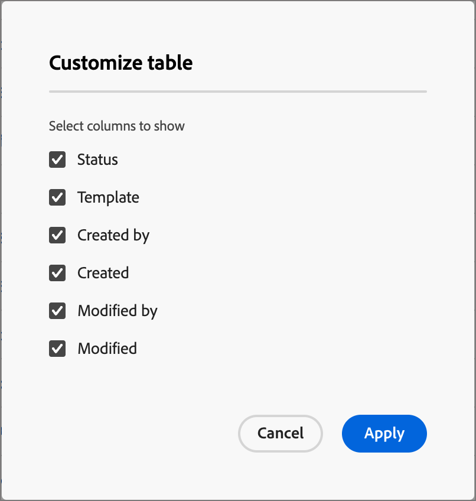

# Openingspagina&#39;s

Een openingspagina is een zelfstandige webpagina waarop u contactpersonen en klanten kunt sturen nadat ze op een gekoppeld item in een e-mail, SMS-bericht of een digitale locatie hebben geklikt. U kunt deze pagina&#39;s opnemen in uw accountreizen om uw vooruitzichten en klanten te laten zien hoe uw berichten op het web worden weergegeven en hoe het werk van uw account wordt voortgezet. U kunt bestemmingspagina&#39;s in de visuele ontwerpruimte van de bestemmingspagina tot stand brengen, personaliseren en voorproef.

Als u uw klanten wilt doorverwijzen naar een gedefinieerde webpagina wanneer ze op een specifieke koppeling klikken, maakt u een bestemmingspagina in Journey Optimizer B2B edition.

* De pagina maken
* De openingspagina en de inhoud van de auteur ontwerpen
* De pagina testen
* De pagina publiceren
* Koppeling maken naar de pagina vanuit uw reisinhoud

U kunt bijvoorbeeld bestemmingspagina&#39;s maken en ontwerpen om uw gebruikers naar online informatie te leiden. De pagina kan een formulier bevatten waarin ze zich kunnen aanmelden of weigeren uw communicatie te ontvangen. Of het zou een kans kunnen zijn om op terugkomende mededelingen, zoals een nieuwsbrief in te tekenen.

U kunt bestemmingspagina&#39;s in de visuele ontwerpruimte maken, personaliseren en voorvertonen.
<!-- 
For the Beta phase, you can only design landing pages from scratch and publish your landing pages. The landing pages will be served on adobe hosted domain for the Beta phase. The capability to define your branded domains for hosting will be delivered in a future release. -->

## Landingspagina&#39;s openen en beheren

Ga naar de linkernavigatie en klik op **[!UICONTROL Content Management]** > **[!UICONTROL Landing pages]** om bestemmingspagina&#39;s te openen in Adobe Journey Optimizer B2B edition. Met deze handeling wordt een pagina geopend met alle bestemmingspagina&#39;s die in de instantie in een tabel zijn gemaakt.

{width="800" zoomable="yes"}

De tabel wordt gesorteerd op de kolom _[!UICONTROL Modified]_, waarbij de laatst bijgewerkte items standaard bovenaan staan. Klik op de kolomtitel om te schakelen tussen oplopend en aflopend.

### De lijst met bestemmingspagina&#39;s filteren

Als u op naam naar een landingspagina wilt zoeken, voert u een tekenreeks in op de zoekbalk voor een overeenkomst. Klik het _pictogram van de Filter_ ( ) om de beschikbare filteropties te tonen en de montages te veranderen om de getoonde punten volgens uw gespecificeerde criteria te filtreren.

{width="700" zoomable="yes"}

### De kolomweergave aanpassen

Pas de kolommen aan die u in de lijst wilt tonen door _te klikken aanpassen lijst_ pictogram ( ) bij het hoogste recht.

Selecteer in het dialoogvenster de kolommen die u wilt weergeven en klik op **[!UICONTROL Apply]** .

{width="300"} wilt tonen

### Status en levenscyclus van bestemmingspagina

De status van de bestemmingspagina bepaalt de beschikbaarheid voor het verbinden in uw e-mail en inhoud van SMS, en de veranderingen die u aan het kunt aanbrengen.

| Status | Beschrijving |
| -------------------- | ----------- |
| Concept | Wanneer u een openingspagina maakt, bevindt deze zich in de conceptstatus. Deze status blijft behouden wanneer u de visuele inhoud definieert of bewerkt en totdat u deze publiceert als een gehoste pagina. Beschikbare handelingen:  <ul><li>Naam of beschrijving bewerken<li>Koppelings-URL bewerken<li>Bewerken in visuele ontwerpruimte<li>Publiceren<li>Dupliceren<li>Verwijderen |
| Gepubliceerd | Wanneer u een landingspagina publiceert, wordt deze gehost op het Journey Optimizer B2B edition-exemplaar en kan deze worden gekoppeld in een e-mail- of SMS-bericht-inhoud. Beschikbare handelingen:  <ul><li>Naam of beschrijving bewerken<li>Koppelings-URL bewerken<li>Koppeling toevoegen in inhoud van e-mail- of SMS-berichten<li>Conceptversie maken<li>Dupliceren<li>Verwijderen |
| Gepubliceerd met concept | Wanneer u een concept maakt van een gepubliceerde bestemmingspagina, blijft de gepubliceerde versie behouden en kan de conceptinhoud worden gewijzigd in de visuele ontwerpruimte. Als u de conceptversie publiceert, vervangt deze de huidige gepubliceerde versie en wordt de inhoud bijgewerkt op de gehoste pagina. Beschikbare handelingen:  <ul><li>Naam of beschrijving bewerken<li>Koppelings-URL bewerken<li>Koppeling toevoegen in inhoud van e-mail- of SMS-berichten<li>Conversie bewerken in visuele ontwerpruimte<li>Conceptversie publiceren<li>Dupliceren<li>Verwijderen (beide versies worden verwijderd)<li>Concept verwijderen (keert terug naar gepubliceerde status) |

{zoomable="yes"}

## Een openingspagina maken

U kunt een nieuwe openingspagina toevoegen in Journey Optimizer B2B edition door op **[!UICONTROL Create landing page]** rechtsboven te klikken.

1. Voer in het dialoogvenster _[!UICONTROL Create landing page]_een handige **[!UICONTROL Name]**en **[!UICONTROL Description]**(optioneel) in.

   Aanlandingspagina-eisen:

   * Naam - maximaal 100 tekens, moet uniek en hoofdlettergevoelig zijn

   * Beschrijving - Maximaal 300 tekens

   * Alpha, numerieke en speciale tekens zijn toegestaan

   * Gereserveerde karakters zijn **_niet toegestaan_**: `\ / : * ? " < > |`

   {width="400"}

1. Indien nodig en als er meerdere subdomeinen zijn geconfigureerd, wijzigt u de **[!UICONTROL Subdomain]** die u wilt gebruiken voor de bestemmingspagina.

1. Klik op **[!UICONTROL Create]**.

   De startpagina van _[!UICONTROL Create your primary landing page]_wordt geopend en bevat meerdere opties voor het maken van de pagina:_[!UICONTROL Design from scratch]_ , _[!UICONTROL Import HTML]_of het gebruik van een opgeslagen sjabloon.

   {width="800" zoomable="yes"}

   Nadat u de methode selecteert die u wilt gebruiken om paginaontwerp te beginnen te landen, gebruik de visuele ontwerpruimte om [ de pagina ](./landing-page-design.md) te ontwerpen.

### Ontwerpen vanaf nul

Gebruik de visuele inhoudeditor om de structuur van de inhoud van de bestemmingspagina te definiëren. Door structurele componenten toe te voegen en te bewegen met eenvoudige belemmering-en-dalingsacties, kunt u de vorm van de pagina inhoud binnen seconden ontwerpen.

1. Selecteer de optie _[!UICONTROL Create your primary landing page]_op de startpagina van **[!UICONTROL Design from scratch]**.

1. [ voegt structuur en inhoud ](./landing-page-design.md#add-structure-and-content) aan de pagina toe.

### HTML importeren

Met Adobe Journey Optimizer B2B edition kunt u bestaande HTML-inhoud importeren om uw bestemmingspagina&#39;s te ontwerpen.

{{$include /help/_includes/content-design-import.md}}

{width="500"}

>[!NOTE]
>
>Als u een `<table>` -tag als eerste laag in een HTML-bestand gebruikt, kan dit leiden tot stijlverlies, zoals de achtergrond- en breedte-instellingen in de bovenste laagtag.

U kunt de geïmporteerde inhoud naar wens aanpassen met de visuele ontwerpruimte.

### Een opgeslagen sjabloon selecteren

U kunt kiezen uit:

* **malplaatjes van de Steekproef**. De interface van Journey Optimizer biedt een inzameling van uit-van-de-doos het landen paginasjablonen aan die u van kunt kiezen.

* **Bewaarde malplaatjes**. Een opgeslagen aangepaste sjabloon gebruiken die door een lid van uw organisatie is gemaakt via het menu _[!UICONTROL Templates]_<!-- or the _[!UICONTROL Save as content template]_ option when designing a landing page. -->

Gebruik de sectie _[!UICONTROL Select design template]_om uw inhoud op te bouwen van een sjabloon. U kunt een voorbeeldsjabloon of een opgeslagen aangepaste landingspagina gebruiken vanuit uw Journey Optimizer B2B edition-exemplaar.

>[!BEGINTABS]

>[!TAB  Bewaarde malplaatjes ]

Op _creeer uw primaire het landen pagina_ homepage, wordt het _malplaatjes van de Steekproef_ lusje geselecteerd door gebrek. Als u een aangepaste sjabloon wilt gebruiken, selecteert u de tab **[!UICONTROL Saved templates]** .

De lijst met alle opgeslagen sjablonen voor bestemmingspagina&#39;s wordt weergegeven. U kunt ze sorteren op _[!UICONTROL Name]_,_[!UICONTROL Last modified]_ en _[!UICONTROL Last created]_.

{width="700" zoomable="yes"}

Selecteer de gewenste sjabloon in de lijst.

Na de selectie wordt een voorbeeld van de sjabloon weergegeven. In de voorvertoningsmodus kunt u met de rechter- en linkerpijltoets navigeren tussen alle sjablonen van één categorie (voorbeeld of opgeslagen, afhankelijk van uw selectie).

{width="800" zoomable="yes"}

Wanneer de weergave overeenkomt met wat u wilt gebruiken, klikt u op **[!UICONTROL Use this template]** rechtsboven in het voorvertoningsvenster.

Met deze actie kopieert u de inhoud naar de visuele ontwerpruimte, waar u de inhoud desgewenst kunt bewerken.

>[!TAB  malplaatjes van de Steekproef ]

Adobe Journey Optimizer B2B edition biedt een selectie van _uit-van-de-doos_ het landen paginasjablonen aan, die voor het creëren van uw eigen het landen pagina&#39;s en het landen paginasjablonen kunnen worden gebruikt.

<!-- {width="800" zoomable="yes"} -->

>[!ENDTABS]

<!-- 
>[!NOTE]
>
> Saved templates may have governance (content locking) settings applied to one or more components. The visual designer provides guidelines about locked components when you [author an email from a governed template](./email-authoring-governance.md). -->

## Een openingspagina bewerken

Bewerkingen aan een landingspagina zijn afhankelijk van de huidige status:

* Wanneer een het landen pagina in **_Laag_** status is, kunt u om het even welk van zijn details, URL, en de visuele inhoud uitgeven.
* Wanneer een het landen pagina in **_Gepubliceerde_** status is, kunt u de beschrijving uitgeven, maar niet de naam. Als u de visuele inhoud wilt wijzigen, moet u een conceptversie van de pagina maken.
* Wanneer een het landen pagina in **_wordt gepubliceerd met ontwerp_** status, is het uitgeven van de details beperkt tot de beschrijving. U kunt ook de visuele inhoud van de conceptversie bewerken.

>[!BEGINTABS]

>[!TAB  Ontwerp ]

1. Klik op de aanbiedingspagina van _[!UICONTROL Landing pages]_op de naam van de bestemmingspagina om deze te openen.

   Aan de rechterkant wordt een voorbeeld van de visuele inhoud weergegeven met de gegevens van de openingspagina.

1. Wijzig de gewenste details, zoals de naam en beschrijving.

   {width="700" zoomable="yes"}

1. Klik op **[!UICONTROL Edit landing page]** om de inhoud in de visuele ontwerpruimte te wijzigen.

   Gebruik de gereedschappen voor visueel ontwerp naar wens:

   * [Structuur en inhoud toevoegen](./landing-page-design.md#add-structure-and-content)
   * [Assets toevoegen](./landing-page-design.md#add-assets)
   * [Navigeren door de lagen, instellingen en stijlen](./landing-page-design.md#navigate-the-layers-settings-and-styles)
   * [Inhoud personaliseren](./landing-page-design.md#personalize-content)
   * [Gekoppelde URL-tracking bewerken](./landing-page-design.md#edit-linked-url-tracking)

1. Klik op **[!UICONTROL Save]** of **[!UICONTROL Save & close]** om terug te keren naar de details van de bestemmingspagina.

1. Klik op **[!UICONTROL Publish]** als de pagina voldoet aan de criteria en beschikbaar moet zijn voor weergave.

>[!TAB  Gepubliceerd ]

1. Klik op de aanbiedingspagina van _[!UICONTROL Landing page]_op de paginanaam om deze te openen.

   Aan de rechterkant wordt een voorbeeld van de visuele inhoud weergegeven met de gegevens van de openingspagina.

1. Wijzig, indien nodig, de beschrijving.

   Voor een gepubliceerde landingspagina kunnen niet alle andere details worden gewijzigd.

1. Als u de inhoud wilt bijwerken, klikt u op **[!UICONTROL Edit landing page]** aan de rechterkant.

   Klik op **[!UICONTROL Create draft version]** in het dialoogvenster om de conceptversie te openen in de ruimte van het visuele ontwerp.

   {width="300"}

   Gebruik de gereedschappen voor visueel ontwerp naar wens:

   * [Structuur en inhoud toevoegen](./landing-page-design.md#add-structure-and-content)
   * [Assets toevoegen](./landing-page-design.md#add-assets)
   * [Navigeren door de lagen, instellingen en stijlen](./landing-page-design.md#navigate-the-layers-settings-and-styles)
   * [Inhoud personaliseren](./landing-page-design.md#personalize-content)
   * [Gekoppelde URL-tracking bewerken](./landing-page-design.md#edit-linked-url-tracking)

1. Klik op **[!UICONTROL Save]** of **[!UICONTROL Save & close]** om terug te keren naar de details van de bestemmingspagina.

1. Wanneer de bestemmingspagina van het ontwerp aan uw criteria voldoet en u wilt de veranderingen op de gepubliceerde pagina ter beschikking stellen, klik **[!UICONTROL Publish]**.

   Wanneer u de conceptversie publiceert, wordt de huidige gepubliceerde versie vervangen en wordt de inhoud bijgewerkt voor de pagina-URL.

>[!TAB  Gepubliceerd met ontwerp ]

Wanneer u de openingspagina opent, wordt de conceptversie standaard weergegeven. Met de tabbladen boven aan de voorvertoningsruimte kunt u schakelen tussen de gepubliceerde versie en de conceptversie. De ontwerphandelingen en -details worden rechts weergegeven.

{width="700" zoomable="yes"}

De inhoud bijwerken:

1. Klik op **[!UICONTROL Edit landing page]** rechtsboven. Gebruik de gereedschappen voor visueel ontwerp naar wens:

   * [Structuur en inhoud toevoegen](./landing-page-design.md#add-structure-and-content)
   * [Assets toevoegen](./landing-page-design.md#add-assets)
   * [Navigeren door de lagen, instellingen en stijlen](./landing-page-design.md#navigate-the-layers-settings-and-styles)
   * [Inhoud personaliseren](./landing-page-design.md#personalize-content)
   * [Gekoppelde URL-tracking bewerken](./landing-page-design.md#edit-linked-url-tracking)

1. Klik op **[!UICONTROL Save]** of **[!UICONTROL Save & close]** om terug te keren naar de details van de bestemmingspagina.

1. Klik op **[!UICONTROL Publish]** als de conceptpagina voldoet aan uw criteria en u de wijzigingen beschikbaar wilt maken.

   Wanneer u de conceptversie publiceert, wordt de huidige gepubliceerde versie vervangen en wordt de inhoud bijgewerkt op de gehoste pagina.

>[!ENDTABS]

### Waarschuwingen controleren

Terwijl u de inhoud van de bestemmingspagina ontwerpt, worden waarschuwingen weergegeven in de interface (rechtsboven) wanneer er geen sleutelinstellingen aanwezig zijn.

{width="250"}

Als deze knop niet wordt weergegeven, zijn er geen problemen gedetecteerd.

Er kunnen twee soorten waarschuwingen worden gedetecteerd:

* **_Waarschuwingen_** die naar aanbevelingen en beste praktijken, zoals verwijzen:

   * `Placeholder links are present in the landing page body`: vergeet niet de plaatsaanduidingen te vervangen door geldige koppelingen.

   * `Text version of HTML is empty`: vergeet niet een tekstversie van de hoofdtekst van de pagina te definiëren die wordt gebruikt wanneer HTML-inhoud niet kan worden weergegeven.

   * `Empty link is present in page body`: controleer of alle koppelingen op de pagina correct zijn.

* **_Fouten_** die u verhinderen de reis/de campagne te testen of te activeren zolang zij niet, zoals worden opgelost:

   * `The landing page content is empty`: Pagina-inhoud is verplicht.

## Een openingspagina dupliceren

U kunt een landingspagina dupliceren met een van de volgende methoden:

* Van de _[!UICONTROL Landing page]_lijstpagina, klik het_ Meer _pictogram (**...**) naast de het landen paginanaam en kies **[!UICONTROL Duplicate]**.
* Klik rechtsboven op de detailpagina van de bestemmingspagina op **[!UICONTROL ... More]** en kies **[!UICONTROL Duplicate]** .

{width="600" zoomable="yes"}

Voer in het dialoogvenster een nuttige naam (uniek) en beschrijving (optioneel) in. Klik op **[!UICONTROL Duplicate]** om de handeling te voltooien.

{width="350"} in

De gedupliceerde (nieuwe) pagina verschijnt dan in de _Landing pagina&#39;s_ lijst.

## Een openingspagina verwijderen

U kunt een bestemmingspagina schrappen gebruikend één van beide volgende methodes:

* Van de _[!UICONTROL Landing page]_lijstpagina, klik het_ Meer _pictogram (**...**) naast de het landen paginanaam en kies **[!UICONTROL Delete]**.
* Klik rechtsboven op de detailpagina van de bestemmingspagina op **[!UICONTROL ... More]** en kies **[!UICONTROL Delete]** .

Met deze handeling wordt een bevestigingsvenster geopend. U kunt het proces afbreken door op **[!UICONTROL Cancel]** te klikken of op **[!UICONTROL Delete]** te klikken om het verwijderen te bevestigen.

{width="400"}

## Koppeling maken naar een bestemmingspagina

Als Marketer of Designer die e-mail, fragment en pagina-inhoud maakt, kunt u koppelingen insluiten naar de gepubliceerde (live) bestemmingspagina&#39;s die in uw Journey Optimizer B2B edition-instantie zijn gemaakt.

1. Terwijl u in de visuele ontwerpruimte werkt voor een fragment, e-mail, landingspagina of sjabloon, selecteert u een fragment met tekst, een knopcomponent of een afbeeldingscomponent voor de koppeling.

   De **[!UICONTROL Link]** -opties worden weergegeven in het rechterdeelvenster.

1. Kies **[!UICONTROL Type]** bij de optie **[!UICONTROL Landing page]** .

   {width="700" zoomable="yes"}

1. Voor de **[!UICONTROL Landing page]** optie, klik het _Uitgezochte pagina_ pictogram ( ).

1. Stel in het dialoogvenster bestemmingspagina selecteren de **[!UICONTROL Landing page source]** als **[!UICONTROL Journey Optimizer B2B Edition]** in, selecteer het selectievakje voor de openingspagina in de lijst met gepubliceerde pagina&#39;s en klik op **[!UICONTROL Select]** .

   {width="600" zoomable="yes"}

1. Kies bij de optie **[!UICONTROL Target]** het gedrag van het koppelingsdoel:

   * **[!UICONTROL None]** - Hiermee opent u de koppeling met het standaardgedrag van de browser.
   * **[!UICONTROL Blank]** - Hiermee opent u de koppeling in een nieuw venster of op een nieuw tabblad.
   * **[!UICONTROL Self]** - hiermee wordt de koppeling in hetzelfde frame geopend.
   * **[!UICONTROL Parent]** - hiermee opent u de koppeling in het bovenliggende frame.
   * **[!UICONTROL Top]** - Hiermee opent u de koppeling in de volledige tekst van het venster.

1. (Alleen tekstkoppeling) Schakel het selectievakje **[!UICONTROL Underline link]** in als u de gekoppelde tekst wilt onderstrepen.

   U kunt aanvullende opmaak instellen voor de koppelingstekst, inclusief de kleur van de koppeling, door de tab **[!UICONTROL Styles]** in het rechterdeelvenster te selecteren.
